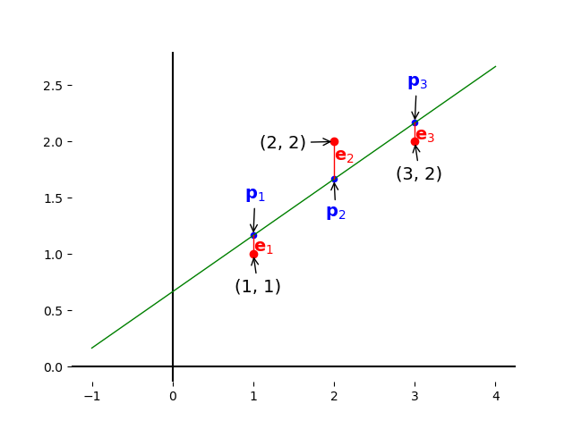

# 正交矩阵的应用

## 1. $𝑨^{⊤}𝑨$

### 1.1. 实对称阵

**定义**：若矩阵$𝑨$为对称，且其中每个元素都是实数，则称之为实对称阵。

实对称阵的特性：

- 特征值为实数
- 特征向量相互正交

> 约定：特征值为实数、特征向量相互正交的矩阵为"好矩阵"。

:::{admonition} 定理

对称阵的互异特征值对应的特征向量，相互正交。

:::

### 1.2. 好方程组

$𝑨^{⊤}𝑨$是一个$n$阶对称方阵。$𝑨^{⊤}𝑨𝒙 = 𝑨^{⊤}𝒃$，这个变换可以将"坏方程组"变为"好方程组"。

对矩阵

$$
\begin{bmatrix}
  1 & 1 \\ 1 & 2 \\ 1 & 5
\end{bmatrix}
\begin{bmatrix}
  x_1 \\ x_2
\end{bmatrix} =
\begin{bmatrix}
  b_1 \\ b_2 \\ b_3
\end{bmatrix}
$$

只有当$\begin{bmatrix}b_1\\b_2\\b_3\end{bmatrix}$在矩阵的列空间时，方程才有解。

做变换

$$
\begin{bmatrix}
  1 & 1 & 1 \\
  1 & 2 & 5
\end{bmatrix}
\begin{bmatrix}
  1 & 1 \\ 1 & 2 \\ 1 & 5
\end{bmatrix} =
\begin{bmatrix}
  3 & 8 \\ 8 & 30
\end{bmatrix}
$$

- $rank(𝑨^{⊤}𝑨) = rank(𝑨)$
- 当且仅当$N(𝑨)$为零向量，即$𝑨$的列向量线性无关，则$𝑨^{⊤}𝑨$可逆。

### 1.3. 正交对角化

:::{admonition} 定理

$𝑨$是实对称阵 ⇔ $𝑨$可正交对角化

:::

在可对角化情况下，一个矩阵可以化为

$$
𝑨 = 𝑺𝜦𝑺^{-1}
$$

在矩阵对称的情况下，由特征向量组成的矩阵$𝑺$中的列向量是相互正交的，此时若把特征向量的长度统一化为$1$，就可以得到一组标准正交的特征向量。

:::{admonition} 谱定理（spectral theorem）

对于标准正交矩阵，有$𝑸 = 𝑸^{⊤}$，故对称阵可以写为

$$
𝑨 = 𝑸𝜦𝑸^{⊤}
$$

:::

> 谱定理在力学上称之为主轴定理（principle axis theorem），从几何上看，它意味着若给定某种材料，在合适的轴上来看，它就变成对角化的，方向就不会重复。

## 2. 正交矩阵

### 2.1. 正交化后投影

若有三个线性无关的向量$𝒂, 𝒃, 𝒄$，则要求它们的正交向量$𝑨, 𝑩, 𝑪$，再将它们单位化，变为单位正交向量，$𝒒_1 = \dfrac{𝑨}{|𝑨|}, 𝒒_2 = \dfrac{𝑩}{|𝑩|}, 𝒒_3 = \dfrac{𝑪}{|𝑪|}$。

- 取$𝒂$向量的方向，$𝒂 = 𝑨$；
- 将$𝒃$投影在$𝑨$的法方向上得到$𝑩$，由$𝒆 = 𝒃 − 𝒑$，即

$$
𝑩 = 𝒃 - \frac{𝑨^{⊤}𝒃}{𝑨^{⊤}𝑨} 𝑨𝒙
$$

- 从$𝒄$中减去其在$𝑨, \ 𝑩$上的分量，得到正交与$𝑨, \ 𝑩$的$𝑪$

$$
𝑪 = 𝒄 - \frac{𝑨^{⊤}𝒄}{𝑨^{⊤}𝑨}𝑨 - \frac{𝑩^{⊤}𝒄}{𝑩^{⊤}𝑩}𝑩
$$

> 正交投影即原数据点和投影点连线垂直于投影点所在直线或平面。

### 2.2. 最小二乘法

投影矩阵有 2 个重要性质

- $𝑷 = 𝑷^{⊤}$，投影矩阵是一个对称阵
- $𝑷^2 = 𝑷$，若对一个向量做两次投影，即$𝑷𝑷𝒃$，则其结果仍然与$𝑷𝒃$相同

为什么需要投影？因为有些时候$𝑨𝒙 = 𝒃$无解，只能求出最接近的那个解。$𝑨𝒙$总是在$𝑨$的列空间中，而$𝒃$却不一定，故可将$𝒃$变为$𝑨$的列空间中最接近的那个向量，即将无解的$𝑨𝒙 = 𝒃$变为求有解的$𝑨𝒙̂ = 𝒑$，其中，$𝒑$是$𝒃$在$𝑨$的列空间中的投影，$𝒙̂$不再是那个不存在的$𝒙$，而是最接近的解。

一般情况下，$𝒃$将会有一个垂直于$𝑨$的分量，有一个在$𝑨$列空间中的分量，投影的作用就是去掉垂直分量而保留列空间中的分量。

举两个极端的例子：

$$
\begin{aligned}
  𝒃 ∈ &C(𝑨) ⇒ 𝑷𝒃 = 𝒃 \\
  𝒃 ⊥ &C(𝑨) ⇒ 𝑷𝒃 = 𝟎
\end{aligned}
$$

在第一个极端情况中，若$𝒃 ∈ C(𝑨)$则有$𝒃 = 𝑨𝒙$。带入投影矩阵$𝒑 = 𝑷𝒃 = 𝑨(𝑨^{⊤}𝑨)^{-1} 𝑨^{⊤}𝑨𝒙 = 𝑨𝒙$，得证。

在第二个极端情况中，若$𝒃 ⊥ C(𝑨)$则有$𝒃 ∈ N(𝑨^{⊤})$，即$𝑨^{⊤}𝒃 = 0$，则$𝒑 = 𝑷𝒃 = 𝑨(𝑨^{⊤}𝑨)^{-1} 𝑨^{⊤}𝒃 = 0$，得证。

向量$𝒃$投影后，有$𝒃 = 𝒆 + 𝒑, \ 𝒑 = 𝑷𝒃, \ 𝒆 = (𝑰 - 𝑷)𝒃$，这里的$𝒑$是$𝒃$在$C(𝑨)$中的分量，而$𝒆$是$𝒃$在$N(𝑨^{⊤})$中的分量。

现需要找到距离图中三个点 `(1, 1)` , `(2, 2)` , `(3, 2)` 偏差最小的直线$𝒃 = C + Dt$

根据条件可以得到方程组

$$
\begin{cases}
  C + D &= 1 \\
  C + 2D &= 2 \\
  C + 3D &= 2
\end{cases}
$$

写作矩阵形式

$$
\begin{bmatrix}
  1 & 1 \\
  1 & 2 \\
  1 & 3
\end{bmatrix}
\begin{bmatrix}
  C \\ D
\end{bmatrix} =
\begin{bmatrix}
  1\\2
\end{bmatrix}
$$

很明显方程组无解。此时，需要在$𝒃$的三个分量上都增加某个误差$𝒆$，使得三点能够共线，同时使得$𝒒_1^2 + 𝒒_2^2 + 𝒒_3^2$最小，即$|𝑨𝒙 - 𝒃|^2 = |𝒆|^2$最小。此时向量$𝒃$变为向量

$$
𝒑 =
\begin{bmatrix}
  𝒑_1\\
  𝒑_2\\
  𝒑_3
\end{bmatrix}
$$

在方程组有解的情况下，$𝑨𝒙 - 𝒃 = 𝟎$，即$𝒃$在$𝑨$的列空间中，误差$𝒆$为零。

> 若有另一个点，如$(0, 100)$，在本例中该点明显距离别的点很远，最小二乘将很容易被离群的点影响，通常使用最小二乘时会去掉明显离群的点。

### 2.3. 三维投影

现在来看$ℝ^3$中的情形，将向量$𝒃$投影在平面$𝑨$上。同样的，$𝒑$是向量$𝒃$在平面$𝑨$上的投影，$𝒆$是垂直于平面$𝑨$的向量，即$𝒃$在平面$𝑨$法方向的分量。

设平面$𝑨$的一组基为$𝒂_1, 𝒂_2$，则投影向量$𝒑 = 𝒙̂_1 𝒂_1 + 𝒙̂_2 𝒂_2$，即$𝒑 = 𝑨𝒙̂$，这里若求出$𝒙̂$，则该解就是无解方程组最近似的解。

现在问题的关键在于找$𝒆 = 𝒃 - 𝑨𝒙̂$，使它垂直于平面，因此得到两个方程

$$
\begin{cases}
  𝒂_1^{⊤}(𝒃 - 𝑨𝒙̂) = 0\\
  𝒂_2^{⊤}(𝒃 - 𝑨𝒙̂) = 0
\end{cases}
$$

将方程组写成矩阵形式

$$
\begin{bmatrix}
  𝒂_1^{⊤} \\
  𝒂_2^{⊤}
\end{bmatrix}
(𝒃 - 𝑨𝒙̂) =
\begin{bmatrix}
  0\\ 0
\end{bmatrix}
$$

即$𝑨^{⊤}(𝒃 - 𝑨𝒙̂) = 0$。

比较该方程与$ℝ^2$中的投影方程，发现只是向量$𝒂$变为矩阵$𝑨$而已，本质上就是$𝑨^{⊤}𝒆 = 0$。故，$𝒆$在$𝑨^{⊤}$的零空间中（$𝒆 ∈ N(𝑨^{⊤})$）。

再化简方程得$𝑨^{⊤}𝑨𝒙 = 𝑨^{⊤}𝒃$，比较在$ℝ^2$中的情形，$𝑨^{⊤}𝒂$是一个数字而$𝑨^{⊤}𝑨$是一个$n$阶方阵，而解出的$x$可以看做两个数字的比值。

现在在$ℝ^3$中

- $𝒙̂ = (𝑨^{⊤}𝑨)^{-1} 𝑨^{⊤}𝒃$；
- $𝒑 = 𝑨𝒙̂ = \underline{𝑨(𝑨^{⊤}𝑨)^{-1} 𝑨^{⊤}} 𝒃$，下划线部分就是原来的$\dfrac{𝒂 𝑨^{⊤}}{𝑨^{⊤}𝒂}$；
- 易看出投影矩阵就是下划线部分$𝑷 = 𝑨(𝑨^{⊤}𝑨)^{-1} 𝑨^{⊤}$。

## 3. 标准方程组

现在尝试解出$x̂ = \begin{bmatrix} Ĉ \\ D̂ \end{bmatrix}$与$𝒑 = \begin{bmatrix} 𝒑_1\\ 𝒑_2\\ 𝒑_3\end{bmatrix}$

$$
𝑨^{⊤}𝑨x̂ = 𝑨^{⊤}𝒃
$$

$$
𝑨^{⊤}𝑨 =
\begin{bmatrix}
  3 & 6 \\
  6 & 14
\end{bmatrix}
$$

$$
\begin{bmatrix}
  3 & 6 \\
  6 & 14
\end{bmatrix}
\begin{bmatrix}
  Ĉ \\ D̂
\end{bmatrix} =
\begin{bmatrix}
  5 \\ 11
\end{bmatrix}
$$

写作形式

$$
\begin{cases}
  3Ĉ + 16D̂ &= 5\\
  6Ĉ + 14D̂ &= 11
\end{cases}
$$

也称作标准方程组（normal equations）。

回顾前面提到的"使得误差最小"的条件，$𝒒_1^2 + 𝒒_2^2 + 𝒒_3^2 = (C + D-1)^2 + (C + 2D - 2)^2 + (C + 3D - 2)^2$，使该式取最小值。若使用微积分方法，则需要对该式的两个变量$C, D$分别求偏导数，再令求得的偏导式为零即可，正是刚才求得的标准方程组。

解方程得

$$
Ĉ= \frac{2}{3}, D̂ = \frac{1}{2}
$$

则"最佳直线"为

$$
y = \frac{2}{3} + \frac{1}{2} t
$$

带回原方程组解得

$$
𝒑_1 = \frac{7}6, \ 𝒑_2 = \frac{5}3, \ 𝒑_3 = \frac{13}6
$$

即

$$
𝒒_1 = -\frac{1}{6}, \ 𝒒_2 = \frac{1}{3}, \ 𝒒_3 = -\frac{1}{6}
$$

于是得到

$$
p =
\begin{bmatrix}
  \frac{7}{6} \\
  \frac{5}{3} \\
  \frac{13}{6}
\end{bmatrix},
e =
\begin{bmatrix}
  -\frac{1}{6} \\
  \frac{1}{3} \\
  -\frac{1}{6}
\end{bmatrix}
$$

易看出$𝒃 = 𝒑 + 𝒆$，同时不能发现$𝒑⋅𝒆 = 𝟎$即$𝒑 ⊥ 𝒆$。误差向量$𝒆$不仅垂直于投影向量$𝒑$，它同时垂直于列空间，如

$$
\begin{bmatrix}
  1\\1\\1
\end{bmatrix},
\begin{bmatrix}
  1\\2\\3
\end{bmatrix}
$$
