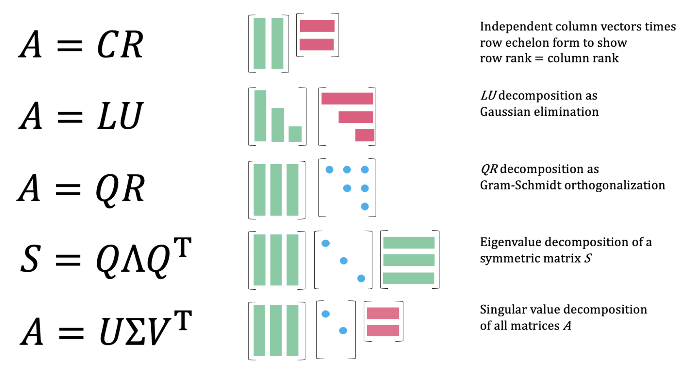

# 矩阵分解

## 1. LU 分解

### 1.1. 基本过程

LU 分解是高斯消元的一种表达方式。首先，对矩阵$𝑨$通过初等行变换将其变为一个上三角矩阵。

1. 矩阵是可逆方阵（LU 分解主要是针对方阵，也可用于非方阵）；
2. 消元过程中没有 0 主元出现，也就是消元过程中不能出现行交换的初等变换。

LU 分解的意义在于求解大型方程组。一个方程组可简化为$𝑨𝒙 = 𝒃$的形式，其中，$𝑨$是$n$阶方阵，$𝒙$是未知数组成的向量，$𝒃$是$n × 1$矩阵。即先通过$𝑳*y = 𝒃$求出$y$，再通过$𝑼*x = y$求出$𝒙$。

对方程组

$$
\begin{aligned}
  2x − 4y = 2 \\
  x + 7y = 10
\end{aligned}
$$

可转化为矩阵形式$𝑨𝒙 = 𝒃$，其中

$$
𝑨 =
\begin{bmatrix}
  2 & -4 \\ 1 & 7
\end{bmatrix},
𝒙 = \begin{bmatrix}
  x \\ y
\end{bmatrix},
𝒃 =
\begin{bmatrix}
  2\\10
\end{bmatrix}
$$

设$𝑨 = 𝑳𝑼$，令

$$
\begin{bmatrix}
  2 & -4\\
  1 & 7
\end{bmatrix} =
\begin{bmatrix}
  l_{11} & \\
  l_{21} & l_{22}
\end{bmatrix}
\begin{bmatrix}
  u_{11} & u_{12} \\
  0 & u_{22}
\end{bmatrix}
$$

得

$$
\begin{bmatrix}
  2 & -4 \\ 1 & 7
\end{bmatrix} =
\begin{bmatrix}
  l_{11}u_{11} & l_{11}u_{12} \\
  l_{21}u_{11} & l_{21}u_{12} + zl_{22}u_{22}
\end{bmatrix}
$$

首先要注意的是我们有 4 个方程和 6 个未知数，因此 LU 分解并不是唯一的。我们应该选择两个值，除了非零之外，做出的选择没有多大区别。

选择$l_{11} = 2$和$l_{22} = 3$，可得

$$
𝑳 =
\begin{bmatrix}
  2 & 0\\ 1 & 3
\end{bmatrix},
𝑼 =
\begin{bmatrix}
  1 & -2\\ 0 & 3
\end{bmatrix}
$$

设置$y = 𝑼x$，则方程可分解为两个方程：

1. 找到作为$𝑳y = 𝒃$的解的向量$y$；
2. 找到向量$x$，它是$𝑼x = y$的解；

由此，可得方程

$$
\begin{bmatrix}
  2 & 0 \\ 1 & 3
\end{bmatrix}
\begin{bmatrix}
  u \\ v
\end{bmatrix} =
\begin{bmatrix}
  2 \\ 10
\end{bmatrix}
$$

$$
\begin{bmatrix}
  1 & -2 \\ 0 & 3
\end{bmatrix}
\begin{bmatrix}
  x \\ y
\end{bmatrix} =
\begin{bmatrix}
  1 \\ 3
\end{bmatrix}
$$

上三角形意味着从底部开始求解各种分量（回代），发现$y = 1$且$x = 3$。

上述计算产生了一些问题。首先，由于 LU 因子化不是唯一的。可选择令$l_{11} =l_{22} = 1$（Doolittle 因子化）或$u_11 = u_22 = 1$（Crout 因子化）。

:::{admonition} 定理

每个线性$n × n$系统都可行重排，因此系数矩阵具有 LU 分解。

:::

$𝑨$的 LU 变换的总运算量应为$O \big(n^2 + (n - 1)^2 + ⋯ +2^2 + 1^2 \big) = O(\dfrac{n!}{3})$。

### 1.2. 置换

**定义**：若$𝑷$为对任意可逆矩阵$𝑨^{-1}$有：

$$
𝑷𝑨 = 𝑳𝑼
$$

则为置换矩阵（permutation matrix）

$n$阶方阵的置换矩阵有$\displaystyle\binom{n}{1} =n!$个。

:::{admonition} 定理

对任意置换矩阵$𝑷$，有

$$
𝑷^{⊤}𝑷 = 𝑰
$$

:::

### 1.3. 对角占优

**定义**：若对于每一行，

$$
|a_{ii}| > ∑_{j=1, j ≠ i} |a_{ij}|
$$

则矩阵$𝑨$是严格对角占优的。

在应用中经常出现的另一种类型的矩阵是三对角矩阵。可在三对角矩阵上使用标准 LU 分解，且若利用矩阵中存在如此多的零的事实，可大大简化该过程。

对矩阵

$$
𝑨 =
\begin{bmatrix}
  a_1 & c_1 & 0 & ⋯ & 0 \\
  b_2 & a_2 & c_2 & ⋯ & ⋮ \\
  0 & b_3 & a_3 & ⋱ & ⋮\\
  ⋮ & 0 & ⋱ & ⋱ & c_{n-1} \\
  0 & ⋯ & ⋯ & b_n & a_n
\end{bmatrix}
$$

LU 因子化，得

$$
\begin{bmatrix}
  a_1 & c_1\\
  b_2 & a_2 & c_2\\
  & b_3 & a_3 & c_3\\
  & & ⋱ & ⋱ & ⋱
\end{bmatrix} =
\begin{bmatrix}
  l_{11} \\
  l_{21} & l_{22} \\
  & l_{32} & l_{33} \\
  & & ⋱ & ⋱
\end{bmatrix}
\begin{bmatrix}
  u_{11} & u_{12} \\
  & u_{22} & u_{23} \\
  & & u_{33} & u_{34} \\
  & & & ⋱ & ⋱
\end{bmatrix}
$$

:::{admonition} 定理

设上述三对角矩阵$𝑨$是可逆的，若下列任何一个成立，可用 Thomas 算法求解$𝑨𝒙 = 𝒛$：

- $𝑨$严格对角占优
- $𝑨$是对角占优，$c_i ≠ 0, \ ∀i, \ |b_n| < |a_n|$。

:::

## 2. 若尔当形

对矩阵

$$
\begin{bmatrix}
  0 & 1 & 0 & 0\\
  0 & 0 & 1 & 0\\
  0 & 0 & 0 & 0\\
  0 & 0 & 0 & 0
\end{bmatrix}
$$

其特征值为四个零。很明显矩阵的秩为$2$，故其零空间的维数为$4 - 2 = 2$，即该矩阵有两个特征向量。可以发现该矩阵在主对角线的上方有两个$1$，在对角线上每增加一个$1$，特征向量个个数就减少一个。

另一个矩阵

$$
\begin{bmatrix}
  0 & 1 & 0 & 0 \\
  0 & 0 & 0 & 0 \\
  0 & 0 & 0 & 1 \\
  0 & 0 & 0 & 0
\end{bmatrix}
$$

从特征向量的数目看来这两个矩阵是相似的，其实不然。

若尔当认为第一个矩阵是由一个$3×3$的块与一个$1×1$的块组成的

$$
\begin{bmatrix}
  0 & 1 & 0 & 0 \\
  0 & 0 & 0 & 0 \\
  0 & 0 & 0 & 1 \\
  \hline0 & 0 & 0 & 0
\end{bmatrix}
$$

而第二个矩阵是由两个$2×2$矩阵组成的

$$
\begin{bmatrix}
  0 & 1 & 0 & 0\\
  0 & 0 & 0 & 0\\
  \hline0 & 0 & 0 & 1\\
  0 & 0 & 0 & 0
\end{bmatrix}
$$

这些分块被称为若尔当块。

若尔当块的定义型为

$$
J_i =
\begin{bmatrix}
  λ_i& 1 && ⋯ &\\
  & λ_i& 1 & ⋯ &\\
  && λ_i& ⋯ &\\
  ⋮ & ⋮ & ⋮ & ⋱ &\\
  &&&& λ_i
\end{bmatrix}
$$

它的对角线上只为同一个数，仅有一个特征向量。故，每个矩阵$𝑨$都相似于一个若尔当矩阵，型为

$$
J = \begin{bmatrix}
J_1 &&&\\
\hline&J_2 &&\\
\hline&& ⋱ &\\
\hline&&&J_d
\end{bmatrix}
$$

注意，对角线上方还有$1$。若尔当块的个数即为矩阵特征值的个数。

在矩阵为"好矩阵"的情况下，$n$阶矩阵将有$n$个不同的特征值，则它可以对角化，故它的若尔当矩阵就是$𝜦$，共$n$个特征向量，有$n$个若尔当块。

:::{admonition} 定理

设$T ∈ \mathscr{L}(V)$。$V$的一个基称为$T$的若尔当基，若关于这个基，$T$有一个块状对角矩阵

$$
\begin{bmatrix}
  A_1 & & 0 \\
  & ⋱ & \\
  0 & & A_p
\end{bmatrix}
$$

其中，每个$A_{j}$是一个上三角矩阵，形式为

$$
A_{j} =
\begin{bmatrix}
  λ_{j} & 1 & & 0 \\
  & ⋱ & ⋱ & \\
  & & ⋱ & 1 \\
  0 & & & λ_{j}
\end{bmatrix}
$$

:::

:::{admonition} 定理

设$V$是一个复数向量空间。若$T ∈ \mathscr{L}(V)$，则$V$的一个基是$T$的若尔当基。

:::

### 2.1. Cholesky 分解

对正定矩阵，可 LU 分解

$$
𝑨 = 𝑼^{⊤}𝑼
$$

这被称为 Cholesky 因子化。因为避免了计算$𝑳$，翻转计数大约是通常 LU 计数的一半。换句话说，当使用 Cholesky 分解时翻转计数约为$\frac{1}{2}n^3$。

除了减少的翻转数，正定矩阵总是非奇异的。且，可在不必使用主元的情况下执行分解。但，不可避免的是矩阵病态的可能性，这取决于对角线的相对值。

## 3. QR 分解

任意非奇异$n × p$矩阵均可分解为如下形式：

$$
𝑨 = 𝑸𝑹
$$

其中，$𝑸$为$n × p$正交矩阵，$𝑹$为$p × p$上三角矩阵。

由$𝑨 = 𝑸𝑹$，可得

- $𝑹 = 𝑸^{⊤}𝑨$
- $𝑨^{⊤}𝑨 = 𝑹^{⊤}𝑸^{⊤}𝑸𝑹 = 𝑹^{⊤}𝑹$

则$𝑨^{⊤}𝑨x̂ = 𝑨^{⊤}𝒃$简化为$𝑹x̂ = 𝑸^{⊤}𝒃$，这个求解过程会快得多。

> QR 分解不限于方阵。因子分解可推广到任何具有行>列的矩阵。

:::{admonition} Schur 定理

设$V$是一个有限维复数向量空间，且$⊤ ∈ \mathscr{L}(V)$，则$⊤$相对于$V$的某个规范正交基有一个上三角矩阵。

:::

## 4. 特征值分解

将矩阵表示为特征值和特征向量之积的形式。对于方阵$𝑨$

$$
𝑨 = 𝑸𝜮𝑸^{-1}
$$

其中，$𝑸$为特征向量构成的矩阵，$𝜮$为特征值构成的对角矩阵。

### 4.1. 谱分解

由

$$
𝑨 = 𝑺𝜦𝑺^{-1}
$$

其中，$𝑺 = \big[𝒙_1 𝒙_2 ⋯ 𝒙_n\big]$。故，

$$
𝑨 = \big[𝒙_1𝒙_2 ⋯ 𝒙_n\big]
\begin{bmatrix}
  λ_1 & & & \\
  & λ_2 & & \\
  & & ⋱ & \\
  & & & λ_n
\end{bmatrix}
\begin{bmatrix}
𝒙_1^{⊤} \\ 𝒙_2^{⊤} \\ ⋮ \\ 𝒙_n^{⊤}
\end{bmatrix}
$$

上式可写成

$$
𝑨 = ∑_i^n λ_i 𝒙_i 𝒙_i^{⊤}
$$

## 5. 奇异值分解

### 5.1. 引理

**引理 1**：$𝑨^{⊤}𝑨$和$𝑨𝑨^{⊤}$是对称的正半定矩阵 ⇒ 其特征值是非负的，特征向量是正交的。

**引理 2**：$\frac{1}{\sqrt{λ_i}}𝑨𝒗̂_i，∀i ∈ \big[1, n\big]$是一组正交的单位向量。

**引理 3**：若$(λ_i, 𝒗̂_i)$是 $𝑨^{⊤}𝑨$的特征值-特征向量对，⇒ $(λ_i, 𝒖̂_i = \frac{1}{\sqrt{λ_i}}𝑨𝒗̂_i)$是$𝑨^{⊤}𝑨$的一对特征值、特征向量

### 5.2. 定义

**定义**：设$𝑨$为$m × n$阶矩阵，$q = \min(m, n)$，$𝑨^{*}𝑨$的$q$个非负特征值的算术平方根叫作$𝑨$的奇异值。

> 奇异矩阵，即非满秩矩阵

奇异值分解（singular value decomposition，SVD）是特性分解在任意矩阵上的推广。

设$𝑨 ∈ \mathscr{L}(𝑽)$，具有奇异值$s_1, …, s_n$，则$𝑽$规范正交基$𝒙_1, …, 𝒙_n$且$f_1, …, f_n$，对$𝒗 ∈ 𝑽$，使得

$$
𝑨𝒗 = s_1⟨v, 𝒙_1⟩ f_1 + ⋯ + s_n⟨v, 𝒙_n⟩ f_n
$$

设$𝑨$是一个$m × n (m ≥ n)$阶矩阵，则存在一个分解使得

$$
𝑨 = 𝑼𝜮^{+}𝑽^{⊤}
$$

其中，$𝑼$是$m × m$阶正交矩阵，$𝑽$是$n$阶正交方阵，$𝜮^{+}$是半正定$m × n$阶对角矩阵，具有形式

$$
𝜮^{+} =
\begin{bmatrix}
  𝑺 \\ 𝑶
\end{bmatrix}
$$

其中，$𝑺$为$n$阶对角方阵，即

$$
𝑺 =
\begin{bmatrix}
  σ_1 & & &\\
  & σ_2 & &\\
  & & ⋱ &\\
  & & & σ_n
\end{bmatrix}
$$

$𝑶$为$(m - n) × n$阶零矩阵。这样的分解称作奇异值分解。$𝜮^{+}$对角线上的迹即为$𝑨$的奇异值。

正定矩阵可以分解为$𝑨 = 𝑸𝜦𝑸^{⊤}$的形式，由于$𝑨$对称性其特征向量是正交的，且其$𝜦$矩阵中的元素皆为正，这就是正定矩阵的奇异值分解。

在这种特殊的分解中，只需要一个正交矩阵$𝑸$就可以使等式成立。

可对角化的矩阵能够分解为$𝑨 = 𝑺𝜦𝑺^{⊤}$的形式，其中$𝑺$的列向量由$𝑨$的特征向量组成，但$𝑺$并不是正交矩阵，故这不是我们希望得到的奇异值分解。

现在要做的是，在$𝑨$的列空间中找到一组特殊的正交基$v_1, v_2, ⋯, v_r$，这组基在$𝑨$的作用下可以变换为$𝑨$的行空间中的一组正交基$u_1, u_2, ⋯, u_r$。

用矩阵语言描述为

$$
𝑨\big[v_1\ v_2\ ⋯\ v_r\big] =
\big[σ_1u_1\ σ_2u_2\ ⋯\ σ_ru_r\big] =
\big[u_1\ u_2\ ⋯\ u_r\big]
\begin{bmatrix}
  σ_1 & & &\\
  & σ_2 & &\\
  & & ⋱ &\\
  & & & σ_n
\end{bmatrix}
$$

即$𝑨v_1 = σ_1u_1, \ 𝑨v_2 = σ_2u_2, ⋯, 𝑨v_r = σ_ru_r$，这些 σ 是缩放因子，表示在变换过程中有拉伸或压缩。而$𝑨$的左零空间和零空间将体现在$σ$的零值中。

另外，若算上左零、零空间，同样可以对左零、零空间取标准正交基，然后写为

$$
𝑨
\big[v_1 v_2 ⋯ v_rv_{r + 1} ⋯ v_m\big] =
\big[u_1 u_2 ⋯ u_ru_{r + 1} ⋯ u_n\big]
\begin{bmatrix}
  & & & \\
  & ⋱ & &\\
  & & σ_r &\\
  \hline
  & & &\big[0\big]
\end{bmatrix}
$$

此时$𝑼$是$m × m$正交矩阵，$𝜮^{+}$是$m × n$对角矩阵，$𝑽^{⊤}$是$n$阶正交方阵。

最终可以写为$𝑨𝑽 = 𝑼𝜮^{+}$，可以看出这十分类似对角化的公式，矩阵$𝑨$被转化为对角矩阵$𝜮^{+}$，我们也注意到$𝑼, \ 𝑽$是两组不同的正交基。进一步可以写作$𝑨 = 𝑼𝜮^{+} 𝑽^{-1}$，因为$𝑽$是标准正交矩阵故可以写为$𝑨 = 𝑼𝜮^{+} 𝑽^{⊤}$

### 5.3. 衍生性质

$$
𝑨^{⊤}𝑨 = (𝑼𝜮^{+} 𝑽^{⊤})^{⊤} 𝑼𝜮^{+} 𝑽^{⊤} = 𝑽 𝑫_𝑽 𝑽^{⊤}
$$

其中，

$$
𝑫_𝑽 = {𝜮^{+}}^{⊤} 𝜮^{+} =
\begin{bmatrix}
  σ_1^2 & & &\\
  &  σ_2^2 & &\\
  & & ⋱ &\\
  & & & σ_n^2
\end{bmatrix}
$$

:::{admonition} 引理

设$𝑨$是$m × n$矩阵，$n ≤ m$，则：

- $𝑨^{⊤}𝑨$和$𝑨𝑨^{⊤}$关于非负特征值对称；
- 若$λ$是$𝑨𝑨^{⊤}$的特征值，具有特征向量$𝒖$，则$λ$是具有特征向量$𝑨^{⊤}𝒖$的$𝑨^{⊤}𝑨$的特征值，或$λ = 0$且$𝑨^{⊤}𝒖 = 0$。

:::

:::{admonition} 定理

若$𝑨$是对称的，则其奇异值是其特征值的绝对值。对于它的 SVD，若$u_i$是$𝑼$的第$i$列，则$𝑽$的第$i$列是$±u_i$，其中若相应的特征值是负的则使用`-`，否则使用`+`。

:::

### 5.4. PCA

考虑一个有 5 个点的三维数据集。

$$
X = \begin{bmatrix}
x_0^{(0)} & x_1^{(0)} & x_2^{(0)} \\
x_0^{(1)} & x_1^{(1)} & x_2^{(1)} \\
x_0^{(2)} & x_1^{(2)} & x_2^{(2)} \\
x_0^{(3)} & x_1^{(3)} & x_2^{(3)} \\
x_0^{(4)} & x_1^{(4)} & x_2^{(4)}
\end{bmatrix}
$$

假设数据已被去平均。检查矩阵乘积$𝑿^{⊤}𝑿$

$$
\begin{aligned}
𝑿^{⊤}𝑿 &= \begin{bmatrix}
∑_{i=0}^4 \big(x_0^{(i)}\big)^{2} & ∑_{i=0}^4 x_0^{(i)} x_1^{(i)} & ∑_{i=0}^4 x_0^{(i)} x_2^{(i)} \\
∑_{i=0}^4 x_1^{(i)} x_0^{(i)} & ∑_{i=0}^4 \big(x_1^{(i)}\big)^{2} & ∑_{i=0}^4 x_1^{(i)} x_2^{(i)} \\
∑_{i=0}^4 x_2^{(i)} x_0^{(i)} & ∑_{i=0}^4 x_2^{(i)} x_1^{(i)} & ∑_{i=0}^4 \big(x_2^{(i)}\big)^{2}
\end{bmatrix}\\
&= \begin{bmatrix}
σ_{00} & σ_{01} & σ_{02} \\
σ_{10} & σ_{11} & σ_{12} \\
σ_{20} & σ_{21} & σ_{22}
\end{bmatrix}
\end{aligned}
$$

因此，$𝑿^{⊤}𝑿$是数据集$𝑿$的协方差矩阵。协方差矩阵的特征向量是主轴（principal axes），相应的特征值是数据集的主值（principal values）。

由定义

$$
𝑿 = 𝑼𝜮𝑽^{⊤}
$$

其中，$𝑽$的列是特征向量，奇异值的平方是$𝑿^{⊤}𝑿$的特征值。因此，对数据矩阵进行 SVD 可以得到数据的 PCA。
