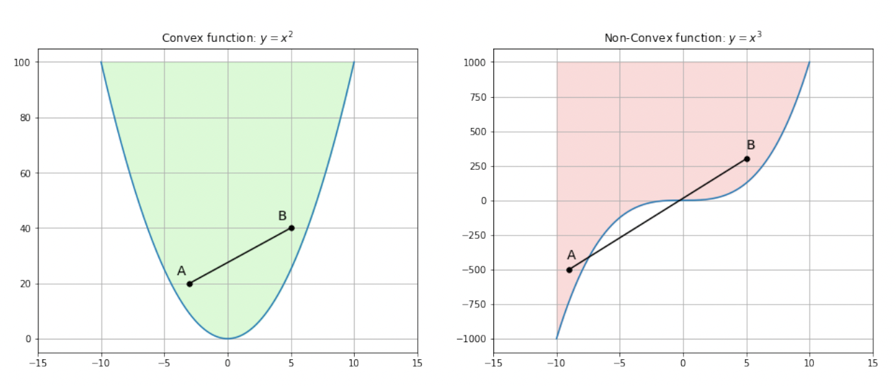

# 线性凸优化

## 1. 目标函数

### 1.1. 凸集

设$x_1$和$x_2$为集合 ℂ 上的两个点，两者连线上的所有点仍在集合上，则该集合为凸集，即

$$
∀x_1, x_2 ∈ ℂ, 0 ≤ θ ≤ 1 ⇒ θ⋅x_1 + (1 - θ)⋅x_2 ∈ ℂ
$$

仿射集为凸集，即

$$
∀x_1, x_2 ∈ ℂ, θ ∈ ℝ ⇒ θ⋅x_1 + (1 - θ)⋅x_2 ∈ ℂ
$$

> 凸集的交集仍为凸集。

半空间为凸集，即

$$
θ ∈ ℝ^n, 𝒃 ∈ ℝ, ℂ = \{𝒙 ∣ θ^{⊤} ⋅ 𝒙 + 𝒃 ≤ 0\}
$$

> 对 Lₚ 范数，当$p≥1$，得到的集合为凸集。

### 1.2. 凸函数

**定义**：一般来说，一个多维函数$g(𝒙)$是凸的，当且仅当

- 给出函数表面上的一组任意点，$(𝒙_1, g(𝒙_1)), (𝒙_2, g(𝒙_2)), ⋯, (𝒙_{n}, g(𝒙_{n}))$
- 给出一组任意的权重$α_1, α_2, ⋯, α_{n}$，其总和为 1
- 函数输出的加权和 ≥ 函数加权和的输出

$$
∑_{i=1}^n α_i g(𝒙_i) ≥ g\bigg(\sum_{i=1}^n α_i 𝒙_i\bigg)
$$

稍微思考一下就会发现，定义 1 意味着凸形曲线总是向上和/或向右弯曲。这导致了凸性的另一个等价定义。

**定义**：

- 一维函数$g(𝒙)$是凸的，当且仅当其曲率在任何地方都是正的。即：

$$
\frac{d^2g}{dx^2} ≥ 0 \quad ∀x
$$

- 一个多维函数$g(𝒙)$是凸的，当且仅当其 Hessian 矩阵是正定的。

> 需要注意的是，若二阶导数在任何地方都是负的或者 Hessian 是半负定的，那么该曲线或曲面就被称为是凹的。

### 1.3. Jensen 不等式

对于一个凸函数$f(x)$，都有函数的期望 ≥ 期望的函数

$$
E\big[f(x)\big] ≥ f(E\big[x\big])
$$

其中，$x$是一个随机变量。

## 2. 仿射变换

仿射变换（affine transformation）一种二维坐标到二维坐标之间的线性变换，其中，仿射（affine）一词源于拉丁语中的 affined，意为关系密切的。

设$𝑨$为$n$阶实方阵，$𝒃$是$n$维向量，定义于几何空间$ℝ^n$的仿射变换具有下列形式：

$$
T(𝒙) = 𝑨𝒙 + 𝒃
$$

仿射变换可以通过一系列的线性变换变换的复合来实现，包括：平移（translation）、缩放（scale）、翻转（flip）、旋转（rotation）和剪切（shear）。当平移量为零，仿射变换为线性变换。

仿射变换有两个特殊的性质：

- 平直性（straightness）：$ℝ^n$内经仿射变换的任一直线的像（image）仍是直线，的任一圆弧的像（image）仍是圆弧
- 平行性（parallelness）：经过仿射变换的二维图形间的相对位置关系不变
