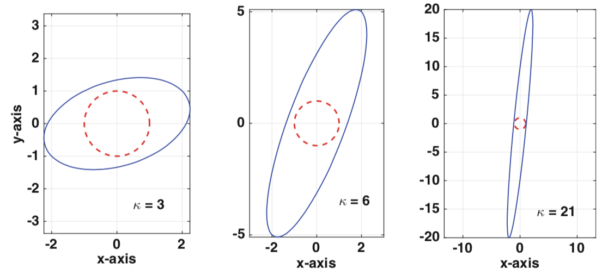

# 线性测度

## 1. 范数

范数（norm）的概念来源于泛函分析，是具有"长度"概念的函数，用于度量一个矢量的大小（测量矢量的测度）。分为向量范数（二维坐标系）和矩阵范数（多维空间，一般化表达）。

### 1.1. 向量范数

**定义**：对向量

$$
𝒙 = 𝒗_1, 𝒗_2, …, 𝒗_m
$$

$$
∥𝒙∥_p = {(∑{\|x_i\|}^{p})}^{\frac{1}{p}}
$$

设$𝒗 ∈ 𝒱$

- 当且仅当$𝒗 = 𝟎$时，$∥𝒗∥ = 0$
- $∥λ𝒗∥ = |λ|∥𝒗∥,\ ∀λ ∈ 𝔽$

|  范数   |   别名   |        数学含义        |                公式                 |
| :-----: | :------: | :--------------------: | :---------------------------------: |
| 1-范数  | 街区距离 |   向量元素绝对值之和   |        $∥𝒙∥_1 = ∑{\|x_i\|}$         |
| 2-范数  | 直线距离 |                        |  $∥𝒙∥_2 = \sqrt{∑{{(\|x_i\|^2)}}}$  |
| ∞-范数  | 棋盘距离 | 向量元素绝对值的最大值 | $∥𝒙∥_{∞} = \mathrm{argmax}\|x_i\|$  |
| -∞-范数 |          | 向量元素绝对值的最小值 | $∥𝒙∥_{-∞} = \mathrm{argmin}\|x_i\|$ |

### 1.2. 矩阵范数

- $ℓ_1$-Norm

表示向量$x$中非零元素的绝对值之和，如 Manhattan 距离（街区距离）

- $ℓ_2$-Norm

$$
∥x∥_2 = \sqrt{∑x_i^2}
$$

表示向量元素的平方和再开平方，如 Euclidean 距离（几何中两点间的直线距离）

- $ℓ_0$-Norm

$ℓ_0$并不是一个真正的范数，它主要被用于度量向量中非零元素的个数，实际情况中，其最优问题会被放宽到$ℓ_2$ 或$ℓ_1$下的最优化。

- Frobenius-Norm

$$
∥x∥_{F} = \sqrt{∑_{ij} a_{ij}^2}
= \sqrt{∑_{i=1}^{\min (m, n)} σ_i^2}
$$

其中，$σ_i$为$𝑨$的第$i$个特征值。

|  范数   |   别名   |           数学含义           |                                公式                                 |
| :-----: | :------: | :--------------------------: | :-----------------------------------------------------------------: |
| 1 -范数 | 列和范数 | 矩阵列向量绝对值之和的最大值 |  $∥𝑨∥_1 = \underset{1≤j≤n}{\mathrm{argmax}}\ ∑_{i=1}^m \|a_{ij}\|$  |
| 2-范数  |  谱范数  |     $𝑨^{⊤}𝑨$的最大特征值     |                      $∥𝑨∥_2 = \max∥𝑨𝒙̂∥ = σ_1$                       |
| ∞-范数  | 行和范数 | 矩阵行向量绝对值之和的最大值 | $∥𝑨∥_∞ = \underset{1 ≤ i ≤ n}{\mathrm{argmax}}∑_{j=1}^m \|a_{ij}\|$ |
| F-范数  |          |     所有矩阵元素的均方根     |             $∥𝑨∥_\mathrm{F} = \sqrt{∑{∑\|a_{ij}\|^2}}$              |
| 核范数  |          |        矩阵奇异值之和        |                           $∥𝑨∥_* = ∑λx_i$                           |

## 2. 条件数

### 2.1. 定义

设$x$是真实解，$x_c$是计算解，定义

误差向量：$e ≡ x - x_c$
残差向量：$r ≡ b - 𝑨𝒙_c$

虽然希望得到零误差，但实际情况是，当使用浮点数时，最好预期是机器$ε$的相对误差。另一个复杂因素是，对于大多数问题，我们不知道$x$，因此无法计算$e$。但，残差是我们可计算的。随后的所有内容都基于使用残差来确定或估计计算解决方案中的误差的目标。即

$$
r = 𝑨e → e = 𝑨^{-1}r
$$

:::{admonition} 定理

设$𝑨$非奇异，$𝑩$非零，则

$$
\frac{∥e∥}{∥x∥} ≤ κ(𝑨) \frac{∥r∥}{∥b∥}
$$

其中，$κ(𝑨)$是$𝑨$的条件数，定义为

$$
κ(𝑨) ≡ ∥𝑨∥ * ∥𝑨^{-1}∥
$$

:::

上述定理表明，若相对残差很小，则相对误差很小。得出这个结论的要求是条件数不是很大。具有大条件数的矩阵是病态的。因为条件数 ≥ 1（这在下面证明），病态的$𝑨$的条件可写为$1 ≪ κ(𝑨)$。

对于对角矩阵

$$
κ(𝑨) = \frac{d_{\max}}{d_{\min}}
$$

这表明，对于这个矩阵，条件数不会受到$d_i$的大小的影响，而是它们之间的差。

:::{admonition} 定理

设$𝑨$和$𝑷$可逆，则以下成立

- $κ(𝑰) = 1$，其中，𝑰 是单位矩阵
- $1≤ κ(𝑨) < ∞$
- $∀α ≠ 0$，$κ(α𝑨) = κ(𝑨)$
- $κ(𝑨) = κ(𝑨 - 1)$
- $κ(𝑷𝑨) ≤ κ(𝑷)κ(𝑨)$

:::

### 2.2. 影响

条件数在确定矩阵方程的求解精度方面起着重要作用。使用$κ$来指定这个数字。若公式适用于任何范数，则将没有下标，而若结果取决于使用的范数，则将使用下标，如$κ_{∞}(𝑨)$。

对

$$
𝑨 =
\begin{bmatrix}
a & b \\ c & d
\end{bmatrix}
$$

若$ad - bc ≠ 0$，则有

$$
𝑨^{-1} = \frac{1}{ad - bc}
\begin{bmatrix}
d & - b \\ -c & a
\end{bmatrix}
$$

$$
∥𝑨∥_{∞} = \max \{|x| + |y|, |c| + |d|\}
$$

$$
∥𝑨^{-1}∥ = \frac{1}{|ad - bc|} \max \{|d| + |y|, |c| + |x|\}
$$

设

$$
𝑨 =
\begin{bmatrix}
1 & 2 \\ -1 & d
\end{bmatrix}
$$

- $d = 1: κ_∞(𝑨) = 3$
- $d = 5: κ_∞(𝑨) = 6$
- $d = 20: κ_∞(𝑨) = 21$

用$𝑨$作用于单位圆（$x^2 + y^2 = 1$）的$x$，可得到相应的椭圆。对于较小的条件数值，$𝑨$不会明显扭曲单位圆。但对于较大的值，扭曲会十分明显。

## 3. 空间关系

### 3.1. 空间平面

已知

$$
𝒗_1(X_1, Y_1, Z_1), 𝒗_2(X_2, Y_2, Z_2), M(x, y, z), M_0(x_0, y_0, z_0)
$$

则

$$
\begin{aligned}
  𝒓_0 &= (x_0, y_0, z_0) \\
  𝒓 &= (x, y, z)
\end{aligned}
$$

则向量$𝐌_0 𝐌$与基向量$𝒗_1, 𝒗_2$共面的充要条件为：

$$
(𝒓 - 𝒓_0, 𝒗_1, 𝒗_2) = 0 ⇔
\begin{bmatrix}
  {x - x_0} & {X_1} & {X_2} \\
  {y-y_0} & {Y_1} & {Y_2} \\
  {z-z_0} & {Z_1} & {Z_2}
\end{bmatrix} = 0
$$

可得，平面的普通方程

$$
Ax + By + Cz + D = 0
$$

其中，

$$
A =
\begin{bmatrix}
  {Y_1} & {Z_1} \\
  {Y_2} & {Z_2}
\end{bmatrix},
B =
\begin{bmatrix}
  {Z_1} & {X_1} \\
  {Z_2} & {X_2}
\end{bmatrix},
C=
\begin{bmatrix}
  {X_1} & {Y_1} \\
  {X_2} & {Y_2}
\end{bmatrix}
$$

$$
D = -(Ax_0 + By_0 + Cz_0)
$$

- 平行条件

$$
\begin{gathered}
  𝒗(X, Y, Z) // Ax + By + Cz + D = 0\\
  ⇕\\
AX + BY + CZ= 0
\end{gathered}
$$

### 3.2. 空间直线

- 参数方程

过点$(x_0, y_0, z_0)$，方向向量为$(X, Y, Z)$

$$
\begin{cases}
  {x = x_0 +t X} \\
  {y = y_0 +t Y} \\
  {z=z_0 +t Z}
\end{cases}
$$

- 标准方程

$$
\frac{x - x_0} x = \frac{y-y_0}y = \frac{z-z_0}{Z}
$$

- 两点方程

$$
\frac{x - x_1}{x_2- x_1} = \frac{y-y_1}{y_2-y_1} = \frac{z-z_1}{z_2-z_1}
$$

平行：方向向量成比例，但不等于点连线比例

重合：方向向量成比例，等于点连线比例

相交：方向向量不成比例

$$
\begin{bmatrix}
  {x_2- x_1} & {y_2-y_1} & {z_2-z} \\
  {X_1} & {Y_1} & {Z_1} \\
  {X_2} & {Y_2} & {Z_2}
\end{bmatrix} = 0
$$

异面：

$$
\begin{bmatrix}
  {x_2- x_1} & {y_2-y_1} & {z_2-z_1} \\
  {X_1} & {Y_1} & {Z_1} \\
  {X_2} & {Y_2} & {Z_2}
\end{bmatrix} ≠ 0
$$

### 3.3. 距离

- 点到线

$$
d= \frac{\big|\overrightarrow{M_0 M}×𝒗 \big|}{|𝒗|}
$$

- 点到面

$$
d= \frac{\big|Ax_0 + By_0 + Cz_0 + D\big|}{\sqrt{A^2 + B^2 + C^2}}
$$

- 线到线
