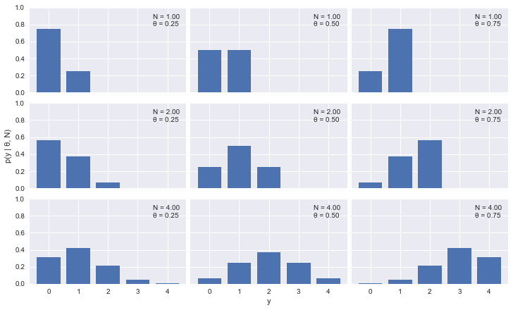
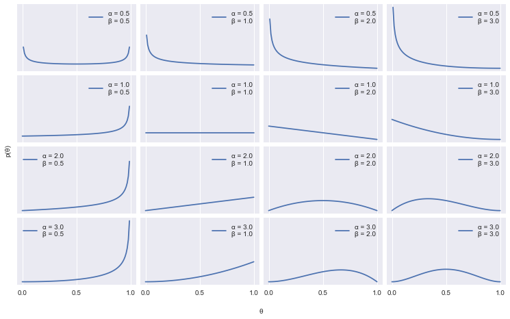
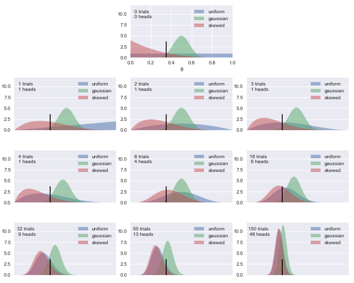
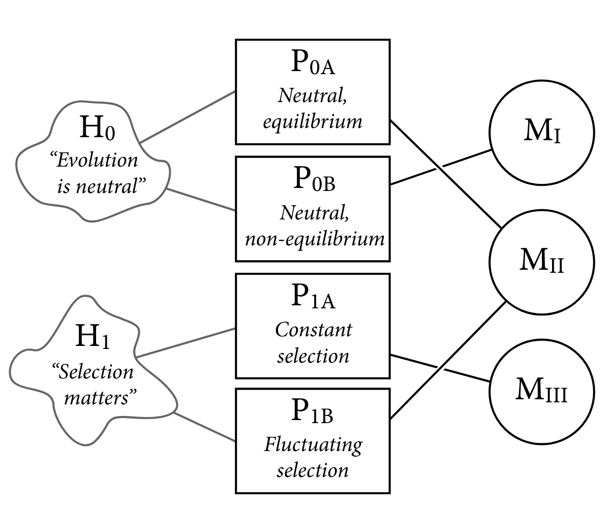
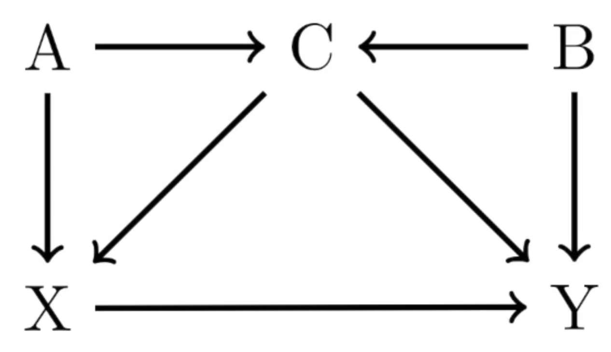

# 概率

## 1. 集合

### 1.1. 子集

- Boolean 方程：$f_n:\{0, 1\}^n → \{0, 1\}$有$2^{2^n}$个子集

:::{admonition} 组合数定理

$$
∑_{i=1}^k p_i = n (p_i ∈ ℕ^{+}) →
∑_{i=1}^k q_i = n - k (q_i ∈ ℕ)
$$

$$
∑_{i=1}^k r_i ≤ n (r_i ∈ ℕ) →
∑_{i=1}^{k+1} r_i = n (r_i ∈ ℕ)
$$

:::

### 1.2. 集合的运算

样本空间：包括所有可能结果的集合，可连续，可离散。

- 交换律

$$
A ∪ B = B ∪ A
$$

$$
A ∩ B = B ∩ A
$$

- 结合律

$$
A ∪ (B ∪ C) = (A ∪ B) ∪ C
$$

$$
A ∩ (B ∩ C) = (A ∩ B) ∩ C
$$

- 分配律

$$
A ∪ (B ∩ C) = (A ∪ B) ∩ (A ∪ C)
$$

$$
A ∩ (B ∪ C) = (A ∩ B) ∪ (A ∩ C)
$$

- De Morgen 律

$$
\overline{A ∪ B} = \overline{A} ∩ \overline{B}
$$

$$
\overline{A ∩ B} = \overline{A} ∪ \overline{B}
$$

- 转化

$$
A + B = A ∪ B
$$

$$
A - B = A \overline{B}
$$

$$
A(B - C) = AB - AC
$$

- 笛卡尔积

$$
A × B = \{(x, y) |x ∈ A ∧ y ∈ B\}
$$

$$
A × ∅ = ∅
$$

> 笛卡尔幂：$n$元集合有$2^n -1$个子集，其$k$阶笛卡尔幂有$n^k$个元素

### 1.3. 重排、组合

1.$P_r^n = \dfrac{n!}{(n -r)!}$
2.$P_r^r = r!$
3.$C_r^n = \dfrac{P_r^n}{P_r^r} = \bigg(\begin{matrix} n \\ r \end{matrix}\bigg)$
4. Pascal 公式

$$
\binom{n+1}{k} = \binom{n}{k} + \binom{n}{k-1}
$$

## 2. 随机事件

### 2.1. 事件的运算

在概率论中，考虑一个样本空间$Ω$，它是所有可能结果$ω$的集合，以及它的子集的集合$F$，其结构为$σ$代数，其元素称为事件（event）。

- 有限可加性

$$
A ⊂ B ⇒ P(B-A) = P(B) - P(A) ⇒ P(A) ≤ P(B)
$$

- 加法定律

$$
P(A ∪ B) = P(A) + P(B) - P(AB)
$$

### 2.2. 随机变量

- 随机变量

一个真实的随机变量 X 是一个（可度量的）从$Ω$到$ℝ$的映射。

$$
X: ω ∈ Ω ↦ x ∈ ℝ
$$

- 离散随机变量

若一个随机变量$X$在$ℝ$的一个子集中取值，其取值个数可度量，则说它是离散的。

## 3. 条件概率

### 3.1. 定义

- 古典概率
  - 无需实验
  - 没有误差
  - 可能性有限且大小相等

- 条件概率
  - 指事件$𝑨$在事件$B$已发生条件下的发生概率
  - 表示为：$P(A|B)$，$P(AB) = P(B|A)P(A)$

### 3.2. 独立性

独立 ⇔$P(AB) = P(A)P(B) ⇒ A ∩ B = ∅$

- 推论 1

$$
\begin{cases}
  P(AB) = P(A)P(B) \\
  P(A) > 0\\
\end{cases}
⇔ P(B|A) = P(B)
$$

- 推论 2

### 3.3. 全概率公式

- 完备事件群：任意两事件互斥，所有事件的并集是整个样本空间（必然事件）
- 全概率公式：对完备事件组$B_i$，若事件都有正概率，则对任一事件$𝑨$都有如下公式成立

$$
P(A) = P(Aω) = P(∑_1^nAB_i) = ∑_1^n{P(AB_i)} = ∑_1^n{P(B_i)P(A|B_i)}
$$

### 3.4. 条件期望

若$X$是一个**随机变量**，$Y$是一个**随机向量**，分别取值于$X ⊂ ℝ$和$Y ⊂ ℝ^q$。令$p_{XY}(x, y)$表示它们的联合概率密度。

## 4. Bayes 定理

$$
p(θ ∣ y) = \frac{p(y ∣ θ) p(θ)}{p(y)}
$$

- $p(θ)$：先验（prior），反映之前对参数的了解；
- $p(y ∣ θ)$：似然（likelihood），引入数据的方式，反映给定参数下获取数据的可信度；
- $p(θ ∣ y)$：后验（posterior），分析的结果，反映给定参数和模型下对问题的全部认知；
- $p(y)$：边际似然（marginal likelihood），又称证据（evidence），是在参数可取遍所有可能值条件下，得到指定实例的概率的均值，大多数时候可简单当成归一化因子，此时，Bayes 定理可写作

$$
p(θ ∣ y) ∝ p(y ∣ θ) p(θ)
$$

### 4.1. 似然（模型分布）

考虑抛硬币问题

- 假设只有两种可能的结果，正面或反面，同时假设抛硬币不会影响其他的抛硬币，即，设抛硬币是相互独立的。
- 进一步假设所有的抛硬币都来自于同一个分布。因此随机变量掷硬币是一个独立同分布变量的例子。

考虑到这些假设，可能性的一个很好的候选人是二项分布。

$$
p(y ∣ θ, N) = \frac{N!}{y!(N - y)!} θ^y(1 - θ)^{N - y}
$$



### 4.2. 先验

作为先验，使用 Beta 分布

$$
p(θ) = \frac{Γ(α+ β)}{Γ(α)Γ(β)} θ^{α - 1}(1 - θ)^{β - 1}
$$

仔细观察，就会发现 Beta 分布除了系数，整体看起来和二项分布很相似。其系数实际上是一个归一化常数，保证分布积分为 1，$Γ$为 Gamma 函数。



使用 Beta 分布来解决这个问题有很多理由：

- Beta 分布被限制在 0 和 1 之间。一般来说，当想对二项式变量的比例进行建模时，会使用 Beta 分布。
- 多功能。Beta 分布使用了几种形状，包括均匀分布、类 Gaussian 分布和类 U 分布。
- Beta 分布是二项分布的共轭先验（conjugate prior）。

> $\mathrm{Beta}(1, 1) = \mathrm{U}(0, 1)$

### 4.3. 共轭先验

似然的共轭先验是指当与给定似然结合使用时，返回一个与先验具有相同函数形式的后验。简单说就是，每当使用一个 Beta 分布作为先验，使用一个二项分布作为似然，将得到一个 Beta 分布作为后验分布。

> Gaussian 分布是自身的共轭先验。

```{note}

多年来，Bayesian 分析只能使用共轭先验。共轭性确保了后验的数学可理解性，这一点很重要，因为 Bayesian 统计中的一个常见问题就是最后得到一个无法求解的后验。在发展出合适的计算方法来解决概率方法之前，这是个难题。

```

### 4.4. 后验

根据 Bayes 定理、似然和 Beta 分布的定义，可得

$$
p(θ | y) ∝ \frac{N!}{y!(N - y)!} θ^y(1 - θ)^{N - y} \frac{Γ(α + β)}{Γ(α) Γ(β)} θ^{α - 1}(1 - θ)^{β - 1}
$$

出于实际考虑，丢弃所有不依赖$θ$​的项，得

$$
p(θ | y) ∝ θ^{y + α - 1}(1 - θ)^{N - y + β - 1}
$$

即

$$
p(θ | y) ∼ \mathrm{Beta}(α_\mathrm{prior} + y, β_\mathrm{prior} + N - y)
$$



在 0.35 处有一条黑色的垂线，代表了$θ$的真实值。在实际问题中，真实值往往是未知的。

- 均匀分布的先验（蓝色），代表了对后验的一无所知，即所有可能的偏差值是同等可能的先验。
- 类 Gaussian 的先验（绿色），代表着硬币公平。
- 倾斜的先验（红色），代表着硬币偏向反面。

在上图中可看到，来自均匀先验和倾斜先验的后验更快地收敛到几乎相同的分布，而 Gaussian 先验的后验则需要更长的时间。Bayesian 分析的结果是一个后验分布，不是一个单一的值，而是一个给定数据和模型的可信值的分布。最有可能的值由后验的众数（分布的峰值）给出。

先验的分布与参数值的不确定性成正比；分布越分散，确定性越低。给予足够大的数据量，两个或多个具有不同先验的 Bayesian 模型将趋向于相同的结果。

## 5. 两大学派

### 5.1. 观点

对概率的诠释有两大学派，频率派和 Bayesian 派。观测集$X$采用如下表示：

$$
X_{N × p} = (x_1, x_2, ⋯, x_N)^{⊤}, x_i = (x_{i1}, x_{i2}, ⋯, x_{ip})^{⊤}
$$

$N$为样本数量，每个样本都是$p$维向量，每个观测都是由$p(x_i ∣ θ)$​生成的。

- 频率派观点

频率派认为，$p(X ∣ θ)$中的$θ$是一个常量，即

$$
p(X ∣ θ) = ∏_{i=1}^N p(x_i ∣ θ)
$$

为了求$θ$的大小，采用最大似然估计（Maximum likelihood estimation，MLE）：

$$
\begin{aligned}
θ_\mathrm{MLE}
&= \underset{θ}{\mathrm{argmax}}\ \log p(X ∣ θ) \\
&= \underset{θ}{\mathrm{argmax}}\ ∑_{i=1}^N\log p(x_i ∣ θ)
\end{aligned}
$$

其中，$\mathscr{L}(θ) = \log p(X ∣ θ)$被称为似然函数。

- 概率派的观点

概率派认为，$p(X ∣ θ)$中的$θ$是满足一个预设的先验分布的随机变量，即$θ ∼ p(θ)$​​。根据 Bayes 定理，有后验：

$$
p(θ | X) = \frac{p(X ∣ θ)⋅p(θ)}{p(X)} = \frac{p(X ∣ θ)⋅p(θ)}{∫_θp(X ∣ θ)⋅p(θ)dθ}
$$

为了求$θ$的值，采用最大后验估计（Maximum a Posteriori estimation，MAP）：

$$
θ_\mathrm{MAP} = \underset{θ}{\mathrm{argmax}}\ p(X ∣ θ)⋅p(θ)
$$

得到了参数的后验分布$p(θ | X)$ 后，可以将这个分布用于预测 Bayesian 推断：

$$
p(x_{new} | X) = \underset{θ}{∫} p(x_{new} ∣ θ)⋅p(θ | X)dθ
$$

其中，$p(x_{new} ∣ θ)$是模型。

> 最大似然估计没有明确地调用任何先验，可被认为是 Bayesian 模型的一种特殊情况，一种具有均匀先验的模型。

简言之，两大学派的差异在于，概率$p$的估计选择先验$p(X ∣ θ)$还是后验$p(θ | X)$。统计学习的本质是优化，概率图本质问题是求积分（如 MCMC）。

### 5.2. 因果推断

```{note}

For statistical models to produce scientific insight, they require additional scientific (causal) models.

--- < Statistical Rethinking >

```

数据的原因不能仅从数据中提取。**没有原因，就不会有结果**。

因果推断是

- 变量的关联（association）
- 干预（intervention）的预测
- 缺失观测的填补（imputation）

> 关联 ≠ 相关

知道一个原因意味着

- 能够预测干预的后果
- 能够构建未观察到的反事实（counterfactual）结果

即使目标是描述性的，也需要因果模型。因为样本与总体不同，要描述总体需要对因果思考。

```{warning}

经典假设检验的风险

- 许多过程会产生相似的概率分布
- 不同的零假设，会得到相互矛盾的结论

```



### 5.3. DAG

有向无环图（directed acyclic graph，DAG），是一个没有有向循环的、有限的有向图。它可以帮助明晰问题，"在没有额外假设的情况下，我们能做出什么决定？"。



在一个因果模型中，加入所有元素往往是不明智的。通过 DAG 递进查询（query），可以逼近真相。

由上图，可以写出如下关系

$$
\begin{aligned}
Y &∼ X \\
Y &∼ X + A \\
Y &∼ X + A + B \\
Y &∼ X + C \\
Y &∼ X + A + C \\
Y &∼ X + B + C
\end{aligned}
$$

但，实际上的模型只需要最后一个关系式，即

$$
Y ∼ X + B + C
$$

```{note}

数据分析原则

- 理解每一步
- 记录每一步，并减少误差
- 尊重科学流程

```
