# 概率编程

## 1. Bayesian 推断

### 1.1. 概率编程

Bayesian 推断遵循以下流程

1. 定义样本的生成模型
2. 定义一个具体的估计量（estimand）
3. 设计一种统计方法来产生估计量
4. 使用 1. 测试 3.
5. 分析样本，总结

> Bayesian 思想的一个关键，是对不断模型提出合理的质疑，在最小化质疑过程中，得到最优模型。

具体到计算，则需要运用概率编程，后者处理的是 3 个问题

- Bayesian 数据分析
  - 以连续的概率值，代替二元逻辑值
  - 使用 Monte Carlo-Markov Chain（MCMC）解决计算困难
- 多水平模型
  - 以模型，代替参数
- 模型比较
  - 以较有意义的模型，代替假设检验
  - 以信息量，代替 Occam 剃刀
  - 因果推断

### 1.2. 先验的选择

对于许多问题来说，我们经常会知道一些关于一个参数可取的值，我们可能知道一个参数可取的大致范围，或我们期望该值接近于或低于或高于某个值。在这种情况下，我们可使用先验在我们的模型中放入一些弱信息。因为这些先验的作用是使后验分布保持在一定的合理边界内，故也被称为正则先验（regularizing priors）。

若有高质量的信息来定义这些先验，使用信息先验（informative prior）亦为一个有效的选择。信息先验是强先验，可传递很多信息。例如，在结构生物信息学领域，几十年来，人们一直在从成千上万个精心设计的实验中收集数据，因此掌握了大量值得信赖的先验信息。不使用它将是荒谬的。

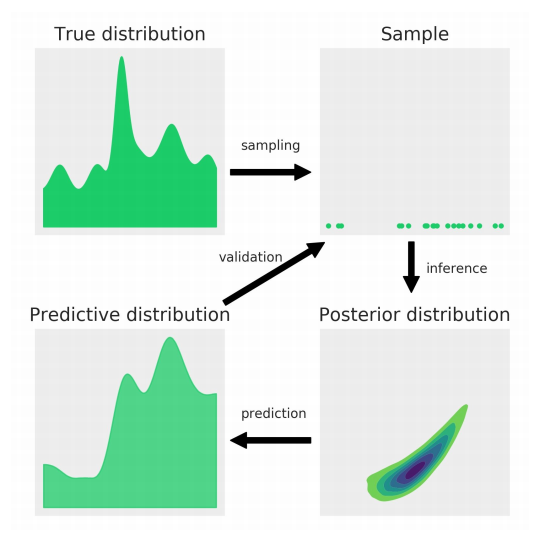

先验可让模型表现得更好，具有更好的泛化特性。另外，每个模型，不管是不是 Bayesian 模型，都有某种方式的先验，即使先验不是明确设置的，其中很多均是由频率学派统计学产生的，在某些情况下可看成是 Bayesian 模型的特例，如扁平先验。

针对抛硬币问题，似然使用二项分布，先验使用标准均匀分布。

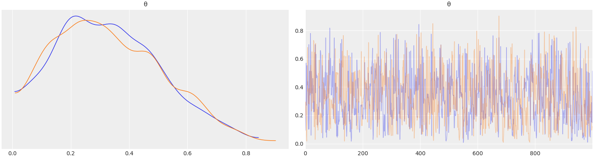

这里得到了每个未观测变量的两个子图。在我们的模型中，唯一一个未观测的变量是$θ$。请注意，$y$是代表数据的观测变量；不需要对其采样。左图是核密度估计（kernel density estimation，KDE）图。在右边，可得到了采样过程中每一步的各个采样值。从踪迹（trace）图中，可直观地从后验中得到可信的值。

|     | mean  |  sd   | hdi3% | hdi_97% | mcse_mean | mcse_sd | ess_bulk | ess_tail | r_hat |
| :-: | :---: | :---: | :---: | :-----: | :-------: | :-----: | :------: | :------: | :---: |
|  θ  | 0.331 | 0.178 | 0.035 |  0.659  |   0.006   |  0.005  |   740    |   1025   |   1   |

这里得到均值、标准差和 `94%` 的 HDI。

### 1.3. 后验总结

一个常用的总结后验分布的方法是使用最高后验密度（highest posterior density，HPD），其对应的区间称最高密度区间（highest density interval，HDI），是包含给定部分概率密度的最短区间。其中最常用的是 `95%` 的 HDI。若我们说某项分析的 `95%` HDI 是 `[2, 5]`，意味着根据我们的数据和模型，我们认为有关参数在 2 和 5 之间，概率为 `0.95`。

> 请注意，HDI 区间不等于置信区间。

有时候，描述后验是不够的，需要根据推论做出决定。我们必须将一个连续的估计还原到一个二元估计：是 - 非，健康 - 疾病，污染 - 安全，等等。例如，我们需要决定硬币是否公平。我们可将 0.5 与 HDI 进行比较。在实践中，我们一般不关心精确的结果，而是关心一定范围内的结果。我们可相应地放宽对公平性的定义，说公平的硬币是值在 0.5 左右的硬币。例如，在 `[0.45, 0.55]` 这个区间内的任何值，我们把这个区间称为实际等价区（region of practical equivalence，ROPE）。一旦定义了 ROPE，我们就将其与 HDI 比较。我们至少可得到三种情况：

- ROPE 与 HDI 不重叠，则可说硬币不公平；
- ROPE 包含了整个 HDI，则可说硬币是公平的；
- ROPE 与 HDI 部分重叠，则不能说硬币是公平或不公平。

注意，这里不需要收集数据来进行任何类型的推理。因为 ROPE 的定义是取决于上下文的。决定本来就是主观的，我们的任务是根据我们的目标，做出最明智的决定。下图中，ROPE 显示为一条半透明的粗线。默认情况下，`plot_posterior` 显示的是离散变量的直方图和连续变量的 KDE。它还可得到分布的均值（可使用 `point_estimate` 参数求取中数或众数）和`94%` 的 HDI，在图的底部用黑线表示。除此之外，也可选择将后验与参考值进行比较。

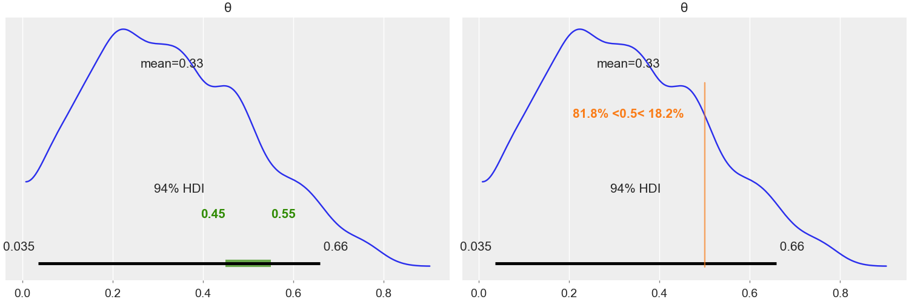

> 注意，上图中的 HDI 是 `94%`。这是对 `95%` 值的任意性的友好剩余。每次 `ArviZ` 计算和报告 HDI 时，它将默认使用 0.94 的值（对应 `94%`）。可通过向 `credible_interval` 传递一个不同的值来改变这个值。

### 1.4. 后验预测核查

一旦有了一个后验$p(θ| y)$，就可根据数据$y$和估计的参数$θ$，生成预测$ỹ$。

$$
p(ŷ | y) = ∫p(ŷ ∣ θ) p(θ | y) dθ
$$

故，后验预测分布是条件预测对后验分布的均值。在概念上，将这个积分近似为一个迭代的两步过程。

1. 从后验$p(θ| y)$中抽取一个值$θ$
2. 将该值反馈给似然，从而得到一个数据点$ỹ$。

当需要进行预测时，可使用生成的预测$ỹ$。但也可用它们来调试模型，通过比较观察到的数据$y$和预测到的数据$ỹ$来发现这两组数据之间的差异，这就是所谓的后验预测核查（posterior predictive checks，PPC）。主要目标是检查自一致性（auto-consistency）。

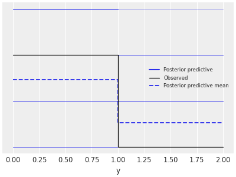

### 1.5. 损失函数

为了做出一个好的决策，对相关参数的估计量有尽可能高的精度是很重要的，但也要考虑到犯错误的成本。成本 - 收益的权衡可用损失函数在数学上度量。关键思想是使用一个函数来捕捉参数的真实值和估计量的差异。损失函数的值越大，估计量越差。一些常见的损失函数的例子有：

- 二次方损失，$(θ - θ̂)^2$
- 绝对损失，$∣θ - θ̂|$
- 0-1 的损失，$I(θ ≠ θ̂)$，其中，$I$为指标函数。

在实践中，我们一般手头没有真实参数的值。相反，我们有一个后验分布形式的估计。故，我们能做的就是找出最小化预期损失函数的值。所谓预期损失函数，我们指的是整个后验分布的平均损失函数。

> 在很多问题中，做一个决策的成本是不对称的。若需要，我们可构造一个非对称损失函数（右图）。

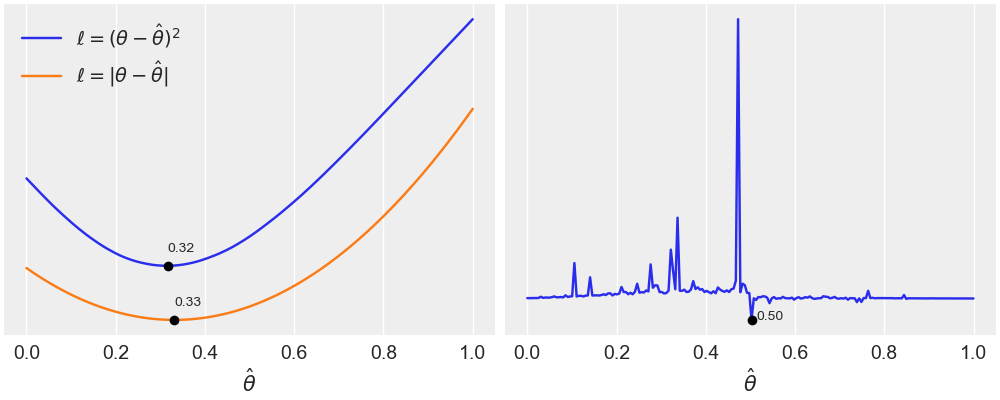

## 2. 稳健推断

### 2.1. 正态推断

核磁共振（nuclear magnetic resonance，NMR）是一种强大的技术，用于研究分子以及人类或酵母等生物。NMR 允许测量不同种类的可观察量，这些量与不可观察的分子属性有关。其中一个观测量被称为化学位移（chemical shift），而我们只能获得某些类型原子核的化学位移。该数据集的 KDE 图显示出类似正态的分布，除了两个远离均值的数据点。设高斯分布是对数据的正确描述。由于不知道均值和标准差，我们必须为这两个数据设置先验。故，一个合理的模型可是

$$
\begin{aligned}
μ &∼ U(l, h) \\
σ &∼ | N (0, σ_{σ}) | \\
y &∼ N (μ, σ)
\end{aligned}
$$

故，$μ$来自于均匀分布，$l$和$h$，分别是下界和上界，$σ$来自于半高斯分布，标准差为$σ_{σ}$。半高斯分布就像普通的高斯分布，但仅限于正值（包括零）。你可从半高斯分布中采样，然后取每个采样值的绝对值，从而得到半高斯分布的样本。最后，在我们的模型中，数据来自于高斯分布，其参数为$μ$和$σ$。

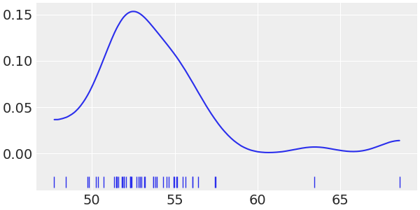

一种选择是将均匀分布的边界设置为$l = 40, h = 70$，这个范围比数据的范围大。另外，我们也可根据我们以前的知识选择一个范围。我们可能知道，对于这种类型的测量，物理上不可能有低于 0 或高于 100 的值。在这种情况下，我们可将均值的先验设置为均匀，参数为$l = 0, h = 100$。对于半正态，我们可设置$σ_{σ} = 10$。

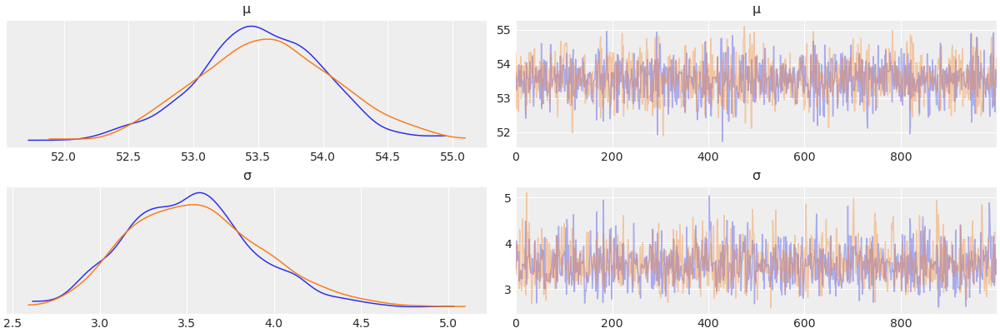

对于这个模型，后验是二维的，上图中的每行显示的是每个参数的边际分布。

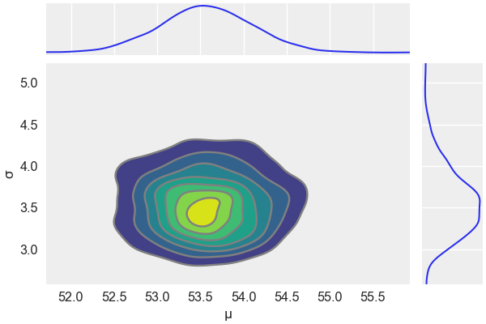

|     | mean  |  sd   | hdi3%  | hdi_97% | mcse_mean | mcse_sd | ess_bulk | ess_tail | r_hat |
| :-: | :---: | :---: | :----: | :-----: | :-------: | :-----: | :------: | :------: | :---: |
|  μ  | 53.06 | 0.387 | 52.332 | 53.768  |   0.011   |  0.008  |   1260   |   1285   |   1   |
|  σ  | 2.191 | 0.425 | 1.434  |  3.008  |   0.014   |  0.01   |   913    |   935    |   1   |
|  ν  | 4.479 | 3.418 | 1.215  |  9.237  |   0.11    |  0.078  |   1103   |   1093   |   1   |

现在已经计算出了后验，我们可用它来模拟数据，并检查模拟的数据与观测数据的一致性。

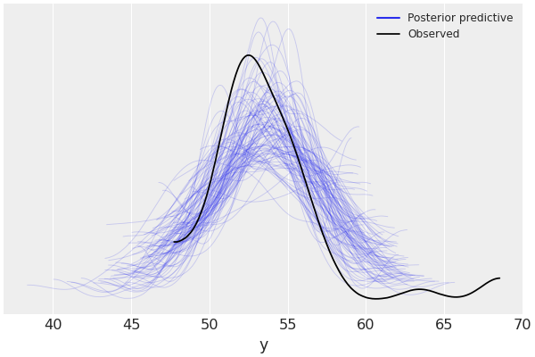

上图中，黑色单线是数据的 KDE，半透明青线是由 100 个后验预测样本中的每个计算出来的 KDE，后者反映了我们对预测数据的推断分布的不确定性。`ArviZ` 中，密度是在传递给 KDE 函数的数据的实际范围内估计的，而在这个范围之外，密度被假设为零。可看到模拟数据的均值略微向右移动，且，模拟数据的方差似乎比实际数据大。这是两个观测值与大部分数据分离的直接结果。根据我对这类测量的经验和我通常使用这些数据的方式，我会说这个模型是一个足够合理的数据表示，对我的大多数分析均是有用的。

> 很多时候，即使是比经验先验大 300 倍的先验，后验值也会收敛到大致相同的结果。在计算上，似乎差别不大。

然而从逻辑上讲，选择无约束的先验可能存在一些问题。由于不可能得到低于 0 或高于 100 的值，故存在这些值的先验没有实际意义。不过幸运的是，有了现代推理方法，如 NUTS，样本可"绕过"有问题的先验，仍然可得到一个很好的近似后验。

### 2.2. 学生 _t_ 推断

值得注意的是，我们设的是高斯分布，但在分布的尾部有两个数据点，使得正态假设有点勉强。我们可想象那些点的权重过大，决定了高斯分布的参数，那么我们可以做什么呢？

一种选择是将这些点宣布为离群值，并将其从数据中删除。离群值的两个定义是

- 任何数据点低于下四分位数的 1.5 倍或高于上四分位数的 1.5 倍
- 任何数据点低于或高于数据标准差的 3 倍

在处理离群值和高斯分布时，一个非常有用的选择是用学生 _t_ 分布代替正态似然。这个分布有三个参数：均值、标度（类似于标准差）和自由度。自由度通常使用字母$ν$，可在$\big[0, ∞\big]$的内变化，也称为正态性参数（normality parameter）。对于$ν = 1$，可得到一个重尾分布，这也被称为 Cauchy 或 Lorentz 分布。重尾的意思是，与高斯分布相比，它更有可能找到远离均值的值。当$ν → ∞$时，就会恢复高斯分布。

学生 _t_ 分布的一个的特征是，在$ν ≤ 1$时，没有定义。同理，这个分布的方差只对$ν > 2$进行定义。故，要注意学生的 _t_ 分布的标度与标准差不一样。对于$ν > 2$，分布没有确定的方差，因此也没有确定的标准差。当接近无穷大时，标度和标准差变得越来越接近。

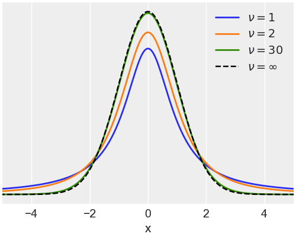

重写之前的模型，用学生 _t_ 分布代替高斯分布。因为学生 _t_ 分布比高斯分布多了一个参数（$ν$），故需要多指定一个先验。设置为均值为 30 的指数分布。上图中，可看到，学生 _t_ 分布与高斯分布看起来非常相似。事实上，从同一张图中，大部分的作用发生在相对较小的值上。故，可说，均值为 30 的指数先验是一个弱信息先验，它告诉我们$ν$应该在 30 左右，但可轻松地移动到更小和更大的值。在很多问题中，直接估计$ν$并不是重点。

$$
\begin{aligned}
  μ &∼ U (l, h) \\
  σ &∼ | N(0, σ_{σ})| \\
  ν &∼ \mathrm{Exp}(λ) \\
  y &∼ T (μ, σ, ν)
\end{aligned}
$$

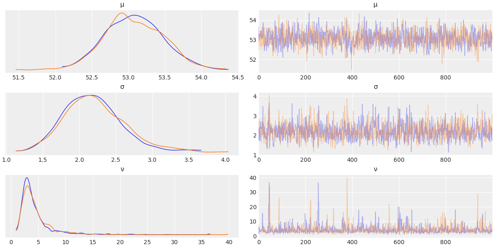

|     |  mean  |  sd   | hdi3%  | hdi_97% | mcse_mean | mcse_sd | ess_bulk | ess_tail | r_hat |
| :-: | :----: | :---: | :----: | :-----: | :-------: | :-----: | :------: | :------: | :---: |
|  μ  | 53.019 | 0.383 | 52.353 | 53.772  |   0.012   |  0.008  |   1068   |   1135   |   1   |
|  σ  | 2.174  | 0.407 | 1.442  |  2.925  |   0.015   |  0.011  |   726    |   846    |   1   |
|  ν  | 4.398  | 3.199 | 1.104  |  8.958  |   0.115   |  0.081  |   872    |   974    |   1   |

与正态模型相比，两种模型之间的对$μ$估计量相近，而对$σ$估计量由 3.5 变为 2.2. 这是由于学生 _t_ 分布对远离均值的值给予的权重较小的结果。我们还可看到$ν ≈ 4.7$，我们有一个尾部较重的分布。

在模型中使用学生 _t_ 分布会使预测样本在分布峰值的位置及其散布上似乎更适合数据。

> 请注意样本如何延展至大部分数据，以及少数预测样本如何看起来非常扁平。

学生 _t_ 分布允许我们有一个更稳健的估计，因为离群值具有减少$ν$的效应，而不是将均值拉向它们，增加标准差。故，均值和标度是通过对大部分数据中的数据点的加权来估计的，而不是对那些离群值的加权。但，标度与数据的分布有关；其值越低，分布越集中。此外，对于$ν > 2$，标度的值往往非常接近去除离群值后的估计量。故，作为经验法则，对于不够小的$ν$，并考虑到它在理论上并不完全正确，我们可认为学生 _t_ 分布的标度是去除离群值后数据标准差的一个合理的实际近似（proxy）。

## 3. 组间比较

一个很常见的统计分析是组间比较。我们可能感兴趣的是病人对某种药物的反应如何，出台新的交通法规后车祸的减少情况等等。有时，这类问题是在假设检验的情况下提出的，目的是宣布一个结果具有统计学意义。仅仅依靠统计学上的显著性是有问题的，原因有很多：一方面，统计学上的显著性不等同于实际意义；另一方面，只要收集足够多的数据，就可宣布一个小的效应是显著的。有长期的研究和论文记录表明，更多的时候，p 值的使用和解释是错误的。

我们不做假设检验，而是要走另一条路，我们要专注于估计效应量（effect size），也就是量化组间差异。从效应量的角度思考的一个好处是，我们从"是 - 否"这样的问题转向更细微的问题"效果如何？"。当有人说某件事情更难、更好、更快、更强时，记得问一下用于比较的基线是什么。为了比较组别，必须决定我们要用哪几个特征来进行比较。一个很常见的特征是每组的均值。我们将努力获得组间均值差异的后验分布，而不仅仅是差异的点估计。

### 3.1. Cohen's d

度量效应量的常用方法是 Cohen's d，其定义如下。

$$
δ = \frac{μ_2 - μ_1}{\sqrt{\dfrac{σ_2^2 + σ_1^2}{2}}}
$$

根据这个表达式，效应量是指两组的均值差与合并标准差（pooled standard deviation）的商。Cohen's d 越小，则组间差异越小。我们可得到均值和标准差的后验分布，计算出 Cohen's d 值的后验分布。一般来说，在计算合并标准差时，我们会明确考虑到每组的样本量，但上面的公式省略了两组的样本量（因为这里的样本量是相等的）。

Cohen's d 通过使用它们的标准差来引入每组的差异性。故，包括各组的内在变化是一种将差异置于背景中的方法。重新放缩（标准化）差异有助于理解组间差异的重要性。

> Cohen's d 可解释为 Z-score。Z-score 是有符号的标准差，是一个值与被观察的均值之间的差异。故，Cohen's d 为 0.5，可解释为一组与另一组的标准差为 0.5。

即使均值的差异是标准化的，我们可能仍然需要根据给定问题的背景来校准。有一个非常好的网页可探索 Cohen's d 的不同值：[cohen's d](https://rpsychologist.com/d3/cohend)。

### 3.2. 优越性概率

优越性概率（probability of superiority）是报告效应量的另一种方式，被定义为从一组随机抽取的数据点比同样从另一组随机抽取的数据点具有更大数值的概率。若设我们使用的数据是高斯分布，我们可用下面的表达式从 Cohen's d 来计算优越性概率

$$
\mathrm{ps} = Φ(\frac{δ}{\sqrt{2}})
$$

其中，$Φ$是累计高斯分布，$δ$是 Cohen's d。我们可计算出优越性概率的点估计量（通常报道的），也可计算出整个后验分布的值。若我们对正态性设没有意见，可用这个公式从 Cohen's d 中得到优越性概率，否则，由于我们有来自后验的样本，我们可直接计算它。这是使用 Markov 链 Monte Carlo（Markov chain Monte Carlo，MCMC）方法的一个非常好的优点；一旦从后验中得到样本，就可从中计算出许多量。

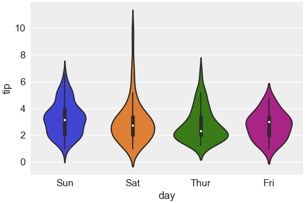

绘制差值，不需要重复比较。不绘制全差矩阵，只绘制上三角部分。解释这些结果的一种方法是将参考值与 HDI 进行比较。根据下面的图表，我们只有一种情况，当 94% 的 HDI 排除参考值为零时，也就是周四和周日的小费差异。对于其他所有的例子，我们不能排除零的差异（根据 HDI-参考值 - 重叠标准）。

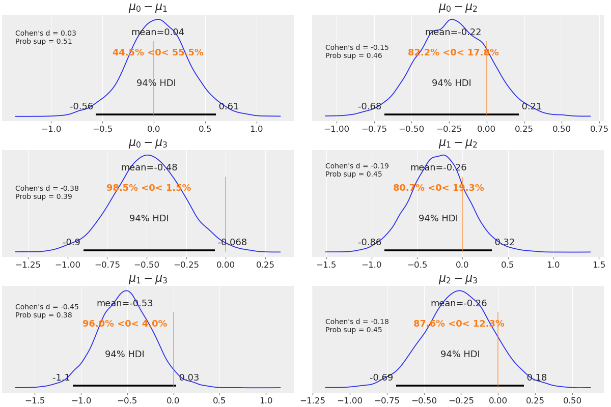

## 4. 层次模型

假设我们想分析一个城市的水质，故我们将城市划分为若干个街区来采集样本。我们可能认为我们有两种选择来分析这些数据：

- 把每个街区作为一个独立的实体来研究
- 把所有的数据集中起来，把城市的水质作为一个大的群体来估计

这两种选择均是合理的，取决于我们想知道什么。第一种方案的合理性在于我们获得了一个更详细的问题视图，否则，若我们将数据平均化，问题可能会变得不明显或不则明显。第二种选择的理由是，若我们将数据集中起来，我们就能获得更大的样本量，从而获得更准确的估计。这两个理由都很充分，但我们可建立一个模型，来估计每个社区的水质，同时估计整个城市的水质。这种类型的模型被称为层次模型。

建立层次模型，我们将通过将共享先验放在数据上直接从数据中估计。这些更高级别的先验通常被称为超先验（hyper-priors），其参数为超参数。当然，也可将先验放在超先验之上，创建我们想要的任何层级，问题是模型很快就会变得难以理解，除非问题真的需要更多的结构，否则增加超过必要的级别并不能帮助我们做出更好的推断。

### 4.1. 模型建立

想象一下，我们从同一个城市的三个不同地区收集了水样，并测量了水中的铅含量；铅浓度高于世界卫生组织（WHO）建议值的样品标为 0，低于建议值的样品标为 1。我们将每组样品的总数存储在 `N_samples` 列表中。使用 `G_samples` 列表，保存每组优质样本的数量记录。其余的代码只是为了生成一个数据列表，其中充满了 0 和 1。这个模型基本上和硬币问题上使用的模型是一样的，除了两个重要的特征：

- 定义 2 个超先验，会影响贝塔先验。
- 没有将超先验放在参数$α$和$β$，而是间接地用贝塔均值$μ$和贝塔精度$κ$来定义它们。精度类似于标准差的倒数；$κ$值越大，Beta 分布的集中度就越高。

$$
\begin{aligned}
  μ &∼ \mathrm{Beta} (α_{μ}, β_{μ}) \\
  κ &∼ |\mathrm{N}(0, σ_{κ})| \\
  α &= μ * κ \\
  β &= (1 - μ * κ) \\
  θ_i &∼ \mathrm{Beta}(α_i, β_i) \\
  y_i &∼ \mathrm{Bern}(θ_i)
\end{aligned}
$$

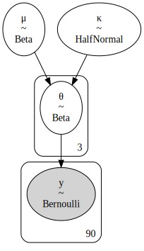

请注意，我们使用子指数来表示该模型有一些参数具有不同值的组。即，并不是所有的参数都在各组之间共享。一旦我们知道$μ$和$κ$的值，$α$和$β$就完全确定了。相应地，我们称这种类型的变量为判别性（deterministic）变量，与随机（stochastic）变量如$μ$和$κ$或$θ$相对。

使用均值和精度在数学上等同于使用$α$和$β$参数化，意味着我们应该得到同样的结果。那么，为什么要走这个弯路呢？有两个原因：

- 均值和精度参数化在数值上更适合采样器。
- 模型的可解释性。对于某些具体问题或特定的受众，报告 Beta 分布均值和精度可能是比$α$和$β$更好的选择。

### 4.2. 收缩

对合成数据进行小幅修改后，再重新运行两次模型，总共会有三次运行。即

- 将 `G_samples` 的所有元素设置为 18
- 将 `G_samples` 的所有元素设置为 3。
- 将 `G_samples` 的一个元素设置为 18，另外两个元素设置为 3。

在继续之前，请重点关注每个实验中$θ_i$的估计均值。

| G_samples  |$θ(\mathrm{mean})$|
| :--------: | :----------------: |
| 18, 18, 18 |   0.6, 0.6, 0.6    |
|  3, 3, 3   |  0.11, 0.11, 0.11  |
|  18, 3, 3  |  0.55, 0.13, 0.13  |

- 在第一行，对于 30 个样本中的 18 个好样本的数据集，得到的均值是 0.6。
- 在第二行，30 个样本中只有 3 个好样本，均值为 0.11。
- 在最后一行，没有得到其他行的平均估计量的混合，如 0.6，0.11 和 0.11，而是得到了不同的值，即 0.55，0.13 和 0.13。

通过使用超先验，我们从数据中估计贝塔先验分布的参数，每一组都在为其他组提供信息，而其他组的估计又为其提供信息。用更简洁的方式来说，各组通过超先验有效地共享信息。故，我们观察到的是所谓的收缩（shrinkage）。

有收缩有助于更稳定的推论。引入超先验，从而在更高层次上进行推断，会导致一个更保守的模型，这个模型对个别群体的极端值反应较小。在层次模型下，一个组的错误估计将被其他组提供的信息所改善。当然，更大的样本量也会起到作用，但更多的时候，并没有这个选项。

当然，收缩的多少取决于数据，数据多的组会把其他组的估计量拉得更紧。若几个组是相似的，而有一个组是不同的，相似的组要把它们的相似性告知其他组，并加强一个共同的估计，而它们要把相似性较低的组的估计拉向它们。

超先验也有调节收缩量的作用。若我们拥有关于组级分布的可信信息，我们就可有效地使用信息先验来将估计量收缩到某个合理的值。直观地讲，得到收缩率就像设每个组是一个数据点，而我们要估计组级的标准差。一般来说，我们不相信数据点太少的估计，除非有一个强大的先验。

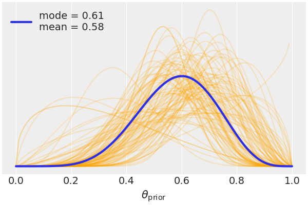

### 4.3. 对比

在实践中，实验是混乱的，总是有可能得不到完整的化学位移记录。一个常见的问题是信号重叠，即，实验没有足够的分辨率来区分两个或多个接近的信号。这个例子去掉了这些情况，故设数据集是完整的。我们有一个 40 个估计均值的图，20 个氨基酸乘以 2（因为有两个模型）。我们也有 94% 的可信区间和分位数范围（分布的中心 50%）。垂直线是基于层次模型的全局均值。这个值接近于零，正如预期的理论值重现实验值一样。

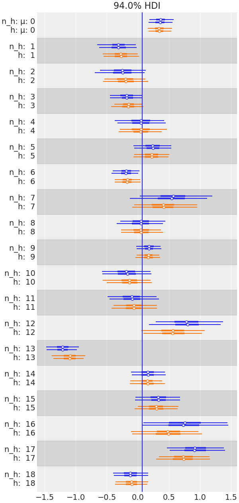

这个图中最相关的部分是，来自层次模型的估计量被拉向部分合并的均值，或说，它们相对于未合并的估计量被缩小了。你还会注意到，对于那些离均值较远的组（如 13），这种影响更为显著，且，不确定性与非层次模型的不确定性相当或更小。估计量是部分合并的，因为我们对每个组都有一个估计量，但各个组的估计量通过超先验相互限制。
