# 线性回归

线性回归（Linear Regression）在统计机器学习中占据核心地位。其有三大特性：线性、全局性和数据未加工性。而其中，线性又分为特征线性、全局线性和系数线性，将其某一种线性改为非线性，即可得到一种新的模型

- 线性 → ×
  - 特征非线性：多项式回归
  - 全局非线性：线性分类（在输出端加入激活函数）
  - 系数非线性：感知机、神经网络（反向传播）
- 全局性 → ×（不基于所有点进行回归）
  - 线性样条回归
  - 决策树
- 数据未加工性 → ×（在输入端降维）
  - PCA
  - 流形

## 1. 简单线性回归

对线性方程

$$
y_i = α + x_i β
$$

参数$β$是控制着线性关系的斜率，$α$称为截距，告诉我们当$x_i = 0$时的$y$。

### 1.1. 最小二乘法

有几种方法可找到线性模型的参数，其中一种为最小二乘估计（Least squares estimation，LSE）。LSE 返回观察值和预测值之间最小的均方误差。这种表达中，估计$α$和$β$的问题是一个优化问题。最优化的另一种方法是生成一个完全概率的模型。以概率论的方式思考给我们带来了几个优势；我们可获得$α$和$β$的最佳值（与优化方法相同），同时还可估计对参数值的不确定性。优化方法则需要额外的工作来提供这些信息。

对数据集

$$
\mathscr{D} = \{(x_1, y_1), (x_2, y_2), ⋯, (x_N, y_N)\}
$$

记

$$
X = (x_1, x_2, ⋯, x_N)^{⊤}, Y = (y_1, y_2, ⋯, y_N)^{⊤}
$$

线性回归假设

$$
f(w) = w^{⊤} x
$$

对这个问题，采用二范数定义的平方误差来定义损失函数

$$
L(w) = ∑_{i=1}^n ∥w^{⊤} x_i - y_i∥^2_2
$$

展开得到

$$
\begin{aligned}
  L(w)
  &= (w^{⊤} x_1 - y_1, ⋯, w^{⊤} x_N - y_N)⋅ (w^{⊤} x_1 - y_1, ⋯, w^{⊤} x_N - y_N)^{⊤} \\
  &= (w^{⊤} 𝑿^{⊤} - Y^{⊤})⋅(Xw -Y) \\
  &= w^{⊤} 𝑿^{⊤} Xw - Y^{⊤} Xw - w^{⊤} 𝑿^{⊤} Y + Y^{⊤} Y\\
  &= w^{⊤} 𝑿^{⊤} Xw - 2w^{⊤} 𝑿^{⊤} Y + Y^{⊤} Y
\end{aligned}
$$

最小化这个值的 $ŵ$

$$
ŵ= \underset{w}{\mathrm{argmin}}\ L(w)\\
↓\\
\frac{∂}{∂w}L(w)=0\\
↓\\
2𝑿^{⊤} Xŵ - 2𝑿^{⊤} Y=0\\
↓\\
ŵ = (𝑿^{⊤} X)^{-1}𝑿^{⊤} Y = X⁺ Y
$$

其中，$(𝑿^{⊤} X)^{-1}𝑿^{⊤}$ 又被称为伪逆。对于非满秩的样本集合，需要使用奇异值分解（SVD）的方法，对$X$求奇异值分解，得到

$$
X⁺ = VΣ^{-1}𝑼^{⊤}
$$

假设我们的试验样本张成一个$p$维空间（满秩的情况）：$X=\mathrm{span}(x_1, ⋯, x_N)$，而模型可以写成 $f(w)= Xβ$。最小二乘法希望$Y$和这个模型距离越小越好，于是它们的差应该与这个张成的空间垂直，即

$$
𝑿^{⊤}⋅(Y-Xβ) = 0\\
↓\\
β = (𝑿^{⊤} X)^{-1}𝑿^{⊤} Y
$$

### 1.3. 解释后验

对更广义的形式，我们有

$$
y ∼ N (α + x β, ϵ)
$$

即，数据向量被假设为高斯分布，均值为$α + x β$，标准差为$ϵ$。由于不知道$α, β, ϵ$的值，我们必须为它们设置先验分布。一个合理的通用选择是

$$
\begin{aligned}
  α & ∼ N (μ_{α}, σ_{α}) \\
  β & ∼ N (μ_{β}, σ_{β}) \\
  ϵ & ∼ |N(0, σ_{ϵ})|
\end{aligned}
$$

对于$α$的先验，我们可通过将该值设置为数据标度相对较高的值，使用一个非常扁平的高斯。一般来说，我们不知道截距可能在哪里，不同的问题和不同的领域知识，它的值会有很大的差异。关于斜率，可能比截距更容易有一个大致的概念。对于许多问题，我们至少可先验地知道斜率的符号。对于$ϵ$，我们可在变量$y$的标度上设置一个大的值$σ_{ϵ}$。这些非常模糊的先验保证了先验对后验的影响非常小，这很容易被数据克服。$ϵ$的半高斯分布的替代选择有均匀分布或半柯西分布。

- 半柯西分布通常可作为一个很好的正则先验；
- 在参数的硬边界的限制已知时，可使用均匀分布；
- 若想围绕标准差的某个特定值使用强先验，可使用Gamma分布。

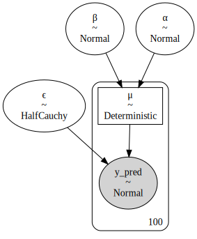

绘制数据的回归线（左图）和核密度估计曲线（右图）。

> 统计学中，核密度估计（kernel density estimation，KDE）是一种对随机变量的概率密度函数进行估计的非参数方法。

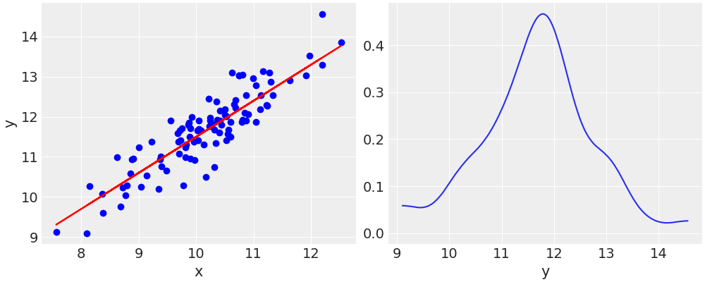

对线性回归，绘制符合数据的平均线，以及$α$和$β$均值。为反映后验的不确定性，在图中添加一个冷却因子，并使用半透明带来说明最高后密度（HPD）区间（左图），也可选择绘制预测数据$ŷ$的 HPD（右图，浅色带为`hdi_prob=0.5`的估计区间）。

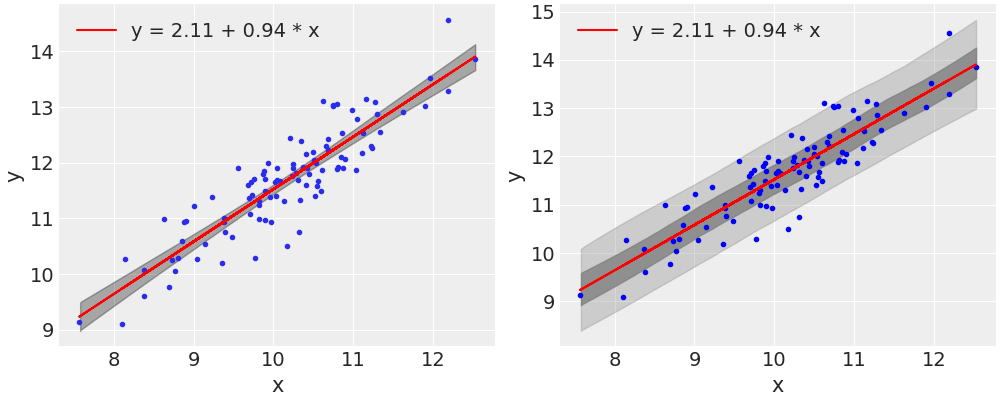

### 1.4. 相关性

线性模型的后验分布中$α$和$β$高度相关

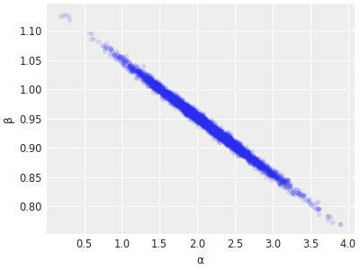

无论我们对数据拟合哪条线，所有的线都应该通过一个点，$(x̄, ȳ)$。故，线拟合过程在某种程度上相当于旋转一条固定在数据中心的直线。斜率的增加意味着截距的减少，反之亦然。根据模型的定义，这两个参数都将是相关的。故，后验（不包括$ϵ$）的形状是一个对角的空间。这对于诸如 Metropolis-Hastings 和 NUTS 这样的采样器来说是不利的。

直线受制于数据的均值只对最小二乘法（及其假设）才是真的。使用贝叶斯方法，这个约束是放松的。在一般情况下，得到的线围绕着和的均值，而不是完全通过精确的均值。此外，若使用强先验，可能会最终得到远离和的均值的线。

> 减弱自相关影响的方法主要有，正态化和标准化。

最常见的度量两个变量之间线性相关的方法是 Pearson 相关系数$r$。当$r =+ 1$时，存在完美的正线性相关。当$r = -1$时，存在完美的负线性相关。当$r = 0$时，不存在线性相关关系。回归与斜率之间的关系如下：

$$
r = β \frac{σ_{x}}{σ_y}
$$

由上，当且仅当$x$和$y$的标准差相等时，斜率$β$和 Pearson 相关系数$r$具有相同的值。Pearson 相关系数与一个称为确定系数的量有关，对于线性回归模型来说，就是$r^2$（有时也称为$R^2$）。可定义为预测值的方差除以数据的方差。故，它可解释为因变量的方差中由自变量预测的比例。对于贝叶斯线性回归来说，预测值的方差可大于数据的方差，这将导致$R^2>1$，则一个好的解决方案就是定义$R^2$如下

$$
R^2 = \frac{V_{n=1}^{N} E \bigg[ŷ^s \bigg]}{V_{n=1}^{N} E \bigg[ŷ^s \bigg]+ V_{n=1}^{S}(ŷ^s -y)}
$$

其中，$E$\big[ŷ^s\$big]$是$ŷ$对$s$的后验样本的期望值。这就是预测值的方差除以预测值的方差加上误差（或残差）。这个定义的优点是确保$R^2$被限制在 $[\big0, 1\big]$的区间内。

计算$R^2$的最简单方法是使用 `ArviZ` 的 `r2_score()`。我们需要$y$的观测值和$ŷ$的预测值。我们可从 `sample_posterior_predictive()` 中得到$ŷ$。默认情况下，这个函数将返回$R^2$和标准差。

另一种计算 方法是估计多变量高斯分布的协方差矩阵。要描述一个二元高斯分布，我们需要 $2$ 个均值，每个边际高斯都需要 1 个。我们需要一个$2× 2$ 的协方差矩阵

$$
Σ =
\begin{bmatrix}
σ_{x_1}^2 & ρ σ_{x_1} σ_{x_2} \\
ρ σ_{x_1} σ_{x_2} & σ_{x_2}^2
\end{bmatrix}
$$

在协方差矩阵的主对角线上是每个变量的方差，矩阵中的其他元素是协方差（变量之间的方差），用单个标准差和变量之间的 Pearson 相关系数$ρ$来表示。

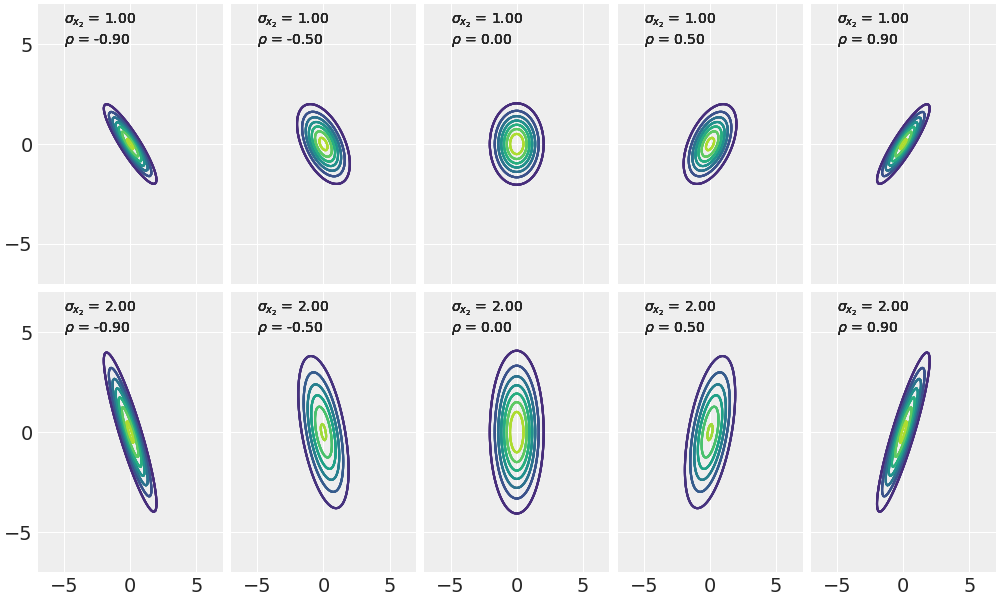

由于我们不知道协方差矩阵的值，我们必须对其进行先验。

- 第一个选择是使用 Wishart 分布，它是多元高斯分布的逆协方差矩阵的共轭先验。Wishart 分布可认为是我们前面看到的Gamma分布向高维的泛化，也可认为是$χ^2$分布的泛化。
- 第二个选择是使用 LKJ 先验。这是一个相关矩阵（而不是协方差矩阵）的先验，一般来说，从相关性的角度考虑更有用。
- 第三种选择是直接把先验给$σ_{x_1}, σ_{x_2}, ρ$，然后使用这些值来手动建立协方差矩阵。

这里，我们选择第三种。

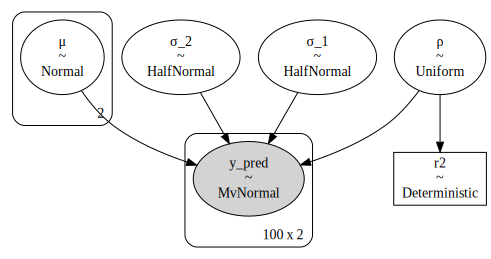

## 2. 稳健线性回归

假设数据遵循高斯分布，在很多情况下是完全合理的。通过假设高斯性，我们不一定说数据真的是高斯的；相反，我们是说它是一个给定问题的合理近似。这同样适用于其他分布。有时，这种高斯假设是失败的，例如，在存在离群值的情况下。我们了解到，使用 _t_ 分布是一种有效处理离群值并获得更稳健推理的方法。同样的想法也可应用到线性回归中。

为了说明 _t_ 分布给线性回归带来的稳健性，这里 Anscombe 四重奏的第三组数据。

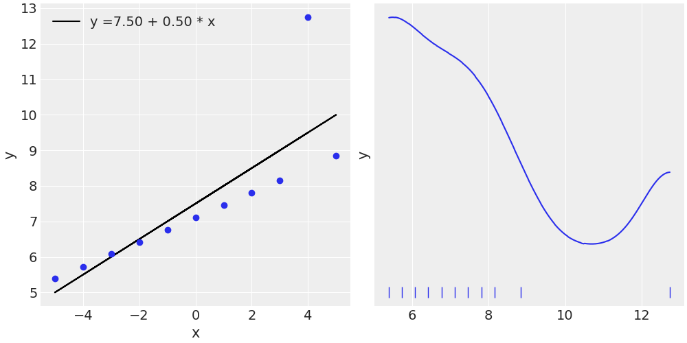

我们使用一个移位的指数（shifted exponential）来避免正态参数$ν$的值接近于零。没有移位的指数在接近零的值上加了太多权重。根据我的经验，这对于没有到中等离群值的数据来说是没有问题的，但，对于有极端离群值的数据（或有几个主体点的数据），如在 Anscombe 的第三个数据集中，最好是避免这么低的值。对这一点，以及其他的先验建议，要谨慎对待。常见的$ν$的先验值有 `gamma(20.1)` 、 `gamma(mu=20, sd=15)` 。

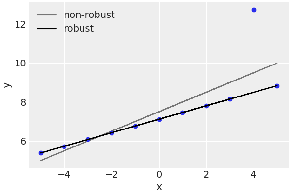

非稳健拟合试图妥协并涵盖所有的点，而稳健贝叶斯模型则自动抛弃一个点，并拟合一条正好穿过所有剩余点的线。_t_ 分布，由于其较重的尾部，能够减少对远离大部分数据的点的重视。

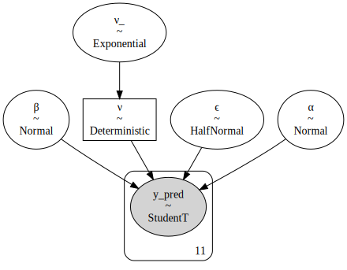

|       | mean  |  sd   | hdi3% | hdi_97% | mcse_mean | mcse_sd | ess_bulk | ess_tail | r_hat |
| :---: | :---: | :---: | :---: | :-----: | :-------: | :-----: | :------: | :------: | :---: |
|   α   | 7.114 | 0.001 | 7.112 |  7.117  |     0     |    0    |   2332   |   2150   |   1   |
|   β   | 0.345 |   0   | 0.345 |  0.346  |     0     |    0    |   2643   |   1913   |   1   |
|   ϵ   | 0.003 | 0.002 | 0.001 |  0.006  |     0     |    0    |   1394   |   635    |   1   |
|   ν   | 1.211 | 0.206 |   1   |  1.595  |   0.004   |  0.003  |   1527   |   1004   |   1   |

正如你所看到的，$α, β$和$ϵ$的范围非常窄，$ϵ ≈ 0$。这是完全合理的，因为我们正在对一组完全对齐的点进行拟合（若忽略了离群点）。运行一个后验预测检查来探索模型对数据的捕捉程度。

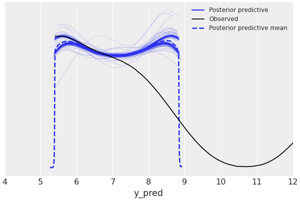

同时注意到，我们的模型预测的数值是远离主体的两边，而不仅仅是在主体上面。对于我们目前的目的来说，这个模型的表现还不错，不需要进一步的改变。尽管如此，请注意，对于某些问题，我们可能希望避免这样做。在这种情况下，我们可能应该回过头来修改模型，将 `y_pred` 的可能值限制为正值。

## 3. 层次线性回归

设我们有来自统一分布的如下配对数据，每对只有一组值

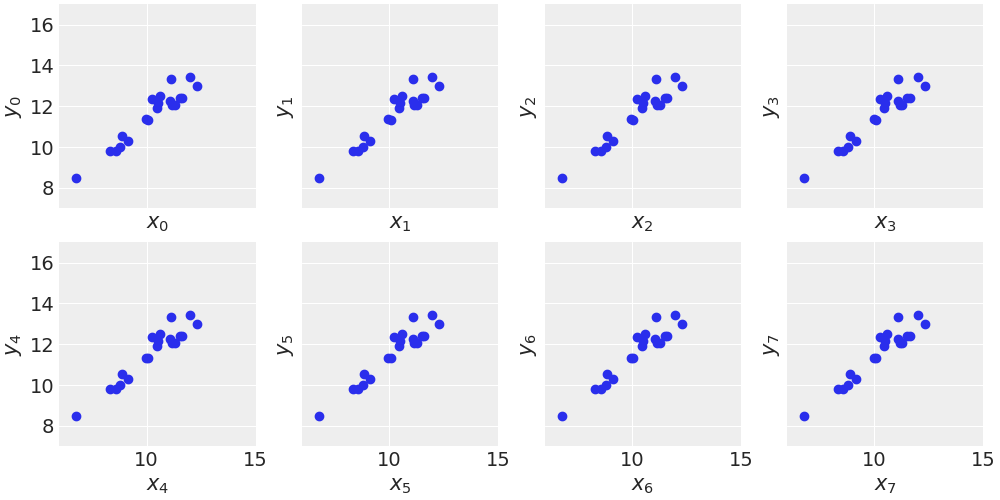

将数据输入模型之前将其居中。试图通过一个点来拟合一条线是没有意义的，我们至少需要两个点，否则参数$α$和$β$是没有边界的。我们需要更多的信息，传递信息有两种主要方法

- 强先验：一个$α$的强先验可使一组线或一个点得到良好的定义。

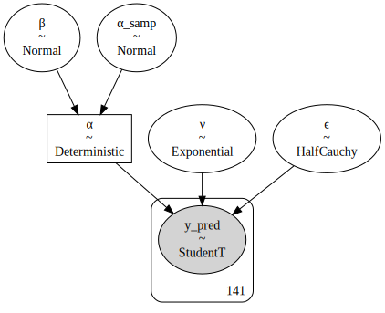

- 定义分层模型：因为分层模型允许组间共享信息，缩小估计参数的可信值。在我们有数据稀疏的组的情况下，这就变得非常有用。

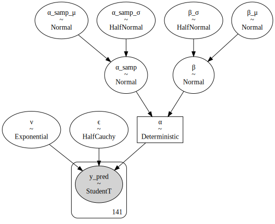

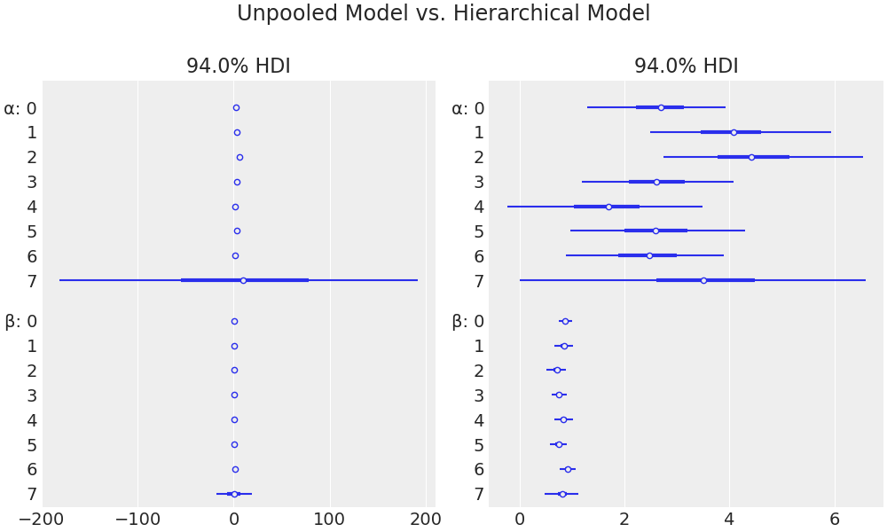

使用层次模型，我们能够将一条线拟合到单个数据点上。起初，这可能听起来很奇怪，甚至很蹊跷，但这只是层次模型结构的结果。每条线均由其他组的线提供信息。

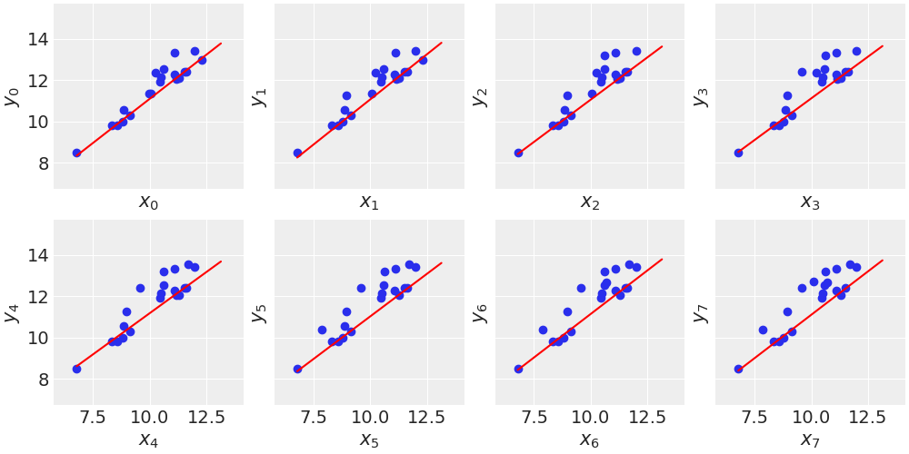

建立的统计模型是一回事，与变量相关的物理机制是另一回事。为了确定相关性可用因果关系来解释，我们需要在问题的描述中加上一个可信的物理机制；仅仅有相关性是不够的。事实上，若进行精心设计的实验，相关性可支持因果关系。总之，生活是混乱的，背景总是很重要。统计模型可帮助我们实现更好的解读，减少胡乱陈述的风险，得到更好的预测。

## 4. 多项式线性回归

现在，我们将学习如何使用线性回归来拟合曲线。使用线性回归模型拟合曲线的一种方法是建立一个多项式

$$
μ = ∑_{i=0}^mβ_i x^i
$$

这里，我们构建二次多项式回归

$$
μ = β_0 + β_1 x+ β_2 x^2
$$

使用 Anscombe 四重奏的第二组，构建模型，不难得到

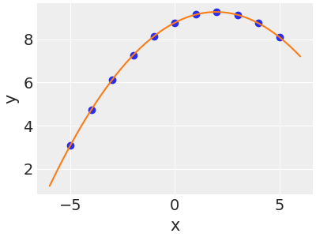

多项式回归的问题之一是参数的解释。系数$β$不再是斜率，而是另一种东西。这就像有两种力量在起作用，一种是推动线向上，另一种是向下。交互作用取决于$x$的区间。解释参数的问题不仅仅是一个数学问题。在许多情况下，参数并没有转化为我们领域知识中的有意义的量。我们无法将它们与细胞的新陈代谢率或遥远星系发射的能量或一栋房子的卧室数量联系起来。在实践中，大多数人都会同意，阶数高于 2 或 3 的多项式一般不是很有用的模型，这时应首选其他的模型，如高斯过程。

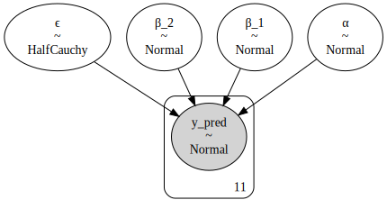

原则上，我们可使用多项式回归来拟合一个任意的复杂模型。我们只是建立了一个具有正确阶数的多项式。我们可通过逐个增加阶数来实现这一目的，直到我们观察到拟合度没有任何改善，或我们可建立一个无限阶的多项式，然后以某种方式使所有不相关的系数为零，直到我们的数据得到完美的拟合。但一般来说，使用多项式来拟合数据并不是最好的想法。任何真实的数据集都会包含噪声。一个任意的过于复杂的模型会拟合噪声，导致糟糕的预测。这就是所谓的过拟合，是统计学和机器学习中普遍存在的现象。

## 5. 多元线性回归

### 5.1. 数据

我们希望在模型中包含几个自变量的情况并不少见。一些例子可是一个学生的平均成绩（因变量）和家庭收入，从家到学校的距离，以及母亲的受教育程度（分类变量）。我们可很容易地扩展简单的线性回归模型来处理多个独立变量。我们把这种模型称为多元线性回归（multiple linear regression）。在多元线性回归模型中，我们对因变量的均值建模如下

$$
μ = α + ∑_{i=1}^m β_i x_i
$$

使用线性代数符号，可得到一个更简短的版本。

$$
μ = α + Xβ
$$

在多元线性回归模型下，拟合的结果为一个维度为$m$的超平面。实际上，多元线性回归模型与简单线性回归模型本质上是一样的，唯一的区别是$β$是一个向量，$X$是一个矩阵。

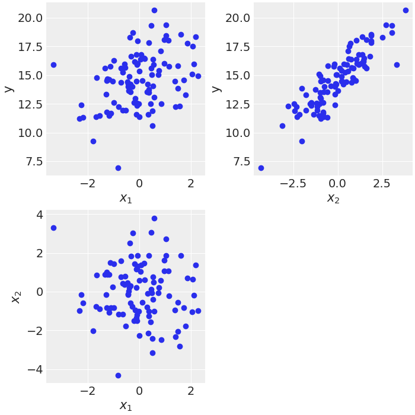

|                | mean  |  sd   | hdi3% | hdi_97% | mcse_mean | mcse_sd | ess_bulk | ess_tail | r_hat |
| :------------: | :---: | :---: | :---: | :-----: | :-------: | :-----: | :------: | :------: | :---: |
| α$\big[0\big]$ | 1.853 | 0.455 | 0.984 |  2.695  |   0.006   |  0.004  |   5883   |   3076   |   1   |
| β$\big[0\big]$ | 0.969 | 0.044 | 0.888 |  1.051  |   0.001   |    0    |   6087   |   3168   |   1   |
| β$\big[1\big]$ | 1.47  | 0.033 | 1.407 |  1.53   |     0     |    0    |   5616   |   3093   |   1   |
|       ϵ        | 0.474 | 0.036 | 0.408 |  0.542  |     0     |    0    |   6469   |   2805   |   1   |

可看到，我们的模型能够覆盖正确的值（检查用于生成合成数据的值）。一个重要的信息是，在多元线性回归中，每个参数只有在其他参数的背景下才有意义。

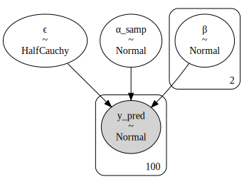

### 5.2. 混杂变量

想象一下下面的情况。我们有一个变量$z$与预测变量$x$相关，同时也与预测变量$y$相关。设变量$z$是导致$x$和$y$的原因。例如，$z$可是工业革命（一个非常复杂的变量），$x$是海盗的数量，$y$是$\mathrm{CO}_2$。若我们在分析中省略$z$，我们可能会在$x$和$y$之间建立一个很好的线性关系，我们甚至可从$x$中预测$y$，但，我们可能会完全错过与这些变量相关的实际机制。当这种情况发生时，$z$被命名为混杂变量（confounding variable）。在很多真实的情况下，$z$很容易被忽略。也许我们没有度量它，或它不存在于我们的数据集中，或我们甚至不认为它可能与我们的问题有关。在分析中不考虑混杂变量可能导致我们建立虚假的相关性。

理解机制有助于我们将所学到的知识转化为新的情况，盲目的预测并不总是具有良好的可转移性。例如，一个国家生产的运动鞋数量可作为度量其经济实力的一个简单指标，但对于生产矩阵或文化背景不同的其他国家来说，这可能是一个糟糕的预测指标。

### 5.3. 冗余变量

建立三个相关的模型。

- 第一个是$m_{x1 x2}$，这是一个线性回归模型，其中，有两个独立变量$x_1$和$x_2$（叠加在一起的变量$x$）。
- 第二个模型，$m_{x1}$是$x_1$的简单线性回归。
- 第三个模型，$m_{x2}$是$x_2$的简单线性回归。

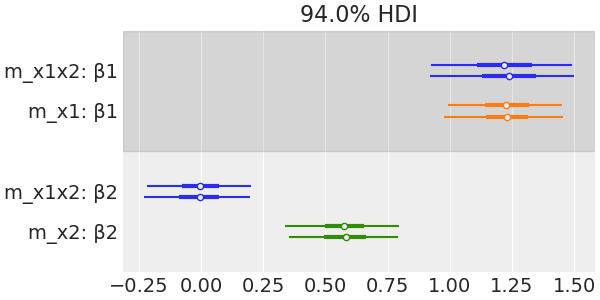

可看到，模型$m_{x1x2}$的$β_2$是零。这表明$x_2$变量对解释$y$的贡献几乎为零。这很有趣，因为我们已经知道，真正重要的变量是$x_1$。同时注意到，模型$m_{x2}$的$β_2$约为 0.55 这比模型$m_{x1x2}$大。当我们考虑到$x_1$时，$x_2$预测$y$的能力就会降低；$x_2$中的信息在$x_1$中是冗余的。

### 5.4. 多重共线性

现在，我们将把前面的例子带到一个极端，看看当两个变量高度相关时会发生什么。为了研究这个问题及其对推理的影响，我们将使用与之前相同的合成数据和模型，但现在我们将通过减少$x_1$中的高斯噪声来增加其与$x_2$之间的相关程度。数据生成代码中的这一变化实际上相当于将$0$与$x$相加，故，从所有实际目的来看，两个变量均是相等的。

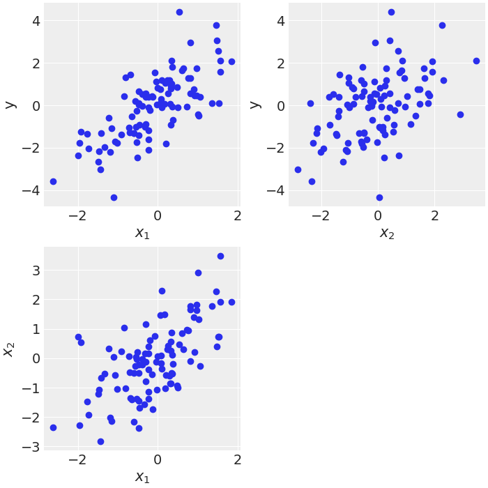

然后，进行多元线性回归，$β$系数的 HPD 很宽，令人怀疑。我们可通过$β$系数的散点图来了解发生了什么。

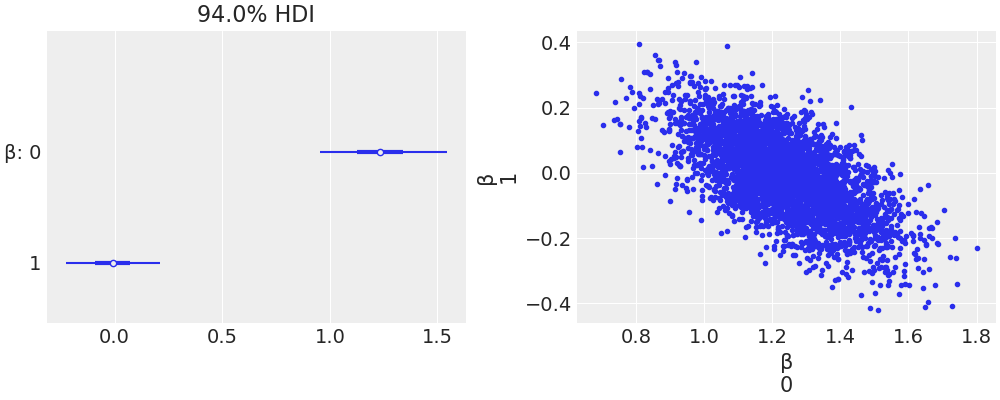

$β$的边际后验是一条很窄的对角线。当一个$β$的系数上升时，另一个一定会下降。两者均是有效相关的。这只是模型和数据的结果。根据我们的模型，均值$μ$是

$$
μ = α+ β_1 x_1 + β_2 x_2
$$

若我们设$x_1$和$x_2$不仅实际上是等价的，且在数学上是相同的，我们可将模型重写为

$$
μ = α+ (β_1 + β_2) x
$$

事实证明，影响$μ$的是$β_1$和$β_2$的总和，而不是它们的分离值。只要我们得到$β_1$，我们就可使$β_1$越来越小。我们没有两个$x$变量，因此实际上，我们没有两个$β$参数。我们说这个模型是不确定的（或说数据无法限制模型中的参数）。

上例子中，有两个原因导致$β$不能在$$\big[-∞,$ ∞\big]$区间内自由移动。

- 这两个变量几乎是相同的，但它们并不完全相等。
- 有一个先验限制了$β$可取的合理值。

在任何真实的数据集中，相关性都会在一定程度上存在。两个或多个变量的相关性要多强才会成为问题？当把两个或多个变量放在多元回归模型中的其他变量中时，它们的相关性会增加或减少。一如既往，我们强烈建议对后验进行仔细检查，同时使用反复批判的方法来建立模型，这可帮助我们发现问题并理解数据和模型。

若我们发现高度相关的变量，我们应该怎么做呢？

- 分析中剔除其中一个变量。鉴于两个变量的信息相似，我们剔除哪一个往往是无关紧要的。我们可基于纯粹的便利性来消除变量，如去掉我们学科中最不为人知的变量，或是更难解释或测量的变量。
- 对冗余变量进行平均，创建一个新的变量。一个更复杂的版本是使用变量减少算法，如主成分分析（PCA）。PCA 的问题是，**所产生的变量是原始变量的线性组合，一般来说，会混淆结果的可解释性**。
- 放更强的前值来限制系数可采取的可信值。如正则先验。

### 5.5. 屏蔽效应变量

创建两个独立变量 $x_1$和$x_2$。它们之间是正相关的，且它们与$y$相关，但方向相反；$x_1$是正相关的，$x_2$是负相关的。

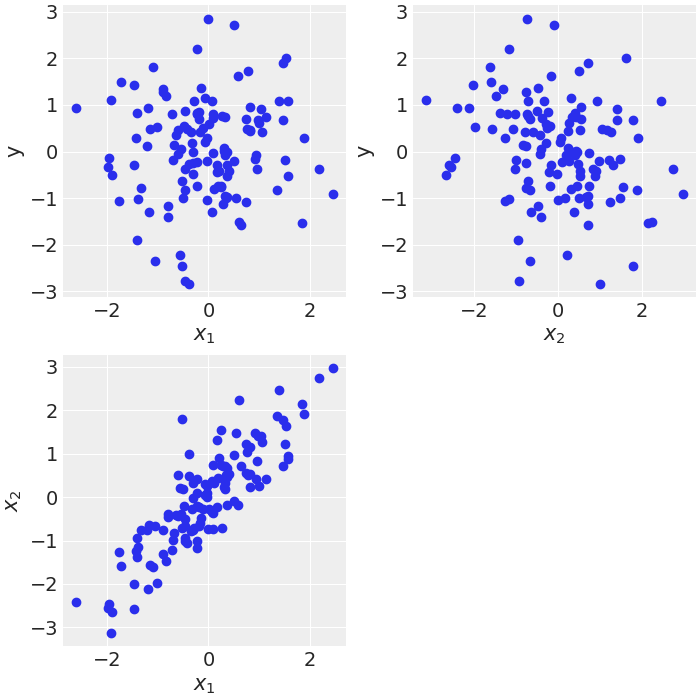

建立三个相关的模型。

- 第一个模型，$m_{x_1 x_2}$是一个线性回归模型，有两个自变量，$x_1$和$x_2$（叠加在一起的变量 x）。
- 第二个模型，$m_{x1}$是$x_1$的简单线性回归。
- 第三个模型，$m_{x2}$是$x_2$的简单线性回归。

从这些模型中采样后，用森林图看一下$β$的参数，在一个图中进行比较。

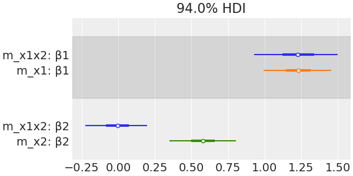

根据后验，$m_{x1x2}$的$β$的值接近于 1 和 -1（根据我们生成数据的方式，正如预期的那样）。对于简单的线性回归模型，也就是当我们单独研究每个变量时，我们可看到$β$的值反而更接近于零，这表明影响较弱。

注意，$x_1$与$x_2$相关。事实上，当$x_1$增加时，$x_2$也会增加。同时注意到，当$y$增加时，$x_1$也增加，但$x_2$减少。由于这种特殊的安排，我们得到了部分削弱效果，除非我们将两个变量都包含在同一个线性回归中。线性回归模型之故能够消除这些影响，是因为模型正在学习的是给定$x_2$的值时，$x_1$对$y$的贡献，而$x_2$则反过来。

### 5.6. 交互作用

到目前为止，在多元回归模型的定义中，已经隐含了$x_i$的变化会导致$y$的恒定变化，同时保持其他预测变量的数值固定。但这不一定是真的。可能发生的情况是，$x_i$的变化会影响到$y$，而$y$又会被$x_{j}$的变化所调节。

这种行为的一个典型例子是药物之间的相互作用。例如，增加药物 A 的剂量会对患者产生积极的影响。在没有药物$B$的情况下是如此（或对于低剂量的 B），而对于增加剂量的 B，A 的影响是负面的（甚至是致命的）。在我们迄今为止看到的所有例子中，因变量对预测变量的贡献是加法的。我们只是将变量相加（每个变量乘以一个系数）。若我们希望捕捉效应，就像在药物的例子中一样，我们需要在模型中加入非加法的项。一个常见的选择是将变量相乘，例如

$$
μ = α+ β_1 x_1 + β_2 x_2 + β_3 x_1 x_2
$$

解释有交互作用的线性模型并不容易。让我们重写一下表达式。

$$
\begin{aligned}
  μ &= α + \underbrace{(β_1 + β_3 x_2)}_{\text{slope of}\ x_1} x_1 + β_2 x_2 \\
  μ &= α + β_1 x_1 + \underbrace{(β_2 + β_3 x_1)}_{\text{slope of}\ x_2}
\end{aligned}
$$

这向我们展示了以下内容。

- 交互项可理解为一个线性模型。故，均值的表达式，$μ$，是一个线性模型。
- 交互作用是对称的，可把它看作是$x_1$的斜率是$x_2$的函数，同时也可看作是$x_2$的斜率是$x_1$的函数。
- 在没有交互作用的多元回归模型中，我们得到的是一个超平面，也就是一个扁平的超曲面。交互项在这样的超曲面中引入了一个曲率。这是因为斜率不再是常数，而是另一个变量的函数。

## 6. 变量方差

当恒定方差的假设没有意义时，我们也可用线性来模拟方差（或标准差）。对于这些情况，我们可能希望将方差视为因变量的线性函数。

世界卫生组织和世界各地的其他卫生机构收集新生儿和幼儿的数据，并设计了成长图表标准。这些图表是儿科工具箱的重要组成部分，亦为度量人口总体福祉的标准，以便制定与健康有关的政策、规划干预措施并监测其有效性。一个例子是新生儿的身长与年龄（月）的关系。

为了对这些数据进行建模，与之前的模型相比，我们将引入三个新的元素：

- $ϵ$现在是$x$的线性函数。为此，我们增加了两个新的参数，$γ$和$δ$，它们是$α$和$β$的直接类似。
- 均值的线性模型是$\sqrt{x}$的函数。这只是将线性模型拟合到曲线上的一个简单技巧。
- 定义了一个共享变量 `x_shared` 。我们将用它来改变$x$变量的值（在本例中是 `мonth`），在模型拟合后，无需重新拟合模型。

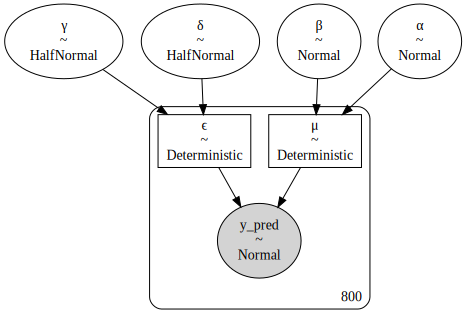

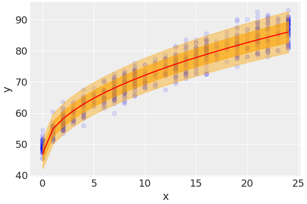

`sample_posterior_predictive` 函数的输出将是$y$的样本，条件是观察到的数据和参数的估计分布，包括不确定性。唯一的问题是，根据定义，这个函数将返回$y$的观测值$x$和 0.5 个月没有被观测到的预测；所有的措施均是报告整数月。获取$x$的非观测值的预测的更简单的方法是定义一个共享变量（作为模型的一部分），然后在从后验预测分布中取样之前更新共享变量的值。

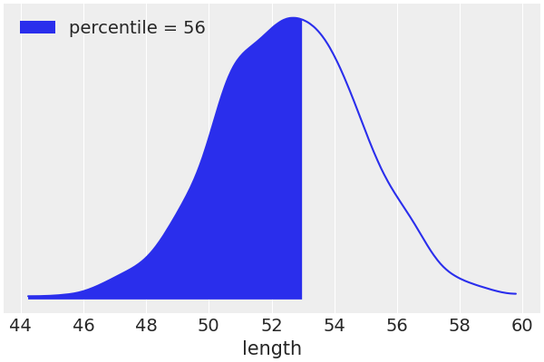
