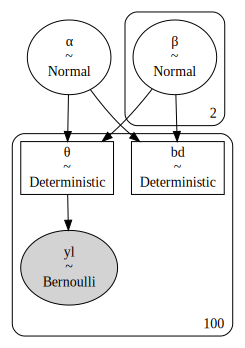
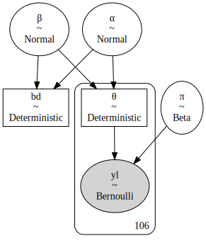

# 线性分类

## 1. 激活函数

对于分类任务，线性回归模型就无能为力了，为了预测输出变量的均值，我们可以在线性模型的函数进行后再加入一层激活函数（activation function），也称逆链接函数（inverse link function），激活函数的反函数称链接函数（link function）

$$
\begin{aligned}
f&: w^{⊤} x →
\begin{cases}
\{0, 1\} & \mathrm{hard\ classification}\\
\big[0, 1\big] & \mathrm{soft\ classification}
\end{cases} \\
f^{-1}&: \{0, 1\} → w^{⊤} x
\end{aligned}
$$

可选择的激活函数有很多，最简单的可能是恒等函数（identity function），其返回其参数使用的相同值。线性回归建模中的所有模型都使用了恒等函数。恒等函数本身可能不是很有用，但它可让我们以一种更统一的方式来思考几个不同的模型。

我们希望使用激活函数的一种情况是，处理分类变量，如颜色、性别、物种。这些变量都不是高斯的。原则上，高斯对于连续变量在实线上取任何值都能很好地工作，而这里提到的变量是离散的，只取几个值。若改变了用于对数据进行建模的分布，一般来说，也需要改变对这些分布的均值的可信值进行建模的方式。一种方法是保留线性模型，但使用激活函数将输出限制在所需区间内。例如，

- 使用二项分布：需要一个线性模型来返回$\big[0, 1\big]$区间内的均值。
- 使用伽马分布或指数分布：希望对只能取正值的数据进行建模。

总的来说，我们有两种线性分类的方式

- 软分类，产生不同类别的概率，这类算法根据概率方法的不同分为两种
  - 判别式（直接对条件概率进行建模）
    - Logistic 回归
  - 生成式（根据 Bayes 定理先计算参数后验，再进行推断）
    - 连续：高斯判别分析（GDA）
    - 离散：朴素贝叶斯
- 硬分类，我们直接需要输出观测对应的分类。这类模型的代表为
  - 线性判别分析（LDA），实战中主要用于降维
  - 感知机

## 2. 逻辑回归

### 2.1. 推导

回归问题是关于给定一个或多个输入变量的值，预测一个输出变量的连续值。相反，分类是关于给定一些输入变量，给一个输出变量分配一个离散值（代表一个离散类）。有时候我们只要得到一个类别的概率，那么我们需要一种能输出$\big[0, 1\big]$区间的值的函数。此时，可以通过用逻辑函数作为激活函数来实现这种泛化。考虑二分类模型，我们利用判别模型，希望对$p(C|x)$建模，利用 Bayes 定理：

$$
p(C_1|x) = \frac{p(x ∣ C_1)p(C_1)}{p(x ∣ C_1)p(C_1)+p(x ∣ C_2)p(C_2)}
$$

取$a = \ln\frac{p(x ∣ C_1)p(C_1)}{p(x ∣ C_2)p(C_2)}$，于是

$$
p(C_1|x) = \frac{1}{1+\exp(-a)}
$$

上面的式子叫 Sigmoid 函数，其参数表示了两类联合概率比值的对数。在判别式中，不关心这个参数的具体值，模型假设直接对$a$进行。

Logistic 回归的模型假设是

$$
a = w^{⊤} x
$$

于是，通过寻找$w$的最佳值可以得到在这个模型假设下的最佳模型。概率判别模型常用最大似然估计的方式来确定参数。

对于一次观测，获得分类$y$的概率为（假设$C_1=1,C_2=0$）

$$
p(y ∣ x)=p_1^yp_0^{1 - y}
$$

则对于$N$次独立全同的观测 MLE 为

$$
ŵ = \underset{w}{\mathrm{argmax}}\ J(w) = \underset{w}{\mathrm{argmax}}∑_{i=1}^n(y_i\log p_1+(1 - y_i)\log p_0)
$$

注意到，这个表达式是交叉熵表达式的相反数乘$N$，MLE 中的对数也保证了可以和指数函数相匹配，从而在大的区间汇总获取稳定的梯度。

对这个函数求导数，注意到

$$
p_1'=(\frac{1}{1+\exp(-a)})'=p_1(1-p_1)
$$

则

$$
J'(w) = ∑_{i=1}^n y_i(1-p_1)x_i -p_1 x_i+y_ip_1 x_i= ∑_{i=1}^n(y_i -p_1)x_i
$$

由于概率值的非线性，放在求和符号中时，这个式子无法直接求解。于是在实际训练的时候，和感知机类似，也可以使用不同大小的批量随机梯度上升（对于最小化就是梯度下降）来获得这个函数的极大值。

### 2.2. 建模

对于我们的目的来说，逻辑函数的关键属性是，无论其参数的值是多少，结果总是一个在$\big[0, 1\big]$区间内的数字。故，我们可把这个函数看作是一种方便的方法，可把从线性模型中计算出来的值压缩成可输入进伯努利分布的值。首先，我们对这些类别进行编码，也就是$y ∈ \{0, 1\}$。这个问题听起来类似于抛硬币。我们可能还记得我们用伯努利分布作为似然。抛硬币问题的不同之处在于，现在$θ$并不是由 Beta 分布产生的；相反，$θ$将由一个线性模型定义，并以逻辑作为激活函数。省略前导，得到：

$$
\begin{aligned}
  θ&= \mathrm{logistic}(α + xβ) \\
  y&= \mathrm{Bern}(θ)
\end{aligned}
$$

对鸢尾花数据集的每个物种的 50 个个案，对于每个个案，数据集包含四个变量，我们将把它们作为独立变量（或特征）：花瓣长度、花瓣宽度、萼片长度和萼片宽度。若你想知道，萼片是经过修改的叶子，其功能一般与保护花蕾中的花朵有关。

在上图中，y 轴是连续的，而 x 轴是分类的。我们从最简单的分类问题开始：两个类，`setosa` 和 `versicolor`，只有一个独立变量或特征，`sepal_length` 。按照通常的做法，我们将用数字 0 和 1 来编码 `setosa` 和 `versicolor` 的分类变量。

注意 `model_0` 的第一部分是如何类似于线性回归模型的。同时注意两个确定性变量：$θ$和 bd。$θ$是应用于$μ$变量的 logistic 函数的输出，bd 是边界决定，也就是用于分隔类的值。

|     |  mean  |  sd   | hdi3%  | hdi_97% | mcse_mean | mcse_sd | ess_bulk | ess_tail | r_hat |
| :-: | :----: | :---: | :----: | :-----: | :-------: | :-----: | :------: | :------: | :---: |
|  α  | 0.316  | 0.339 | -0.276 |  0.974  |   0.009   |  0.007  |   1301   |   1232   |   1   |
|  β  | 5.435  | 1.073 | 3.494  |  7.386  |   0.03    |  0.022  |   1393   |   1290   |   1   |
| bd  | -0.057 | 0.062 | -0.179 |  0.05   |   0.002   |  0.001  |   1416   |   1390   |   1   |

上图为数据、拟合的 S 曲线和决策边界。图中显示了萼片长度与鸢尾种类的关系（`setosa = 0`，`versicolor = 1`）。为了避免过度绘制，二进制响应变量是抖动的。S 形线是$θ$的均值。这条线可被解释为知道萼片长度的值时，花是多色（x = 1）的概率。半透明的 S 形带是 94% 的 HPD 区间。边界决定被表示为一条垂直线，半透明带为其 94％HPD。根据边界决定，左边的$x_i$值（萼片长度）对应于 0 级（`*setosa*`），右边的值对应于 1 级（`*versicolor*`）。

决策边界被定义为$x_i$的值，其中，$y = 0.5$，结果是$- \frac{α}{β}$，可推导出如下。

- 根据模型的定义，有以下关系：

$$
θ = \mathrm{logistic}(α+ x β)
$$

- 而从逻辑函数的定义来看，当逻辑回归的参数为 0 时，我们有$θ = 0.5$。

$$
\begin{gathered}
  0.5= \mathrm{logistic}(α + x_i β) \\
  ⇕ \\
  0= α+ x_i β
\end{gathered}
$$

- 重排上式，我们发现$x_i$的值在$θ = 0.5$时对应的表达式如下

$$
x_i = -\frac{α}{β}
$$

有几个关键点需要提及。

- 一般来说，$θ$的值是$p(y = 1 |x)$。从这个意义上说，逻辑回归是一种真正的回归；关键的细节是，我们是在给定一个线性特征组合的情况下，对一个数据点属于 1 类的概率进行回归。
- 我们是对一个二分变量的均值进行建模，也就是在$\big[0, 1\big]$区间内的数字。然后，我们引入一个规则，将这个概率变成一个两类赋值。在这种情况下，若$p(y = 1)>= 0.5$，我们赋值为 1 类，否则为 0 类。
- 关于$0.5$的值并没有什么特别的，除了它是 0 和 1 中间的数字。我们可能会说，只有当我们在一个方向上或另一个方向上犯错误都没问题时，这个边界才是合理的。事实证明，情况并非总是如此，与错误分类相关的成本并不需要对称。

## 3. 多元逻辑回归

与多元线性回归类似，多元逻辑回归就是要使用多个独立变量。让我们尝试将萼片长度和萼片宽度结合起来。

### 3.1. 边界决策

模型中，我们有如下的公式。

$$
θ = \mathrm{logistic}(α + β_1 x_1 + β_2 x_2)
$$

从逻辑函数的定义来看，当逻辑回归的参数为零时，有$θ = 0.5$。

$$
\begin{gathered}
  0.5= \mathrm{logistic}(α + β_1 x_1 + β_2 x_2) \\
  ⇕\\
  0= α+ β_1 x_1 + β_2 x_2
\end{gathered}
$$

通过重新排序，我们发现$x_2$的值$x_2$中$θ = 0.5$对应于下面的表达式。

$$
x_2 = -\frac{α}{β_2} + (-\frac{β_1}{β_2} x_1)
$$

边界是一条线是完全合理的。若我们有一个特征，我们就有了单维度据，我们可用一个点把它分成两组；若我们有两个特征，我们就有了一个二维度据空间，我们可用一条线把它分开；对于三维来说，边界将是一个平面；对于更高的维度，我们将笼统地谈论超平面。事实上，超平面是一个通用的概念，大致定义为一个$n$维空间的维度$n - 1$的子空间。

就像我们对单个预测变量所做的那样，我们要绘制数据和决策边界。

不要被 94% HPD 带的弯曲方面所迷惑。表面上的曲率是多条线围绕一个中心区域（大致在$x$均值和$y$均值的周围）旋转的结果。

### 3.2. 逻辑回归的系数

解释逻辑回归的系数$β$并不像解释线性模型那样简单。我们必须考虑使用逻辑激活函数引入了一个的非线性。若$β$为正值，增加$x$会使$p(y = 1)$增加一定的量，但这个量不是$x$的线性函数，而是非线性地取决于$x$的值。一点代数可让我们进一步了解$p(y = 1)$随$β$变化的程度。

基础的逻辑模型是：

$$
θ = \mathrm{logistic}(α + Xβ)
$$

对数的逆函数是对数几率（logit），它是

$$
\mathrm{logit}(z) = \log \bigg(\frac{z}{1 - z} \bigg)
$$

故，

$$
\mathrm{logit}(θ) = α + Xβ
$$

请记住，在我们的模型中$θ$是$p(y = 1)$。

$$
\log \bigg(\frac{p(y = 1)}{1 - p(y = 1)}\bigg) = α + Xβ。
$$

在逻辑回归中，$β$系数编码了$x$变量的单位增加而增加的对数几率单位。

从概率到几率的变换是一个单调的变换，意味着几率随着概率的增加而增加，反之亦然。概率被限制在$\big[0, 1\big]$区间，而几率则生活在 $[0, ∞)$区间。对数是另一种单调变换，对数几率在$(-∞, ∞)$区间内。

故，总结提供的系数值均是以对数几率为标准的。

|      |  mean  |  sd   |  hdi3%  | hdi_97% | mcse_mean | mcse_sd | ess_bulk | ess_tail | r_hat |
| :--: | :----: | :---: | :-----: | :-----: | :-------: | :-----: | :------: | :------: | :---: |
|  α   | -9.036 | 4.72  | -17.532 |  0.36   |   0.139   |  0.098  |   1170   |   953    |   1   |
| β\big[0\big] |  4.67  | 0.846 |  3.147  |  6.256  |   0.026   |  0.019  |   1038   |   1158   |   1   |
| β\big[1\big] | -5.22  | 1.001 | -6.925  | -3.266  |   0.029   |  0.02   |   1214   |   1087   |   1   |

一个非常实用的理解模型的方法是改变参数，看看会发生什么。下面，我们计算有利于 `versicolor` 的对数几率为 `log_odds_versicolor_i`$= α + β_1x1 + β_2x2$，然后用逻辑函数计算 `versicolor` 的概率。然后，重复计算，固定$x_2$，将$x_1$增加 1。

对数几率的增加是$≈ 4.65$，这正好是$β_0$的值（查看 `trace_1` 的摘要）。$β$编码了$x$变量的单位增加所带来的对数几率单位的增加。概率的增加是$≈ 0.70$。

### 3.3. 处理关联变量

当处理（高度）相关的变量时，会有棘手的事情等着我们。相关变量转化为能够解释数据的系数的更广泛的组合，或从补充的角度来看，相关数据对模型的限制力更小。当类变得完全可分离时，也会出现类似的问题。

使用鸢尾数据集，你可尝试运行 `model_1`，但这次使用 `petal_width` 和 `petal_length` 变量。你会发现系数比以前更宽了，且，94%HPD 黑带也更宽了。

请注意，我们绘制的是相关性的绝对值，因为此刻我们并不关心变量之间相关性的符号，只关心其强度。在处理（高度）相关的变量时，一个解决方案是只删除一个（或多个）相关变量。另一种选择是在先验中加入更多的信息，若我们有有用的信息，可使用信息先验来实现。对于弱信息性先验，Stan 团队建议将所有非二元变量的均值缩放为 0，然后使用

$$
β ∼ \mathrm{t}(0, ν, s d)
$$

其中，`sd` 的选择应该是为了告知我们关于标度的期望值。正态参数，$ν$，建议在 3-7 左右。这个先验是说，一般情况下，我们期望系数是小的，但我们使用肥尾，因为偶尔我们会发现一些较大的系数。

### 3.4. 处理非平衡数据

鸢尾数据集是完全平衡的，在这个意义上，每个类别有完全相同数量的观察值。相反，许多数据集由不平衡数据组成，即，来自一个类的数据点比来自另一个类的数据点多很多。当这种情况发生时，逻辑回归可能会遇到麻烦，即无法像数据集比较平衡时那样准确地确定边界。为了看到这种行为的一个例子，我们将使用鸢尾数据集，我们将任意删除 `setosa` 类的一些数据点。现在的边界决定向丰度较低的类别转移，而且不确定性比以前更大。这是典型的非平衡数据的逻辑模型的行为。你可能会说我在这里作弊，因为更大的不确定性可能是总数据较少的产物，而不仅仅是 `setosa` 比 `versicolors` 少的产物！这可能是一个合理的观点。

若我们发现不平衡的数据，我们该怎么办？

- 得到一个数据集，每个类的数据点大致相同。若你正在收集或生成数据，这一点可能很重要。若你无法控制数据集，在解释不平衡数据的结果时，你应该小心。检查模型的不确定性，并运行一些后验预测检查，看看结果是否对你有用。
- 输入更多的先验信息（若有的话），和/或运行一个替代模型。

## 4. Softmax 回归

将逻辑回归泛化到两类以上的一种方法是用 softmax 回归。我们需要对逻辑回归进行两个改变，首先，用 softmax 函数代替逻辑函数

$$
\mathrm{softmax}_i\bigg(μ = \frac{\exp (μ_i)}{∑\exp (μ_k)}\bigg)
$$

换句话说，为了得到一个向量$μ$的 i-esim 元素的 softmax 函数输出，我们取 i-esim 值的指数除以$μ$向量中所有指数值的总和。

Softmax 保证得到加起来为 1 的正值，当$κ=2$时，softmax 函数为逻辑函数。作为一个补充，softmax 函数与统计力学中使用的 Boltzmann 分布具有相同的形式。Boltzmann 分布有一个称为温度的参数$T$，用于切分$μ$，当$T → ∞$时，概率分布变得扁平，所有的状态均是同等可能的，而当$T → 0$时，只有最可能的状态才会被填充，因此 softmax 表现得像一个 max 函数。

另一个修改是，我们用类别分布代替伯努利分布。类别分布是伯努利分布的泛化，可用于两个以上的结果。另外，由于伯努利分布是二项分布的特例，类别类分布是多项分布的特例。

为了说明 softmax 回归，我们将继续使用鸢尾数据集，只是这次我们将使用它的三个类（ `setosa` 、 `versicolor` 和 `virginica` ）和四个特征（萼片长度、萼片宽度、花瓣长度和花瓣宽度）。我们还将对数据进行标准化处理，因为这将有助于采样器更高效地运行。用参数的均值来计算每个数据点属于三个类的概率，然后用 `argmax` 函数来分配类。而我们将结果与观测值进行比较。

结果是，我们正确地对数据点进行了分类，即，我们只漏掉了三个案例。这是非常好的。但，真正评估我们模型性能的测试将是在没有用于拟合模型的数据上检查它。否则，我们可能高估了模型对其他数据的泛化能力。现在，我们只将其作为一个自动一致性检验，表明模型运行正常。

你可能已经注意到，后验，或更正确的说，每个参数的边际分布都非常宽；事实上，它们和前验所显示的一样宽。即使我们能够做出正确的预测，这看起来也不行。这亦为我们在其他回归模型中已经遇到的相关数据或完全可分离类的不可识别性问题。在这种情况下，宽的后验是由于所有的概率之和必须为 1 的条件。考虑到这个条件，我们使用的参数超过了完全指定模型的需要。简单来说，若你有十个数字的和为 1，你只需要给我其中的九个，其他的我可计算。一个解决方案是将额外的参数固定为某个值，例如，零。

## 5. 稳健逻辑回归

我们刚刚看到了如何在不直接模拟产生零的因素的情况下修正过剩的零。请记住，在逻辑回归中，我们将数据建模为二项式，即 0 和 1。故，我们可能会发现一个数据集有不寻常的 0 和/或 1。以鸢尾数据集为例，增加一些入侵者。

这里，我们有一些 `versicolors` (1s) 的萼片长度特别短。我们可用一个混合模型来解决这个问题。我们要说的是，通过随机猜测，输出变量的概率为 π，或是逻辑回归模型中的$1 - π$概率。在数学上有

$$
p = π 0.5 + (1 - π) \mathrm{logistic}(α + Xβ)
$$

请注意，当$π = 1$时，我们得到$p = 0.5$，当$π = 0$时，我们恢复了逻辑回归的表达式。

若我们将这些结果与 `model_0` 的结果进行比较，我们会发现，我们得到的边界大致相同。

|     |  mean  |  sd   | hdi3%  | hdi_97% | mcse_mean | mcse_sd | ess_bulk | ess_tail | r_hat |
| :-: | :----: | :---: | :----: | :-----: | :-------: | :-----: | :------: | :------: | :---: |
|  α  | -0.757 | 0.892 | -2.449 |  0.858  |   0.029   |  0.021  |   977    |   955    |   1   |
|  β  | 15.699 | 5.947 | 5.448  | 26.556  |   0.207   |  0.148  |   837    |   939    |   1   |
| bd  | 0.046  | 0.058 | -0.061 |  0.16   |   0.002   |  0.001  |   1306   |   970    |   1   |

## 6. Poisson 回归

### 6.1. 零膨胀 Poisson 分布

Poisson 分布假设事件的发生是相互独立的，且是在一个固定的时间和/或空间间隔上发生的。这种离散分布的参数化只用一个值，$λ$（这里统一用$μ$表示），对应于分布的均值和方差。

> 注意，$μ$可是一个浮点数，但分布的输出总是一个整数。

若我们使用 Poisson 分布，我们会注意到，例如，在进行后验预测检查时，模型产生的零与数据相比更少。我们该如何解决这个问题呢？我们可尝试解决我们的模型预测的零比观察到的少的确切原因，并在模型中加入该因素。但，通常情况下，只要假设我们有两个过程的混合就足够了，即

- 概率为$ψ$的 Poisson 分布
- 添加额外的零，概率为$1 -ψ$。

这就是所谓的零膨胀 Poisson（zero-inflated Poisson，ZIP）模型。基本上，ZIP 分布是

$$
\begin{aligned}
p(y_{j} = 0) &= 1 - ψ + (ψ) e^{- μ} \\
p(y_{j} = k_i) &= ψ \frac{μ_i^x e^{- μ}}{x_i!}
\end{aligned}
$$

> 我们可把 ZIP 分布看作是另外两种分布的混合物：Poisson 分布和产生额外零的二元分布。
> 另一个可解释为混合物的有用扩展是负二项分布，负二项分布是 Poisson 分布的混合物，其中，速率$μ$是一个随机变量的伽马分布。当数据过于分散时，即数据的方差大于其均值时，负二项分布是 Poisson 分布的一个有用的替代方法。

### 6.2. 回归

我们可使用激活函数将线性模型的结果转化为适合与高斯分布以外的其他分布一起使用的范围内的变量。按照同样的思路，我们现在可使用 Poisson 或 ZIP 分布来进行回归分析，输出变量是一个计数变量。这一次，我们可使用指数函数$e$作为激活函数。这种选择保证了线性模型返回的值总是正值。

$$
θ = e^{(α + Xβ)}
$$

假设我们有一个公园的 250 组游客。以下是每组数据的一些部分

- 他们钓到的鱼的数量（`fish_caught`）
- 该组有多少孩子（`child`）
- 他们是否带了露营者来（`camper`）公园

利用这些数据，我们要建立一个模型，预测钓到的鱼的数量作为孩子和露营者变量的函数。

|      | mean  |  sd   | hdi3%  | hdi_97% | mcse_mean | mcse_sd | ess_bulk | ess_tail | r_hat |
| :--: | :---: | :---: | :----: | :-----: | :-------: | :-----: | :------: | :------: | :---: |
|  α   | 1.613 | 0.084 | 1.451  |  1.757  |   0.003   |  0.002  |   1028   |   964    |   1   |
| β\big[0\big] | -0.93 | 0.102 | -1.129 | -0.755  |   0.003   |  0.002  |   1475   |   1235   |   1   |
| β\big[1\big] | 0.807 | 0.094 |  0.64  |  0.987  |   0.003   |  0.002  |   964    |   1114   |   1   |
|  ψ   | 0.485 | 0.036 | 0.414  |  0.55   |   0.001   |  0.001  |   1404   |   1142   |   1   |

`camper` 是一个二进制变量，其值$θ$代表非 `camper`，1 代表 `camper` 。表示某项属性的缺失/存在的变量通常表示为哑变量或指示变量。需要注意的是，当 `camper` 取值为 0 时，涉及$β_1$的项也将为 0，模型简化为一个单一自变量的回归。

可看出，儿童人数越多，捕到的鱼数量越少。另外，带着露营者出行的人一般都能钓到更多的鱼。若你检查孩子和露营者的系数，你会发现，我们可说

- 每多一个孩子，预期的捕鱼数量就会减少约 0.93
- 乘坐露营车会增加约 0.81 的预期捕鱼数量

我们通过分别取系数$β_1$和系数$β_2$的指数来得出这些值。

