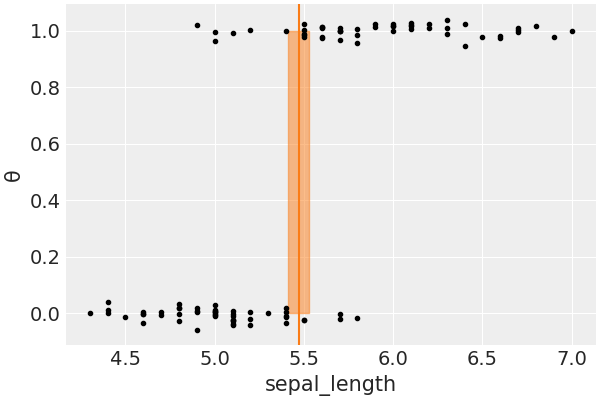

# 降维

我们知道，解决过拟合的问题除了正则化和添加数据之外，降维就是最好的方法。降维的思路来源于维度灾难的问题，我们知道$n$维球的体积为

$$
CR^n
$$

则在球体积与边长为$2R$的超立方体比值为

$$
\underset{n → 0}{\lim} \frac{C R^n}{2^n R^n} =0
$$

这就是所谓的维度灾难，在高维数据中，主要样本都分布在立方体的边缘，故数据集更加稀疏。

降维的算法分为

- 直接降维：特征选择
- 线性降维：PCA，MDS
- 流形降维：UMAP，LLE

## 1. 线性判别分析

### 1.1. 推导

在 LDA 中，我们的基本想法是选定一个方向，将试验样本顺着这个方向投影，投影后的数据需要满足两个条件，从而可以更好地分类

1. 相同类内部的试验样本距离接近
2. 不同类别之间的距离较大

首先是投影，我们假设原来的数据是向量$x$，则顺着$w$方向的投影就是标量

$$
z = w^{⊤}⋅x(= |w|⋅|x|\cosθ)
$$

对第一点，相同类内部的样本更为接近，我们假设属于两类的试验样本数量分别是$N_1$和$N_2$，则我们采用方差矩阵来表征每一个类内的总体分布，这里我们使用了协方差的定义，用$S$表示原数据的协方差

$$
\begin{aligned}
C_1:Var_z\big[C_1\big]
&= \frac{1}{N_1} ∑_{i=1}^{N_1}(z_i -\overline{z_{c1}})(z_i -\overline{z_{c1}})^{⊤} \\
&= \frac{1}{N_1} ∑_{i=1}^{N_1}(w^{⊤} x_i -\frac{1}{N_1} ∑_{j=1}^{N_1} w^{⊤} x_{j})(w^{⊤} x_i -\frac{1}{N_1} ∑_{j=1}^{N_1} w^{⊤} x_{j})^{⊤} \\
&= w^{⊤} \frac{1}{N_1} ∑_{i=1}^{N_1}(x_i -\overline{x_{c1}})(x_i -\overline{x_{c1}})^{⊤} w\\
&= w^{⊤} S_1w\\
C_2:Var_z\big[C_2\big]
&= \frac{1}{N_2} ∑_{i=1}^{N_2}(z_i -\overline{z_{c2}})(z_i -\overline{z_{c2}})^{⊤} \\
&= w^{⊤} S_2w
\end{aligned}
$$

故类内距离可以记为

$$
\begin{aligned}
Var_z\big[C_1\big]+Var_z\big[C_2\big]=w^{⊤}(S_1+S_2)w
\end{aligned}
$$

对于第二点，我们可以用两类的均值表示这个距离

$$
\begin{aligned}
(\overline{z_{c1}}-\overline{z_{c2}})^2 &=(\frac{1}{N_1} ∑_{i=1}^{N_1} w^{⊤} x_i -\frac{1}{N_2} ∑_{i=1}^{N_2} w^{⊤} x_i)^2\\
&=(w^{⊤}(\overline{x_{c1}}-\overline{x_{c2}}))^2\\
&=w^{⊤}(\overline{x_{c1}}-\overline{x_{c2}})(\overline{x_{c1}}-\overline{x_{c2}})^{⊤} w
\end{aligned}
$$

综合这两点，由于协方差是一个矩阵，于是我们用将这两个值相除来得到我们的损失函数，并最大化这个值

$$
\begin{aligned}
ŵ = \underset{w}{\mathrm{argmax}}J(w) &= \underset{w}{\mathrm{argmax}}\ \frac{(\overline{z_{c1}}-\overline{z_{c2}})^2}{Var_z\big[C_1\big]+Var_z\big[C_2\big]} \\
&= \underset{w}{\mathrm{argmax}}\ \frac{w^{⊤}(\overline{x_{c1}}-\overline{x_{c2}})(\overline{x_{c1}}-\overline{x_{c2}})^{⊤} w}{w^{⊤}(S_1+S_2)w} \\
&= \underset{w}{\mathrm{argmax}}\ \frac{w^{⊤} S_bw}{w^{⊤} S_ww}
\end{aligned}
$$

这样，我们就把损失函数和原数据集以及参数结合起来了。下面对这个损失函数求偏导，注意我们其实对 $w$ 的绝对值没有任何要求，只对方向有要求，因此只要一个方程就可以求解了

$$
\begin{aligned}
&\frac{∂}{∂w}J(w)=2S_bw(w^{⊤} S_ww)^{-1}-2w^{⊤} S_bw(w^{⊤} S_ww)^{-2}S_ww=0\\
&⇒ S_bw(w^{⊤} S_ww)=(w^{⊤} S_bw)S_ww\\
&⇒ w∝ S_w^{-1}S_bw=S_w^{-1}(\overline{x_{c1}}-\overline{x_{c2}})(\overline{x_{c1}}-\overline{x_{c2}})^{⊤} w∝ S_w^{-1}(\overline{x_{c1}}-\overline{x_{c2}})
\end{aligned}
$$

于是$S_w^{-1}(\overline{x_{c1}}-\overline{x_{c2}})$ 就是我们需要寻找的方向。最后可以归一化求得单位的$w$值。

### 1.2. 建模

在所有的情况下，我们试图直接计算$p(y ∣ x)$，即，给定的类知道$x$的概率，$x$是我们测量到的类成员的特征。换句话说，我们尝试直接模拟从独立变量到因变量的映射，然后使用阈值将连续计算的概率变成一个离散的边界，允许我们分配类。

这种方法并不是唯一的。一种替代方法是先建立$p(x ∣ y)$的模型，也就是每个类的$x$的分布，然后分配类。这种模型被称为生成式分类器。

逻辑回归是一种判别式分类器，因为它试图通过判别类进行分类，但我们无法从模型中生成每个类的例子。我们要做的是针对两个类和只有一个特征，和我们在本章建立的第一个模型（model_e）一模一样，我们要使用的数据亦为非常相同的。下面是一个生成式分类器实现。从代码中可看到，现在边界决策被定义为估计高斯均值之间的均值。当分布为正态且其标准差相等时，这是正确的边界决策。这些均是被称为线性判别分析（LDA）的模型所做的假设。尽管它的名字，LDA 模型是生成性的。

|      | mean  |  sd   | hdi3% | hdi_97% | mcse_mean | mcse_sd | ess_bulk | ess_tail | r_hat |
| :--: | :---: | :---: | :---: | :-----: | :-------: | :-----: | :------: | :------: | :---: |
| μ\big[0\big] | 5.005 | 0.065 | 4.875 |  5.119  |   0.001   |  0.001  |   2691   |   1314   |   1   |
| μ\big[1\big] | 5.936 | 0.065 | 5.816 |  6.052  |   0.001   |  0.001  |   2594   |   1468   |   1   |
|  σ   | 0.447 | 0.033 | 0.386 |  0.508  |   0.001   |    0    |   2477   |   1484   |   1   |
|  bd  | 5.47  | 0.045 | 5.382 |  5.552  |   0.001   |  0.001  |   2446   |   1351   |   1   |

现在，我们要绘制一个图，显示两个类（ `setosa = 0` 和 `versicolor = 1` ）对萼片长度的值，亦为边界决定作为一条红线和 94％的最高后密度（HPD）区间为它作为一个半透明带。

LDA 模型和逻辑回归都能提供类似的结果。线性判别模型可通过将类作为多变量高斯模型来扩展到一个以上的特征。此外，还可放宽类共享一个共同方差（或协方差）的假设。这导致了一种被称为二次线性判别（QDA）的模型，因为决策边界是二次的。

一般来说，当我们使用的特征或多或少是高斯分布时，LDA 或 QDA 模型将比逻辑回归更好，而逻辑回归在相反的情况下会表现得更好。生成模型用于分类的一个优势是，它可能更容易或更自然地纳入先验信息；例如，我们可能有关于数据的均值和方差的信息来纳入模型。

需要注意的是，LDA 和 QDA 的边界决定是以封闭形式已知的，因此它们通常以这样的方式计算。若要对两个类和一个特征使用 LDA，我们只需要计算每个分布的均值，并对这两个值进行平均，就可得到边界决定。在前面的模型中，我们只是做到了这一点，但却用了贝叶斯的方法。我们估计了两个高斯的参数，然后我们把这些估计值插入一个预定义的公式中。要想得到这个公式，我们必须假设数据是高斯分布的，故，只有当数据没有大幅偏离正态的时候，这样的公式才会有效。当然，若我们想放宽正态性假设，如使用学生 _t_ 分布，我们可能会遇到一个问题。在这种情况下，我们不能再使用 LDA（或 QDA）的闭合形式；不过，我们仍然可使用 PyMC3 来数值计算决策边界。

## 2. 主成分分析

为了方便，我们首先将协方差矩阵（数据集）写成中心化的形式：

$$
\begin{aligned}
S&= \frac{1}{N} ∑_{i=1}^n (x_i -x̄)(x_i -x̄)^{⊤} \\
&= \frac{1}{N}(x_1 - x̄, x_2-x̄, ⋯, x_N -x̄)(x_1 - x̄, x_2 -x̄, ⋯, x_N -x̄)^{⊤} \\
&= \frac{1}{N}(𝑿^{⊤} - \frac{1}{N}𝑿^{⊤} 𝑰_{N_1} 𝑰_{N_1}^{⊤})(𝑿^{⊤} - \frac{1}{N}𝑿^{⊤} 𝑰_{N_1} 𝑰_{N_1}^{⊤})^{⊤} \\
&= \frac{1}{N}𝑿^{⊤} (E_N -\frac{1}{N} 𝑰_{N_1} 𝑰_{1N})(E_N -\frac{1}{N} 𝑰_{N_1} 𝑰_{1N})^{⊤} 𝑿\\
&= \frac{1}{N}𝑿^{⊤} 𝑯_N𝑯_N^{⊤} 𝑿\\
&= \frac{1}{N}𝑿^{⊤} 𝑯_N𝑯_N𝑿 = \frac{1}{N}𝑿^{⊤} 𝑯𝑿
\end{aligned}
$$

这个式子利用了中心矩阵 $𝑯$的对称性，这也是一个投影矩阵。

### 2.1. 损失函数

主成分分析中，我们的基本想法是将所有数据投影到一个字空间中，从而达到降维的目标，为了寻找这个子空间，我们基本想法是

1. 所有数据在子空间中更为分散
2. 损失的信息最小，即，在补空间的分量少

原来的数据很有可能各个维度之间是相关的，于是我们希望找到一组$p$个新的线性无关的单位基$u_i$，降维就是取其中的$q$个基。于是对于一个样本$x_i$，经过这个坐标变换后

$$
x̂_i = ∑_{i=1}^p (u_i^{⊤} x_i)u_i = ∑_{i=1}^q (u_i^{⊤} x_i)u_i + ∑_{i=q+1}^p (u_i^{⊤} x_i)u_i
$$

对于数据集来说，我们首先将其中心化然后再去上面的式子的第一项，并使用其系数的平方平均作为损失函数并最大化

$$
\begin{aligned}
J
&= \frac{1}{N} ∑_{i=1}^n ∑_{j=1}^q ((x_i -x̄)^{⊤} u_{j})^2\\
&= ∑_{j=1}^q u_{j}^{⊤} Su_{j}\ ,\ s.t.\ u_{j}^{⊤} u_{j}=1
\end{aligned}
$$

由于每个基都是线性无关的，于是每一个 $u_{j}$ 的求解可以分别进行，使用拉格朗日乘子法

$$
\underset{u_{j}}\mathrm{argmax}\ L(u_{j},λ) = \underset{u_{j}}\mathrm{argmax}u_{j}^{⊤} Su_{j}+λ(1-u_{j}^{⊤} u_{j})
$$

于是

$$
Su_{j}=λ u_{j}
$$

可见，我们需要的基就是协方差矩阵的特征矢。损失函数最大取在特征值前 $q$ 个最大值。

下面看其损失的信息最少这个条件，同样适用系数的平方平均作为损失函数，并最小化

$$
\begin{aligned}
J
&= \frac{1}{N} ∑_{i=1}^n ∑_{j=q + 1}^p ((x_i -x̄)^{⊤} u_{j})^2 \\
&= ∑_{j=q + 1}^p u_{j}^{⊤} Su_{j}\ ,\ s.t.\ u_{j}^{⊤} u_{j}=1
\end{aligned}
$$

同样的

$$
\underset{u_{j}}\mathrm{argmin}\ L(u_{j},λ) = \underset{u_{j}}\mathrm{argmin}\ u_{j}^{⊤} Su_{j}+λ(1-u_{j}^{⊤} u_{j})
$$

损失函数最小取在特征值剩下的个最小的几个值。数据集的协方差矩阵可以写成 $S=𝑼𝜦𝑼^{⊤}$，直接对这个表达式当然可以得到特征矢。

### 2.2. PCoA

下面使用实际训练时常常使用的 SVD 直接求得这个$q$个特征向量。

对中心化后的数据集进行奇异值分解

$$
𝑯𝑿 = 𝑼𝜮𝑽^{⊤}, 𝑼^{⊤}𝑼 = E_N, 𝑽^{⊤} 𝑽 = E_p, 𝜮: N × p
$$

于是

$$
\begin{aligned}
S
&= \frac{1}{N} 𝑿^{⊤} 𝑯𝑿 \\
&= \frac{1}{N} 𝑿^{⊤} 𝑯^{⊤} 𝑯𝑿 \\
&= \frac{1}{N} 𝑽𝜮^{⊤} 𝜮 𝑽^{⊤}
\end{aligned}
$$

因此，直接对中心化后的数据集进行 SVD，就可以得到特征值和特征向量 $𝑽$，在新坐标系中的坐标就是

$$
𝑯𝑿⋅𝑽
$$

由上面的推导，我们也可以得到另一种方法 PCoA 主坐标分析，定义并进行特征值分解

$$
\begin{aligned}
T
&= 𝑯𝑿 𝑿^{⊤} 𝑯 \\
&= 𝑼𝜮𝜮^{⊤} 𝑼^{⊤}
\end{aligned}
$$

由于

$$
T𝑼𝜮 = 𝑼𝜮(𝜮^{⊤} 𝜮)
$$

于是可以直接得到坐标。这两种方法都可以得到主成分，但是由于方差矩阵是$p × p$的，而$T$是$N × N$的，故对样本量较少的时候可以采用 PCoA 的方法。

### 2.3. p-PCA

下面从概率的角度对 PCA 进行分析，概率方法也叫 p-PCA。使用线性模型，类似之前 LDA，选定一个方向，对原数据$x ∈ ℝ^p$，降维后的数据为$z ∈ ℝ^q, q < p$。降维通过一个矩阵变换（投影）进行

$$
\begin{aligned}
z &∼ N(𝕆_{q_1}, 𝑰_{qq}) \\
x &= 𝐖z + μ + ɛ\\
ɛ &∼ N(0, σ^2𝑰_{pp})
\end{aligned}
$$

对于这个模型，我么可以使用期望最大（EM）算法进行学习，在进行推断的时候需要求得$p(z ∣ x)$，推断的求解过程和线性高斯模型类似。

由

$$
\begin{aligned}
p(z ∣ x) &= \frac{p(x ∣ z)p(z)}{p(x)} \\
\mathrm{E}\big[x\big] &= \mathrm{E}\big[𝐖z + μ + ɛ\big] = μ\\
Var\big[x\big] &= 𝐖𝐖^{⊤} + σ^2 𝑰_{pp} \\
\end{aligned}
$$

可得

$$
p(z ∣ x) = N(𝐖^{⊤}(𝐖𝐖^{⊤} + σ^2𝑰)^{-1}(x-μ), 𝑰 - 𝐖^{⊤}(𝐖𝐖^{⊤} + σ^2𝑰)^{-1}𝐖)
$$
