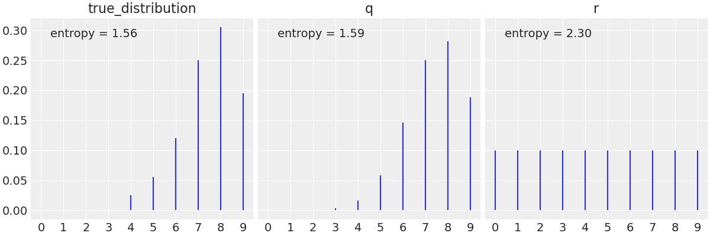

# 指数分布族

## 1. 定义

### 1.1. 最大熵

直观地说，一个分布越分散，其熵就越大。对于完全随机的变量（等可能），信息熵最大。假设数据是离散分布的，$k$个特征的概率分别为$p_k$，最大熵原理（maximum entropy principle）可以表述为

$$
\max\{H(p)\} = \min\bigg\{∑_{k=1}^k p_k\log p_k\bigg\}\\
s.t.\ ∑_{k=1}^k p_k = 1
$$

利用 Lagrange 乘子法

$$
L(p, λ) = ∑_{k=1}^k p_k\log p_k + λ\bigg(1-∑_{k=1}^k p_k\bigg)
$$

于是可得

$$
p_1 = p_2 = ⋯ = p_k = \frac{1}{k}
$$

因此等可能的情况熵最大。

在某些情况下，熵的增加意味着方差的增加。这将是高斯分布的情况。但，也有方差增加而熵不增加的例子。

设有一个分布是两个高斯的混合分布。当增加众数之间的距离时，我们增加了大部分点与均值的距离，而方差正是所有点到均值的平均距离。故，若我们不断增加距离，方差会无限制地不断增加。熵的影响会比较小，因为随着我们增加众数之间的距离，众数之间的点的概率越来越小，因此它们对总熵的贡献会忽略不计。从熵的角度来看，若我们从两个重叠的高斯开始，然后将一个高斯向另一个高斯移动，在某一时刻，我们将有两个分离的高斯。

熵与不确定性有关。一个比较分散或扁平的先验分布是一个信息量较小的分布。这不仅在直观上是正确的，且有熵的概念的理论支持。我们希望找到尽可能大的熵（最小信息量）的分布，但我们也希望考虑到我们的问题所定义的约束。这是一个可用数学方法解决的优化问题

在以下约束条件下，熵最大的分布分别为

- 无约束条件：均匀分布
- 一个正的均值：指数分布
- 一个给定的方差：高斯分布
- 只有两个无序结果和一个恒定的均值：二项分布，或 Poisson 分布

### 1.2. 概率分布

指数分布族（exponential family）的概念是 E. J. G. Pitman，G. Darmois 和 B. O. Koopman 在 1935∼1936 年提出的。包括高斯分布、伯努利分布、二项分布、Poisson 分布、Beta 分布、Dirichlet 分布、Gamma分布等一系列分布。其概率分布满足以下形式

$$
p(x ∣ η)=h(x)\exp(η^{⊤}T(x)-A(η)) = \frac{1}{\exp(A(η))}h(x)\exp(η^{⊤}T(x))
$$

其中，$θ ≡ \bigg[θ_1, θ_2, …, θ_s \bigg]^{⊤}$被称为族参数。

分布函数中的$T(x), η(θ), A(η)$都有其特殊的意义。

\-$T(x)$是分布的充分统计量（sufficient statistic）。对于指数族来说，充分统计量是数据的函数，它拥有数据$x$提供的关于未知参数值的所有信息，如高斯分布中的均值和方差。$T(x)$的维度等于$θ$的参数个数，包含了与参数$θ$有关的所有数据信息。 -$η(θ)$是自然参数向量。对于有限的函数$f_{X}(x;θ)$而言，$η$的集合被称为自然参数空间。自然参数空间总是凸的。 -$A(η)$被称为对数配分函数（log-partition function），实际上它是归一化因子的对数形式。它使得概率分布积分为 1 的条件得到满足。

$$
A(η) = \ln \bigg(∫_x h(x) \exp(η(θ)⋅T(x)) dx\bigg)
$$

上式可看出，通过对$A(η)$求导，容易得到充分统计量$T(x)$的均值，方差和其他性质。

> 充分统计量在在线学习中有应用，对于一个数据集，只需要记录样本的充分统计量即可。

对于一个模型分布假设（似然），则我们在求解中，常常需要寻找一个共轭先验，使得先验与后验的形式相同，例如选取似然是二项分布，可取先验是 Beta 分布，则后验也是 Beta 分布。指数族分布常常具有共轭的性质，于是我们在模型选择以及推断具有很大的便利。共轭先验的性质便于计算。

### 1.3. 推导

假设一个数据集$\mathscr{D}$，在这个数据集上的经验分布为$p̂(x) = \frac{\mathrm{Count}(x)}{N}$，实际不可能满足所有的经验概率相同，于是在上面的最大熵原理中还需要加入这个经验分布的约束。

对任意一个函数，经验分布的经验期望可以求得为

$$
\mathrm{E}_p̂\big[f(x)\big]=Δ
$$

于是

$$
\max\{H(p)\} = \min\bigg\{∑_{k=1}^n p_k\log p_k\bigg\}\\
s.t.\ ∑_{k=1}^n p_k = 1, \mathrm{E}_p\big[f(x)\big] = Δ
$$

Lagrange 函数为

$$
L(p,λ_0,λ) = ∑_{k=1}^n p_k\log p_k + λ_0(1-∑_{k=1}^n p_k) + λ^{⊤}(Δ-\mathrm{E}_p\big[f(x)\big])
$$

求导得到

$$
\frac{∂}{∂p(x)} L= ∑_{k=1}^n (\log p(x) + 1) - ∑_{k=1}^n λ_0 - ∑_{k=1}^n λ^{⊤} f(x) \\
↓\\
∑_{k=1}^n \log p(x) + 1 - λ_0 - λ^{⊤} f(x) = 0
$$

由于数据集是任意的，对数据集求和也意味着求和项里面的每一项都是 0

$$
p(x) = \exp(λ^{⊤}f(x)+λ_0 -1)
$$

这就是指数族分布。

观察到指数族分布的表达式类似线性模型，事实上，指数族分布很自然地导出广义线性模型

$$
y = f(w^{⊤} x) \\
y ∣ x ∼ \text{Exp Family}
$$

在更复杂的概率图模型中，例如在无向图模型中如受限玻尔兹曼机中，指数族分布也扮演着重要作用。在推断的算法中，例如变分推断中，指数族分布也会大大简化计算。

## 2. 配分函数

在学习和推断中，对于一个概率的归一化因子很难处理，这个归一化因子和配分函数相关。

假设一个概率分布

$$
p(x ∣ θ) = \frac{1} {Z(θ)}p̂(x ∣ θ), Z(θ) = ∫p̂(x ∣ θ)dx
$$

### 2.1. 包含配分函数的最大似然估计

在学习任务中，采用最大似然估计（MLE）

$$
\begin{aligned}
θ̂ &= \underset{θ}{\mathrm{argmax}}\ p(x ∣ θ) = \underset{θ}{\mathrm{argmax}}∑_{i=1}^n\log p(x_i ∣ θ) \\
&= \underset{θ}{\mathrm{argmax}}\ ∑_{i=1}^n\log p̂(x ∣ θ)-N\log Z(θ) \\
&= \underset{θ}{\mathrm{argmax}}\ \frac{1}{N} ∑_{i=1}^n \log p̂(x ∣ θ)-\log Z(θ) = \underset{θ}{\mathrm{argmax}}\ l(θ)
\end{aligned}
$$

求导

$$
\begin{aligned}
∇_θ\log Z(θ)
&= \frac{1}{Z(θ)}∇_θ Z(θ) \\
&= \frac{p(x ∣ θ)}{p̂(x ∣ θ)} ∫∇_θ p̂(x ∣ θ)dx\\
&= ∫\frac{p(x ∣ θ)}{p̂(x ∣ θ)}∇_θp̂(x ∣ θ)dx\\
&= \mathrm{E}_{p(x ∣ θ)}[∇_θ\log p̂(x ∣ θ)]
\end{aligned}
$$

由于这个表达式和未知的概率相关，于是无法直接精确求解，需要近似采样，若没有这一项，则可以采用梯度下降，但是存在配分函数就无法直接采用梯度下降了。

上面这个期望值，是对模型假设的概率分布，定义真实概率分布为$p_\mathrm{data}$，于是，$l(θ)$中的第一项的梯度可以看成是从这个概率分布中采样出来的$N$个点求和平均，可以近似期望值。

$$
∇_θ l(θ) = \mathrm{E}_{p_{data}} [∇_θ\log p̂(x ∣ θ)] - \mathrm{E}_{p(x ∣ θ)}[∇_θ\log p̂(x ∣ θ)]
$$

于是，相当于真实分布和模型假设越接近越好。上面这个式子第一项称为正相，第二项称为负相。为了得到负相的值，需要采用各种采样方法，如 MCMC。

采样得到$x̂_{1-m} ∼ p_\mathrm{model}(x ∣ θ^t)$，则

$$
θ^{t + 1} = θ^t + η\bigg(∑_{i=1}^m ∇_θ \log p̂(x_i ∣ θ^t) - ∑_{i=1}^m ∇_θ\log p̂(x̂_i | θ^t)\bigg)
$$

这个算法也称为基于 MCMC 采样的梯度上升。每次通过采样得到的样本称为幻想粒子，若这些幻想粒子区域的概率高于实际分布，则最大化参数的结果就是降低这些部分的概率。

### 2.2. KL 散度

Kullback-Leibler（KL）散度是度量两个分布接近程度的一种方法，定义如下

$$
D_\mathrm{KL}(p ∣ q) = ∑p_i \log \frac{p_i}{q_i}
$$

这读作从$q$到$p$的 KL 散度，其中，$p$和$q$是两个概率分布。对于连续变量，需要计算一个积分，而不是求和，但主要的思想是一样的。

我们可将$D_\mathrm{KL}(p ∣ q)$散度解释为通过使用概率分布$q$来近似分布$p$而引入的额外熵或不确定性。事实上，KL 散度是两个熵之间的差异。

$$
D_\mathrm{KL}(p ∣ q) = \underbrace{∑p_i \log p_i}_{\text{entropy of}\ p} - \underbrace{∑p_i \log q_i}_{\text{cross-entropy of}\ p , q} = ∑p_i(\log p_i - \log q_i)
$$

> 我们也可将$D_\mathrm{KL}(p ∣ q)$读作$p$相对于$q$的相对熵。

作为一个简单的例子，我们可使用 KL 散度来评估$q$或$r$哪个分布是 `true_distribution` 的更好近似。

> KL 散度不是对称的，因此不是一个真实的距离。

我们可使用 KL 散度来比较模型，因为这将给出一个度量哪个模型更接近真实分布的后验。问题是我们不知道真实的分布。故，KL 散度不能直接应用。但，我们可用它作为一个论据来证明偏离度的使用。若我们设真分布存在，如下面的公式所示，则真分布是独立于任何模型和常数的，因此它将以同样的方式影响 KL 散度的值。故，我们可使用偏离度，也就是取决于每个模型的部分，来估计我们与真实分布的接近程度，即使我们不知道它。

$$
\begin{aligned}
  D_\mathrm{KL}(p ∣ q) - D_\mathrm{KL}(p ∣ r)
  &= \bigg(∑p_i \log p_i - ∑p_i \log q_i \bigg) - \bigg(∑p_i \log p_i - ∑p_i \log r_i \bigg) \\
  &= -∑p_i \log q_i + ∑p_i \log r_i
\end{aligned}
$$

即使我们不知道$p$，我们也可得出结论，具有较大的对数似然或偏离度的分布是 KL 散度中更接近真实分布的分布。在实践中，对数似然或偏离度是从一个已经拟合到有限样本的模型中获得的。故，我们还必须添加一个惩罚项来纠正偏离度的高估，这就引出了 WAIC 和其他信息标准。

### 2.3. 对比散度

对于负相的采样，最大的问题是，采样到达平稳分布的步骤数量是未知的。对比散度的方法，是对上述的采样是的初始值作出限制，直接采样$x̂_i=x_i$，这样可以缩短采样的混合时间。这个算法称为对比散度（Contrastive Divergence-k，CD-k）算法，$k$就是初始化后进行的演化时间，很多时候，即使$k = 1$也是可以的。

由 MLE 的表达式

$$
\begin{aligned}
θ̂
&= \underset{θ}{\mathrm{argmax}}p(x ∣ θ) \\
&= \underset{θ}{\mathrm{argmax}}\frac{1}{N} ∑_{i=1}^n \log p(x_i ∣ θ) = \mathrm{E}_{p_{data}}[\log p_{model}(x ∣ θ)] \\
&= \underset{θ}{\mathrm{argmax}}\ ∫p_{data}\log p_{model}dx \\
&= \underset{θ}{\mathrm{argmax}}\ ∫ p_{data}\log \frac{p_{model}}{p_{data}}dx\\
&= \underset{θ}{\mathrm{argmin}}\ KL(p_{data}||p_{model})
\end{aligned}
$$

对于 CD-k 的采样过程，可以将初始值这些点表示为

$$
p⁰ = p_{data}
$$

而我们的模型需要采样过程达到平稳分布

$$
p^{∞} = p_{model}
$$

因此，我们需要的是$\mathrm{KL}(p⁰||p^{∞})$。定义 CD

$$
\mathrm{KL}(p⁰||p^{∞}) - \mathrm{KL}(p^{k}||p^{∞})
$$

这就是 CD-k 算法第$k$次采样的目标函数。

## 3. 充分统计量

### 3.1. 对数配分函数的关系

对概率密度函数求积分

$$
\exp(A(η)) = ∫ h(x)\exp(η^{⊤}ϕ(x))dx
$$

两边对参数求导

$$
\exp(A(η))A'(η)= ∫ h(x)\exp(η^{⊤}ϕ(x))ϕ(x)dx\\
↓\\
A'(η) = \mathrm{E}_{p(x ∣ η)}\big[ϕ(x)\big]
$$

类似的

$$
A''(η)=Var_{p(x ∣ η)}\big[ϕ(x)\big]
$$

由于方差为正，于是$A(η)$一定是凸函数。

### 3.2. 和 MLE

对于独立全同采样得到的数据集$\mathscr{D} = \{x_1, x_2, ⋯, x_N\}$

$$
\begin{aligned}η_\mathrm{MLE} &= {\mathrm{argmax}}_η ∑_{i=1}^n \log p(x_i|η) \\
&= {\mathrm{argmax}}_η ∑_{i=1}^n(η^{⊤}ϕ(x_i)-A(η)) \\
&⟶ A'(η_\mathrm{MLE}) = \frac{1}{N}∑_{i=1}^nϕ(x_i)
\end{aligned}
$$

由此可以看到，为了估算参数，只需要知道充分统计量就可以了。

## 4. 一维高斯分布

一维高斯分布可以写成

$$
p(x ∣ θ) = \frac{1}{\sqrt{2π}σ}\exp(-\frac{(x-μ)^2}{2σ^2})
$$

将这个式子改写

$$
\frac{1}{\sqrt{2πσ^2}}\exp\bigg(-\frac{1}{2σ^2}(x^2-2μ x+μ^2)\bigg)
= \exp(\log(2πσ^2)^{-1/2})\exp(-\frac{1}{2σ^2}
\begin{bmatrix}
-2μ& 1
\end{bmatrix}
\begin{bmatrix}
x\\ x^2
\end{bmatrix}
-\frac{μ^2}{2σ^2})
$$

故

$$
η =
\begin{bmatrix}
\frac{μ}{σ^2} \\ -\frac{1}{2σ^2}
\end{bmatrix} =
\begin{bmatrix}
η_1 \\ η_2
\end{bmatrix}
$$

于是$A(η)$

$$
A(η) = -\frac{η_1^2}{4η_2} + \frac{1}{2}\log(-\frac{π}{η_2})
$$

## 5. 演化

|      分布      |   $θ$    |                                $η$                                 |          $h(x)$          |                        $T(x)$                         |                   $A(θ)$                   |
| :------------: | :------: | :----------------------------------------------------------------: | :----------------------: | :---------------------------------------------------: | :----------------------------------------: |
| Bernoulli 分布 |   $p$    |                      $\log \dfrac{p}{1 - p}$                       |           $1$            |                          $x$                          |              $- \log (1 - p)$              |
|    二项分布    |   $p$    |                      $\log \dfrac{p}{1 - p}$                       |      $\binom{n}{x}$      |                          $x$                          |              $-n\log (1 - p)$              |
|   负二项分布   |   $p$    |                              $\log p$                              |   $\binom{x +r-1}{x}$    |                          $x$                          |             $-r \log (1 - p)$              |
|  Poisson 分布  |   $λ$    |                              $\logλ$                               |     $\dfrac{1}{x!}$      |                          $x$                          |                    $λ$                     |
|    指数分布    |   $λ$    |                               $- λ$                                |           $1$            |                          $x$                          |                 $- \log λ$                 |
|  Weibull 分布  |   $λ$    |                        $- \dfrac{1}{λ^{k}}$                        |        $x^{k-1}$         |                        $x^{k}$                        |             $k \log λ- \log k$             |
|    高斯分布    | $μ, σ^2$ | $\begin{bmatrix} \frac{μ}{σ^2} \\ - \frac{1}{2 σ^2} \end{bmatrix}$ |  $\dfrac{1}{\sqrt{2π}}$  |       $\begin{bmatrix} x \\ x^2 \end{bmatrix}$        |       $\dfrac{μ^2}{2 σ^2} + \log σ$        |
|  对数高斯分布  | $μ, σ^2$ | $\begin{bmatrix} \frac{μ}{σ^2} \\ - \frac{1}{2 σ^2} \end{bmatrix}$ | $\dfrac{1}{\sqrt{2π} x}$ | $\begin{bmatrix} \log x \\ (\log x)^2 \end{bmatrix}$  |       $\dfrac{μ^2}{2 σ^2} + \log σ$        |
|    Beta 分布    |  $α, β$  |                $\begin{bmatrix}α \\ β\end{bmatrix}$                |  $\dfrac{1}{x(1 - x)}$   | $\begin{bmatrix} \log x \\ \log (1 - x)\end{bmatrix}$ |   $\log Γ(α) + \log Γ(β) - \log Γ(α+ β)$   |
|    Gamma分布    |  $α, β$  |              $\begin{bmatrix}α-1 \\ - β\end{bmatrix}$              |           $1$            |      $\begin{bmatrix} \log x \\ x\end{bmatrix}$       |           $\log Γ(α) - α \log β$           |
|   $χ^2$分布    |   $ν$    |                         $\dfrac{ν}{2} -1$                          |   $e^{- \frac{x}{2}}$    |                       $\log x$                        | $\log Γ(\frac{ν}{2}) + \frac{ν}{2} \log 2$ |
|                |          |                                                                    |                          |                                                       |                                            |
|                |          |                                                                    |                          |                                                       |                                            |
|                |          |                                                                    |                          |                                                       |                                            |
