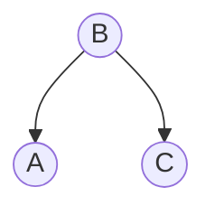
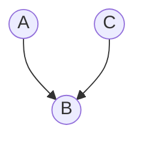
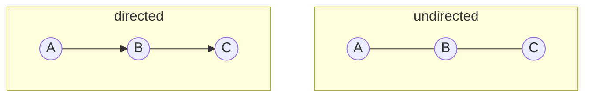
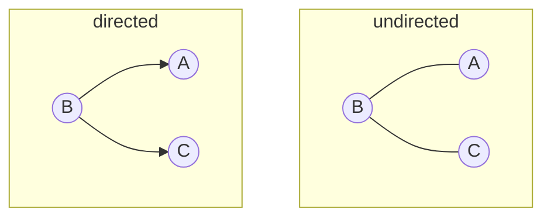
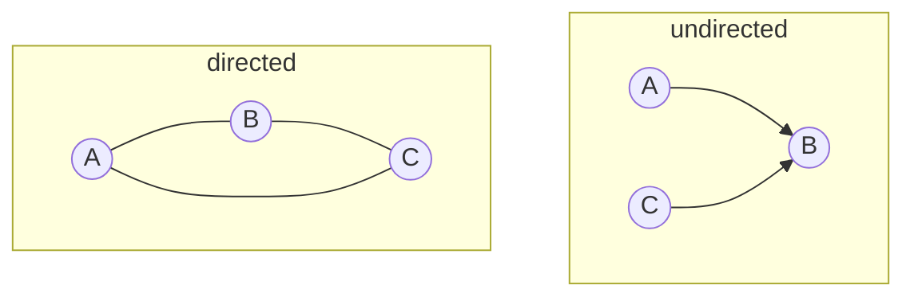
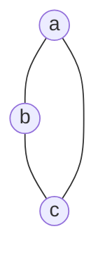
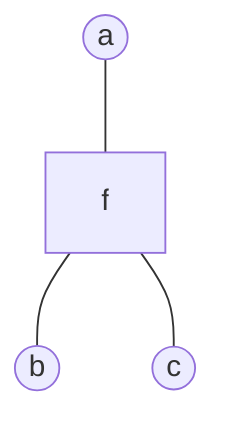
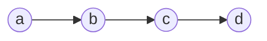
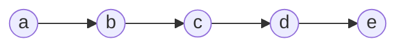
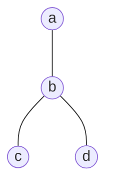

# 概率图

## 1. 概率图模型

概率图模型使用图的方式表示概率分布。为了在图中添加各种概率，首先总结一下随机变量分布的一些规则

- 加法法则

$$
p(x_1) = ∫p(x_1, x_2)dx_2
$$

- 乘法法则

$$
p(x_1, x_2) = p(x_1 ∣ x_2)p(x_2)
$$

- 链式法则

$$
p(x_1, x_2, ⋯, x_p) = ∏_{i=1}^p p(x_i | x_{i+1}, x_{i+2}, ⋯, x_p)
$$

- 贝叶斯法则

$$
p(x_1 ∣ x_2) = \frac{p(x_2 ∣ x_1)p(x_1)}{p(x_2)}
$$

可以看到，在链式法则中，若数据维度特别高，则的采样和计算非常困难，我们需要在一定程度上作出简化，在朴素贝叶斯中，作出了条件独立性假设。在 Markov 假设中，给定数据的维度是以时间顺序出现的，给定当前时间的维度，则下一个维度与之前的维度独立。在 HMM 中，采用了齐次Markov假设。在Markov假设之上，更一般的，加入条件独立性假设，对维度划分集合$A,B,C$，使得$X_A ⟂ X_B|X_C$。

概率图模型采用图的特点表示上述的条件独立性假设，节点表示随机变量，边表示条件概率。概率图模型可以分为三大理论部分：

- 表示
  - 有向图（离散）：贝叶斯网络
  - 高斯图（连续）：高斯贝叶斯和高斯 Markov 网络
  - 无向图（离散）：Markov 网络
- 推断
  - 精确推断
  - 近似推断
    - 确定性近似（如变分推断）
    - 随机近似（如 MCMC）
- 学习
  - 参数学习
    - 完备数据
    - 隐变量：EM 算法
  - 结构学习

### 1.1. 有向图

已知联合分布中，各个随机变量之间的依赖关系，则可以通过拓扑排序（根据依赖关系）可以获得一个有向图。而若已知一个图，也可以直接得到联合概率分布的因子分解

$$
p(x_1, x_2, ⋯, x_p) = ∏_{i=1}^p p(x_i | x_\mathrm{parent(i)})
$$

则实际的图中条件独立性是如何体现的呢？在局部任何三个节点，可以有三种结构

- 结构 1

$$
p(A,B,C)=p(A)p(B|A)p(C|B)=p(A)p(B|A)p(C|B,A) \\
↓\\
p(C|B)=p(C|B,A) \\
⇕\\
p(C|B)p(A|B)=p(C|A,B)p(A|B)=p(C,A|B) \\
↓\\
C ⟂ A|B
$$

- 结构 2

$$
p(A,B,C)=p(A|B)p(B)p(C|B)=p(B)p(A|B)p(C|A,B) \\
↓\\
p(C|B)=p(C|B,A) \\
⇕\\
p(C|B)p(A|B)=p(C|A,B)p(A|B)=p(C,A|B) \\
↓\\
C ⟂ A|B
$$

- 结构 3

$$
p(A,B,C)=p(A)p(C)p(B|C,A)=p(A)p(C|A)p(B|C,A) \\
↓\\
p(C)=p(C|A) \\
⇕\\
C ⟂ A\\
$$

对这种结构，$A,C$不与$B$条件独立。

### 1.2. D 划分

从整体的图来看，可以引入 D 划分的概念。对于类似上面图 1 和图 2 的关系，引入集合$A$和$B$，则满足$A ⟂ B|C$的$C$集合中的点与$A,B$中的点的关系都满足图 1，2，满足图 3 关系的点都不在$C$中。D 划分应用在 Bayes 定理中

$$
p(x_i | x_{-i}) = \frac{p(x)}{∫ p(x)dx_i} = \frac{∏_{j=1}^p p(x_{j} ∣ x_\mathrm{parents(j)})}{∫∏_{j=1}^p p(x_{j} ∣ x_\mathrm{parents(j)})dx_i}
$$

可以发现，上下部分可以分为两部分，一部分是和$x_i$相关的，另一部分是和$x_i$无关的，而这个无关的部分可以相互约掉。于是计算只涉及和$x_i$相关的部分。

与$x_i$相关的部分可以写成

$$
p(x_i | x_\mathrm{parents(i)})p(x_\mathrm{child(i)} ∣ x_i)
$$

这些相关的部分又称为 Markov 毯。

实际应用的模型中，对这些条件独立性作出了假设，从单一到混合，从有限到无限可以分为

- 朴素贝叶斯（NB）：单一的条件独立性假设$p(x ∣ y) = ∏_{i=1}^p p(x_i|y)$，在 D 划分后，所有条件依赖的集合就是单个元素。
- 高斯混合模型（GMM）：混合的条件独立。引入多类别的隐变量$z_1, z_2, ⋯,z_k$，$p(x ∣ z)=N(μ, σ)$，条件依赖集合为多个元素。
- 与时间相关的条件依赖
  - Markov 链（MC）
  - 高斯过程（无限维高斯分布）
  - 连续：高斯贝叶斯网络
  - 离散：隐 Markov（HMM）

### 1.3. 无向图

无向图没有了类似有向图的局部不同结构，在 Markov 网络中，也存在 D 划分的概念。

- 全局 Markov：将条件独立的集合$x_A ⟂ x_B ∣ x_C$划分为三个集合。
- 局部 Markov：$x ⟂ (X-\mathrm{neighbor}(\mathscr{x}))|\mathrm{neighbor}(x)$。
- 配对 Markov：$x_i ⟂ x_{j} ∣ x_{-i-j}$，其中，$i,j$不能相邻。

事实上上面三个点局部全局配对是相互等价的。有了这个条件独立性的划分，还需要因子分解来实际计算。引入团的概念

- 团：图中节点的集合，集合中的节点之间相互都是连接的称为团。
- 最大团：不能再添加节点的团，则叫最大团。

利用这个定义进行$x$所有维度的联合概率分布的因子分解，假设有$K$个团，$Z$就是对所有可能取值求和

$$
\begin{aligned}
p(x) = \frac{1}{Z} ∏_{i=1}^k ϕ(x_{ci}) \\
Z = ∑_{x∈ \mathscr{X}} ∏_{i=1}^k ϕ(x_{ci})
\end{aligned}
$$

其中，$ϕ(x_{ci})$称为势函数，它必须是一个正值，可以记为

$$
ϕ(x_{ci}) = \exp(-E(x_{ci}))
$$

这个分布称为 Gibbs 分布或玻尔兹曼分布。也可以记为：

$$
p(x) = \frac{1}{Z} \exp\bigg(-∑_{i=1}^kE(x_{ci})\bigg)
$$

这个分解和条件独立性等价（Hammesley-Clifford 定理），这个分布的形式也和指数族分布形式上相同，于是满足最大熵原理。

## 2. 图的变换

### 2.1. 有向变无向

我们常常想将有向图转为无向图，从而应用更一般的表达式

- 直线型

$$
p(a,b,c)=p(a)p(b|a)p(c|b)=ϕ(a,b)ϕ(b,c)
$$

- V 形

$$
p(a,b,c)=p(b)p(a|b)p(c|b)=ϕ(a,b)ϕ(b,c)
$$

- 倒 V 形

$$
p(a,b,c)=p(a)p(c)p(b|a,c)=ϕ(a,b,c)
$$

观察着三种情况可以概括为

- 将每个节点的父节点两两相连
- 将有向边替换为无向边

### 2.2. 因子图

对于一个有向图，可以通过引入环的方式，可以将其变换为无向图（tree-like graph），这个图就称为道德图。但是我们上面的 BP 算法只对无环图有效，通过因子图可以变为无环图。

考虑一个无向图

可以将其转为

其中，$f=f(a,b,c)$。因子图不是唯一的，这是由于因式分解本身就对应一个特殊的因子图，将因式分解：$p(x) = ∏_s f_s(x_s)$可以进一步分解得到因子图。

## 3. 精确推断

推断的主要目的是求各种概率分布，包括边缘概率，条件概率，以及使用 MAP 来求得参数。通常推断可以分为

- 精确推断
  - 变量消除（VE）
  - 信念传播（BP, Sum-Product Algo），从 VE 发展而来
  - Junction Tree，上面两种在树结构上应用，Junction Tree 在图结构上应用
- 近似推断
  - Monte Carlo Interference
    - Importance Sampling
    - MCMC
  - 变分推断（Variational Inference）

### 3.1. 变量消除

变量消除（Variable Elimination，VE）的方法是在求解概率分布的时候，将相关的条件概率先行求和或积分，从而一步步地消除变量，例如在 Markov 链中：

$$
p(d) = ∑\_{a,b,c}p(a,b,c,d) = ∑_cp(d|c)∑_bp(c|b)∑_ap(b|a)p(a)
$$

变量消除的缺点很明显

1. 计算步骤无法存储
2. 消除的最优次序是一个 NP-hard 问题

### 3.2. 信念传播

信念传播（Belief Propagation）可以克服 VE 的计算步骤无法存储。

对上面的 Markov 链进行观察

要求$p(e)$，当然使用 VE，从$a$一直消除到$d$，记$∑_ap(a)p(b|a)=m_{a → b(b)}$，表示这是消除$a$后的关于$b$的概率。

类似地，记$∑_bp(c|b)m_{a→ b}(b)=m_{b→ c}(c)$。于是$p(e) = ∑_dp(e|d)m_{b→ c}(c)$。

进一步观察，对$p(c)$

$$
p(c)=\big[∑_bp(c|b)∑_ap(b|a)p(a)\big]⋅\big[∑_dp(d|c)∑_ep(e)p(e|d)\big]
$$

我们发现了和上面计算$p(e)$类似的结构，这个式子可以分成两个部分

- 从$a$传播过来的概率
- 从$e$传播过来的概率

一般地，对于图（只对树形状的图）

这四个团（对于无向图是团，对于有向图就是概率为除了根的节点为 1），有四个节点，三个边

$$
p(a,b,c,d) = \frac{1}{Z} ϕ_a(a)ϕ_b(b)ϕ_c(c)ϕ_d(d)⋅ϕ_{ab}(a,b)ϕ_{bc}(c,b)ϕ_{bd}(d,b)
$$

套用上面关于有向图的观察，若求解边缘概率$p(a)$，定义

-$m_{c → b}(b) = ∑_c ϕ_c(c)ϕ_{bc}(bc)$
-$m_{d → b}(b) = ∑_d ϕ_d(d)ϕ_{bd}(bd)$
-$m_{b → a}(a) = ∑_b ϕ_{ba}(ba)ϕ_b(b)m_{c → b}(b)_{d → b}m(b)$

这样概率就一步步地传播到了$a$

$$
p(a)=ϕ_a(a)m_{b→ a}(a)
$$

写成一般的形式，对于相邻节点$i,j$

$$
m_{j → i}(i) = ∑_{j}ϕ_{j}(j) ϕ_{ij}(ij) ∏_{k∈ \mathrm{neighbor}(j)-i} m_{k → j}(j)
$$

这个表达式，就可以保存计算过程了，只要对每条边的传播分别计算，对于一个无向树形图可以递归并行实现

1. 任取一个节点$a$作为根节点
2. 对这个根节点的邻居中的每一个节点，收集信息（计算入信息）
3. 对根节点的邻居，分发信息（计算出信息）

### 3.3. Max-Product 算法

在推断任务中，MAP 也是常常需要的，MAP 的目的是寻找最佳参数

$$
(â, b̂, ĉ, d̂) = \underset{a,b,c,d}{\mathrm{argmax}}\ p(a,b,c,d|E)
$$

类似 BP，我们采用信息传递的方式来求得最优参数，不同的是，我们在所有信息传递中，传递的是最大化参数的概率，而不是将所有可能求和

$$
m_{j → i} = \max_{j} ϕ_{j} ϕ_{ij} ∏_{k ∈ \mathrm{neighbor}(j)-i}m*{k→ j}
$$

于是对于上面的图：

$$

\max_a p(a,b,c,d) = \max_aϕ_aϕ*{ab}m*{c→ b}m*{d→ b}
$$

这个算法是 Sum-Product 算法的改进，也是在 HMM 中应用给的 Viterbi 算法的推广。
