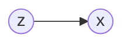

# 期望最大

期望最大算法的目的是解决具有隐变量的混合模型的参数估计（最大似然估计）。

## 1. 推导

### 1.1. 迭代

已知，MLE 对 $p(x ∣ θ)$ 参数的估计记为

$$
θ_\mathrm{MLE} = \underset{θ}{\mathrm{argmax}}\ \log p(x ∣ θ)
$$

EM 算法对这个问题的解决方法是采用迭代

$$
θ^{t+1} = \underset{θ}{\mathrm{argmax}}\ ∫_z\log \big[p(x, z ∣ θ)\big]p(z ∣ x, θ^t)dz= \mathrm{E}_{z ∣ x, θ^t}[\log p(x, z ∣ θ)]
$$

这个公式包含了迭代的两步

1. E step：计算 $\log p(x, z ∣ θ)$ 在概率分布 $p(z ∣ x, θ^t)$ 下的期望
2. M step：计算使这个期望最大化的参数得到下一个 EM 步骤的输入

求证：$\log p(x ∣ θ^t)≤\log p(x ∣ θ^{t+1})$

> 证明：$\log p(x ∣ θ) = \log p(z, x ∣ θ)-\log p(z ∣ x, θ)$，对左右两边求积分

- 左边

$$
∫_zp(z ∣ x, θ^t)\log p(x ∣ θ)dz= \log p(x ∣ θ)
$$

- 右边

$$
∫_zp(z ∣ x, θ^t)\log p(x, z ∣ θ)dz- ∫_zp(z ∣ x, θ^t)\log p(z ∣ x, θ)dz=Q(θ, θ^t)-H(θ, θ^t)
$$

故

$$
\log p(x ∣ θ) = Q(θ, θ^t) - H(θ, θ^t)
$$

由于 $Q(θ, θ^t) = ∫_zp(z ∣ x, θ^t)\log p(x, z ∣ θ)dz$，而 $θ^{t+1} = \underset{θ}{\mathrm{argmax}}\ ∫_z\log \big[p(x, z ∣ θ)\big]p(z ∣ x, θ^t)dz$

故

$$
Q(θ^{t+1}, θ^t) ≥ Q(θ^t, θ^t)
$$

要证 $\log p(x ∣ θ^t) ≤ \log p(x ∣ θ^{t+1})$，需证：$H(θ^t, θ^t) ≥ H(θ^{t+1}, θ^t)$：

$$
\begin{aligned}
H(θ^{t+1}, θ^t)-H(θ^t, θ^t) &= ∫_zp(z ∣ x, θ^t)\log p(z ∣ x, θ^{t+1})dz- ∫_zp(z ∣ x, θ^t)\log p(z ∣ x, θ^t)dz\\
&= ∫_zp(z ∣ x, θ^t)\log\frac{p(z ∣ x, θ^{t+1})}{p(z ∣ x, θ^t)}\\
&= -\mathrm{KL}(p(z ∣ x, θ^t),p(z ∣ x, θ^{t+1}))< 0
\end{aligned}
$$

综上

$$
\log p(x ∣ θ^t) ≤ \log p(x ∣ θ^{t+1})
$$

根据上面的证明，我们看到，似然函数在每一步都会增大。

### 1.2. ELBO

我们看 EM 迭代过程中的式子是怎么来的

$$
\log p(x ∣ θ) = \log p(z, x ∣ θ)-\log p(z ∣ x, θ) = \log \frac{p(z, x ∣ θ)}{q(z)}-\log \frac{p(z ∣ x, θ)}{q(z)}
$$

分别对两边求期望 $\mathrm{E}_{q(z)}$

- 左边

$$
∫_zq(z)\log p(x ∣ θ)dz= \log p(x ∣ θ)
$$

- 右边

$$
∫_zq(z)\log \frac{p(z, x ∣ θ)}{q(z)}dz - ∫_z q(z) \log \frac{p(z ∣ x, θ)}{q(z)}dz = \mathrm{ELBO} + \mathrm{KL}(q(z),p(z ∣ x, θ))
$$

其中，ELBO（Evidence Lower Bound），是一个下界，故 $\log p(x ∣ θ) ≥ ELBO$，等于号取在 KL 散度为 0 时，即：$q(z) = p(z ∣ x, θ)$。

EM 算法的目的是将 ELBO 最大化，根据上面的证明过程，在每一步 EM 后，求得了最大的 ELBO，并根据这个使 ELBO 最大的参数代入下一步中

$$
\begin{aligned}
θ̂ &= \underset{θ}{\mathrm{argmax}}\ \mathrm{ELBO}\\
&= \underset{θ}{\mathrm{argmax}}\ ∫_zq(z)\log\frac{p(x, z ∣ θ)}{q(z)}dz
\end{aligned}
$$

由于 $q(z)=p(z ∣ x, θ^t)$ 的时候，这一步的最大值才能取等号，故

$$
\begin{aligned}
θ̂ &= \underset{θ}{\mathrm{argmax}}\ \mathrm{ELBO} \\
&= \underset{θ}{\mathrm{argmax}}\ ∫_zq(z) \log \frac{p(x, z ∣ θ)}{q(z)}dz \\
&= \underset{θ}{\mathrm{argmax}}\ ∫_zp(z ∣ x, θ^t)\log\frac{p(x, z ∣ θ)}{p(z ∣ x, θ^t)}dz\\
&= \underset{θ}{\mathrm{argmax}}\ ∫_z p(z ∣ x, θ^t)\log p(x, z ∣ θ)
\end{aligned}
$$

这个式子就是上面 EM 迭代过程中的式子。

从 Jensen 不等式出发，也可以导出这个式子

$$
\begin{aligned}
\log p(x ∣ θ)
&= \log∫_zp(x, z ∣ θ)dz \\
&= \log∫_z\frac{p(x, z ∣ θ)q(z)}{q(z)}dz\\
&= \log \mathrm{E}_{q(z)}[\frac{p(x, z ∣ θ)}{q(z)}] ≥ \mathrm{E}_{q(z)}[\log\frac{p(x, z ∣ θ)}{q(z)}]
\end{aligned}
$$

其中，右边的式子就是 ELBO，等号在 $p(x, z ∣ θ) = Cq(z)$ 时成立。于是

$$
∫_zq(z)dz= \frac{1}{C} ∫_zp(x, z ∣ θ)dz = \frac{1}{C}p(x ∣ θ)=1\\
↓\\
q(z) = \frac{1}{p(x ∣ θ)}p(x, z ∣ θ)=p(z ∣ x, θ)
$$

我们发现，这个过程就是上面的最大值取等号的条件。

## 2. 广义 EM

EM 模型解决了概率生成模型的参数估计的问题，通过引入隐变量 $z$，来学习 $θ$，具体的模型对 $z$ 有不同的假设。对学习任务 $p(x ∣ θ)$，就是学习任务 $\frac{p(x, z ∣ θ)}{p(z ∣ x, θ)}$。在这个式子中，我们假设了在 E 步骤中，$q(z)=p(z ∣ x, θ)$，但是这个$p(z ∣ x, θ)$ 若无法求解，则必须使用采样（MCMC）或变分推断等方法来近似推断这个后验。我们观察 KL 散度的表达式，为了最大化 ELBO，在固定的 $θ$ 时，我们需要最小化 KL 散度，于是

$$
q̂(z) = \underset{q}{\mathrm{argmin}}\ \mathrm{KL}(p,q) = \underset{q}{\mathrm{argmax}}\ \mathrm{ELBO}
$$

这就是广义 EM 的基本思路

- E step

$$
q̂^{t+1}(z) = \underset{q}{\mathrm{argmax}}\ ∫_zq^t(z)\log\frac{p(x, z ∣ θ)}{q^t(z)}dz,\ fixed\ θ
$$

- M step

$$
θ̂ = \underset{θ}{\mathrm{argmax}}\ ∫_zq^{t+1}(z)\log\frac{p(x, z ∣ θ)}{q^{t+1}(z)}dz,\ fixed\ q̂
$$

对上面的积分

$$
\mathrm{ELBO} = ∫_z q(z)\log\frac{p(x, z ∣ θ)}{q(z)}dz = \mathrm{E}_{q(z)}\big[p(x, z ∣ θ)\big] + \mathrm{Entropy}(q(z))
$$

因此，广义 EM 相当于在原来的式子中加入熵这一项。

## 3. GMM 加权平均

为了解决高斯模型的单峰性的问题，我们引入多个高斯模型的加权平均来拟合多峰数据

$$
p(x) = ∑_{k=1}^k α_k N(μ_k, Σ_k)
$$

引入隐变量 $z$，这个变量表示对应的样本 $x$ 属于哪一个高斯分布，这个变量是一个离散的随机变量：

$$
p(z=i) = p_i, ∑_{i=1}^{k} p(z=i) = 1
$$

作为一个生成式模型，高斯混合模型通过隐变量 $z$ 的分布来生成样本。用概率图来表示

其中，节点 $z$ 就是上面的概率，$x$ 就是生成的高斯分布。于是对 $p(x)$，有

$$
\begin{aligned}
p(x)
&= ∑_zp(x, z)\\
&= ∑_{k=1}^k p(x, z=k) \\
&= ∑_{k=1}^k p(z=k)p(x ∣ z=k)
\end{aligned}
$$

因此

$$
p(x) = ∑_{k=1}^k p_kN(x ∣ μ_k, Σ_k)
$$

### 3.1. MLE

样本为 $X=(x_1, x_2, ⋯, x_N)$，$(X,Z)$ 为完全参数，参数为 $θ = \{p_1,p_2, ⋯,p_k, μ_1, μ_2, ⋯, μ_kΣ_1, Σ_2, ⋯, Σ_k\}$。

通过 MLE 得到 $θ$

$$
\begin{aligned}
θ_\mathrm{MLE}
&= \underset{θ}{\mathrm{argmax}}\log p(X)\\
&= \underset{θ}{\mathrm{argmax}}\ ∑_{i=1}^n\log p(x_i) \\
&= \underset{θ}{\mathrm{argmax}∑}_{i=1}^n\log ∑_{k=1}^k p_kN(x_i|μ_k, Σ_k)
\end{aligned}
$$

这个表达式直接通过求导，由于连加号的存在，无法得到解析解。因此需要使用 EM 算法。

### 3.2. 求解

套用 GMM 的表达式，对数据集

$$
\begin{aligned}
Q(θ, θ^t)
&= ∑_z[\log ∏_{i=1}^n p(x_i,z_i ∣ θ)]∏_{i=1}^n p(z_i | x_i, θ^t) \\
&= ∑_z[∑_{i=1}^n\log p(x_i,z_i ∣ θ)]∏_{i=1}^n p(z_i | x_i, θ^t)
\end{aligned}
$$

对于中间的那个求和号展开，第一项为

$$
\begin{aligned}
∑_z\log p(x_1,z_1 ∣ θ)∏_{i=1}^n p(z_i | x_i, θ^t)
&= ∑_z\log p(x_1,z_1 ∣ θ)p(z_1 ∣ x_1, θ^t)∏_{i=2}^n p(z_i | x_i, θ^t) \\
&= ∑_{z_1}\log p(x_1,z_1 ∣ θ) p(z_1 ∣ x_1, θ^t)∑_{z_2, ⋯,z_k} ∏_{i=2}^n p(z_i | x_i, θ^t) \\
&= ∑_{z_1}\log p(x_1,z_1 ∣ θ)p(z_1 ∣ x_1, θ^t)
\end{aligned}
$$

类似地，$Q$ 可以写为

$$
Q(θ, θ^t) = ∑_{i=1}^n ∑_{z_i}\log p(x_i,z_i ∣ θ)p(z_i | x_i, θ^t)
$$

对 $p(x, z ∣ θ)$

$$
p(x, z ∣ θ)=p(z ∣ θ)p(x ∣ z, θ)=p_zN(x ∣ μ_z, Σ_z)
$$

对 $p(z ∣ x, θ^t)$

$$
p(z ∣ x, θ^t) = \frac{p(x, z ∣ θ^t)}{p(x ∣ θ^t)} = \frac{p_z^t N(x ∣ μ_z^t, Σ_z^t)}{∑_k p_k^t N(x ∣ μ_k^t, Σ_k^t)}
$$

代入 $Q$

$$
Q = ∑_{i=1}^n ∑_{z_i}\log p_{z_i}\mathscr{N(x_i|μ_{z_i}, Σ_{z_i})}\frac{p_{z_i}^tN(x_i|μ_{z_i}^t, Σ_{z_i}^t)}{∑_kp_k^tN(x_i|μ_k^t, Σ_k^t)}
$$

下面需要对 $Q$ 值求最大值

$$
Q = ∑_{k=1}^k∑_{i=1}^n[\log p_k+\log N(x_i|μ_k, Σ_k)]p(z_i=k ∣ x_i, θ^t)
$$

- $p_k^{t+1}$

$$
p_k^{t+1} = \underset{p_k}{\mathrm{argmax}}\ ∑_{k=1}^k ∑_{i=1}^n[\log p_k + \log N(x_i|μ_k, Σ_k)]p(z_i=k ∣ x_i, θ^t)\ s.t.\ ∑_{k=1}^k p_k=1
$$

即

$$
p_k^{t+1} = \underset{p_k}{\mathrm{argmax}}\ ∑_{k=1}^k∑_{i=1}^n\log p_kp(z_i=k ∣ x_i, θ^t)\\
s.t.\ ∑_{k=1}^k p_k=1
$$

引入 Lagrange 乘子

$$
L(p_k,λ) = ∑_{k=1}^k ∑_{i=1}^n \log p_k p(z_i=k ∣ x_i, θ^t) - λ(1 - ∑_{k=1}^k p_k)
$$

故

$$
\frac{∂}{∂p_k} L = ∑_{i=1}^n \frac{1}{p_k}p(z_i=k ∣ x_i, θ^t) + λ = 0\\
↓\\
∑_k ∑_{i=1}^n \frac{1}{p_k}p(z_i=k ∣ x_i, θ^t) + λ ∑_kp_k = 0\\
↓\\
λ = - N
$$

于是有

$$
p_k^{t+1} = \frac{1}{N} ∑_{i=1}^n p(z_i=k ∣ x_i, θ^t)
$$

- $μ_k, Σ_k$，这两个参数是无约束的，直接求导即可。
