# 高斯过程

## 1. 线性模型及其扩展

对于建模，我们有一个通式

$$
θ = ψ(ϕ(X) β)
$$

其中，$θ$是某个概率分布的参数，例如，高斯的均值，二项式的$p$参数，Poisson 分布的速率等等。我们把$ψ$称为逆链接函数，$ϕ$是一个函数，是平方根或多项式函数。对于简单的线性回归情况，$ψ$是恒等函数（identity function）。

拟合（或学习）一个贝叶斯模型可看作是寻找权重$β$的后验分布，故，这被称为近似函数的权重观。以多项式回归为例，通过令$ϕ$为一个非线性函数，我们可将输入映射到一个特征空间。然后我们在特征空间中拟合一个线性关系，而这个线性关系在实际空间中不是线性的。我们看到，通过使用适当项数的多项式，我们可完美拟合任何函数。但，除非我们应用某种形式的正则化（例如，使用先验分布），否则将导致记忆数据的模型。

高斯过程为任意函数建模提供了一个原则性的解决方案，它有效地让数据决定了函数的复杂性，同时最小化了过拟合的机率。

## 2. 建模函数

讨论高斯过程时，我们将首先描述一种将函数表示为概率对象的方法。我们可把一个函数$f$看作是一组输入$x$到一组输出$y$的映射。故，我们可写成

$$
y = f(x)
$$

表示函数的一种方法是为每个$x_i$的值列出对应的$y_i$的值。

一般情况下，$x$和$y$的值会在实线上；故，我们可把一个函数看作是一个（潜在的）无限的、有序的$(x_i, y_i)$配对值的列表。顺序是很重要的，因为若我们将这些值洗牌，我们将得到不同的函数。
一个函数也可表示为一个（潜在的）无限数组，这个数组以$x$的值为索引，重要的区别在于$x$的值并不限于整数，但它们可是实数。

使用这些描述，我们可用数字表示任何我们想要的特定函数。但若我们想用概率表示函数呢？好吧，我们可通过让映射具有概率性质来实现。让我来解释一下；我们可让每个$y_i$的值是一个随机变量，以高斯型分布，具有给定的均值和方差。这样，我们就不再是对一个单一的具体函数的描述，而是对一个分布家族的描述。

### 2.1. 高斯函数

下图表明，使用高斯分布的样本对函数进行编码并不是则愚蠢。尽管如此，用于生成图的方法是有限的，且不够灵活。虽然我们期望真实的函数有一些结构或模式，但我们表达第一个函数的方式并不能让我们编码数据点之间的任何关系。事实上，每个点是完全独立于其他点的，因为我们只是把它们作为 10 个独立的样本从一个共同的一维高斯分布中得到。对于第二个函数，我们引入一些依赖性。点$y_{i+ 1}$的均值就是$y_i$的值。

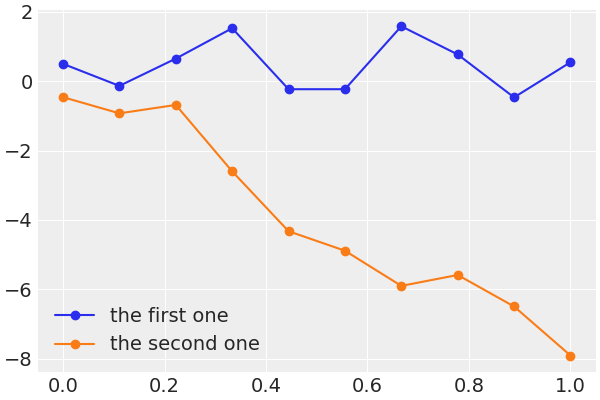

我们可用高斯来表示一个一维函数，以获得$n$个样本。也可使用 $n$ 维多元高斯分布来获得一个长度为$n$的向量。这样 10 个点中的每个点的方差均是 1，它们之间的方差（也就是它们的协方差）是 0（故，它们是独立的）。若我们把这些 0 换成其他（正）数，我们就可得到协方差。故，为了用概率论的方式来表示函数，我们只需要一个具有合适协方差矩阵的多变量高斯。

### 2.2. 协方差

在实践中，协方差矩阵是用称为核的函数来指定的。这里使用的核基本上是一个对称函数，它接受两个输入，并在输入相同的情况下返回一个零值，否则返回一个正值。若满足这些条件，我们就可将内核函数的输出解释为两个输入之间相似性的度量。

一个常用的内核是指数化二次型内核

$$
K(x, x^{′}) = \exp \bigg(-\frac{∥x - x^{′}∥^2}{2 ℓ^2} \bigg)
$$

其中，$∥x - x^{′}∥^2$是欧几里得距离的平方。

$$
∥x - x^{′}∥^2 = ∑(x_i - x_i^{′})^2
$$

乍一看可能并不明显，但指数二次核的公式与高斯分布相似。由于这个原因，人们把这个核称为高斯核。$ℓ$被称为长度标度（或带宽或方差），控制着内核的宽度。

下图是为了展示不同输入的协方差矩阵是如何出现的。左边的面板显示了输入，x 轴上的数值代表每个数据点的数值，文字注释显示了数据点的顺序（从零开始）。在右侧面板上，热图代表使用指数化二次核得到的协方差矩阵。颜色越浅意味着协方差越大。热图是对称的，对角线的数值较大。协方差矩阵中每个元素的值与点之间的距离成反比，因为对角线是每个数据点与自身比较的结果。我们得到最接近的距离，为 0，而这个核的协方差值较高，为 1。对于其他的核来说，其他的值亦为可的。

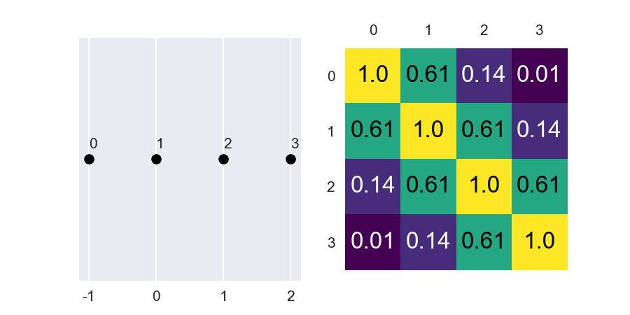

> 核是将数据点沿 x 轴的距离转化为预期函数值的协方差值（在 y 轴上）。故，最接近的两个点在 x 轴上；最相似的我们期望其值在 y 轴上。

正如所看到的，一个高斯核意味着各种各样的函数，参数$ℓ$的值越大，函数越平滑。

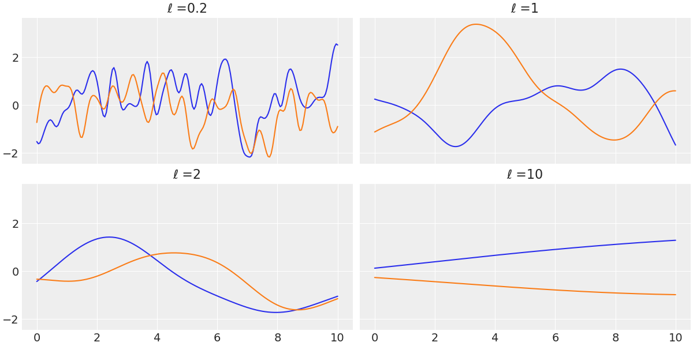

### 2.3. 正式定义

高斯过程（GP）的取自维基百科的定义，如下

"以时间或空间为索引的随机变量集合，这些随机变量的每个有限集合都具有多变量高斯分布，即它们的每个有限线性组合均是高斯分布"

理解 GP 的诀窍在于认识到 GP 的概念是一个心理（和数学）脚手架。因为在实践中，我们不需要直接处理这个无限的数学对象。相反，我们只在我们有数据的地方评估 GP。通过这样做，我们将无限维的 GP 折叠成一个有限的多变量高斯分布，其维度与数据点一样多。在数学上，这种折叠是通过对无限未观测维度的边际化来实现的。理论保证我们可省略（实际上是边际化）所有的点，除了那些我们正在观察的点。它还保证我们将始终得到一个多变量的高斯分布。故，我们可严格地将上一个图解释为来自高斯过程的实际样本。请注意，我们将多元高斯的均值设为零，只使用协方差矩阵，通过指数化二次核来建立函数模型。在处理高斯过程时，将多元高斯的均值设为零是常见的做法。

> 高斯过程对于建立贝叶斯非参数模型很有用，因为我们可将其作为函数的先验分布。

## 3. 高斯过程回归

### 3.1. 建模

设我们可将$y$作为$x$加上一些噪声的函数$f$来建模。

$$
y ∼ N (μ = f(x), σ=ϵ)
$$

其中，$ϵ ∼ (0, σ_{ϵ})$。现在我们将在$f$上设置一个先验分布。高斯过程可作为这样的先验分布，因此我们可写出

$$
f(x) ∼ \mathscr{GP} (μ_x, K(x, x^{′}))
$$

其中，$\mathscr{GP}$代表一个高斯过程分布，$μ_x$是均值函数，$K(x, x^{′})$是核函数或协方差函数。在这里，我们用函数这个词来表示，在数学上，均值和协方差是无限的对象，即使在实践中，我们总是在处理有限的对象。若先验分布是 GP，似然是高斯分布，则后验亦为 GP，我们可分析计算。

$$
\begin{gather}
  p(f(X_{*}) |X_{*}, X, y) ∼ N(μ, Σ) \\
  μ = K_{*}^{⊤} K^{-1} y \\
  Σ = K_{* *} - K_{*}^{⊤} K^{-1} K_{*}
\end{gather}
$$

这里，

- $K = K(X, X)$
- $K_{*} = K(X_{*}, X)$
- $K_{* *} = K(X_{*}, X_{*})$

$X$是观察到的数据点，$K_{*}$代表测试点；也就是我们想知道来推断函数值的新点。

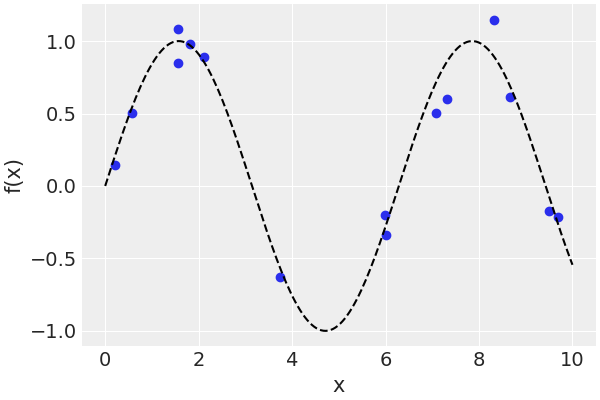

上图中，我们看到真正的未知函数是一条黑色的虚线，而圆点代表未知函数的样本（有噪声）。

请注意，为了将方程$(3.3)$编码到 PyMC3 模型中，我们只需要找出参数$ϵ$、正态似然的方差$ℓ$和指数化二次核的长度标度参数。

请注意，我们使用了 `gp.marginal_likelihood` 方法，而不是像表达式所预期的那样，使用正态似然。因为边际似然是似然和先验的积分

$$
p(y ∣ X, θ) ∼ ∫p(y ∣ f, X, θ) p(f |X, θ) df
$$

其中，$θ$代表所有未知参数，$x$是自变量，$y$是因变量。请注意，我们正在对函数$f$的值进行边际化，对于 GP 先验和正态似然，边际化可通过分析进行。通常情况下，对于长度标度的参数，避开零的先验效果更好。对于$ℓ$来说，一个有用的默认前值是 `pm.Gamma(2, 0.5)` 。

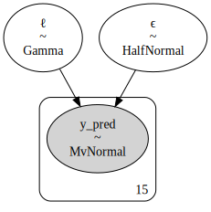

### 3.2. 预测

现在我们已经找到了$ℓ$和$ϵ$的值，我们可能想从 GP 后验中得到样本，也就是函数拟合数据的样本。我们可通过使用 `gp.conditional` 函数计算在新输入位置上评估的条件分布来实现。

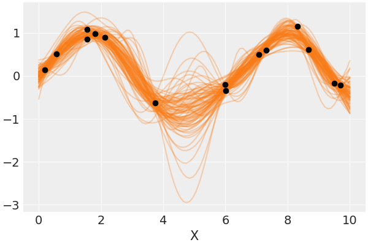

结果，我们得到一个新的 PyMC3 随机变量 `f_pred`，我们可用它来从后验预测分布中获取样本（在 `X_new` 值处评估）。这里，也可使用 `pm.gp.util.plot_gp_dist` 函数。每张图代表一个百分位数，范围从 51（浅色）到 99（深色）。

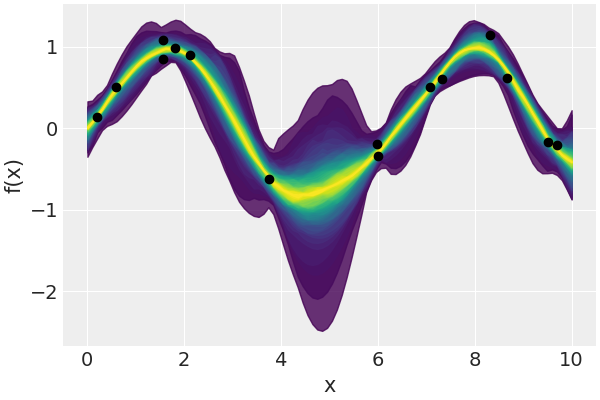

另一种选择是计算参数空间中给定点的条件分布的平均向量和标准差。下面，我们使用$ℓ$和$ϵ$的均值（在跟踪的样本上）。我们可使用 `gp.predict` 函数来计算均值和方差，因为 PyMC3 已经分析计算了后验。

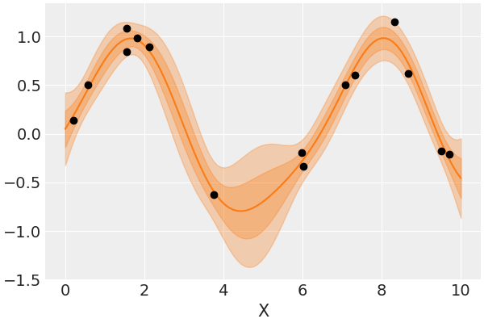

我们可使用具有非高斯似然和适当逆链接函数的线性模型来扩展线性模型的范围。我们也可为 GP 做同样的事情。例如，可使用具有指数逆链接函数的 Poisson 似然。对于这样的模型，后验不再是可分析的，但，我们还是可用数值方法来逼近它。

### 3.3. 空间自相关

我们有 10 个不同的岛屿社会；对于每个岛屿社会，我们都有他们使用的工具数量。一些理论预测，较大的人口比较小的人口更容易开发和维护工具。另一个重要的因素是人口之间的接触率。

由于工具数量作为因变量，我们可用人口作为自变量进行 Poisson 回归。事实上，我们可使用人口的对数，因为真正重要的是人口的数量级而不是绝对规模。将接触率纳入我们的模型的一种方法是收集这些社会在历史上的接触频率信息，并创建一个分类变量，如低/高接触率。另一种方法是使用社会之间的距离作为接触率的代用词，因为我们可合理地假设，最近的社会比远处的社会接触得更频繁。

在人口数据中，我们只使用 `culture` 、 `total-tools` 、 `lat` 、 `lon2` 和 `logpop` 这几列。

|       |  culture   | population | contact | total_tools | mean_TU |  lat  |  lon  | lon2  | logpop  |
| :---: | :--------: | :--------: | :-----: | :---------: | :-----: | :---: | :---: | :---: | :-----: |
|   0   |  Malekula  |    1100    |   low   |     13      |   3.2   | -16.3 | 167.5 | -12.5 | 7.00307 |
|   1   |  Tikopia   |    1500    |   low   |     22      |   4.7   | -12.3 | 168.8 | -11.2 | 7.31322 |
|   2   | Santa Cruz |    3600    |   low   |     24      |    4    | -10.7 |  166  |  -14  | 8.18869 |
|   3   |    Yap     |    4791    |  high   |     43      |    5    |  9.5  | 138.1 | -41.9 | 8.47449 |
|   4   |  Lau Fiji  |    7400    |  high   |     33      |    5    | -17.7 | 178.1 | -1.9  |         |

这里，省略了$α$和$β$的先验，以及内核的超先验。$x$是对数人口，$y$是工具的总数。

$$
\begin{gather}
  f ∼ \mathscr{GP} (\big[0, ⋯, 0\big], K(x, x^{′} )) \\
  μ ∼ \mathrm{E}(α + βx + f) \\
  y ∼ \mathrm{Poi}(μ)
\end{gather}
$$

这基本上是一个新的 Poisson 回归模型，线性模型中的一个项$f$来自于 GP。为了计算 GP 的核，将使用距离矩阵 `islands_dist` 。通过这种方式，将有效地纳入技术暴露的相似性度量。故，我们将不设总数量只是人口的结果，而独立于一个社会和近邻，我们将把每个社会的工具数量作为其地理相似性的函数来建模。

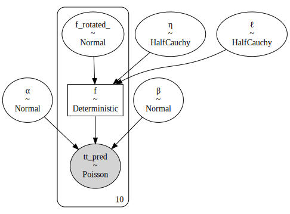

为了了解协方差函数在距离方面的后验分布，我们可绘制一些后验分布的样本。

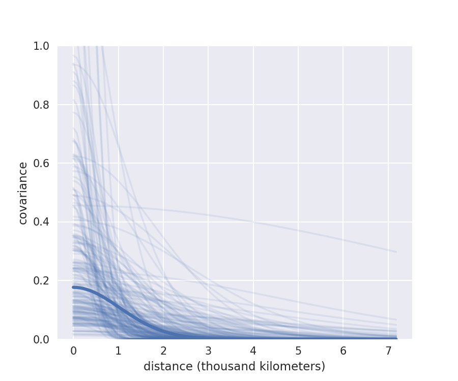

图中的粗线是一对社会之间的协方差的后验中值，它是距离的函数。我们使用中位数是因为$ℓ$和$η$的分布非常倾斜。可看到，平均而言，协方差并不高，且，在大约 2000 公里处，协方差几乎降到了 0。细线代表了不确定性，可看到有很多不确定性。

我们现在要根据模型来探讨岛屿 - 社会之间的相关性有多强。为了做到这一点，我们必须将协方差矩阵变成一个相关矩阵。

可得到两个观察结果是，夏威夷是非常孤独的。另外，马利库拉（Ml）、蒂科皮亚（Ti）和圣克鲁斯（SC），彼此高度相关。这是有道理的，因为这些社会离得很近，且，他们的工具数量也差不多。

现在我们要利用经纬度信息来绘制岛屿 - 社会的相对位置。

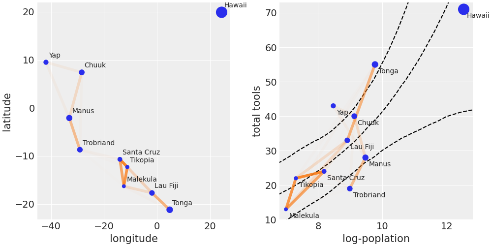

左图显示了在相对地理位置的背景下计算的社会之间的后验中位数相关性的线条。有些线条不可见，因为我们已经使用相关性来设置线条的不透明度。右图中，显示了后验中位数的相关性。虚线代表工具数量的中位数和 HPD 94% 区间作为对数人口的函数。两图中，点的大小与每个岛屿社会的人口成正比。

Malekula、Tikopia 和 Santa Cruz 之间的相关性如何描述了这样一个事实，即他们的工具数量相当低，接近中位数或低于其人口的预期工具数量。Trobriands 和 Manus 也发生了类似的情况；他们在地理上很接近，但他们的工具数量比预期的人口数量要少。Tonga 的工具数量比预期的人口数量要多，而与 Lua Fiji 的相关性相对较高。在某种程度上，该模型告诉我们，Tonga 对 Lua Fiji 有积极影响，增加了工具总数，抵消了它对近邻 Malekula、Tikopia 和 Santa Cruz 的影响。

## 4. 高斯过程分类

### 4.1. 逻辑回归

高斯过程不仅限于回归，也可用于分类。我们将从最简单的分类问题开始：两个类，`setosa` 和 `versicolor`，只有一个独立变量，`sepal_length` 。我们将用数字 0 和 1 对分类变量 `setosa` 和 `versicolor` 进行编码。

对于这个模型，我们不使用 `pm.gp.Marginal` 类来实例化 GP 先验，而是使用 `pm.gp.Latent` 类。后者更通用，可用于任何似然。前者仅限于高斯似然。

> `pm.gp.Marginal` 利用 GP 先验与高斯似然结合的数学可操作性，具有更高效的优势。

对于协方差矩阵 `cov`，我们将其建模为三个核的组合，通过添加线性核，来解决肥尾问题。白噪声核只是一个计算技巧，用于稳定协方差矩阵的计算。

现在我们已经找到了$ℓ$的值，我们可能想从 GP 后验中获得样本。就像我们对 `marginal_gp_model` 所做的那样，我们也可借助 `gp.conditional` 函数来计算在一组新输入位置上评估的条件分布。

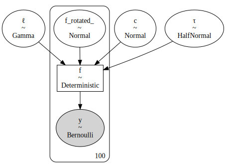

另一方面，高斯过程的核是有限制的，以保证得到的协方差矩阵是正定的。但，数值误差会导致违反这个条件。这个问题的一个表现是，我们在计算拟合函数的后预测样本时，会得到 `nans` 。减轻这种错误的一个方法是通过添加一点噪声来稳定计算。事实上，PyMC3 在引擎下已经做到了这一点，但有时需要多加一点噪声。

为了显示这个模型的结果，我们将使用下面的函数直接从 `f_pred` 中计算出边界决定。

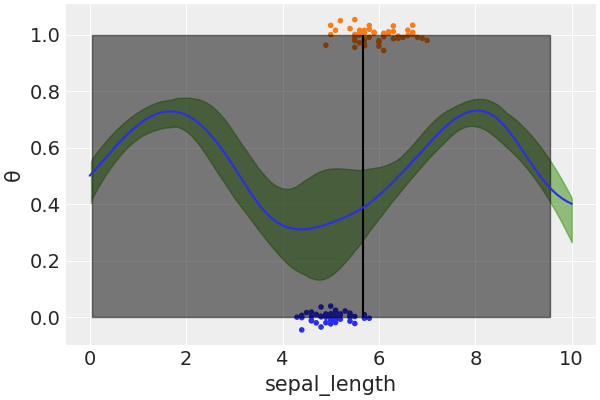

### 4.2. 更复杂的分类

逻辑回归是高斯过程的一个特例，因为简单线性回归只是高斯过程的一个特例。事实上，很多已知的模型都可看作是 GP 的特例，或至少它们与 GP 有某种联系。

在实践中，我们用 GP 来模拟一个我们用逻辑回归就能解决的问题，并没有太大意义。相反，我们希望用 GP 来模拟一些比较复杂的数据，而这些数据是不太灵活的模型所不能很好地捕捉到的。例如，设我们想将患某种疾病的概率作为年龄的函数来建模。结果发现，非常年轻和非常年长的人比中年人的风险更高。数据集 `space_flu.csv` 是受前面描述的启发而伪造的数据集。

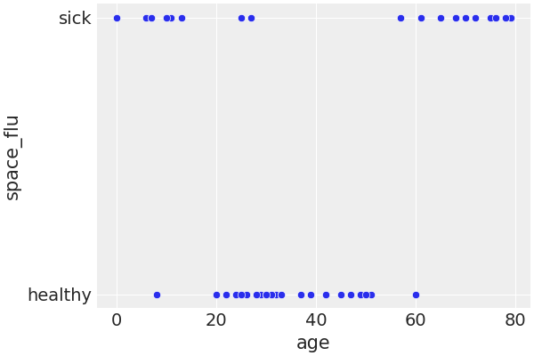

现在我们为 `model_space_flu` 生成后验预测样本，然后绘制结果。

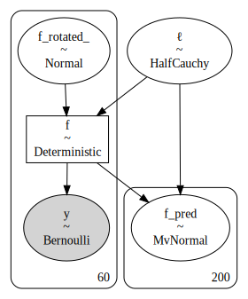

GP 能够很好地拟合这个数据集，即使数据要求函数比逻辑函数更复杂。对于简单的逻辑回归来说，要想很好地拟合这个数据是不可能的，除非我们引入一些特别的修改。

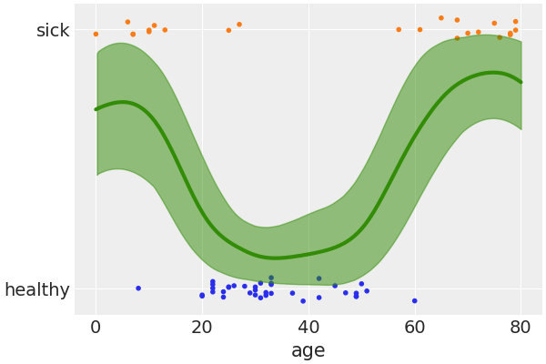

## 5. 考克斯过程

现在让我们回到对计数数据建模的例子。我们将看到两个例子；一个是时间变化的速率，一个是 2D 空间变化的速率。为了做到这一点，我们将使用 Poisson 似然，速率将使用高斯过程建模。由于 Poisson 分布的速率仅限于正值，我们使用指数作为逆链接函数。

在文献中，速率也以强度的名称出现，故，这类问题被称为强度估计，这类模型通常被称为考克斯模型。考克斯模型是 Poisson 过程的一种，速率本身是一个随机过程。正如高斯过程是一个随机变量的集合，其中这些随机变量的每个有限集合都具有多变量高斯分布一样，Poisson 过程是一个随机变量的集合，其中，这些随机变量的每个有限集合都具有 Poisson 分布。我们可把 Poisson 过程看成是给定空间中点的集合上的分布。当 Poisson 过程的速率本身是一个随机过程时，就有考克斯过程（Cox process）。

### 5.1. 煤矿灾难

采煤灾难包括 1851 年至 1962 年英国的采煤灾难记录。灾难的数量被认为是受这一时期安全法规变化的影响。我们希望将灾难发生率作为时间的函数进行建模。我们的数据集由一列组成，每个条目对应于灾难发生的时间。

我们用于拟合 `coal_df` 数据框的模型是

$$
\begin{aligned}
  f(x) &∼ \mathscr{GP} (μ_x, K(x, x^{′})) \\
  y &∼ Poi(f(x))
\end{aligned}
$$

这是一个 Poisson 回归问题。在这一点上，若我们只有一列，只有灾害的日期，我们如何执行回归？答案是对数据进行离散化处理，就像建立一个直方图一样。我们将使用 `bin` 的中心作为变量 $x$，而每个 `bin` 的计数作为变量$y$。

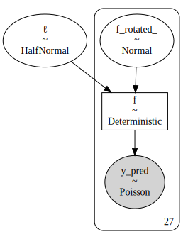

下图用一条白线显示了灾害率中值随时间变化的情况。带状线描述了 50% HPD 区间（较深）和 94% HPD 区间（较浅）。可看到，事故率随着时间的推移而降低，除了最初的短暂增加。请注意，即使我们对数据进行了分层，结果也得到了一条平滑的曲线。在这个意义上，我们可把 `model_coal` 这种类型的模型看作是建立一个直方图，然后平滑它。

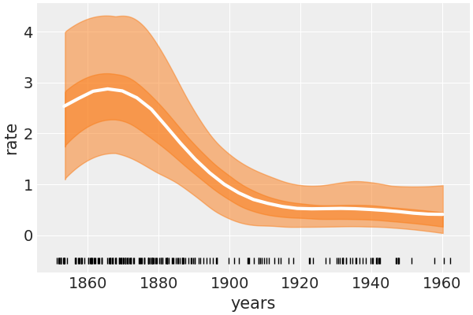

### 5.2. 红木

现在我们将刚才的同类型模型应用到二维空间问题上，使用红木数据。数据集由给定区域内红木树的位置组成。推理的动机是确定树木的速率在这个区域是如何分布的。

载入后，对数据离散化

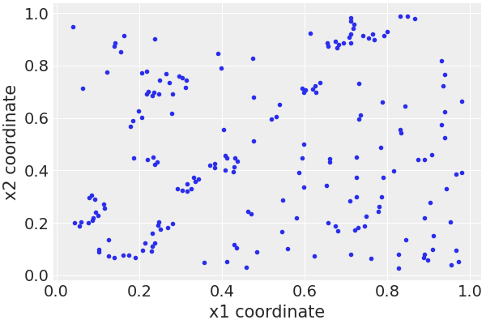

请注意，我们没有做筛网（mesh grid），而是将 $x_1$ 和 $x_2$ 数据分开处理。这使得我们可为每个坐标建立一个协方差矩阵，有效地减少了计算 GP 所需矩阵的大小。我们只需要在使用 `LatentKron` 类来定义 GP 时注意。需要注意的是，这不是一个数值技巧，而是这类矩阵结构的数学属性，故我们并没有在模型中引入任何近似或误差。我们只是用一种可加快计算速度的方式来表达。

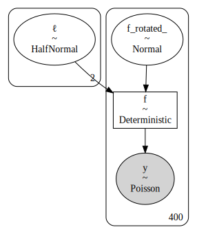

|              | mean  |  sd   | hdi3% | hdi_97% | mcse_mean | mcse_sd | ess_bulk | ess_tail | r_hat |
| :----------: | :---: | :---: | :---: | :-----: | :-------: | :-----: | :------: | :------: | :---: |
| ℓ\big[0\big] | 0.13  | 0.056 | 0.072 |  0.194  |   0.005   |  0.004  |   154    |   130    | 1.01  |
| ℓ\big[1\big] | 0.095 | 0.024 | 0.055 |  0.137  |   0.002   |  0.001  |   154    |   298    | 1.01  |

图中，浅色的树木比深色的树木生长率高。我们可想象，我们对寻找高生长率区感兴趣，因为我们可能对木材如何从火灾中恢复感兴趣，或我们可能对土壤的特性感兴趣，我们用树木作为近似（proxy）。

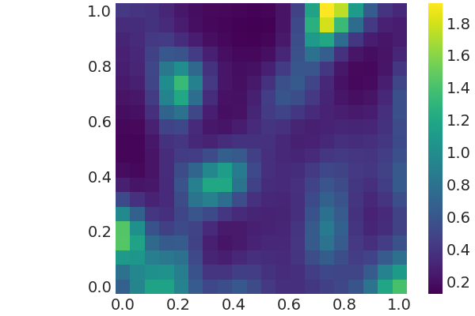
