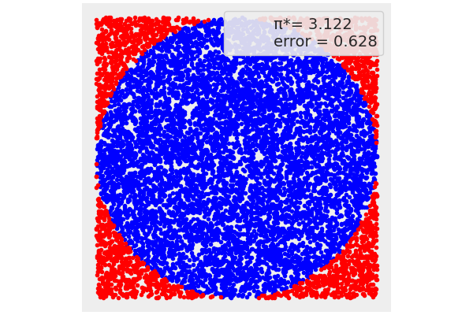
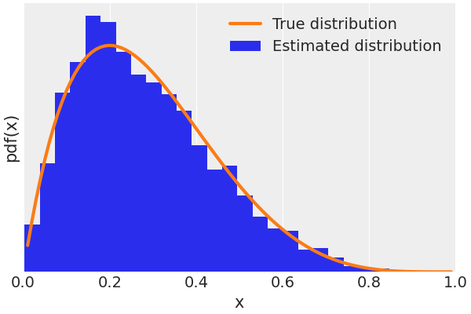
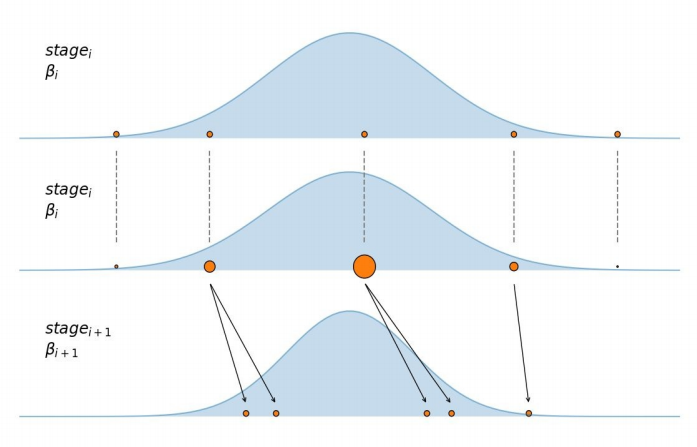
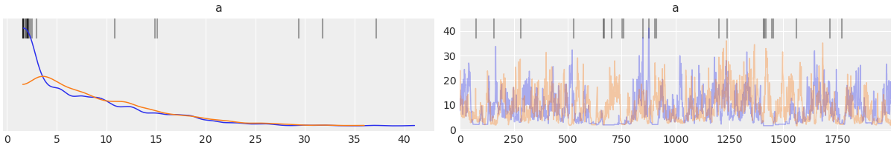
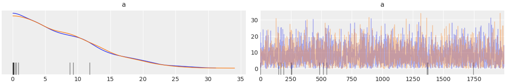
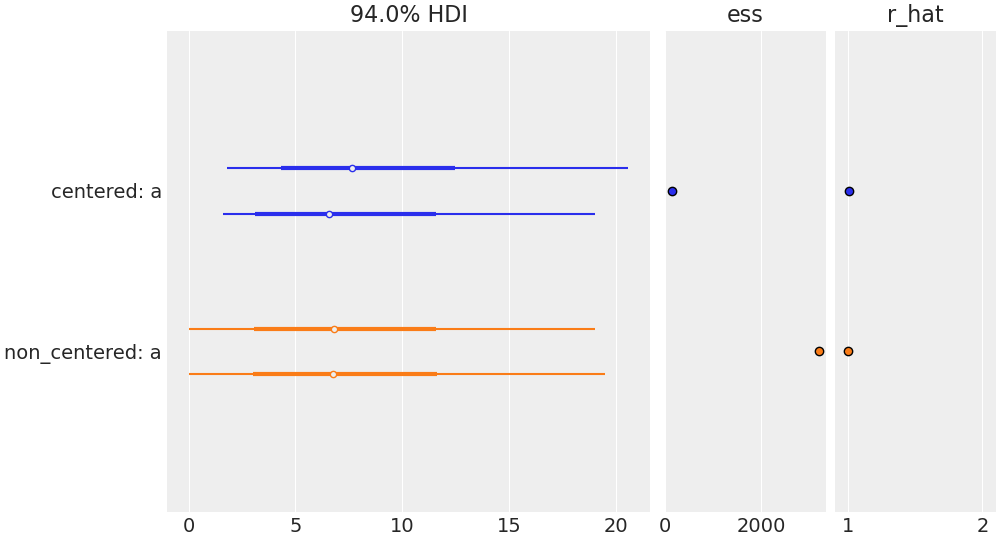
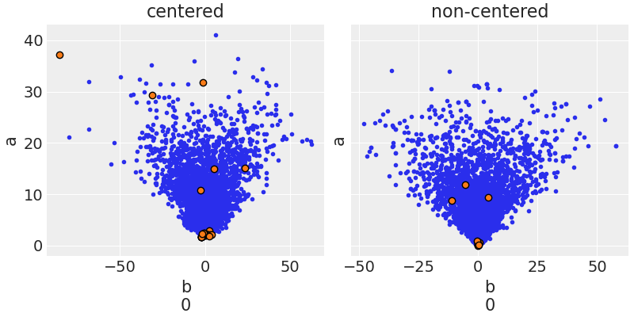
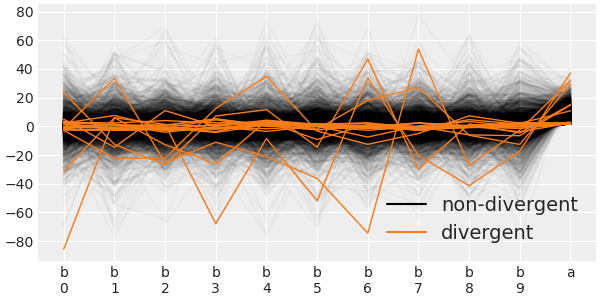

# Markov 推断

虽然概念上很简单，但贝叶斯方法在数学上和数值上都很有挑战性。主要原因是边际似然，通常使用难以解决或计算成本高的积分形式。由于这个原因，后验通常使用 Monte Carlo-Markov Chain（MCMC）家族的算法或变分算法进行数值估计。

## 1. 采样

对于采样任务来说，有下面一些常用的场景

- 生成新的样本
- 求和/求积分

采样结束后，我们需要评价采样出来的样本点是不是好的样本集

- 样本趋向于高概率的区域
- 样本之间必须独立

具体采样中，采样是一个困难的过程

1. 无法采样得到归一化因子，即无法直接对概率 $p(x) = \frac{1}{Z}p̂(x)$ 采样，常常需要对 CDF 采样，但复杂的情况不行
2. 若归一化因子可以求得，但是对高维数据依然不能均匀采样（维度灾难），这是由于对 $p$ 维空间，总的状态空间是 $K^p$ 这么大，于是在这种情况下，直接采样也不行

因此需要借助其他手段，如 Monte Carlo 方法中的拒绝采样，重要性采样和 MCMC。

## 2. Monte Carlo

Monte Carlo 方法是一个非常广泛的算法家族，它使用随机采样来计算或模拟一个给定的过程。使用 Monte Carlo 方法计算一个感兴趣的量的一个经典教学实例是数字估计 π。在实践中，这种特殊的计算有更好的方法，但其教学价值仍然存在。

Monte Carlo 方法旨在求得复杂概率分布下的期望值

$$
\mathrm{E}_{z ∣ x}\big[f(z)\big] = ∫ p(z ∣ x)f(z)dz ∼ \frac{1}{N}∑_{i=1}^nf(z_i)
$$

也就是说，从概率分布中取 $N$ 个点，从而近似计算这个积分。采样方法有：

- 概率分布采样

首先求得概率密度的累积密度函数 CDF，然后求得 CDF 的反函数，在 0 到 1 之间均匀采样，代入反函数，就得到了采样点。但是实际大部分概率分布不能得到 CDF。

我们可通过以下程序来估计 π 值

1. 在边长为$2R$的正方形中随机抛出$N$的点。
2. 在正方形中画一个半径为$R$的圆，数一数这个圆内有多少个点。
3. 估计$\hat{π}$的比值，$4 \frac{\mathrm{inside}}{N}$.

- 拒绝采样（Rejection Sampling）

对于概率分布 $p(z)$，引入简单的提议分布 $q(z)$，使得 $∀ z_i,Mq(z_i)≥ p(z_i)$。我们先在 $q(z)$ 中采样，定义接受率：$α= \frac{p(z^i)}{Mq(z^i)} ≤1$。算法描述为：

1. 取 $z^i ∼ q(z)$。
2. 在均匀分布中选取 $u$。
3. 若$u ≤ α$，则接受 $z^i$，否则，拒绝这个值。

- 重要性（Importance Sampling）

直接对期望 $\mathrm{E}_{p(z)}\big[f(z)\big]$ 进行采样

$$
\begin{aligned}
\mathrm{E}_{p(z)}\big[f(z)\big]
&= ∫ p(z)f(z)dz \\
&= ∫ \frac{p(z)}{q(z)}f(z)q(z)dz ∼ \frac{1}{N}∑_{i=1}^nf(z_i)\frac{p(z_i)}{q(z_i)}
\end{aligned}
$$

于是采样在 $q(z)$ 中采样，并通过权重计算和。重要值采样对于权重非常小的时候，效率非常低。重要性采样有一个变种 Sampling-Importance-Resampling，这种方法，首先和上面一样进行采样，然后在采样出来的 $N$ 个样本中，重新采样，这个重新采样，使用每个样本点的权重作为概率分布进行采样。

## 3. MCMC

MCMC 是一种随机的近似推断，其核心就是基于采样的随机近似方法 Monte Carlo 方法。MCMC 方法允许我们从真实的后验分布中获得样本，只要我们能够计算出似然和先验点。MCMC 方法能够从高概率区域抽取比低概率区域更多的样本，会根据参数空间的相对概率访问每个区域。若区域 A 的概率是区域 B 的两倍，则我们从 A 中得到的样本数量将是 B 的两倍。故，即使我们无法分析计算整个后验，我们也可使用 MCMC 方法从中获取样本。

在最基本的层面上，基本上我们在统计学中所关心的一切都与计算期望有关，如

$$
E\big[f\big] = ∫_θ p(θ) f(θ) dθ
\tag{2.1}
$$

用 MCMC 方法，我们用有限样本来逼近方程$(2.1)$

$$
\underset{N → ∞}{\lim} E_π\big[f\big] = \frac{1}{N} ∑_{n=1}^{N} f(θ_n)
\tag{2.2}
$$

方程$(2.2)$的最大问题是，该等式只在渐进的情况下成立。在实践中，我们总是有有限的样本，故，我们希望 MCMC 方法能够尽可能快地收敛正确的答案。一般来说，确定一个 MCMC 的特定样本已经收敛了，并不容易。故，在实践中，我们必须依靠经验测试来确保我们有一个可靠的 MCMC 近似。

### 3.1. Markov 链

Markov 链（Markov chain）是一种时间状态都是离散的随机变量序列，它由一个状态序列和一组描述如何在状态间移动的过渡概率组成。若移动到任何其他状态的概率只取决于当前状态，则这个链就是 Markov 链。给定这样一条链，我们可通过选择一个起点并根据过渡概率移动到其他状态来进行随机游走（random walk）。若我们以某种方式找到了一个 Markov 链，其过渡与我们想要采样的分布成正比（贝叶斯分析中的后验分布），采样就简单地变成了在这个链中的状态之间移动的问题。

我们主要关注的是齐次的一阶 Markov 链。Markov 链满足

$$
p(X_{t+1}|X_1,X_2, ⋯,X_t) = p(X_{t+1}|X_t)
$$

这个式子可以写成转移矩阵的形式

$$
p_{ij} = p(X_{t+1} = j|X_t = i)
$$

我们有

$$
π*{t+1}(x^{*}) = ∫π_i(x)p_{x → x^{*}}dx
$$

### 3.2. 平稳分布

MCMC 就是通过构建 Markov 链概率序列，使其收敛到平稳分布 $p(z)$。

若存在

$$
π = (π(1), π(2), ⋯), ∑_{i=1}^{+∞}π(i) = 1
$$

这个序列就叫 Markov 链 $X_t$的平稳分布，平稳分布就是表示在某一个时刻后，分布不再改变。

定义随机矩阵

$$
Q =
\begin{bmatrix}
Q_{11} &Q_{12} & ⋯ &Q_{1K} \\
⋮ & ⋮ & ⋮ & ⋮\\
Q_{k1} &Q_{k2} & ⋯ &Q_{KK}
\end{bmatrix}
$$

这个矩阵每一行或每一列的和都是 1。随机矩阵的特征值都小于等于 1。假设只有一个特征值为 $λ_i=1$。于是在 Markov 过程中

$$
q^{t+1}(x=j) = ∑_{i=1}^k q^t(x=i)Q_{ij} \\
↓\\
q^{t+1} = q^t⋅Q = q^1Q^t
$$

于是有

$$
q^{t+1} = q^1A λ^t A^{-1}
$$

若$m$足够大，则

$$
λ^m = \mathrm{diag}(0,0, ⋯,1, ⋯,0)\\
↓\\
q^{m+1} =q^m
$$

即趋于平稳分布了。Markov 链可能具有平稳分布的性质，故我们可以构建 Markov 链使其平稳分布收敛于需要的概率分布（设计转移矩阵）。

在采样过程中，需要经历一定的时间（燃烧期/混合时间）才能达到平稳分布。但是 MCMC 方法有一些问题：

1. 无法判断是否已经收敛
2. 燃烧期过长（维度太高，并且维度之间有关，可能无法采样到某些维度），例如在 GMM 中，可能无法采样到某些峰。于是在一些模型中，需要对隐变量之间的关系作出约束，如受限玻尔兹曼机（RBM）假设隐变量之间无关。
3. 样本之间一定是有相关性的，若每个时刻都取一个点，则每个样本一定和前一个相关，这可以通过间隔一段时间采样。

### 3.3. 细致平衡条件

若一开始不知道后验，就需要使用细致平衡条件的东西（detailed balance condition）。直观地说，这个条件说的是我们应该以一种可逆的方式移动（可逆过程是物理学中常见的近似）。即，处于状态和移动到状态的概率应该和处于状态和移动到状态的概率一样。这个条件并不是真正的必要条件，但它是充分的，且，一般比较容易证明，故一般将它作为设计大多数最流行的 MCMC 方法的指南。

引入细致平衡

$$
π(x)p_{x → x^{*}} = π(x^{*})p_{x^{*} → x}
$$

若一个分布满足细致平衡，则一定满足平稳分布（反之不成立）

$$
∫π(x)p_{x → x^{*}}dx = ∫π(x^{*})p_{x^{*} → x}dx = π(x^{*})
$$

细致平衡条件将平稳分布的序列和 Markov 链的转移矩阵联系在一起，通过转移矩阵可以不断生成样本点。

### 3.4. 梅-黑算法

对于一些分布，如高斯分布，我们有非常有效的算法来获取样本，但对于其他分布，情况并非如此。梅-黑算法（Metropolis-Hastings）使我们能够从任何概率分布$p(x)$中获得样本，只要我们能够计算出至少一个与它成正比的值，从而忽略了归一化因子。这是非常有用的，因为在很多问题中，不仅仅是贝叶斯统计学，困难的部分是计算归一化因子。

假设随机取一个转移矩阵 $Q = Q_{ij}$，作为一个提议矩阵。我们有

$$
p(z)⋅ Q_{z → z^{*}}α(z, z^{*})=p(z^{*})⋅Q_{z^{*} → z}α(z^{*}, z)
$$

取

$$
α(z, z^{*}) = \min\bigg\{1,\frac{p(z^{*})Q_{z^{*} → z}}{p(z)Q_{z → z^{*}}}\bigg\}
$$

则

$$
p(z)⋅ Q_{z → z^{*}}α(z, z^{*}) = \min\{p(z)Q_{z → z^{*}},p(z^{*})Q_{z^{*} → z}\} =p(z^{*})⋅ Q_{z^{*} → z}α(z^{*},z)
$$

于是，迭代就得到了序列，这就是梅-黑算法，简单概括

1. 选择一个参数的初始值，这可随机进行，也可通过有根据的猜测进行。如在 [\big0, 1\big] 之间均匀分布取点 $u$
2. 选择一个新的参数值，从一个容易取样的分布中取样，如高斯分布或均匀分布。生成 $z^{*} ∼ Q(z^{*} ∣ z^{i-1})$。可认为这一步是以某种方式扰动参数的状态。
3. 计算 $α$ 值，如均匀分布所取的值比较
   - 若$α ≥ u$，接受新的状态，$z^i = z^{*}$
   - 若$α < u$，留在旧的状态，$z^i =z^{i-1}$

这样取的样本就服从

$$
p(z) = \frac{p̂(z)}{z_p}∼ p̂(z)
$$

这里有几个注意事项需要考虑。

- 若候选分布$Q_{z^{*} → z}$是对称的，我们得到 Metropolis 标准（注意，我们放弃了 Hastings 部分）:

$$
α(z, z^{*}) = \min \bigg(1, \frac{p(z^{*})}{p(z)} \bigg)
$$

- 目标分布（后验分布）由一个采样参数值列表来近似。若我们接受，我们将新的采样值$z^{*}$添加到列表中。若我们拒绝，我们将$z$的值添加到列表中，即使该值是重复的。

在这个过程结束时，我们将有一个值的列表。若一切都以正确的方式进行，这些样本将是后验的近似值。根据后验，我们的跟踪中最频繁的值将是最有可能的值。

算法的效率很大程度上取决于候选分布，若候选状态离当前状态非常远，则拒绝的几率非常大，若候选状态非常近，我们探索参数空间的速度就非常慢。在这两种情况下，我们需要的样本会比不太极端的情况多很多。通常，建议是一个多变量的高斯分布，其协方差矩阵是在优化阶段确定的。

### 3.5. Gibbs 采样

若$z$的维度非常高，则通过固定被采样的维度其余的维度来简化采样过程：$z_i ∼ p(z_i ∣ z_{-i})$

1. 给定初始值 $z_1⁰,z_2⁰, ⋯$
2. 在 $t+1$ 时刻，采样 $z_i^{t+1}∼ p(z_i ∣ z_{-i})$，从第一个维度一个个采样。

Gibbs 采样方法是一种特殊的 MH 采样，可以计算 Gibbs 采样的接受率

$$
\frac{p(z^{*})Q_{z^{*} → z}}{p(z)Q_{z → z^{*}}} = \frac{p(z_i^{*}|z^{*}_{-i})p(z^{*}_{-i})p(z_i ∣ z_{-i}^{*})}{p(z_i ∣ z_{-i})p(z_{-i})p(z_i^{*} ∣ z_{-i})}
$$

对于每个 Gibbs 采样步骤，$z_{-i} =z_{-i}^{*}$，这是由于每个维度 $i$ 采样的时候，其余的参量保持不变。故上式为 1。于是 Gibbs 采样过程中，相当于找到了一个步骤，使得所有的接受率为 1。

## 4. 改进的 MCMC

### 4.1. 汉密尔顿 - Monte Carlo

MCMC 方法，包括梅-黑算法，在理论上保证了若我们抽取足够的样本，我们将得到正确分布的准确近似。但，在实践中，它可能需要比我们获得足够的样本更多的时间。出于这个原因，人们提出了一般的梅-黑算法的替代方法。其中一个这样的修改被称为汉密尔顿 - Monte Carlo（Hamiltonian Monte Carlo，HMC），或杂交 Monte Carlo（Hybrid Monte Carlo）。简单来说，汉密尔顿是对物理系统总能量的描述。

HMC 方法与梅-黑算法基本相同，除了新位置的提出不是随机的。根据参数空间的曲率移动被证明是一种更聪明的移动方式，因为它避免了梅-黑算法的一个主要缺点：对样本空间的有效探索需要拒绝大部分候选的步骤。相反，使用 HMC，即使是参数空间中的远点，也可得到很高的接受率，从而得到一种非常高效的采样方法。

回到现实世界，我们必须为这个基于汉密尔顿的非常聪明的提议付出代价。我们需要计算我们函数的梯度。我们可利用梯度信息来模拟球在弯曲空间中的运动。计算梯度使我们面临一个权衡，每个 HMC 步骤的计算成本要比梅-黑算法步骤高，但用 HMC 接受该步骤的概率要比 Metropolis 高很多。为了平衡这种有利于 HMC 的权衡情况，我们需要调参 HMC 模型的一些参数。幸运的是，PyMC3 自带了一个比较新的采样器，称为 No-U-Turn Sampler（NUTS）。事实证明，这种方法非常有用，它为解决贝叶斯模型提供了非常好的效率，而不需要人为干预（至少是最小化干预）。NUTS 的一个缺陷是它只适用于连续分布，原因是我们不能计算离散分布的梯度。PyMC3 通过给连续参数分配 NUTS，给离散参数分配 Metropolis 来解决这个问题。

### 4.2. 序列 Monte Carlo

梅-黑算法和 NUTS（以及其他的 HMC 变体）的一个缺陷是，若后验有多个峰，且，这些峰被概率很低的区域分开，这些方法可能会卡在一个单一的众数中，而错过其他的众数。

很多为了克服这个多重最小值问题而开发的方法均是基于回火（tempering）的思想。这个思想，又是借用了统计力学。一个物理系统可填充的状态数量取决于系统的温度；在 0 开尔文时，每个系统都停留在单一状态。在另一个极端，对于一个无限的温度，所有可能的状态均是同样可能的。一般来说，我们对处于某个中间温度的系统感兴趣。对于贝叶斯模型来说，有一个非常直观的方法来适应这种回火的思想。扭转一下贝叶斯公式

$$
p(θ | y)_{β} = p(y  ∣ θ)^{β} p(θ)
$$

这里唯一的变动是对$β$参数的规定，这就是所谓的逆温度（inverse temperature）或回火参数。注意，当$β = 0$时，我们得到$p(y  ∣ θ)^{β} = 1$，因此回火后，$p(θ | y)_{β}$只是先验，$p(θ)，$而当$β = 1$时，回火后就是实际的完全后验。由于从先验中取样通常比从后验中取样更容易（通过增加$β$的值），我们从一个更容易的分布开始取样，然后慢慢地将其转化为我们真正关心的更复杂的分布。

有很多方法可利用这个想法，其中一种被称为序列 Monte Carlo（Sequential Monte Carlo，SMC）。在 PyMC3 中实现的 SMC 方法可总结如下

1. 初始化$β$为零。
2. 从回火后生成$N$样本$S_{β}$。
3. 稍微增加$β$。
4. 计算一组$N$的权重$w$。权重的计算是根据新的回火的后验。
5. 根据$w$重新取样$S_{β}$，得到$S_w$。
6. 运行 _N_-Metropolis 链，每个都从$S_w$中的不同样本开始。
7. 重复步骤 3∼6，直到$β ≥ 1$。

重新取样步骤的工作原理是去除低概率的样本，用高概率的样本代替。Metropolis 步骤对这些样本进行扰动，以帮助探索参数空间。

回火法的效率很大程度上取决于$β$的中间值，也就是通常所说的冷却时间表。两个连续的$β$值之间的差异越小，两个连续的回火后验就越接近，因此从一个阶段到下一个阶段的变换就越容易。但若步长太小，我们就需要很多中间阶段，超过某个阶段就会转化为浪费大量的计算资源，而无法真正提高结果的准确性。

幸运的是，SMC 可自动计算$β$的中间值，确切的冷却时间表将根据问题的难度进行调参；更难采样的分布将比简单的分布需要更多的阶段。

SMC 在下图中进行了总结，第一个子图显示了五个样本（橙色）在某个特定阶段的点。第二个子图显示了这些样本如何根据它们的节制后密度（蓝色）曲线重新加权。第三个子图显示了从第二个子图中的重新加权样本开始，运行一定数量的 Metropolis 步骤的结果；注意到后密度较低的两个样本（最右边和左边的小圆圈）是如何被丢弃的，而不是用于传播新的 Markov 链。

除了$β$的中间值之外，还有两个参数是根据前一阶段的接受率动态计算出来的：每个 Markov 链的步数和候选分布的宽度。

对于 SMC 算法的第 6 步，PyMC3 使用了 Metropolis 算法，这不是唯一的选择，却是一个非常合理的选择，且，是出于理论和实践的考虑。需要注意的是，比即使 SMC 方法使用 Metropolis 方法，它也比它有几个优势。

- 它可从多模态分布中取样。
- 它没有烧损期。这是由于重新权重的步骤。计算权重的方式是使$S_w$不是接近$p(θ | y)_{β_i}$，而是接近$p(θ | y)_{β_{i+ 1}}$，因此在每个阶段，MCMC 链均是从正确的回火后验分布开始的。
- 它可生成低自相关的样本。
- 它可用于逼近边际似然，这只是 SMC 方法的一个副作用，几乎不需要额外的计算。

## 5. 收敛

### 5.1. 样本诊断

MCMC 方法在开始从目标分布中获取样本之前，往往需要一定的时间。故，在实践中，人们会执行一个 burn-in 步骤，包括消除第一部分样本。做一个 burn-in 是一个实用的技巧，而不是 Markov 理论的一部分；事实上，对于一个无限的样本来说，它是不必要的。故，在我们只能计算有限样本的情况下，去掉样本的第一部分只是为了得到更好的结果而临时起意的技巧。

由于我们是用有限的样本来逼近后验，故检查我们是否有一个有效的样本是很重要的。我们可进行一些测试，有些是视觉测试，有些是定量测试。这些测试是为了发现我们样本的问题，但它们无法证明我们的分布是正确的，它们只能提供样本似乎合理的证据。若我们发现样本有问题，有很多解决方案可尝试。

- 增加样本的数量
- 从踪迹的开始处删除一些样本。这就是所谓的`burn-in`。PyMC3 调参阶段有助于减少`burn-in` 的需要。
- 修改采样器参数，如增加调参阶段的长度，或增加 NUTS 采样器的`target_accept` 参数。在某些情况下，PyMC3 会提供修改的候选。
- 重新参数化模型，即用不同但等价的方式表达模型。
- 对数据进行变换。

为了使解释具体化，我们将使用一个最小化的层次模型，有两个参数：一个全局参数 `a`，和一个局部参数 `b` （每组参数）。就这样，我们在这个模型中甚至没有似然/数据。我在这里省略数据，是为了强调我们将讨论的一些属性与模型的结构有关，而不是数据。我们将讨论同一模型的两种备选参数化。

中心化模型和非中心化模型的区别在于，对于前者，我们直接拟合组级（group-level）参数，而对于后者，我们将组级参数建模为漂移和缩放的高斯。

### 5.2. 收敛检验

一个 MCMC 采样器，如 NUTS 或 Metropolis，可能需要一段时间才能收敛；即，它从正确的分布开始采样。正如我们之前所解释的，MCMC 方法在理论上保证了在非常一般的条件和无限数量的样本下的收敛性。不幸的是，在实践中，我们只能得到有限的样本，故我们必须依靠经验测试，这些测试充其量只能提供提示或警告，当它们失败时可能会发生一些不好的事情，但不能保证当它们不失败时一切正常。

一个直观检查收敛性的方法是运行 `plot_trace` 函数并检查结果。

图 2 中的 KDE 比图 1 中的更平滑；平滑的 KDE 是一个好的征兆，而不均匀的 KDE 可能表明了一个问题，如需要更多的样本或更严重的问题。踪迹本身（右边的图）应该看起来像白噪声，这意味着我们不应该看到任何可识别的众数；我们希望曲线能自由蜿蜒，就像图 2 中的踪迹。当这种情况发生时，我们说我们有良好的混合。若你仔细对比图 2，你会发现图 2 的两条链的重合度比图 1 大，你还会发现图 1 中沿着踪迹的几个区域发生了一些蹊跷的事情；最明显的是在 500-1000 画之间的区域：你会看到其中一条链子（蓝色的那条）被卡住了（基本上是一条水平线）。

这真的是非常糟糕。采样器拒绝了所有的新候选，除了那些非常接近的候选；换句话说，它的采样速度非常慢，因此效率不高。对于无限的样本来说，这不会有问题，但，对于有限的样本来说，这会在结果中引入一个偏差。一个简单的解决方法是采集更多的样本，但这只有在偏差较小的情况下才会有帮助，否则补偿偏差所需的样本数会增长得非常快，使得这个简单的解决方法毫无用处。

一个好的 MCMC 样本的另一个特征是自相似的踪迹；例如，前 10%（或左右）应该与踪迹中的其他部分相似，如最后 50% 或 10%。我们依然不想要众数；相反，我们希望有一些噪声。这一点也可用 `az.plot_trace` 来观察。若踪迹的第一部分看起来与其他部分不同，这表明需要烧录，或需要更多的样本。若我们看到其他部分缺乏自动相似性，或我们看到一个众数，这可能意味着我们需要更多的采样，但更多的时候，我们应该用不同的参数化来尝试。对于困难的模型，我们甚至可能需要应用所有这些策略的组合。

默认情况下，PyMC3 将尝试并行运行独立的链（具体数量取决于可用处理器的数量）。这是由 `pm.sample` 函数中的 `chains` 参数指定的。然后我们可将并行链合并成一条链进行推理，故注意并行运行链并不浪费资源。比较独立链的定量方法是使用 Rhat 统计量。这个测试的想法是计算链之间的方差与链内的方差。理想情况下，我们应该期望值为 1。作为经验法则，我们可接受低于 1.1 的值；更高的值意味着缺乏收敛性。。

### 5.3. Monte Carlo 误差

获取摘要

|              | mean  |  sd   | hdi3% | hdi_97% | mcse_mean | mcse_sd | ess_bulk | ess_tail | r_hat |
| :----------: | :---: | :---: | :---: | :-----: | :-------: | :-----: | :------: | :------: | :---: |
|   centered   | 8.701 | 6.132 | 1.56  | 19.752  |   0.484   |  0.343  |    89    |   109    | 1.01  |
| non_centered | 7.985 | 6.142 | 0.006 | 19.196  |   0.108   |  0.077  |   2145   |   1290   |   1   |

摘要返回的其中一个量是 `mc_error` 。这是对采样方法引入的误差的估计。 `mc_error` 是$n$个区块的均值$x$的标准误差，而每个区块只是踪迹的一部分。

$$
\mathrm{mc_{error}} = \frac{σ(x)}{\sqrt{n}}
$$

这个误差应该在我们的结果中低于我们想要的精度。

## 6. 自相关

一个理想的分布样本，包括后验，其自相关应该等于零（除非我们期望像时间序列那样的相关）。当一个样本在给定的迭代中的值与其他迭代中的采样值不独立时，这个样本就是自相关的。在实践中，MCMC 方法产生的样本均是自相关的，尤其是梅-黑算法，其次是 NUTS 和 SMC。 `az.plot_autocorr` 显示了样本值与连续点（最多 100 点）的平均相关性。理想情况下，我们应该看到没有自相关。在实践中，我们希望样本的自相关值迅速下降到低值。

一般情况下，非中心模型的样本几乎没有自相关，而中心模型的样本则表现出较大的自相关值。

### 6.1. 有效样本量

一个有自相关的样本比没有自相关的相同规模的样本信息量要少。事实上，我们可用自相关来估计一个给定的信息量相当但没有自相关的样本的大小。这就是所谓的有效样本大小（effective sample size）。一个参数的自相关度越高，我们获得给定精度所需要的样本数量就越大，换句话说，自相关度具有减少有效样本数量的不利影响。我们可用使用 `az.ess` 函数计算有效样本数。有效样本大小也可通过 `az.summary` 和 `az.plot_forest` 函数计算。

理想情况下，有效样本量应该接近实际样本量。与 Metropolis 相比，NUTS 的一个优点是 NUTS 的有效样本量通常比 Metropolis 高得多，因此一般情况下，若使用 NUTS，一般会比使用 Metropolis 时需要更少的样本。

若任何参数的有效样本量低于 200，PyMC3 会警告我们。作为一般的指导，100 个有效样本应该可提供一个良好的分布均值的估计，但，拥有更多的样本将提供每次我们重新运行模型时变化较小的估计，这亦为你使用 200 个有效样本大小的截止点的部分原因。对于大多数问题值，1000 到 2000 个有效样本就足够了。若我们想要在依赖于分布尾部的量或非常罕见的事件上获得高精度，我们将需要更多的有效样本量。

### 6.2. 散度

我们现在将探讨 NUTS 独有的测试，因为它们是基于方法的内部工作，而不是生成样本的属性。这些测试是基于一种称为散度（divergence）的东西，是一种强大而敏感的诊断样本的方法。

散度可能表明 NUTS 在后验中遇到了无法正确探索的高曲率区域；它在告诉我们，采样器可能遗漏了参数空间的某个区域，因此我们的结果会有偏差。散度通常比这里讨论的测试要敏感得多，故，即使其他测试通过，它们也会发出问题的信号。散度的一个很好的特点是，它们往往出现在靠近有问题的参数空间区域，因此我们可用它们来识别问题的所在。一种可视化散度的方法是使用 `az.plot_pair` 和 `divergences =True` 参数。

上图中，小的点是常规样本，大的点代表散度。可看到，中心模型的散度主要集中在漏斗的顶端。还可看到，非中心模型尖端比较尖锐。采样器通过散度，是在告诉我们，它很难从靠近漏斗尖的区域采样。我们确实可在图中检查到，中心模型在靠近散度集中的尖端周围，没有样本。在 ArviZ 的踪迹图中，散度也用黑色的"|"标记来表示。请注意散度是如何集中在踪迹的病态扁平部分周围的。另一种可视化散度的有用方法是使用平行图。

在这里，我们可看到 `b` 和 `a` 的散度都集中在 0 附近。上面的两个图是超级重要的。PyMC3 使用了一个启发式方法来标记散度，有时候，这个启发式方法可在我们没有散度时说我们有一个散度。一般来说，若散度在参数空间中是分散的，则我们可能有假阳性；若散度是集中的，则我们很可能有问题。当得到散度时，一般有三种方法可摆脱它们，或至少减少它们的数量：

- 增加调参步数，类似`pm.sample(tuning= 1000)` 。
- 增加`target_accept` 参数的值，从它的默认值 0.8 增加。最大值是 1，故你可尝试用 0.85 或 0.9 这样的值。
- 重新参数化模型。正如我们看到的，非中心模型是对中心模型的重新参数化，这样可得到更好的样本和没有散度。

### 6.3. 非中心参数

从之前的图中，我们可看到 `a` 和 `b` 的参数是相关的。由于 `b` 是一个形状为 10 的向量，我们选择绘制 `b(0)`，但 `b` 的任何其他元素都应该显示出同样的模式。相关性，以及这种特殊的漏斗形状，是模型定义的结果，亦为模型能够部分汇集数据的结果。随着 `a` 的值的减少，`b` 的各个值相互之间变得更接近，更接近全局均值。换句话说，收缩水平越来越高，因此数据的池化程度也越来越高（直至完全池化）。同样允许部分池化的结构也引入了影响采样器方法性能的相关性。

我们知道线性模型也会导致相关性（性质不同）；对于这些模型，一个简单的解决方法是将数据居中。我们可能很想在这里做同样的事情，但不幸的是，这并不能帮助我们摆脱漏斗形引入的采样问题。漏斗形的棘手特点是，相关性会随着参数空间中的位置而变化，因此将数据居中无助于减少这种相关性。正如我们所看到的，MCMC 方法，如梅-黑算法，在探索高度相关的空间时存在问题；这些方法找到的唯一正确获得样本的方法是在前一步的附近提出一个新的步骤。结果，探索变得高度自相关和痛苦的缓慢。缓慢的混合可能是非常剧烈，以至于简单地增加样本数量并不是一个合理或可行的解决方案。NUTS 等采样器在这项工作上比较好，因为它们根据参数空间的曲率提出步骤，但正如我们已经讨论过的，采样过程的效率高度依赖于调参阶段。对于后验的某些几何形状，如由层次模型引起的，调参阶段会过度调参到链开始的局部邻域，使得对其他区域的探索效率低下，因为那时新的候选更随机，类似于梅-黑算法的行为。
