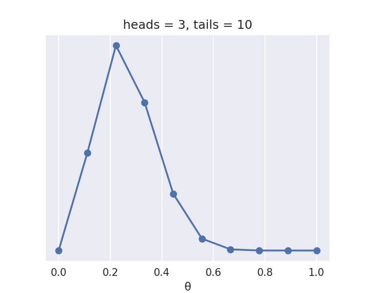
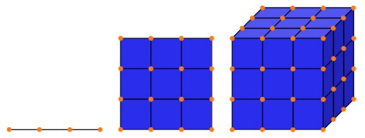
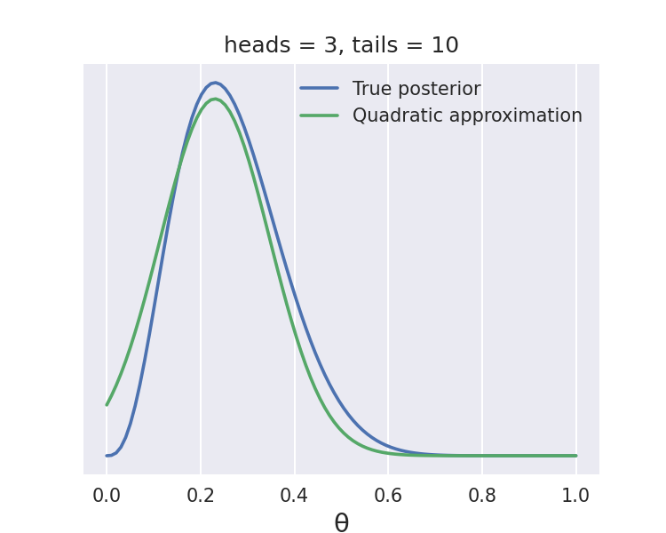

# 非 Markov 推断

## 1. 变分方法

现代贝叶斯统计学大部分是使用 Markov 方法，但对于某些问题，这些方法可能太慢。变分方法是一种替代方法，对于大数据集或计算成本太高的后验来说，它可能是一个更好的选择。变分方法的一般思路是用一个更简单的分布来逼近后验分布，类似于 LaPlace 方法，但方式更复杂。我们可通过解决一个优化问题来找到这个较简单的分布，这个优化问题包括在某种测量接近性的方法下找到与后验最接近的分布。度量分布之间紧密性的一个常见方法是使用 Kullback-Leibler 散度。使用 KL 散度：

$$
D_{KL}(q(θ) | p(θ | y)) = ∫q(θ) \log \frac{q(θ)}{p(θ | y)} d(θ)
\tag{1.1}
$$

其中，$q$是较简单的分布，我们用它来逼近后验，$p(θ | y)$; $q$通常被称为变分分布，通过使用优化方法，我们试图找出$q$的参数（变分参数），使$q$在 KL 散度方面尽可能地接近后验分布。

表达式$(1.1)$的问题是，我们不知道后验，故不能直接使用它。我们需要找到另一种方法来表达我们的问题。

首先，我们用它的定义替换条件分布

$$
D_{K L}(q(θ) ∥ p(θ | y)) = ∫q(θ) \log \frac{q(θ)}{\frac{p(θ, y)}{p(y)}} d(θ)
$$

重排后，得

$$
= ∫q(θ) \log \frac{q(θ)}{p(θ，y)} p(y) d(θ)
$$

根据对数的特性，我们有

$$
= ∫q(θ)\bigg(\log \frac{q(θ)}{p(θ，y)} + \log p(y)\bigg) d(θ)
$$

重排后，得

$$
= ∫q(θ) \log \frac{q(θ)}{p(θ，y)} d(θ) +∫q(θ) \log p(y) d(θ)
$$

其中，$q(θ)$的积分为 1，我们可将$\log p(y)$从积分中移出，得

$$
= ∫q(θ) \log \frac{q(θ)}{p(θ，y)} d(θ) + \log p(y)
$$

利用对数的特性

$$
D_{K L}(q(θ) ∥ p(θ | y)) = \underbrace{- ∫q(θ) \log \frac{p(θ, y)}{q(θ)} d(θ)}_\mathrm{ELBO} + \log p(y)
$$

> ELBO: evidence lower bound

因为$D_{K L} ≥ 0$，则$\log p(y) ≥$ ELBO，换句话说，证据总是 ≥ ELBO，这就是它名字的由来。由于$\log p(y)$是一个常数，我们可只关注 ELBO。最大化 ELBO 的值相当于最小化 KL 散度。故，最大化 ELBO 是使$q(θ)$尽可能地接近后验的方法，$p(θ | y)$。

到目前为止，我们还没有引入任何近似。原则上，$q(⋅)$可是我们想要的任何东西，但在实践中，我们应该选择容易处理的分布。一个解决方案是设高维后验可用独立的一维分布来描述; 在数学上，可用以下方式表示

$$
q(θ) = ∏_{j} q_{j}(θ_{j})
$$

这就是所谓的平均场近似 (mean-field approximation) 。均值场近似在物理学中很常见，它被用于模拟具有许多相互作用部分的复杂系统，将其作为完全不相互作用的较简单的子系统的集合，或在一般情况下，只考虑了平均的相互作用。

我们可为每个参数$θ_{j}$选择不同的分布$q_{j}$。一般来说，$q_{j}$分布取自指数族，因为它们易于处理。

有了这些要素，我们已经有效地将一个推理问题变成了一个优化问题; 故，至少在概念上，我们需要解决的是使用一些现成的优化器方法，并最大化 ELBO。在实践中，事情要复杂一些，但我们已经涵盖了大致的思路。

均值场变分法的主要缺点是，我们必须为每个模型提出一个特定的算法。我们没有一个通用推理引擎的配方，而是生成需要用户干预的特定模型方法的配方。幸运的是，很多人已经注意到了这个问题，并提出了专注于变分方法自动化的解决方案。最近提出的一种方法是自动微分变分推理（Automatic Differentiation Variational Inference，ADVI）。在概念层面上，ADVI 的主要步骤是：

1. 变换所有的有界分布，使它们在实线上生存，就像 LaPlace 方法一样。
2. 用高斯分布来逼近无界参数；注意到在变换后的参数空间上的高斯是在原始参数空间上的非高斯。
3. 使用自动微分来最大化 ELBO。

## 2. 变分推断

我们已经知道概率模型可以分为，频率派的优化问题和贝叶斯派的积分问题。从贝叶斯角度来看推断，对于 $x̂$ 这样的新样本，需要得到：

$$
p(x̂|X) = ∫_θ p(x̂,θ|X)dθ= ∫_θ p(θ|X)p(x̂ ∣ θ,X)dθ
$$

若新样本和数据集独立，则推断就是概率分布依参数后验分布的期望。

我们看到，推断问题的中心是参数后验分布的求解，推断分为：

1. 精确推断
2. 近似推断 - 参数空间无法精确求解
   - 确定性近似 - 如变分推断
   - 随机近似 - 如 MCMC，MH，Gibbs

### 2.1. 平均场假设

我们记 $Z$ 为隐变量和参数的集合，$Z_i$ 为第 $i$ 维的参数，于是，回顾一下 EM 中的推导：

$$
\log p(X) = \log p(X,Z)-\log p(Z|X) = \log\frac{p(X,Z)}{q(Z)} - \log\frac{p(Z|X)}{q(Z)}
$$

左右两边分别积分

- 左边

$$
∫_Z q(Z)\log p(X)dZ = \log p(X)
$$

- 右边

$$
∫_Z \bigg[\\log \frac{p(X,Z)}{q(Z)} - \log \frac{p(Z|X)}{q(Z)}\bigg]q(Z)dZ = \mathrm{ELBO} + \mathrm{KL}(q,p)
$$

第二个式子可以写为变分和 KL 散度的和：

$$
L(q) + \mathrm{KL}(q,p)
$$

由于这个式子是常数，于是寻找 $q ∼ eqp$ 就相当于对 $L(q)$ 最大值。

$$
q̂(Z) = \underset{q(Z)}{\mathrm{argmax}}\ L(q)
$$

假设 $q(Z)$ 可以划分为 $M$ 个组（平均场近似）

$$
q(Z) = ∏_{i=1}^M q_i(Z_i)
$$

因此，在 $L(q) = ∫_Z q(Z) \log p(X,Z)dZ - ∫_Z q(Z)\log{q(Z)}$ 中，看 $p(Z_{j})$

- 第一项

$$
\begin{aligned}
∫_Z q(Z)\log p(X,Z)dZ
&= ∫_Z ∏_{i=1}^M q_i(Z_i)\log p(X,Z)dZ\\
&= ∫_{Z_{j}} q_{j}(Z_{j})∫_{Z-Z_{j}} ∏_{i≠j}q_i(Z_i)\log p(X,Z)dZ\\
&= ∫_{Z_{j}} q_{j}(Z_{j})\mathrm{E}_{∏_{i≠j}q_i(Z_i)}[\\log p(X,Z)] dZ_{j}
\end{aligned}
$$

- 第二项

$$
∫_Z q(Z)\log q(Z)dZ = ∫_Z∏_{i=1}^M q_i(Z_i)∑_{i=1}^M\log q_i(Z_i)dZ
$$

展开求和项第一项为

$$
∫_Z ∏_{i=1}^M q_i(Z_i)\log q_1(Z_1)dZ = ∫_{Z_1}q_1(Z_1)\log q_1(Z_1)dZ_1
$$

故

$$
\begin{aligned}
   ∫_Z q(Z)\log q(Z)dZ
   &= ∑_{i=1}^M ∫_{Z_i}q_i(Z_i)\log q_i(Z_i)dZ_i\\
   &= ∫_{Z_{j}}q_{j}(Z_{j})\log q_{j}(Z_{j})dZ_{j} + \mathrm{Const}
\end{aligned}
$$

两项相减，令$\mathrm{E}_{∏_{i≠j}q_i(Z_i)}[\\log p(X,Z)] = \log p̂(X,Z_{j})$可得

$$
-∫_{Z_{j}}q_{j}(Z_{j})\log\frac{q_{j}(Z_{j})}{p̂(X,Z_{j})}dZ_{j} ≤ 0
$$

于是最大的 $q_{j}(Z_{j}) = p̂(X,Z_{j})$ 才能得到最大值。我们看到，对每一个 $q_{j}$，都是固定其余的 $q_i$，求这个值，于是可以使用坐标上升的方法进行迭代求解，上面的推导针对单个样本，但是对数据集也是适用的。

基于平均场假设的变分推断存在一些问题

- 假设太强，$Z$ 非常复杂的情况下，假设不适用
- 期望中的积分，可能无法计算

### 2.2. SGVI

从 $Z$ 到 $X$ 的过程称为生成过程或译码，反过来的额过程叫推断过程或编码过程，基于平均场的变分推断可以导出坐标上升的算法，但是这个假设在一些情况下假设太强，同时积分也不一定能算。我们知道，优化方法除了坐标上升，还有梯度上升的方式，我们希望通过梯度上升来得到变分推断的另一种算法。

我们的目标函数：

$$
q̂(Z) = \underset{q(Z)}{\mathrm{argmax}}L(q)
$$

假设 $q(Z)=q_ϕ(Z)$，是和$ϕ$这个参数相连的概率分布。于是 $\underset{q(Z)}{\mathrm{argmax}}L(q) = \underset{ϕ}{\mathrm{argmax}}\ L(ϕ)$，其中 $L(ϕ) = \mathrm{E}_{q_ϕ}[\\log p_θ(x^i, z)-\log q_ϕ(z)]$，这里 $x^i$ 表示第 $i$ 个样本。

$$
\begin{aligned}
∇_ϕ L(ϕ)
&= ∇_ϕ\mathrm{E}_{q_ϕ}[\\log p_θ(x^i, z)-\log q_ϕ(z)] \\
&= ∇_ϕ∫q_ϕ(z)\big[\log p_θ(x^i, z)-\log q_ϕ(z)\big] dz\\
&= ∫∇_ϕ q_ϕ[z](\\log p_θ(x^i, z)-\log q_ϕ(z)) dz+∫ q_ϕ(z)∇_ϕ [\\log p_θ(x^i, z)-\log q_ϕ(z)] dz\\
&= ∫∇_ϕ q_ϕ[z](\\log p_θ(x^i, z)-\log q_ϕ(z)) dz- ∫ q_ϕ(z)∇_ϕ \log q_ϕ(z)dz\\
&= ∫∇_ϕ q_ϕ[z](\\log p_θ(x^i, z)-\log q_ϕ(z)) dz- ∫ ∇_ϕ q_ϕ(z)dz\\
&= ∫∇_ϕ q_ϕ[z](\\log p_θ(x^i, z)-\log q_ϕ(z)) dz\\
&= ∫q_ϕ(∇_ϕ\log q_ϕ)(\log p_θ(x^i, z)-\log q_ϕ(z))dz\\
&= \mathrm{E}_{q_ϕ}[(∇_ϕ\log q_ϕ)(\log p_θ(x^i, z)-\log q_ϕ(z))]
\end{aligned}
$$

这个期望可以通过 Monte Carlo 采样来近似，从而得到梯度，然后利用梯度上升的方法来得到参数

$$
z^l ∼ q_ϕ(z) \\
\mathrm{E}_{q_ϕ}[(∇_ϕ\log q_ϕ)(\log p_θ(x^i, z)-\log q_ϕ(z))]∼ \frac{1}{L} ∑_{l=1}^L(∇_ϕ\log q_ϕ)(\log p_θ(x^i, z)-\log q_ϕ(z))
$$

但是由于求和符号中存在一个对数项，于是直接采样的方差很大，需要采样的样本非常多。为了解决方差太大的问题，采用 Re-parameterization 的技巧。

考虑：

$$
∇_ϕ L(ϕ)=∇_ϕ\mathrm{E}_{q_ϕ}[\\log p_θ(x^i, z)-\log q_ϕ(z)]
$$

取$z=g_ϕ(ɛ, x^i), ɛ ∼ p(ɛ)$，于是对后验：$z ∼ q_ϕ(z ∣ x^i)$，有 $|q_ϕ(z ∣ x^i)dz| = |p(ɛ)dɛ|$。代入上面的梯度中

$$
\begin{aligned}
∇_ϕ L(ϕ) &=∇_ϕ\mathrm{E}_{q_ϕ}[\\log p_θ(x^i, z)-\log q_ϕ(z)] \\
&=∇_ϕ L(ϕ)=∇_ϕ∫[\\log p_θ(x^i, z)-\log q_ϕ(z)] q_ϕ dz\\
&=∇_ϕ∫[\\log p_θ(x^i, z)-\log q_ϕ(z)] p_ɛ dɛ\\
&= \mathrm{E}_{p(ɛ)}[∇_ϕ[\\log p_θ(x^i, z)-\log q_ϕ(z)]] \\
&= \mathrm{E}_{p(ɛ)}[∇_z[\\log p_θ(x^i, z)-\log q_ϕ(z)]∇_ϕ z] \\
&= \mathrm{E}_{p(ɛ)}[∇_z[\\log p_θ(x^i, z)-\log q_ϕ(z)]∇_ϕ g_ϕ(ɛ, x^i)]
\end{aligned}
$$

对这个式子进行 Monte Carlo 采样，然后计算期望，得到梯度。

## 3. 网格计算

网格计算（Grid computing）是一种简单粗暴的方法。即使你无法计算整个后验，你也可能能够计算出先验和似然点，这是很常见的情况，甚至是最常见的情况。设我们要计算一个单参数模型的后验，网格近似如下：

1. 为参数定义一个合理的区间。
2. 在该区间上放置一个点的网格（一般是等距离的）。
3. 对于网格中的每个点，乘以似然和先验。

我们可选择对计算值进行归一化。下面的代码块实现了网格方法来计算抛币模型的后验，设我们扔了 13 次硬币，我们观察到三个头

很容易注意到，更多的点可得到更好的近似。事实上，在无限点数的限制下，我们将以增加计算资源为代价得到精确的后验。

网格方法最大的问题是，这种方法随着参数数量（维度）的增加而伸缩性很差。我们可用一个简单的例子来说明这一点。设我们想对一个单位区间进行采样，就像抛硬币问题一样，我们使用四个等距离的点。这意味着分辨率为 0.25 个单位。现在设我们有一个二维问题，我们想使用同样分辨率的网格，我们将需要 16 个点，则对于三维问题，我们将需要 64 个点。在这个例子中，我们从边长为 1 的立方体中采样所需要的资源是分辨率为 0.25 的长度为 1 的线的 16 倍。若我们决定改用 0.1 单位的分辨率，我们将需要对线进行 10 个点的采样，对立方体进行 1000 个点的采样。

除了点的数量增加之外，还有一个现象是高维空间的属性。随着参数数量的增加，参数空间中大部分后验集中的区域相比采样量越来越小。这是统计学和机器学习中普遍存在的现象，通常被称为维度的诅咒。

维度的诅咒在名称中用于谈论各种相关的现象，这些现象在低维空间中不存在，但在高维空间中却存在。下面是这些现象的一些例子。

- 随着维度的增加，任何一对样本之间的欧氏距离都会变得越来越近。即，在高维空间中，大多数点之间的距离基本相同。
- 对于一个超立方体来说，大部分体积都在它的角上，而不是在中间。对于超球来说，大部分的体积在它的表面，而不是在中间。
- 在高维度上，一个多变量高斯分布的大部分质量并不接近均值（或众数），而是在它周围的一个壳（shell）中，随着维度的增加，这个壳从均值向尾部移动。这个壳获得典型集的名称（typical set）。

网格法并不是一种非常明智的选择评估后验分布的位置的方法，因此使得它作为高维问题的一般方法并不是很有用。

## 4. 二次方法

二次近似，也被称为 LaPlace 法或正态近似，包括用高斯分布$q(x)$来近似后验$p(x)$。这种方法包括两个步骤：

1. 找到后验分布的模式。这将是$q(x)$的均值。
2. 计算黑森矩阵。由此，我们可计算出$q(x)$的标准差。

第一步可用优化方法进行数值计算，即求函数的最大值或最小值的方法。为此有很多现成的方法。因为对于高斯来说，众数和均值是相等的，我们可用众数作为近似分布的均值，$q(x)$。第二步并不则透明。我们可近似地计算$q(x)$的标准差，通过评估$q(x)$的众数/均值的曲率，这可通过计算黑森矩阵的平方根的倒数来完成。黑森矩阵是一个函数的二次导数的矩阵，它的倒数提供了协方差矩阵。使用 PyMC3，可进行以下操作

至少对于这个例子来说，二次方程近似并不是则糟糕。严格来说，我们只能将 LaPlace 方法应用于无界变量，也就是 ℝᴺ 中的变量。这是因为高斯是一个无界分布，故若我们用它来模拟一个有界分布 (如 Beta 分布)，我们最终会估计出一个正密度，而事实上密度应该是零 (在 Beta 分布的$[\big0, 1\big]$区间之外) 。尽管如此，若我们首先对有界变量进行变换，使其成为无界变量，就可使用 LaPlace 方法。例如，我们通常用半正态来模拟标准差，正是因为它被限制在$[0, ∞)$区间内，我们可通过取半正态变量的对数来使它成为无界变量。

LaPlace 法的局限性很大，但对于某些模型可很好地发挥作用，可用于获得分析表达式来逼近后验。同时亦为一种更高级的方法的构件之一，称为集成嵌套 LaPlace 逼近（Integrated Nested LaPlace Approximation，INLA）。
