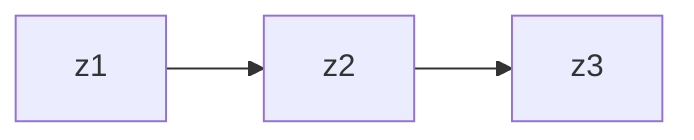
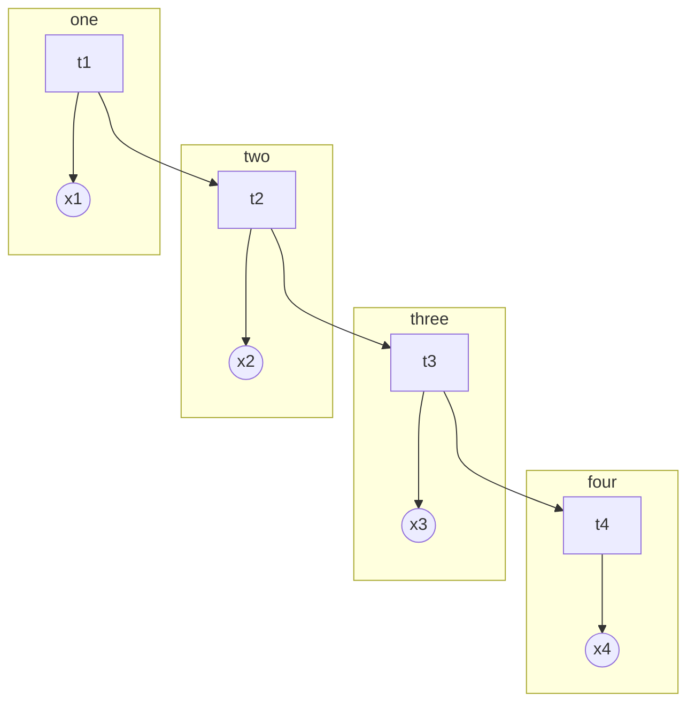

# 混合概率图

## 1. 隐 Markov 模型

- 概率图模型
  - 有向图
    - 贝叶斯网络
  - 无向图
    - Markov 随机场

若样本之间存在关联，可以认为样本中附带了时序信息，从而样本之间不独立全同分布的，这种模型就称为动态模型，隐变量随着时间发生变化，于是观测变量也发生变化

根据状态变量的特点，可以分为

- 离散：隐 Markov 模型
- 连续
  - 线性：Kalman 滤波
  - 非线性：粒子滤波

## 2. HMM

隐 Markov 模型（HMM）是一种概率图模型。用概率图表示为：

上图表示了四个时刻的隐变量变化。用参数 $λ=(π, 𝑨, 𝑩)$来表示，其中，$π$是开始的概率分布，$𝑨$为状态转移矩阵，$𝑩$为发射矩阵。

下面使用 $o*t$来表示观测变量，$O$为观测序列，$V= \{v_1,v_2, ⋯,v_M\}$表示观测的值域，$i_t$表示状态变量，$I$为状态序列，$Q= \{q_1,q_2, ⋯,q_N\}$表示状态变量的值域。定义 $𝑨=(a*{ij} =p(i\_{t+1} =q_{j}|i_t=q_i))$表示状态转移矩阵，$𝑩=(b_{j}(k)=p(o_t=v_k|i_t=q_{j}))$表示发射矩阵。

在 HMM 中，有两个基本假设

1. 齐次 Markov 假设（未来只依赖于当前）

$$
p(i_{t+1}|i_t, i_{t-1}, ⋯, i_1, o_t, o_{t-1}, ⋯, o_1)=p(i_{t+1}|i_t)
$$

2. 观测独立假设

$$
p(o_t|i_t, i_{t-1}, ⋯, i_1, o_{t-1}, ⋯, o_1)=p(o_t|i_t)
$$

HMM 要解决三个问题：

1. 评估（Forward-Backward 算法）
   - $p(O|λ)$
2. 学习（EM 算法，即 Baum-Welch 算法）
   - $λ = \mathrm{argmax}\underset{λ}{p(O|λ)}$，
3. 解码（Vierbi 算法）
   - $I = \mathrm{argmax}\underset{I}{p(I|O, λ)}$
   - 预测问题：$p(i_{t+1}|o_1, o_2, ⋯, o_t)$
   - 滤波问题：$p(i_t|o_1, o_2, ⋯, o_t)$

### 2.1. 评估

$$
p(O|λ) = ∑_I p(I,O|λ) = ∑_I p(O|I, λ)p(I|λ)
$$

$$
p(I|λ)=p(i_1, i_2, ⋯, i_t|λ)=p(i_t|i_1, i_2, ⋯, i_{t-1}, λ)p(i_1, i_2, ⋯, i_{t-1}|λ)
$$

根据齐次 Markov 假设：

$$
p(i_t|i_1, i_2, ⋯, i_{t-1}, λ)=p(i_t|i_{t-1})=a_{i_{t-1}i_t}
$$

故：

$$
p(I|λ) = π_1∏_{t=2}^{⊤}a_{i_{t-1}, i_t}
$$

又由于：

$$
p(O|I, λ)= ∏_{t=1}^{⊤}b_{i_t}(o_t)
$$

于是：

$$
p(O|λ) = ∑_I π_{i_1}∏_{t=2}^{⊤}a_{i_{t-1}, i_t}∏_{t=1}^{⊤}b_{i_t}(o_t)
$$

上面的式子中的求和符号是对所有的观测变量求和，于是复杂度为 $O(N^{⊤})$。

下面，记 $α_t(i)=p(o_1, o_2, ⋯, o_t, i_t=q_i|λ)$，故，$α_T(i)=p(O, i_T=q_i|λ)$。得

$$
p(O|λ) = ∑_{i=1}^n p(O, i_T=q_i|λ) = ∑_{i=1}^n α_T(i)
$$

对 $α_{t+1}(j)$：

$$
\begin{aligned}
α_{t+1}(j)  &= p(o_1, o_2, ⋯, o_{t+1}, i_{t+1} =q_{j}|λ) \\
 &=  ∑_{i=1}^n p(o_1, o_2, ⋯, o_{t+1}, i_{t+1} =q_{j}, i_t=q_i|λ) \\
 &=  ∑_{i=1}^n p(o_{t+1}|o_1, o_2, ⋯, i_{t+1} =q_{j}, i_t=q_i|λ)p(o_1, ⋯, o_t, i_t=q_i, i_{t+1} =q_{j}|λ)
\end{aligned}
$$

利用观测独立假设

$$
\begin{aligned}
α_{t+1}(j)  &=  ∑_{i=1}^n p(o_{t+1}|i_{t+1} =q_{j})p(o_1, ⋯, o_t, i_t=q_i, i_{t+1} =q_{j}|λ) \\
 &=  ∑_{i=1}^n p(o_{t+1}|i_{t+1} =q_{j})p(i_{t+1} =q_{j}|o_1, ⋯, o_t, i_t=q_i, λ)p(o_1, ⋯, o_t, i_t=q_i|λ) \\
 &=  ∑_{i=1}^nb_{j}(o_t)a_{ij}α_t(i)
\end{aligned}
$$

上面利用了齐次 Markov 假设得到了一个递推公式，这个算法称为前向算法。

还有一种算法称为后向算法，定义 $β_t(i)=p(o_{t+1}, o_{t+1}, ⋯，o_T|i_t=i, λ)$：

$$
\begin{aligned}
p(O|λ)  &= p(o_1, ⋯, o_T|λ) \\
 &=  ∑_{i=1}^n p(o_1, o_2, ⋯, o_T, i_1=q_i|λ) \\
 &=  ∑_{i=1}^n p(o_1, o_2, ⋯, o_T|i_1=q_i, λ)π_i\\
 &=  ∑_{i=1}^n p(o_1|o_2, ⋯, o_T, i_1=q_i, λ)p(o_2, ⋯, o_T|i_1=q_i, λ)π_i\\
 &=  ∑_{i=1}^nb_i(o_1)π_iβ_1(i)
\end{aligned}
$$

对于这个 $β_1(i)$：

$$
\begin{aligned}
β_t(i)  &= p(o_{t+1}, ⋯, o_T|i_t=q_i) \\
 &=  ∑_{j=1}^n p(o_{t+1}, o_{t+2}, ⋯, o_T, i_{t+1} =q_{j}|i_t=q_i) \\
 &=  ∑_{j=1}^n p(o_{t+1}, ⋯, o_T|i_{t+1} =q_{j}, i_t=q_i)p(i_{t+1} =q_{j}|i_t=q_i) \\
 &=  ∑_{j=1}^n p(o_{t+1}, ⋯, o_T|i_{t+1} =q_{j})a_{ij} \\
 &=  ∑_{j=1}^n p(o_{t+1}|o_{t+2}, ⋯, o_T, i_{t+1} =q_{j})p(o_{t+2}, ⋯, o_T|i_{t+1} =q_{j})a_{ij} \\
 &=  ∑_{j=1}^nb_{j}(o_{t+1})a_{ij}β_{t+1}(j)
\end{aligned}
$$

于是后向地得到了第一项。

### 2.2. 学习

为了学习得到参数的最优值，在 MLE 中：

$$
λ_\mathrm{MLE} = \mathrm{argmax}_λ p(O|λ)
$$

采用 EM 算法（在这里也叫 Baum Welch 算法），用上标表示迭代：

$$
θ^{t+1} = \mathrm{argmax}_θ ∫_z\log p(X,Z \mid θ)p(Z|X, θ^t)dz
$$

其中，$X$是观测变量，$Z$是隐变量序列。于是：

$$
λ^{t+1} = \mathrm{argmax}_λ∑_i\log p(O, I|λ)p(I|O, λ^t) \\
= \mathrm{argmax}_λ∑_i\log p(O, I|λ)p(O, I|λ^t)
$$

这里利用了 $p(O|λ^t)$和$λ$无关。将 Evaluation 中的式子代入：

$$
∑_i\log p(O, I|λ)p(O, I|λ^t) = ∑_i[\log π_{i_1}+ ∑_{t=2}^{⊤} \log a_{i_{t-1}, i_t}+ ∑_{t=1}^{⊤} \log b_{i_t}(o_t)]p(O, I|λ^t)
$$

对 $π^{t+1}$：

$$
\begin{aligned}π^{t+1}  &=  \mathrm{argmax}_π∑_i[\log π_{i_1}p(O, I|λ^t)] \\
 &=  \mathrm{argmax}_π∑_i[\log π_{i_1}⋅ p(O, i_1, i_2, ⋯, i_T|λ^t)]
\end{aligned}
$$

上面的式子中，对 $i_2, i_2, ⋯, i_T$求和可以将这些参数消掉：

$$
π^{t+1} = \mathrm{argmax}_π∑_{i_1}[\log π_{i_1}⋅ p(O, i_1|λ^t)]
$$

上面的式子还有对 $π$的约束 $∑_iπ_i=1$。定义 Lagrange 函数：

$$
L(π,η) = ∑_{i=1}^n \log π_i⋅ p(O, i_1=q_i|λ^t)+η(∑_{i=1}^nπ_i -1)
$$

于是：

$$
\frac{∂L}{∂π_i} = \frac{1}{π_i}p(O, i_1=q_i|λ^t)+η=0
$$

对上式求和：

$$
∑_{i=1}^n p(O, i_1=q_i|λ^t)+π_iη=0⇒η=-p(O|λ^t)
$$

故：

$$
π_i^{t+1} = \frac{p(O, i_1=q_i|λ^t)}{p(O|λ^t)}
$$

### 2.3. 解码

解码 问题表述为：

$$
I= \mathrm{argmax}\underset{I}p(I|O, λ)
$$

我们需要找到一个序列，其概率最大，这个序列就是在参数空间中的一个路径，可以采用动态规划的思想。

定义：

$$
δ_{t}(j) = \max\underset{i_1, ⋯, i_{t-1}}p(o_1, ⋯, o_t, i_1, ⋯, i_{t-1}, i_t=q_i)
$$

于是：

$$
δ_{t+1}(j) = \max\underset{1 ≤ i ≤ N}δ_t(i)a_{ij}b_{j}(o_{t+1})
$$

这个式子就是从上一步到下一步的概率再求最大值。记这个路径为：

$$
ψ_{t+1}(j) = \mathrm{argmax}\underset{1 ≤ i ≤ N}δ_t(i)a_{ij}
$$

## 3. 小结

HMM 是一种动态模型，是由混合树形模型和时序结合起来的一种模型（类似 GMM + Time）。对于类似 HMM 的这种状态空间模型，普遍的除了学习任务（采用 EM）外，还有推断任务，推断任务包括：

1. 译码 解码：$p(z_1,z_2, ⋯,z_t \mid x_1, x_2, ⋯, x_t)$

2. 似然概率：$p(X \mid θ)$

3. 滤波：$p(z_t \mid x_1, ⋯, x_t)$，Online

   $$
   p(z_t \mid x_{1:t}) = \frac{p(x_{1:t},z_t)}{p(x_{1:t})} =Cα_t(z_t)
   $$

4. 平滑：$p(z_t \mid x_1, ⋯, x_T)$，Offline

   $$
   p(z_t \mid x_{1:T}) = \frac{p(x_{1:T},z_t)}{p(x_{1:T})} = \frac{α_t(z_t)p(x_{t+1:T} \mid x_{1:t},z_t)}{p(x_{1:T})}
   $$

   根据概率图的条件独立性，有：

   $$
   p(z_t \mid x_{1:T}) = \frac{α_t(z_t)p(x_{t+1:T} \mid z_t)}{p(x_{1:T})} =Cα_t(z_t)β_t(z_t)
   $$

   这个算法称为前向后向算法。

5. 预测：$p(z_{t+1},z_{t+2} \mid x_1, ⋯, x_t),p(x_{t+1}, x_{t+2} \mid x_1, ⋯, x_t)$

   $$
   p(z_{t+1} \mid x_{1:t}) = ∑_{z_t}p(z_{t+1},z_t \mid x_{1:t}) = ∑_{z_t}p(z_{t+1} \mid z_t)p(z_t \mid x_{1:t})
   $$

   $$
   p(x_{t+1} \mid x_{1:t}) = ∑_{z_{t+1}}p(x_{t+1},z_{t+1} \mid x_{1:t}) = ∑_{z_{t+1}}p(x_{t+1} \mid z_{t+1})p(z_{t+1} \mid x_{1:t})
   $$

## 4. 卡尔曼滤波

HMM 模型适用于隐变量是离散的值的时候，对于连续隐变量的 HMM，常用卡尔曼滤波描述线性高斯模型的态变量，使用粒子滤波来表述非高斯非线性的态变量。

LDS 又叫卡尔曼滤波，其中，线性体现在上一时刻和这一时刻的隐变量以及隐变量和观测之间：

$$
\begin{aligned}
z_t &= 𝑨⋅z_{t-1}+𝑩+ɛ\\
x_t &= C⋅z_t+D+δ\\
ɛ& ∼ N(0,Q) \\
δ& ∼ N(0,R)
\end{aligned}
$$

类比 HMM 中的几个参数：

$$
\begin{aligned}
p(z_t \mid z_{t-1}) & ∼ N(𝑨⋅z_{t-1}+𝑩,Q) \\
p(x_t \mid z_t) & ∼ N(C⋅z_t+D,R) \\
z_1 & ∼ N(μ_1, Σ_1)
\end{aligned}
$$

在含时的概率图中，除了对参数评估的学习问题外，在推断任务中，包括译码，证据概率，滤波，平滑，预测问题，LDS 更关心滤波这个问题：$p(z_t \mid x_1, x_2, ⋯, x_t)$。类似 HMM 中的前向算法，我们需要找到一个递推关系。

$$
p(z_t \mid x_{1:t})=p(x_{1:t},z_t)/p(x_{1:t})=Cp(x_{1:t},z_t)
$$

对于 $p(x_{1:t},z_t)$：

$$
\begin{aligned}
p(x_{1:t},z_t)  &= p(x_t \mid x_{1:t-1},z_t)p(x_{1:t-1},z_t)=p(x_t \mid z_t)p(x_{1:t-1},z_t) \\
 &= p(x_t \mid z_t)p(z_t \mid x_{1:t-1})p(x_{1:t-1})=Cp(x_t \mid z_t)p(z_t \mid x_{1:t-1}) \\
\end{aligned}
$$

我们看到，右边除了只和观测相关的常数项，还有一项是预测任务需要的概率。对这个值：

$$
\begin{aligned}
p(z_t \mid x_{1:t-1})  &=  ∫_{z_{t-1}}p(z_t,z_{t-1} \mid x_{1:t-1})dz_{t-1} \\
 &=  ∫_{z_{t-1}}p(z_t \mid z_{t-1}, x_{1:t-1})p(z_{t-1} \mid x_{1:t-1})dz_{t-1} \\
 &=  ∫_{z_{t-1}}p(z_t \mid z_{t-1})p(z_{t-1} \mid x_{1:t-1})dz_{t-1}
\end{aligned}
$$

我们看到，这又化成了一个滤波问题。于是我们得到了一个递推公式：

1. $t=1$，$p(z_1 \mid x_1)$，称为 update 过程，然后计算 $p(z_2 \mid x_1)$，通过上面的积分进行，称为 prediction 过程。
2. $t=2$，$p(z_2 \mid x_2, x_1)$和 $p(z_3 \mid x_1, x_2)$

我们看到，这个过程是一个 Online 的过程，对于我们的线性高斯假设，这个计算过程都可以得到解析解。

1. Prediction：

   $$
   p(z_t \mid x_{1:t-1}) = ∫_{z_{t-1}}p(z_t \mid z_{t-1})p(z_{t-1} \mid x_{1:t-1})dz_{t-1} = ∫_{z_{t-1}}N(𝑨z_{t-1}+𝑩,Q)N(μ_{t-1}, Σ_{t-1})dz_{t-1}
   $$

   其中第二个高斯分布是上一步的 Update 过程，故根据线性高斯模型，直接可以写出这个积分：

   $$
   p(z_t \mid x_{1:t-1})=N(𝑨μ_{t-1}+𝑩, Q + 𝑨Σ_{t-1}𝑨^{⊤})
   $$

2. Update:
   $$
   p(z_t \mid x_{1:t})∝ p(x_t \mid z_t)p(z_t \mid x_{1:t-1})
   $$
   同样利用线性高斯模型，也可以直接写出这个高斯分布。

## 5. 粒子滤波

Kalman 滤波根据线性高斯模型可以求得解析解，但是在非线性，非高斯的情况，是无法得到解析解的，对这类一般的情况，我们称为粒子滤波，我们需要求得概率分布，需要采用采样的方式。

对于一个概率分布，若我们希望计算依这个分布的某个函数 $f(z)$的期望，可以利用某种抽样方法，在这个概率分布中抽取 $N$个样本，则 $\mathrm{E}\big[f(z)\big]∼eq\frac{1}{N} ∑_{i=1}^nf(z_i)$。但是若这个概率十分复杂，则采样比较困难。对于复杂的概率分布，我们可以通过一个简单的概率分布 $q(z)$作为桥梁（重要值采样）:

$$
\mathrm{E}\big[f(z)\big] = ∫_zf(z)p(z)dz= ∫_zf(z)\frac{p(z)}{q(z)}q(z)dz= ∑_{i=1}^nf(z_i)\frac{p(z_i)}{q(z_i)}
$$

于是直接通过对 $q(z)$采样，然后对每一个采样的样本应用权重就得到了期望的近似，当然为了概率分布的特性，我们需要对权重进行归一化。

在滤波问题中，需要求解 $p(z_t \mid x_{1:t})$，其权重为：

$$
w_t^i= \frac{p(z_t^i | x_{1:t})}{q(z_t^i | x_{1:t})}, i = 1,2, ⋯,N
$$

于是在每一个时刻 $t$，都需要采样 $N$个点，但是即使采样了这么多点，分子上面的那一项也十分难求，于是希望找到一个关于权重的递推公式。为了解决这个问题，引入序列重要性采样（SIS）。

## 6. SIS

在 SIS 中，解决的问题是 $p(z_{1:t} \mid x_{1:t})$。

$$
w_t^i∝\frac{p(z_{1:t} \mid x_{1:t})}{q(z_{1:t} \mid x_{1:t})}
$$

根据 LDS 中的推导：

$$
\begin{aligned}p(z_{1:t} \mid x_{1:t})∝ p(x_{1:t},z_{1:t})  &= p(x_t \mid z_{1:t}, x_{1:t-1})p(z_{1:t}, x_{1:t-1}) \\
 &= p(x_t \mid z_t)p(z_t \mid x_{1:t-1},z_{1:t-1})p(x_{1:t-1},z_{1:t-1}) \\
 &= p(x_t \mid z_t)p(z_t \mid z_{t-1})p(x_{1:t-1},z_{1:t-1}) \\
&∝ p(x_t \mid z_t)p(z_t \mid z_{t-1})p(z_{1:t-1} \mid x_{1:t-1})
\end{aligned}
$$

于是分子的递推式就得到了。对于提议分布的分母，可以取：

$$
q(z_{1:t} \mid x_{1:t})=q(z_t \mid z_{1:t-1}, x_{1:t})q(z_{1:t-1} \mid x_{1:t-1})
$$

故有：

$$
w_t^i∝\frac{p(z_{1:t} \mid x_{1:t})}{q(z_{1:t} \mid x_{1:t})}∝ \frac{p(x_t \mid z_t)p(z_t \mid z_{t-1})p(z_{1:t-1} \mid x_{1:t-1})}{q(z_t \mid z_{1:t-1}, x_{1:t})q(z_{1:t-1} \mid x_{1:t-1})} = \frac{p(x_t \mid z_t)p(z_t \mid z_{t-1})}{q(z_t \mid z_{1:t-1}, x_{1:t})} w_{t-1}^i
$$

得到的对权重的算法为：

1. $t-1$时刻，采样完成并计算得到权重
2. t 时刻，根据 $q(z_t \mid z_{1:t-1}, x_{1:t})$进行采样得到 $z_t^i$。然后计算得到 $N$个权重。
3. 最后对权重归一化。

SIS 算法会出现权值退化的情况，在一定时间后，可能会出现大部分权重都逼近 0 的情况，这是由于空间维度越来越高，需要的样本也越来越多。解决这个问题的方法有：

1. 重采样，以权重作为概率分布，重新在已经采样的样本中采样，然后所有样本的权重相同，这个方法的思路是将权重作为概率分布，然后得到累积密度函数，在累积密度上取点（阶梯函数）。
2. 选择一个合适的提议分布，$q(z_t \mid z_{1:t-1}, x_{1:t})=p(z_t \mid z_{t-1})$，于是就消掉了一项，并且采样的概率就是 $p(z_t \mid z_{t-1})$，这就称为生成与测试方法。

采用重采样的 SIS 算法就是基本的粒子滤波算法。若像上面那样选择提议分布，这个算法称为 SIR 算法。
