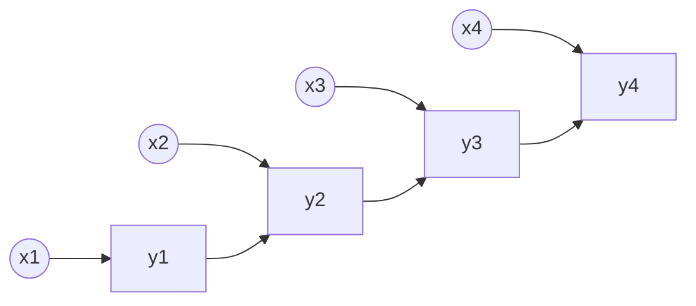
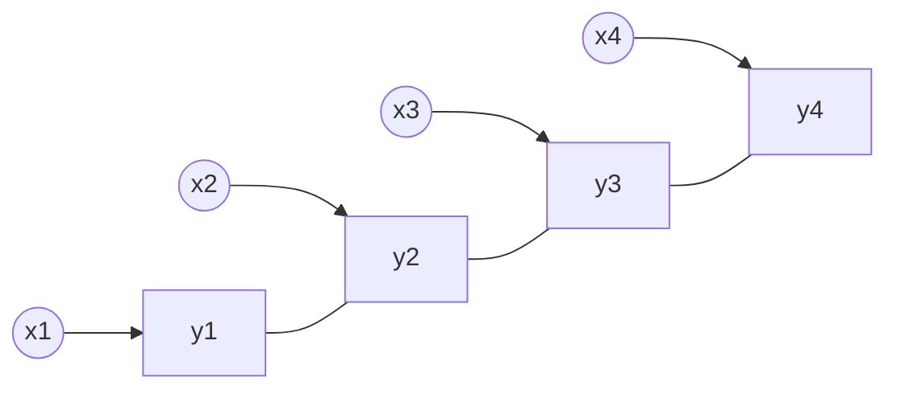

# 条件随机场

- 硬分类：SVM，PLA，LDA
- 软分类
  - 概率生成模型
    - 最大熵模型（和指数族分布的概率假设一致）
      - Logistic 回归：损失函数为交叉熵
  - 概率判别模型
    - 动态模型
      - 朴素贝叶斯模型
      - HMM（可以看成是 GMM 在时序上面的推广）

一般地，若将最大熵模型和 HMM 相结合，则这种模型称为最大熵 Markov 模型（MEMM）：

这个图就是将 HMM 的图中观测变量和隐变量的边方向反向，应用在分类中，隐变量就是输出的分类，这样 HMM 中的两个假设就不成立了，特别是观测之间不是完全独立的了。

HMM 是一种生成式模型，其建模对象为 $p(X,Y|λ)$，根据 HMM 的概率图，$p(X,Y ∣ λ) = ∏_{t=1}^{⊤}p(x_t, y_t|λ, y_{t-1})$。我们看到，观测独立性假设是一个很强的假设，若我们有一个文本样本，则观测独立性假设就假设了所有的单词之间没有关联。

在 MEMM 中，建模对象是 $p(Y|X, λ)$，我们看概率图，给定 $y_t$，$x_t, x_{t-1}$ 是不独立的，这样，观测独立假设就不成立了。根据概率图，$p(Y ∣ X, λ) = ∏_{t=1}^{⊤}p(y_t|y_{t-1}, X, λ)$。

MEMM 的缺陷是其必须满足局域的概率归一化（Label Bias Problem），我们看到，在上面的概率图中，$p(y_t|y_{t-1}, x_t)$，这个概率，若 $p(y_t|y_{t-1})$ 非常接近 1，则事实上，观测变量是什么就不会影响这个概率了。

对于这个问题，我们将 $y$ 之间的箭头转为直线转为无向图（线性链条件随机场），这样就只要满足全局归一化了（破坏齐次 Markov 假设）。

## 1. CRF 的 PDF

线性链的 CRF 的 PDF 为 $p(Y|X) = \frac{1}{Z}\exp∑_{t=1}^{⊤}(F_t(y_{t-1}, y_t, x_{1:T}))$，两两形成了最大团，其中 $y_0$ 是随意外加的一个元素。作为第一个简化，我们假设每个团的势函数相同 $F_t=F$。

对于这个 $F$，我们进一步，可以将其写为$F(y_{t-1}, y_t, X) = Δ_{y_{t-1}, X} + Δ_{y_t, X} + Δ_{y_t, y_{t-1}, X}$这三个部分，分别表示状态函数已经转移函数，由于整体的求和，可以简化为 $ F(y*{t-1}, y_t, X) = Δ*{y*{t}, X} + Δ*{y*t, y*{t-1}, X}$。

我们可以设计一个表达式将其参数化：

$$
\begin{aligned}
Δ_{y_t, y_{t-1}, X} &= ∑_{k=1}^k λ_kf_k(y_{t-1}, y_t, X) \\
Δ_{y_t, X} &= ∑_{l=1}^Lη_lg_l(y_t, X)
\end{aligned}
$$

其中 $g, f$ 称为特征函数，对于 $y$ 有 $S$ 种元素，则 $K≤ S^2,L ≤ S$。

代入概率密度函数中：

$$
p(Y|X) = \frac{1}{Z}\exp∑_{t=1}^{⊤}\big[∑_{k=1}^k λ_kf_k(y_{t-1}, y_t, X)+ ∑_{l=1}^Lη_lg_l(y_t, X)\big]
$$

对于单个样本，将其写成向量的形式。定义 $y = (y_1, y_2, ⋯, y_T)^{⊤}, x= (x_1, x_2, ⋯, x_T)^{⊤}, λ= (λ_1, λ_2, ⋯, λ_k)^{⊤}, η = (η_1, η_2, ⋯, η_L)^{⊤}$。并且有 $f= (f_1,f_2, ⋯,f_k)^{⊤}, g= (g_1, g_2, ⋯, g_L)^{⊤}$。于是：

$$
p(Y=y | X=x) = \frac{1}{Z}\exp∑_{t=1}^{⊤}\big[λ^{⊤}f(y_{t-1}, y_t, x)+η^{⊤}g(y_t, x)\big]
$$

不妨记：$θ= (λ, η)^{⊤}, H= (∑_{t=1}^{⊤}f,∑_{t=1}^{⊤}g)^{⊤}$：

$$
p(Y=y | X=x) = \frac{1}{Z(x, θ)}\exp\big[θ^{⊤} H(y_t, y_{t-1}, x)\big]
$$

上面这个式子是一个指数族分布，于是 $Z$ 是配分函数。

CRF 需要解决下面几个问题：

1. 学习：参数估计问题，对$N$个$T$维样本，$θ̂ = \underset{θ}{\mathrm{argmax}}\ ∏_{i=1}^n p(y^i|x^i)$，这里用上标表示样本的编号。

2. 推断：

3. 边缘概率：

$$
p(y_t|x)
$$

4. 条件概率：一般在生成模型中较为关注，CRF 中不关注
5. MAP 推断：

$$
ŷ = \mathrm{argmax}\ p(y ∣ x)
$$

## 2. 边缘概率

边缘概率这个问题描述为，根据学习任务得到的参数，给定了 $p(Y=y|X=x)$，求解 $p(y_t=i|x)$。根据无向图可以给出：

$$
p(y_t=i|x) = ∑_{y_{1:t-1}, y_{t+1:T}}p(y ∣ x) = ∑_{y_{1:t-1}} ∑_{y_{t+1:T}}\frac{1}{Z} ∏_{t'=1}^{⊤}ϕ_{t'}(y_{t'-1}, y_{t'}, x)
$$

我们看到上面的式子，直接计算的复杂度很高，这是由于求和的复杂度在 $O(S^{⊤})$，求积的复杂度在 $O(T)$，故整体复杂度为 $O(TS^{⊤})$。我们需要调整求和符号的顺序，从而降低复杂度。

首先，将两个求和分为：

$$
\begin{aligned} &p(y_t=i|x) = \frac{1}{Z}Δ_lΔ_r\\
&Δ_l= ∑_{y_{1:t-1}}ϕ_1(y_0, y_1, x)ϕ_2(y_1, y_2, x)⋯ϕ_{t-1}(y_{t-2}, y_{t-1}, x)ϕ_t(y_{t-1}, y_t=i, x) \\
&Δ_r= ∑_{y_{t+1:T}}ϕ_{t+1}(y_t=i, y_{t+1}, x)ϕ_{t+2}(y_{t+1}, y_{t+2}, x)⋯ϕ_T(y_{T-1}, y_T, x)
\end{aligned}
$$

对于 $Δ_l$，从左向右，一步一步将 $y_t$ 消掉：

$$
Δ_l= ∑_{y_{t-1}}ϕ_t(y_{t-1}, y_t=i, x)∑_{y_{t-2}}ϕ_{t-1}(y_{t-2}, y_{t-1}, x)⋯∑_{y_0}ϕ_1(y_0, y_1, x)
$$

引入：

$$
α_t(i) = Δ_l
$$

于是：

$$
α_t(i) = ∑_{j∈ S}ϕ_t(y_{t-1} =j, y_t=i, x)α_{t-1}(j)
$$

这样我们得到了一个递推式。

类似地，$Δ_r=β_t(i) = ∑_{j∈ S}ϕ_{t+1}(y_t=i, y_{t+1} =j, x)β_{t+1}(j)$。这个方法和 HMM 中的前向后向算法类似，就是概率图模型中精确推断的变量消除算法（信念传播）。

## 3. 参数估计

在进行各种类型的推断之前，还需要对参数进行学习：

$$
\begin{aligned}
θ̂ &= \underset{θ}{\mathrm{argmax}}\ ∏_{i=1}^n p(y^i|x^i) \\
&= \underset{θ}{\mathrm{argmax}}∑_{i=1}^n\log p(y^i|x^i) \\
&= \underset{θ}{\mathrm{argmax}}∑_{i=1}^n\big[-\log Z(x^i, λ, η)+ ∑_{t=1}^{⊤}\big[λ^{⊤}f(y_{t-1}, y_t, x)+η^{⊤}g(y_t, x)\big]\big]
\end{aligned}
$$

上面的式子中，第一项是对数配分函数，根据指数族分布的结论：

$$
∇_λ(\log Z(x^i, λ, η)) = \mathrm{E}_{p(y^i|x^i)}\big[∑_{t=1}^{⊤}f(y_{t-1}, y_t, x^i)\big]
$$

其中，和 $η$ 相关的项相当于一个常数。求解这个期望值：

$$
\mathrm{E}_{p(y^i|x^i)}\big[∑_{t=1}^{⊤}f(y_{t-1}, y_t, x^i)\big] = ∑_yp(y ∣ x^i)∑_{t=1}^{⊤}f(y_{t-1}, y_t, x^i)
$$

第一个求和号的复杂度为 $O(S^{⊤})$，重新排列求和符号：

$$
\begin{aligned}\mathrm{E}_{p(y^i|x^i)}\big[∑_{t=1}^{⊤}f(y_{t-1}, y_t, x^i)\big]&= ∑_{t=1}^{⊤}∑_{y_{1:t-2}} ∑_{y_{t-1}} ∑_{y_t} ∑_{y_{t+1:T}}p(y ∣ x^i)f(y_{t-1}, y_t, x^i) \\
&= ∑_{t=1}^{⊤}∑_{y_{t-1}} ∑_{y_t}p(y_{t-1}, y_t|x^i)f(y_{t-1}, y_t, x^i)
\end{aligned}
$$

和上面的边缘概率类似，也可以通过前向后向算法得到上面式子中的边缘概率。

于是：

$$
∇_λ L= ∑_{i=1}^n ∑_{t=1}^{⊤}\big[f(y_{t-1}, y_t, x^i)-∑_{y_{t-1}} ∑_{y_t}p(y_{t-1}, y_t|x^i)f(y_{t-1}, y_t, x^i)\big]
$$

利用梯度上升算法可以求解。对于 $η$ 也是类似的过程。

## 4. 译码

译码问题和 HMM 中的 Viterbi 算法类似，同样采样动态规划的思想一层一层求解最大值。
