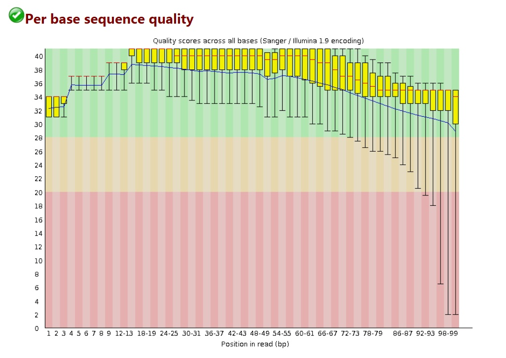

# 生物信息学基础

## 1. 扩增子测序

### 1.1. 复制、转录与表达

- RNA 聚合酶将 DNA 转录为 mRNA，之后由核糖体翻译为蛋白质；
- 任意 2 个人类基因组都有千分之一的不同；
- 对于给定的基因，从该基因表达的 mRNA 水平与该基因的蛋白质水平没有一对一的相关性，原因有
  - 对于给定基因的表达，转录速率和翻译速率可变化。
  - mRNA 与蛋白质的降解速率可能不同。
  - 蛋白质水平可经历翻译后调节，例如降解。


### 1.2. 测序技术

- 第一代测序技术（Sanger 法）

原理：不能在新合成的 DNA 链中掺入"有缺陷的"核苷酸（双脱氧核苷酸或 ddNTP）。

- 第二代测序技术

原理：荧光标记 ddNTP 和利用毛细管分离 DNA 片段。

- 优势

  - 不必暴露于放射性危险中；
  - 可通过一个测序反应而不是四个测序反应对一个 DNA 区域进行测序；
  - 可从一个毛细管中确定该区域的序列，而不是运行具有四个泳道的聚丙烯酰胺测序凝胶。

- 芯片技术

  - 仅使用"有缺陷的"核苷酸；
  - 测序反应进行后没有 DNA 产物的大小分离。

- 序列拼接

  - 最终的序列结果依靠重叠（overlap）对短片段进行组装；
  - 若两个序列重叠，则 Hash 表中应该有多个序列匹配两个序列。这两个序列不必匹配散列表中的所有相同序列，因为在 300 个核苷酸读数内将存在不重叠的区域；
  - 使用 Hash 表从重叠序列的分析中消除长分散元素（LINE）和短分散元素（SINE）的重复序列：从分析中删除 Hash 索引匹配项多于匹配阈值的序列；

### 1.3. 16S rDNA/rRNA

16S rRNA 为核糖体的 RNA 的一个亚基，16S rDNA 就是编码该亚基的基因，存在于所有细菌染色体基因中，是细菌的系统分类研究中最有用的和最常用的分子钟，其种类少，含量大（rRNA 约占细菌 RNA 含量的 80%），分子大小适中（1.5 kb 左右），在结构与功能上具有高度的保守性，素有"细菌化石"之称。

> 大多数原核生物中 rDNA 都具有多个拷贝，5S、16S、23S rDNA 的拷贝数相同；
> 基因序列比较基于相应 mRNA

### 1.4. 16S rDNA 测序

- **定义**：以细菌 16S rRNA 基因测序为主；
- 功能：主要研究群落的物种组成、物种间的演化关系以及群落的多样性；
- 方法：测定并比对高变区 V4，使用引物 515F/806R；
- 深度：但，某些物种在高变区可能非常相近，很多注释不到种水平；

### 1.5. ITS 测序

内转录间隔区（Internal Transcribed Spacer，ITS）：是位于真菌 rRNA 基因转录区或对应多顺反子 rRNA 前体中大、小亚基 rRNA 之间的核酸序列。用于真菌鉴定的 ITS 序列通常包括 ITS1（18S rRNA 和 5.8S）、5.8S 和 ITS2。真菌 ITS 区域长度一般在 500~750 bp。

## 2. 组学

- 宏基因组（Metagenomics）

  - **定义**：微生物群的基因和基因组，强调群体的遗传学潜能；
  - 功能：在 16S 测序分析的基础上还可进行基因和功能层面的深入研究；
  - 方法：通过对微生物基因组随机打断，并通过组装将小片段拼接成较长的序列；
  - 深度：能鉴定微生物到种水平甚至菌株水平

- 微生物组（Microbiome）

  - **定义**：微生物群的基因和基因组，以及微生物群的产物与宿主环境；

- 微生物群（Microbiota）
  - **定义**：与微生物组同义，仅指 16S 扩增子研究细菌组；

## 3. Illumina 测序

### 3.1. 原理

目前接触到的很多生物信息学的技术，均是基于第二代测序技术的（Next Generation Sequencing，NGS）技术的，如 RNA-Seq，ChIP-Seq，FAIRE-Seq，ChIA-PET，Hi-C 等等。

目前最为常用的 NGS 技术是 Illumina 测序技术，它能够保证在几十个小时内产生几百 G 甚至上 T 的测序数据，完全能够满足高通量测序的通量要求，且其测序准确程度亦为完全能够保证。

### 3.2. 基本概念

- flowcell：指 Illumina 测序时，测序反应发生的位置，1 个 flowcell 含有 8 条 lane（泳道），用于测序反应，可添加试剂，洗脱等等；
- tile：每一次测序荧光扫描的最小单位；
- reads：指测序的结果，1 条序列一般称为 1 条 reads；
- 双端测序：一条序列可能比较长如 500bp，可两端每端各测 150bp；
- junction：双端测序中间留有的 200bp 测不到的东西；


### 3.3. 建库

由于 Illumina 测序战略本身的问题，导致其测序长度不可能太长，目前最好的 X Ten 也就是双端各 150bp，故在测序的时候需要先打断成一定长度的片段。

- 一般测人的基因组，是将其打断成 300~500bp 的长度。这个是根据跑胶控制的。
- 打断以后会出现末端不平整的情况，用酶补平，故现在的序列是平末端。
- 完成补平以后，在 3'端使用酶加上一个特异的碱基 A。
- 加上 A 之后就可利用互补配对的原则，加上 adapter，这个 adapter 可分成两个部分，一个部分是测序的时候需要用的引物序列，另一部分是建库扩增时候需要用的引物序列。
- 进行 PCR 扩增，使得 DNA 样品浓度足够上机要求。


### 3.4. 桥式 PCR

1. 将上述的 DNA 样品调整到合适的浓度加入到 flowcell 中，再加入特异的化学试剂，就可使得序列的一端与 flowcell 上面已经存在的短序列通过化学键十分强健地相连。
2. 连接以后就正式开始桥式 PCR。首先进行第一轮扩增，将序列补成双链。加入 NaOH 强碱性溶液破坏 DNA 的双链，并洗脱。由于最开始的序列是使用化学键连接的，故不会被洗。
3. 加入缓冲溶液，这时候序列自由端的部分就会和旁边的 adapter 进行匹配。
4. 进行一轮 PCR，在 PCR 的过程中，序列弯成桥状，故叫桥式 PCR，一轮桥式 PCR 可使得序列扩增 1 倍。
5. 如此循环下去，就会得到一个具有完全相同序列的簇，一般叫 cluster。
6. 形成这种 1 个 cluster，1 个 cluster 的形态，在整个 flowcell 中看上去，示意图如下。其中的每 1 个 cluster 就算是 1 群完全相同的序列。


### 3.5. 测序

- 测序的过程反而简单了不少。就是来一个 primer，然后加入特殊处理过的 A，T，C，G 四种碱基。
- 特殊的地方有两点，一个是脱氧核糖 3 号位加入了叠氮基团而不是常规的羟基，保证每次只能够在序列上添加 1 个碱基；另一方面是，碱基部分加入了荧光基团，可激发出不同的颜色。


- 在测序过程中，每 1 轮测序，保证只有 1 个碱基加入的当前测序链。这时候测序仪会发出激发光，并扫描荧光。因为一个 cluster 中所有的序列是一样的，故理论上，这时候 cluster 中发出的荧光应该颜色一致
- 随后加入试剂，将脱氧核糖 3 号位的—N₂ 改变成 —OH，然后切掉部分荧光基团，使其在下一轮反应中，不再发出荧光。如此往复，就可测出序列的内容。


### 3.6. 长度限制

- 测序时，经过长时间的 PCR，会有不同步的情况。通俗一点讲，如一开始 1 个 cluster 中是 100 个完全一样的 DNA 链，但，经过 1 轮增加碱基，其中 99 个都加入了 1 个碱基，显示了红色，另外 1 个没有加入碱基，不显示颜色。这时候整体为红色，可顺利得到结果。随后，在第 2 轮再加入碱基进行合成的时候，就变成了，之前没有加入的加入了 1 个碱基显示红色，剩下的 99 个显示绿色，这个时候就会出现杂信号。当测序长度不断延长，这个杂信号会越来越多，最后很有可能出现，50 个红，50 个绿色，这时候判断不出来到底是什么碱基被合成。
- 测序过程中，使用的碱基是特殊处理的，有一个非常大的荧光基团修饰。在使用 DNA ploymerase 的时候，酶的状态也会受到底物的影响，越来越差。

## 4. 序列文件

### 4.1. fasta & .fastq

- FASTA

FASTA 格式是一种非常简单的储存序列的格式，可储存核酸序列和蛋白质的氨基酸序列，主要分成 2 个部分；

- 以 `>` 为开始的一行主要储存的是序列的描述信息；
- 剩下的是序列部分，中间，前后都可有空格，小于 120 就行，一般 70 到 80 左右。实际操作中，程序处理的时候均是自动去掉空格和换行符，把序列读成 1 行再处理。

- FASTQ

FASTQ 格式储存的序列信息，每 1 条 reads 的信息，可分成 4 行；

```none
@ST-E00126:128:HJFLHCCXX:2:1101:7405:1133
TTGCAAAAAATTTCTCTCATTCTGTAGGTTGCCTGTTCACTCTGATGATAGTTTGTTTTGG
+
FFKKKFKKFKF<KK<F, AFKKKKK7FFK77<FKK, <F7K, , 7AF<FF7FKK7AA, 7<FA, ,
```

1. 第 1 行：主要储存序列测序时的坐标等信息

   |          符号           |         含义         |
   | :---------------------: | :------------------: |
   |            @            |    开始的标记符号    |
   | ST-E00126:128:HJFLHCCXX | 测序仪唯一的设备名称 |
   |            2            |     lane 的编号      |
   |          1101           |     tail 的坐标      |
   |          7405           | 在 tail 中的 X 坐标  |
   |          1133           | 在 tail 中的 Y 坐标  |

2. 第 2 行：测序得到的序列信息，其中 N 表示荧光信号干扰无法判断到底是哪个碱基；
3. 第 3 行：以"+"开始，可储存一些附加信息，一般是空的；
4. 第 4 行：储存的是质量信息，与第 2 行的碱基序列是一一对应的，其中的每个符号对应的 ASCII 值成为 Phred 值，可简单理解为对应位置碱基的质量值，越大说明测序的质量越好。

### 4.2. 质量值的计算

在测序仪进行测序的时候，会自动根据荧光信号的强弱给出一个参考的测序错误概率（Error Probability，P）。根据定义来说，P 值肯定是越小越好，具体计算时，遵循以下两步：

1. 将 P 取 log₁₀ 之后再乘以-10，得到的结果为 Q。如 P = 1%，则对应的 Q= -10 × log₁₀（0.01）= 20；
2. 把这个 Q 加上 33（Sanger）或 64（Illumina，Solexa）转成一个新的数值，称为 Phred，最后把 Phred 对应的 ASCII 字符对应到这个碱基。如 Q = 20，Phred = 20 + 33 = 53，对应的符号是"5"。这样就可用 1 个符号与 1 个碱基一一对应。

### 4.3. fastqc

- 整条序列



|   项目   |             含义             |               注释               |
| :------: | :--------------------------: | :------------------------------: |
|   横轴   |           序列碱基           |                                  |
|   纵轴   |           质量得分           | $Q = -10*\log(P_\mathrm{error})$ |
|  箱线图  |   该位置序列的测序质量统计   |                                  |
| 蓝色细线 |       各位置的均值连线       |                                  |
|   要求   | 所有位置的 10% 分位数大于 20 |                                  |
| Warning  |     任何碱基质量低于 10      |      或是任何中位数低于 25       |
| Failure  |      任何碱基质量低于 5      |      或是任何中位数低于 20       |

- 每条序列


|   项目   |             含义             |
| :------: | :--------------------------: |
|   横轴   |             Q 值             |
|   纵轴   |   每个值对应的 reads 数目    |
| 测序结果 | 集中在高分，证明测序质量良好 |

- 重复短序列


这个图统计的是，在序列中某些特征的短序列重复出现的次数，可看到 1∼8 bp 的时候图例中的几种短序列都出现了非常多的次数。一般来说，出现这种情况，要么是 adapter 没有去除干净，而又没有使用-a 参数；要么就是序列本身可能重复度比较高，如建库 PCR 的时候出现了 bias。对于这种情况，可 cut 掉前面的一些长度，可试着 cut 5∼8 bp。

### 4.4. cutadapt

1. fastq 文件中的 adapter 肯定是需要去掉的；

2. 一些头部的 random barcode 亦为需要去掉的；

3. 在进行一些特殊的分析的时候，还需要保证所有的输入序列长度完全一致，不能长不能短，必须整整齐齐在一起（如 RNA-Seq 的可变剪切分析经常有这个要求）。

### 4.5. sam & .bam

#### 4.5.1. SAM

SAM（Sequence Alignment Map）设计之初就是为了存储 mapping 结果的。一个标准的 SAM 文件由 2 部分组成。

- 第 1 部分是以"@"开头的头部，在文件的最前面；
- 第 2 部分就是紧跟在头部后面的比对结果文件。

1 行 SAM 文件的内容包含有多列，标准的 SAM 文件会包含 11 列内容，其中每一列的内容代表的意思与简单的描述如下。

> 主要关注的前 4 列内容。


#### 4.5.2. BAM

BAM 文件是 SAM 文件的一种压缩格式，亦为最常用的一种比对结果的压缩格式。它一般可将 SAM 文件压缩到只有原来的 20∼30% 大小，且使用非常方便。

同时，对于 BAM 文件，一般还会进行排序，根据不同的需要，排序的方法一般有 2 种：

- 第 1 种是按照 mapping 到的参考基因组的坐标上下游顺序来排序，是 samtools 的默认排序方法；
- 第 2 种是按照 reads name 进行排序，需要增加一个-n 参数。

### 4.6. gtf & .gff

GFF（General Feature Format）有若干个版本，简单来说，GTF（General Transfer Format）是 GFF 文件的其中一个版本，一般认为 GTF 文件就是 GFF 2.0 版本的内容。一个标准的 GTF/GFF2.0 文件需要包括 9 列内容。

所有的列必须用 TAB 分隔，总共有 9 列内容，第 9 列是补充列；

补充列的内容可为空，但，前面 8 列必须有内容，若想表达空的概念，则需要用"."；

- 第 1 列 seqname
  染色体的名称，需要与 genome FASTA 文件中的染色体名对应，别一个用"chr1"一个用"Chr1"；
- 第 2 列 source
  注释来自哪里，如图 2 表示来自 NCBI RefSeq 数据库；
- 第 3 列 feature
  此行的注释类型，一般有 exon，CDS，stop_codon, start_codon 等等；
- 第 4，5 列 start，end
  此行注释的起始和终止位置，标准的 GTF/GFF 均是以 1 为染色体的起点（1 -based system）;
  注意！无论这个 gene 是正链还是负链，start 的坐标都小于 end 坐标；
- 第 6 列 score
  一般存放打分值，如拼装的可信度之类。下载的官方注释文件一般为 0.0
- 第 7 列 strand
  正链基因标记为 "+", 负链基因标记为 "-"；
- 第 8 列 frame
  只可能是 0, 1, 2 这 3 个值，表示与 CDS 中 codon 的相对位置；
  0 表示，这个 region 的第 1bp 就是正好是 codon 三连密码子的第 1 个碱基；
  1 表示，这个 region 的第 2bp 就是正好是 codon 三连密码子的第 1 个碱基；
  2 表示，这个 region 的第 3bp 就是正好是 codon 三连密码子的第 1 个碱基；
- 第 9 列 attribute
  一般会记录 `gene*id` 与 `transcript*id`;
  这一列是可选列，可增加很多内容。在程序处理过程中，相同的 attribute 会合并在一起处理。
  如，所有 `gene_id=SGIP1` 的行都会先汇总在一起，表示 1 个基因。

### 4.7. RPKM, FPKM

- RPKM: Reads Per Kilobase per Million mapped reads
- FPKM: Fragments Per Kilobase per Million mapped reads
- TPM: Transcripts Per Million

设 geneA 的 reads count 为 Count，geneA 的 exon 总长度为 Length Kbp，总的测序量为 D 兆 reads，则：

$$
\mathrm{RPKM} = \mathrm{Count}/ \mathrm{Length} / D * 10⁹
$$

$$
\mathrm{TPM} = \mathrm{FPKM} / ∑(\mathrm{FPKM}) * 10^6
$$

## 5. 扩增子分析

- Barcode：样品标签，用于混池测序后区分列来自那个样品
- Primer：在 16S/ITS/18S 保守区设计的引物，用于扩增 rDNA 的部分高变区
- Amplicon：扩增的 rDNA 片段


### 5.1. 预处理、质控

推荐使用 `DADA2`，主要作用是去除低质量序列、嵌合体，再生成 Feature 表（OTU 表），不再使用聚类方法。

### 5.2. 物种多样性

- **定义**：用于度量群落生态单样本的物种多样性，是反映丰富度和均匀度的综合指标；
- 菌群丰富度（community richness），指数有 Chao1、Ace，指数越大，说明菌群丰富度越高；
- 菌群多样性（community diversity），指数有 Shannon、Simpson，Shannon 值越大，说明群落多样性越高；Simpson 值越大，说明菌群多样性越低；


#### 5.2.1. 丰富度（Richness）

- OTU

OTU（Operational Taxonomic Unit）：在系统发生学研究或群体遗传学研究中，为便于进行分析，人为给某一个分类单元（品系，种，属，分组等）设置的同一标志。在生物信息分析中，通过聚类方法获得。通常按 97\% 的相似度，对所有序列进行 OTU 划分并进行生物信息统计分析，快速获取丰度矩阵。

- [x] 通常在 97\% 的相似水平下聚类生成 OTU，近期讨论发现 100% 更合理
- [x] 选择每个簇中最高丰度序列作为代表性序列
- [x] 使用 Observed OTUs 方法估计 OUT 数量 N，即有多少物种
- [ ] 不足：只到属水平，菌和 OTU 无法对应，不同批次实验无法比较;

- Chao1 指数

Chao1 是根据出现 1/2 次的 OTU 来估算总体

$$
\mathrm{Chao1} = S_\mathrm{obs} + \frac{F₁}{2}×\frac{F₁}{F₂}
$$

$$
\mathrm{Chao1} = S_\mathrm{obs} + \frac{F₁}{2}×\frac{F₁ -1}{F₂ + 1}
$$

#### 5.2.2. Alpha 多样性

- Shannon-Weiner 指数

Shannon-Weiner 指数来源于信息理论。它的计算公式表明，群落中生物种类增多代表了群落的复杂程度增高，即 H 值愈大，群落所含的信息量愈大

$$
H = -∑_{i=1}^{r}{(\frac{n_i}{N})ln(\frac{n_i}{N})}
$$

- Simpson 指数

Simpson 指数描述从一个群落种连续两次采样所得到的个体数属于同一种的概率

$$
1 - \mathrm{dominance} = 1 - ∑_{i=1}^{r}{(\frac{n_i}{N})}^2
$$

- 均匀度（Evenness）

使用 Pielou 方法估算各 OTU 相对丰度间关系，计算方法是将 Shannon-Wiener 熵除以 OTU 数量的自然对数

$$
\mathrm{evenness} = \frac{H}{\ln N}
$$

### 5.3. 生态系统多样性

#### 5.3.1. Beta 多样性

- **定义**：用于不同生态系统间多样性的比较，利用各样本序列间的演化关系及丰度信息来计算样本间距离，反映样本（组）间是否具有显著的微生物群落差异；
- Beta 多样性的本质是排序（ordination），即在一个可视化的低维空间（通常是二维）重排这些样品，使得样方之间的距离最大程度地反映出平面散点图内样品间的关系信息

#### 5.3.2. 距离矩阵

- 在生物学研究中，距离主要分为两大类，一种是物种距离（jaccard，bray_curtis）；另一种是演化距离（unifrac，unweighted_unifrac）
- 统计距离的组间差异显著性

以 unweighted_unifrace 距离为例

- 主坐标轴分析（PCoA）
- 物种分类

### 5.4. 差异丰度分析

- 相关图表

  - 差异 OUT：热图、Manhattan 图、火山图
  - 共有和特有 OUT：Venn 图
  - 三组间的相对基因表达或 OTU 丰度：三元图
  - OTU 互作：网络图
  - 差异分析：整体上使用 ANOVA 统计，存在显著差异，P< 0.0001

- 差异 Features 分析
- 差异分类学级别分析

## 6. 生物的分类

### 6.1. 两界分类系统

- Karl von Linnaeus（1707∼1778 年）
- 1735 年出版《自然系统》（System Nature）

1. Vegetabilia（植物界）
2. Animalia（动物界）

### 6.2. 三界分类系统

- Haeckel（1866）

1. Animalia（动物界）
2. Plantae（植物界）
3. Protista（原生生物界）

### 6.3. 五界分类系统

- Whittaker（1969）

1. Prokaryotes（原核生物界）
2. Protista（原生生物界）
3. Plantae（植物界）
4. Fungi（真菌界）
5. Animalia（动物界）

### 6.4. 三域分类系统

- Woese et al. （1990）
  - 依据：16S rRNA

1. Archaea（古细菌）
2. Bacteria（细菌，真细菌）
3. Eukarya（真核生物）

### 6.5. 六界分类系统

- Cavalier-Smith（1998）
  - 依据：rDNA

1. Bacteria（细菌）
2. Protozoa（原生动物）
3. Chromista（藻物）
4. Plantae（植物）
5. Fungi（真菌界）
6. Animalia（动物界）

### 6.6. 生物分类的基本等级

1. Domain
2. Kingdom
3. Phylum（Called "Division" By Botanists)
4. Class
5. Order
6. Family
7. Genus (Plural: Genera)
8. Species


## 7. 发生树

### 7.1. 定义

- 系统发生（phylogeny）：某个生物类群的演化历史
- 发生树（phylogenetic tree）是表明被认为具有共同祖先的各物种间演化关系的树。是一种亲缘分支分类方法（cladogram）。树中的每个节点代表其各分支的最近共同祖先，而节点间的线段长度对应演化距离，如估计的演化时间。
- 祖征（plesiomorphic character）：与祖先特征状态相似的特征
- 衍征（apomorphic character）：由祖先特征演化而来的特征
- 趋异演化（divergent evolution）：起源于同一类生物，活在不环境中最终导致形成了新的适应了不同的环境。
- 趋同演化（convergent evolution）：亲缘关系较远、不是来自最近共同祖先的相似特征。


### 7.2. 有根树和无根树

- 有根树（rooted tree）：以最古老的物种为根，展示物种形成的顺序。

  > 根据系统发生树可推断出物种的起源包含唯一的节点，将其作为树中所有物种的最近共同祖先。最常用的确定树根的方法是使用一个或多个无可争议的同源物种作为外群（out-group），这个外群要足够近，以提供足够的信息，但又不能太近以至于和树中的种类相混。把有根树去掉根即成为无根树。一棵无根树在没有其他信息（外群）或设（如设最大枝长为根）时不能确定其树根。

- 无根树：无古老的物种参照，只有相互关系。

1. 单系类群（monophyletic）：来自于同一最近祖先的全部后代
2. 并系类群（paraphyletic）：来自于同一最近祖先的后代，但不是全部后代（一般来说含有一个完整的支）
3. 多系类群（polyphyletic）：来自于不同最近祖先的后代

### 7.3. 基因树和物种树

- 基于单个同源基因差异构建的系统发生数应称之为基因树。因为这种树代表的仅仅是单个基因的演化历史。
- 物种树一般最好是从多个基因数据的分析中得到。例如一项关于植物演化的研究中，用了 100 个不同的基因来构建物种树，因为演化是发生在生物体种群水平上的，而不是发生在个体水平上的，虽然表面上不需要更多的数据，但实际上还是有必要的。若只用等位基因来构建物种数，那许多人人和大猩猩就会分到一起，而不是和其他人分到一起。

### 7.4. 构建方法

- 独立元素法（discrete character methods）：演化树的拓扑形状是由序列上的每个状态决定的
  - 最大简约法（maximum Parsimony methods）：生物演化"沿着"最短的步骤进行，即演化的步骤越少，其实际发生的可能性越大
  - 最大似然法（maximum Likelihood methods）
- 距离依靠法（distance methods）：演化树的拓扑形状由两两序列的演化距离决定的，演化树枝条的长度代表着演化距离
  - 括除权配对法（UPGMAM）
  - 邻位相连法（neighbor-joining）
- Bayesian 法（Bayesian）
