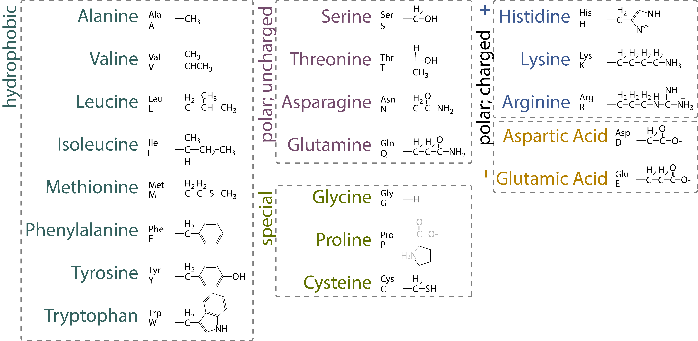
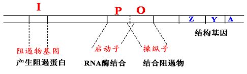
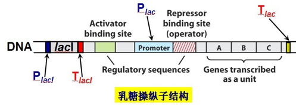
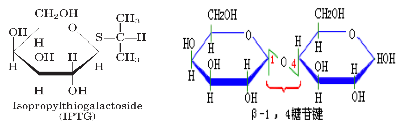
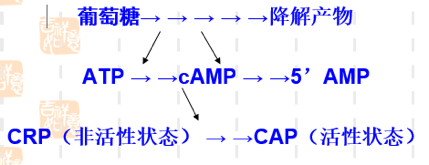

# 分子生物学基础

## 1. 微生物命名

### 1.1. 分类

- 分类
  - 非细胞型：病毒、亚病毒
  - 原核细胞型：细菌（支原体、衣原体、立克次氏体、放线菌和螺旋体）
  - 真核细胞型：酵母、霉菌、原生动物、藻类
- 双名法
  - 属名 + 种名（斜体）+ 命名者姓氏缩写（正体）
  - 属名：首字母大写
  - 种名：小写字母
  - 名词所有格（表来源）
  - 形容词主格（表性质）

### 1.2. 基因

- 一般方法（三部分）
  - 3 lower case letters (pathway)
  - 1 capital letter (actual gene)
  - 1 allele number
- 突变体

|     Superscripts      |        Meaning        |    Example    |       Comment        |
| :-------------------: | :-------------------: | :-----------: | :------------------: |
|           +           |       Wild type       |   $leuA⁺$-    |        Mutant        |
|          ts           | temperature sensitive |  $leuA^{ts}$  |                      |
|          cs           |    cold sensitive     |  $leuA^{cs}$  |                      |
|          am           |    amber mutation     |  $leuA_{am}$  |                      |
|          um           | umber (opal) mutation |  $leuA_{um}$  |       琥珀突变       |
|          oc           |    ochre mutation     |  $leuA_{oc}$  |       赭石突变       |
|           R           |       resistant       |    $rif^R$    |                      |
|           Δ           |       deletion        |    $ΔleuA$    |                      |
|           -           |        fusion         |  $leuA-lacZ$  |                      |
|           :           |        fusion         |  $leuA:lacZ$  | `:` 前的基因是断裂的 |
|          ::           |       insertion       | $leuA::Tn10Ω$ |                      |
| Δ(gene)::(resistance) | deletion/replacement  |  ΔleuA::npt   |                      |

### 1.3. 表型

1. first-letter capitalized
2. not italicized

   - _DnaA⁻_ the protein produced by the _dnaA_ gene
   - _LeuA⁻_ the phenotype of a _leuA_ mutant

## 2. 基因结构

### 2.1. 基础概念

- 基因（gene）：即遗传因子，是产生一条多肽链或功能 RNA 所需的全部核苷酸序列，即带有遗传讯息的 DNA 片段；
- 顺反子（cistron）：即结构基因，为决定一条多肽链合成的功能单位。顺反子在一定条件下与基因同义；
- 多顺反子 mRNA：含有编码一个以上蛋白质的编码信息，且，这些蛋白质均是以独立的多肽被翻译的 mRNA；
- 全酶（holoenzyme）：一些酶除蛋白质外，还含有对热稳定的小分子物质。前者称为酶蛋白（apoenzyme），后者称为辅因子（cofactor）。只有酶蛋白和辅因子结合成完整的分子时，才具有活力；
- 辅酶（coenzyme）：一类可将化学基团从一个酶转移到另一个酶上的有机小分子。与酶较为松散地结合，对于特定酶的活性发挥是必要的；

### 2.2. 复制、转录、翻译

- 复制

以 DNA 为模板，在 DNA 聚合酶的催化作用下，将四种游离的 dNTP 按照碱基互补配对原则合成新链 DNA，为半保留复制，需要引物。

- 转录

以 DNA 为模版，在 DNA 指导的 RNA 聚合酶的作用下，将四种游离的 NTP 按照碱基互补配对的原则合成 RNA，为半不连续转录，需要引物。

- 翻译

以 mRNA 为模板，原料为 20 中游离的氨基酸，3 个碱基决定 1 个氨基酸。

### 2.3. ORF, CDS

开放读码框（Open Reading Frame, ORF）是从一个起始密码子开始到一个终止密码子结束的一段序列；不是所有读码框都能被表达出蛋白产物或有生物学功能的蛋白；

- CDS 必定是一个或多个 ORF；但，每个 ORF 不一定均是 CDS；
- ORF = translation（理论可能）
- CDS = transcription（事实存在）；

### 2.4. 启动子（Promoter）

位于编码区上游的非编码区。真核生物启动子包括下列几种不同顺序，能促进转录过程：

- 帽子位点

  - 转录的起始位点；

- TATA 框（Hogness box）

  - 似于原核生物的 Pribnow 框，决定转录起点的选择，为 RNA 聚合酶的结合处；
  - 一致顺序为 TATAATAAT；
  - 约在基因转录起始点上游约 -30-50bp 处；

- CAAT 框（CAAT box）

  - 真核生物基因常有的调节区，控制转录的起始频率，可能亦为 RNA 聚合酶的结合处之一；
  - 一致顺序为 GGGTCAATCT；
  - 位于转录起始点上游约 -80-100bp 处；

- GC 框（GC box）

  - 转录因子 Sp1 能识别 GC 框且与之结合，其 N 端有激活转录的作用；
  - 由 GGCGGG 组成；
  - 位于 CAAT 框的两侧，有 2 个拷贝；

### 2.5. 增强子（Enhancer）

又称远上游序列（far upstream sequence），一般都在-100bp 以上；

- 对依赖于 TATA 框的转录和不依赖 TATA 框的转录都有增强效应，但对前者增强效应高；
- 增强子是通过启动子来增加转录的，有效的增强子可位于基因的 5'端，也可位于基因的 3'端，有的还可位于基因的内含子中；
- 增强子的效应很明显，一般能使基因转录频率增加 10-200 倍，有的甚至可高达上千倍；

### 2.6. 终止子（Terminator）

在一个基因的末端往往有一段特定顺序，具有转录终止的功能，为反向重复序列，是 RNA 聚合酶停止工作的信号，反向重复序列转录后，可形成发夹式结构，且形成一串 U。发夹式结构阻碍了 RNA 聚合酶的移动，一串 U 的 U 与 DNA 模板中的 A 结合不稳定，从模板上脱落下来，转录终止。

## 3. 乳糖操纵子

### 3.1. 操纵子（Operon）

很多功能相关的结构基因串联排列在染色体上，由一个共同的控制区来操纵这些基因的表达，包含这些结构基因和控制区的整个核苷酸序列就称为操纵子。

- 1960∼1961 年，Monod 和 Jacob 首次提出"操纵子"学说（Lodish et al. 2000），获 1965 年诺贝尔生理学和医学奖；
- 1940 年，Monod 发现细菌在含葡萄糖和乳糖的培养基上生长时，细菌先利用葡萄糖，葡萄糖用完后，才利用乳糖；在糖源变换期，细菌的生长会出现停顿。即产生"二次生长曲线"。

### 3.2. 相关概念

- 组成型表达（constitutive expression）：在个体发育的任一阶段都能在大多数细胞中持续进行的基因表达，受环境因素的影响较少；
- 持家基因（housekeeping gene）：表达产物通常是对生命过程必需的、必不可少的基因；
- 诱导（induction）：在特定的环境信号刺激下，相应基因被激活，从而使基因的表达产物增加的过程；
- 阻遏（repression）：在特定环境信号刺激下，相应基因被抑制，从而使基因的表达产物减少的过程；
- 协调表达（coordinate expression）：在一定机制控制下，功能上相关的一组基因，无论其为何种表达方式，均需协调一致、共同表达，使各表达产物的分子比例适当，从而正常发挥功能的现象；
- 安慰诱导物（gratuitous inducer）：能诱导酶的合成，但又不被分解的分子；

### 3.3. 组成

- 三个特异性序列

  - 操纵子 O（operator）: 阻遏蛋白结合位点，指能被调控蛋白特异性结合的一段 DNA 序列；
  - 启动子 P（promoter）: 位于结构基因的上游，指能被 RNA 聚合酶识别、结合并启动基因转录的一段 DNA 序列；
  - CAP 结合位点：环 cAMP 受体蛋白（分解代谢物激活蛋白）结合位点；

- 一个调节基因

  - _lac I_：编码阻遏蛋白，能结合于操纵序列位点；

- 结构基因

  - 结构基因（structural gene，SG）：操纵元中被调控的编码蛋白质的基因
  - Z 编码 _β_-半乳糖苷酶：将乳糖水解成葡萄糖和半乳糖；
  - Y 编码 _β_-半乳糖苷透过酶：使外界的 _β_-半乳糖苷（如乳糖）能透过大肠杆菌细胞壁和原生质膜进入细胞内；
  - A 编码 _β_-半乳糖苷乙酰基转移酶：乙酰 CoA 上的乙酰基转到 _β_-半乳糖苷上，形成乙酰半乳糖；

### 3.4. 多顺反子 mRNA

多顺反子 mRNA 在细菌中很普遍。多顺反子 _lac_ mRNA 中的 lacZ，lacY，lacA 经翻译生成的产物分别生成代谢分解乳糖的三种酶，且始终存在着一定的比例关系（Z:Y:A = 5:2:1）

- lacZ，lacY，lacA 基因的转录是由 lacI 基因指令合成的阻遏蛋白 R 所控制；
- lacI 一般和结构基因相毗连，但它本身具有自己的启动子和终止子，成为独立的转录单位；
- 由于 lacI 的产物是可溶性蛋白，按照理说是无需位于结构基因的附近，它是能够分散到各处或结合到分散的 DNA 位点上；

## 4. 乳糖操纵子的调控

### 4.1. 阻遏蛋白的负调控

- 无乳糖：lac 操纵子处于阻遏状态（repression）；
- 有乳糖（presence of lactose）：_lac_ 操纵子即可被诱导；
- 诱导剂（inducer）：别乳糖、半乳糖、IPTG（异丙基硫代半乳糖苷）

### 4.2. IPTG

由于乳糖虽可诱导酶的合成，但又随之分解，产生很多复杂的动力学问题，因此人们常用安慰诱导物来进行各种实验，如异丙基-_β_-D-硫代半乳糖苷（IPTG）；

- IPTG 与自然的 _β_-半乳糖苷酶相似，且不能被酶分解，它的浓度在实验中不会改变。能在缺乏_lacY_ 基因下而有效地被运送。
- 半乳糖苷键中用硫代替了氧，失去了水解活性，但硫代半乳糖苷和同源的氧代化合物与酶位点的亲和力相同，IPTG 虽不为 _β_-半乳糖苷酶所识别，但它是 lac 基因簇十分有效的诱导物；
- X-gal（5-溴-4-氯-3-吲哚-_β_-半乳糖苷）亦为一种人工化学合成的半乳糖苷，可被 _β_-半乳糖苷酶水解产生兰色化合物，因此可用作 β－半乳糖苷酶活性的指示剂；IPTG 和 X-gal 都被广泛应用在分子生物学和基因工程的工作中；

### 4.3. CAP 的正调控

CAP（catabolite activator protein）：分解代谢基因激活蛋白，又称为 CRP（cAMP receptor protein），_lac_ 操纵子高水平转录必需的一个激活蛋白；

- CAP（同二聚体），含 DNA 结合区
  以二聚体的方式与特定的 DNA 序列结合，cAMP 结合区与 cAMP 特异结合，并发生空间构象的变化，形成 cAMP-CAP 复合物（有活性）；
- 当 CAP 与 CAP 结合位点这段序列结合时，可激活 RNA 转录酶活性，使之提高 50 倍；
- 葡萄糖效应

当细菌在含有葡萄糖套和乳糖的培养基中生长时，通常优先利用葡萄糖。只有当葡萄糖消耗完，经过一段停滞期，在乳糖的诱导下半乳糖苷酶开始合成，细菌才能充分利用乳糖。葡萄糖的降解物能抑制腺苷酸环化酶活性，并活化磷酸二脂酶，因而降低 cAMP 的浓度。故葡萄糖存在时，cAMP 浓度低；仅在葡萄糖消耗完毕时，cAMP 浓度增高，CAP-cAMP 复合物形成（结合于 _lac_ 操纵子 CAP 结合位点），才会促进转录。

### 4.4. 协调调控

由于 $P_{lac}$ 是弱启动子，单纯因乳糖的存在发生去阻遏使 _lac_ 操纵元转录开放，还不能使细菌很好利用乳糖，必需同时有 CAP 来加强转录活性，细菌才能合成足够的酶来利用乳糖；

- 关键条件：_lac_ 操纵子的强诱导既需要有乳糖的存在又需要没有葡萄糖可供利用。

### 4.5. 阻遏蛋白和 CAP 的双重调控

- 负调节与正调节协调合作

  - 阻遏蛋白封闭转录时，CAP 不发挥作用；
  - 如没有 CAP 加强转录，即使阻遏蛋白 R 从 P 上解聚仍无强大转录活性；
  - 葡萄糖可降低 cAMP 浓度，阻碍其与 CAP 结合从而抑制转录；

- 本底表达

在细胞中透性酶等总是以最低量存在着，足以供给底物开始进入时的需要。即，操纵子有一个本底水平（basal level）的表达，即使没有诱导物的存在，也保持此表达水平（诱导水平的 1‰）；有的诱导物是通过其他吸收系统进入细胞的。

## 5. 出芽酵母基因的命名

1. Dominant gene: 3 upper case letters + 1 number
2. Recessive gene: 3 lower case letters + 1 number
3. Alleles: gene symbol + a hyphen + 1 italic Arabic number, _e..g._, act1-606, his2-1
4. Protein: Proteins are referred to by the relevant gene symbol, non-italic, initial letter uppercase and with the suffix p, _e.g._, Ade5p, Cdc28p
5. Phenotypes: a non-italic three-letter abbreviation corresponding to the gene symbol, initial letter uppercase. _e.g._, Arg⁻, Arg⁺.
