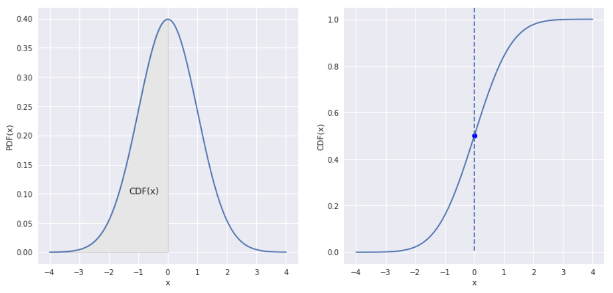
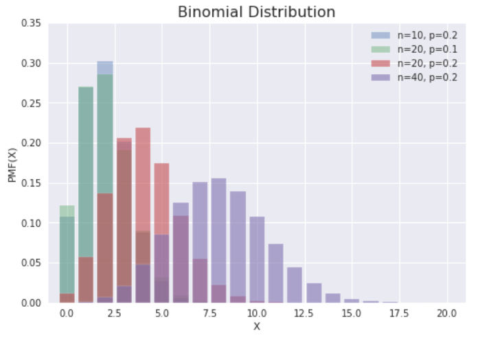
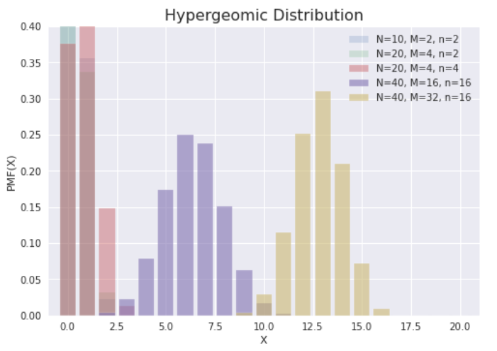
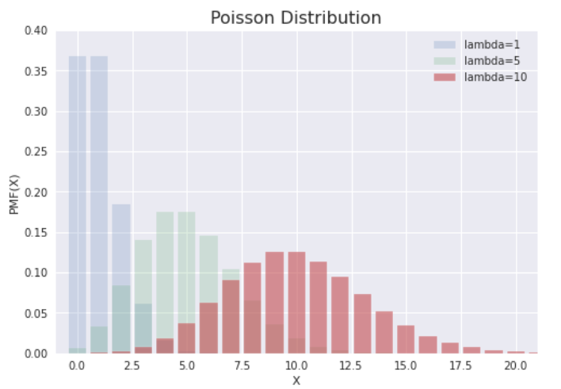
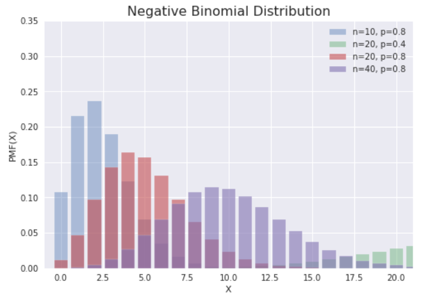
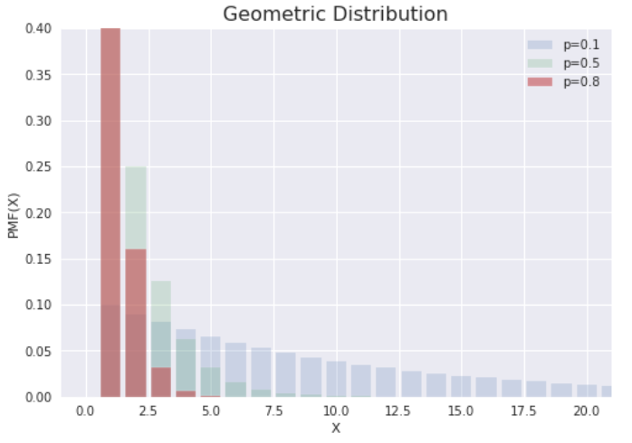
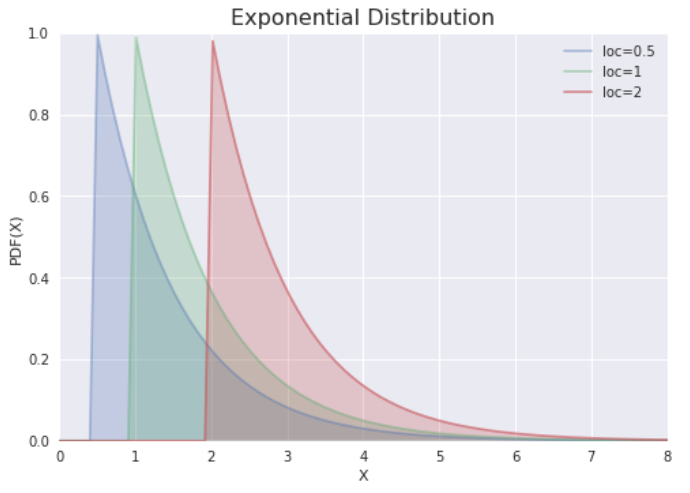
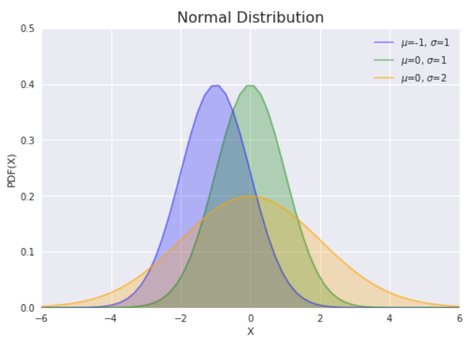
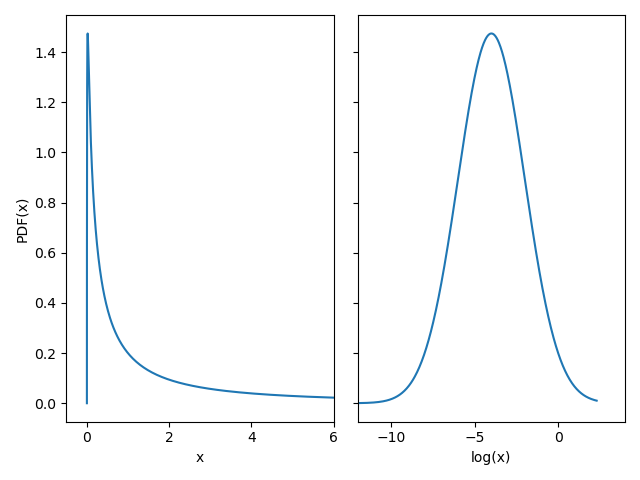
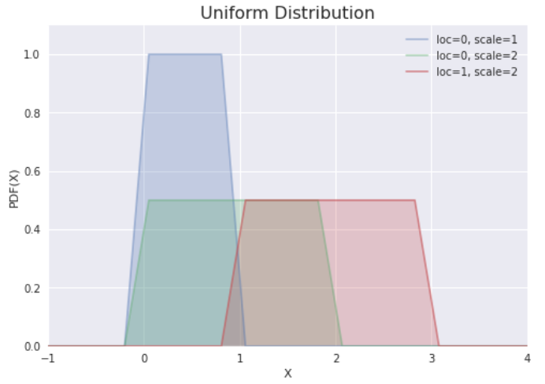

# 概率与分布

## 1. 集合

- Boolean 方程：$f_n:\{0, 1\}^{n} → \{0, 1\}$有$2^{2^{n}}$个子集

:::{admonition} 组合数定理

$$
∑_{i = 1}^{k} p_{i} = n (p_{i} ∈ ℕ⁺) →
∑_{i = 1}^{k} q_{i} = n - k (q_{i} ∈ ℕ)
$$

$$
∑_{i = 1}^{k} r_{i} ≤ n (r_{i} ∈ ℕ) →
∑_{i = 1}^{k+ 1} r_{i} = n (r_{i} ∈ ℕ)
$$

:::

### 1.1. 集合的运算

样本空间：包括所有可能结果的集合，可连续，可离散。

- 交换律

$$
A ∪ B = B ∪ A
$$

$$
A ∩ B = B ∩ A
$$

- 结合律

$$
A ∪ (B ∪ C) = (A ∪ B) ∪ C
$$

$$
A ∩ (B ∩ C) = (A ∩ B) ∩ C
$$

- 分配率

$$
A ∪ (B ∩ C) = (A ∪ B) ∩ (A ∪ C)
$$

$$
A ∩ (B ∪ C) = (A ∩ B) ∪ (A ∩ C)
$$

- De Morgen 律

$$
\overline{A ∪ B} = \overline{A} ∩ \overline{B}
$$

$$
\overline{A ∩ B} = \overline{A} ∪ \overline{B}
$$

- 转化

$$
A + B = A ∪ B
$$

$$
A - B = A\overline{B}
$$

$$
A(B-C) = AB - AC
$$

- 笛卡尔积

$$
A× B = \{(x, y) |x ∈ A ∧ y ∈ B\}
$$

$$
A×∅ = ∅
$$

> 笛卡尔幂：$n$元集合有$2^{n} -1$个子集，其$k$阶笛卡尔幂有$n^{k}$个元素

### 1.2. 重排、组合

1. $P_r^{n} = \dfrac{n!}{(n -r)!}$
2. $P_r^{r} = r!$
3. $C_r^{n} = \dfrac{P_r^{n}}{P_r^{r}} = \bigg(\begin{matrix} n \\ r \end{matrix}\bigg)$
4. Pascal 公式

$$
\binom{n + 1}{k} = \binom{n}{k} + \binom{n}{k-1}
$$

### 1.3. 事件的运算

在概率论中，考虑一个样本空间 Ω，它是所有可能结果$ω$的集合，以及它的子集的集合$F$，其结构为 σ 代数，其元素称为事件（event）。

- 有限可加性

$$
A ⊂ B ⇒ P(B-A) = P(B) - P(A) ⇒ P(A) ≤ P(B)
$$

- 加法定律

$$
P(A ∪ B) = P(A) +P(B) -P(AB)
$$

### 1.4. 随机变量

- 随机变量

一个真实的随机变量 X 是一个（可度量的）从 Ω 到 ℝ 的映射。

$$
X: ω ∈ Ω ↦ x ∈ ℝ
$$

- 离散随机变量

若一个随机变量$X$在 ℝ 的一个子集中取值，其取值个数可度量，则说它是离散的。

## 2. 条件概率

### 2.1. 定义

- 古典概率

  - 无需实验
  - 没有误差
  - 可能性有限且大小相等

- 条件概率

  - 指事件$𝐀$在事件$B$已发生条件下的发生概率
  - 表示为：$P(A|B)$，$P(AB) = P(B|A)P(A)$

### 2.2. 独立性

独立 ⇔ $P(AB) = P(A)P(B) ⇒ A ∩ B = ∅$

- 推论 1

$$
\begin{cases}
  P(AB) = P(A)P(B) \\
  P(A)> 0\\
\end{cases}
⇔ P(B|A) = P(B)
$$

- 推论 2

### 2.3. 全概率公式

- 完备事件群：任意两事件互斥，所有事件的并集是整个样本空间（必然事件）
- 全概率公式：对完备事件组$B_{i}$，若事件都有正概率，则对任一事件$𝐀$都有如下公式成立

$$
P(A) = P(Aω) = P(∑_{1}^{n}AB_{i}) = ∑_{1}^{n}{P(AB_{i})} = ∑_{1}^{n}{P(B_{i})P(A|B_{i})}
$$

## 3. 随机分布

### 3.1. 分布函数



- 概率质量函数（Probability Mass Function，PMF）：离散随机变量在各特定取值上的概率。
- 概率密度函数（Probability Density Function，PDF）：连续随机变量的 PMF。
- 累积分布函数（Cumulative Distribution Function，CDF）：PDF 的积分，是分位数的倒数。

$$
\mathrm{CDF}(x) = ∫_{-∞}^x\mathrm{PDF}(x) dx
$$

$$
P(a ≤ x ≤ b) = ∫_a^b\mathrm{PDF}(x) dx = \mathrm{CDF}(b) - \mathrm{CDF}(a)
$$

> $k$ 个随机值的和 $S_{k} ≥ 4\sqrt{k}$

- 生存函数（Survival Function，SF）：1 - CDF，给出大于给定值的值的概率。也可解释为数据"存活"超过某个值的比例。
- 百分点函数（Percentile Point Function，PPF）：CDF 的逆函数。
- 逆生存函数（Inverse Survival Function，ISF）

## 4. 常见离散分布

### 4.1. 二项分布

设试验 _E_ 只有 2 种可能结果 A 和 Ā，则称 _E_ 为 Bernoulli 试验，将此试验独立重复$n$次，即为$n$重 Bernoulli 试验（如放回采样），其结果的发生概率服从 Bernoulli 分布，也叫 (0-1) 分布。

将后者的试验结果$X$扩展为 ℤ，则其中一个结果$k (k ∈ ℤ)$的发生概率$P\{X = k\}$服从二项分布

$$
P(X = i) = \binom{n}{i}p^{i}(1 - p)^{n - i}, i ∈ ℕ
$$

:::{admonition} 二项式定理

$$
(a + b)^{n} = ∑∑_{i=0}^{n}\binom{n}{i}a^{n - i}b^{i} (∀a, b ∈ ℝ, ∀n ∈ ℤ⁺)
$$

:::

:::{admonition} 多项式定理

$$
\bigg(∑_{i = 1}^{m} a_{i}\bigg)^{n} = ∑\binom{n}{k₁, k₂, ⋯, k_m} ∏_{t = 1}^{m} a_t^{k_t} (a_{i} ∈ ℝ, ∀k_{i} ∈ ℕ, ∑_{i = 1}^{m} k_{i} = n)
$$

:::



假如投一个正六面体的筛子 256 次，则得到 32 次 6 的概率，可由如下方式计算

```{code} python
from scipy import stats

def binomial_test(n, p, checkVal):
  bn = stats.binom(n, p)
  p_oneTail = bn.sf(checkVal-1)
  p_twoTail = stats.binom_test(checkVal, n, p)

  return (p_oneTail, p_twoTail)

n, p = 256, 1/6
checkVal = 64

p1, p2 = binomial_test(n, p, checkVal)
print(f'The chance that you roll {checkVal} or more "6" is {p1:5.3f}, and the chance of an event as extreme as {checkVal} or more rolls is {p2:5.3f}')
# The chance that you roll 64 or more "6" is 0.000, and the chance of an event as extreme as 64 or more rolls is 0.001
```

### 4.2. 超几何分布

一批产品共$N$个，其中废品$M(≤ N)$个。随机抽取$n$个，含$m$个废品的概率服从分布，相当于不放回抽样的二项分布

$$
P(X = m) = \binom{N - M}{n - m} \binom{M}{m}/\binom{N}{n}
$$



### 4.3. Poisson 分布

Poisson 分布用于描述单位时间内随机事件发生的次数。将时间切分为$n$个时段，设某事件的总发生次数为$λ$，则一个时段内该事件发生的概率为$p= λ/n$，代入二项分布，

$$
P(X = i) = \binom{n}{i}\bigg(\dfrac{λ}{n}\bigg)^{i}\bigg(1-\dfrac{λ}{n}\bigg)^{n - i}
$$

当$n → ∞$

$$
\binom{n}{i}/n^{i} → 1/i!
$$

$$
\bigg(1 - \frac{λ}{n}\bigg)^{n} → e^{-λ}
$$

得

$$
P(X = i) = e^{-λ}⋅\frac{λ^{i}}{i!}, i ∈ ℕ
$$

- Poisson 分布的均值、方差具有**线性可加性**。



### 4.4. 负二项分布

已知合格率为$p$时，进行$n$次实验，抽到合格品$r$个，服从分布

$$
P(X = i) = \binom{i + r - 1}{r - 1}p^{r}(1 - p)^{i}
$$

此分布得名于负二项展开式

$$
(1 - x)^{-n} = ∑₀^{∞} \binom{i + n + 1}{n + 1} x^{n}
$$



> 当$r$为整数时，又称帕斯卡分布。

### 4.5. 几何分布

对负二项分布，当$r = 1$，则有分布

$$
P(X = i) = p(1 - p)^{i}
$$

即第一次成功之前的失败次数。几何分布得名于几何级数：

$$
G = ∑_{i = 0}^{n} ar^{i} = a\bigg(\frac{1 - r^{n + 1}}{1 - r}\bigg),\ r ≠ 1
$$



### 4.6. 小结

|    离散分布    |     表示     |  结果取值  |    常见情况    |
| :------------: | :----------: | :--------: | :------------: |
| Bernoulli 分布 |  $Bern(p)$   | $\{0, 1\}$ | 单样本互斥事件 |
|    二项分布    |  $B(n, p)$   |     ℤ      | 多样本互斥事件 |
|   超几何分布   | $H(N, m, n)$ |     ℤ      | 不放回二项分布 |
|  Poisson 分布  |   $Poi(λ)$   |     ℤ      |   小概率事件   |

1. 当$n ≥ 20, p ≤ 0.05$，$B(n, p) → Poi(λ)$
2. 当$np ≥ 5$，$B(n, p) → N(np, np(1 - p))$
3. 当$λ ≥ 20$，$Poi(λ) → N(λ, λ)$
4. 当$N → ∞$，$H(N, m, n) → B(n, p)$（当$n$固定，则$p=M/N$固定）

## 5. 常见连续分布

### 5.1. 指数分布

指数分布表示 Poisson 过程中的事件的时间间隔。可以看作是逆 Poisson 分布。

> 逆分布（inverse distribution）是随机变量的倒数服从的分布。

概率密度函数

$$
f(x, λ) =
\begin{cases}
  λe^{-λx}, & x ≥ 0\\
  0, & x < 0
\end{cases}
$$

其中，$λ > 0$，是分布的参数，即每单位时间发生该事件的次数。



- 无记忆性

$$
∀s, \ t ≥ 0 ⇒ P(X > s + t | X > s) = P(T > t)
$$

### 5.2. 高斯分布

高斯分布或高斯分布是所有分布函数中最重要的。这是由于所有分布函数的均值在足够大的样本数下都近似于高斯分布。

概率密度函数

$$
f(x) = \frac{1}{\sqrt{2π} σ} e^{-\frac{(x - μ)²}{2 σ²}}
$$

> 该式由 de Moivre-Laplace 中心极限定理首先给出，详见第二章。



### 5.3. 对数高斯分布

数据的对数正态变换通常用于将高偏度分布变换为高斯分布。

$$
f(x, s) = \frac{1}{s x \sqrt{2π}} \exp{\bigg(-\frac{\log²(x)}{2 s²}\bigg)}
$$

其中，$s$为形状参数。



### 5.4. 均匀分布

概率密度函数

$$
\begin{cases}
  \dfrac{1}{b - a}, & x ∈ (a, b) \\
  0, & x ∉ (a, b)
\end{cases}
$$


