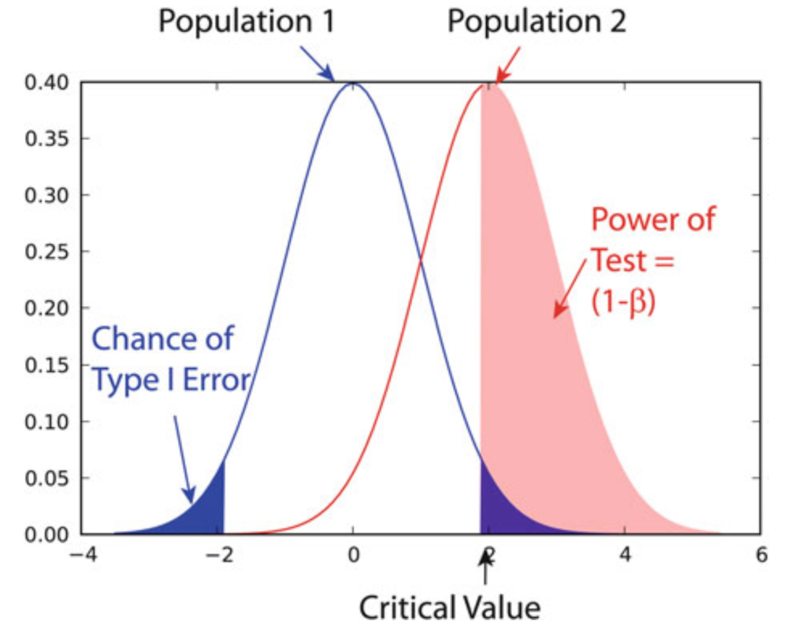

# 参数估计

## 1. 点估计

### 1.1. 矩估计

即经验分布函数的矩。

- 原点矩

$$
a_{k} = \frac{1}{n} ∑_{1}^{n} X_{i}^{k}
$$

- 中心矩

$$
m_{k} = \frac{1}{n} ∑(X_{i} - X̂)^{k}
$$

> $m₂ = \dfrac{n - 1}{n}S²$

由随机样本计算出的分布参数估计总体分布参数（分布已知）

$$
a_m = ∫_{-∞}^{∞} x^{m} f(x;θ₁, ⋯, θ_{k}) dx
$$

### 1.2. 最大似然估计

由样本分布估计总体分布

$$
L(x₁, ⋯, x_n; θ₁, ⋯, θ_n) = \underset{θ₁, ⋯, θ_n}{\mathrm{argmax}}\ ∏ f(x_{i};θ₁, ⋯, θ_n)
$$

由

$$
\ln L = ∑\ln f(X_{i}; θ₁, …, θ_{k})
$$

建立方程组

$$
\frac{∂\ln L}{∂θ_{i}} = 0
$$

得极值点

### 1.3. 点估计评判

- 无偏性

$$
E_{θ₁, ⋯, θ_n}[ĝ(x_{i})] = g(θ₁, ⋯, θ_n)
$$

当$N → ∞$，

$$
\frac{∑ĝ(x_{i})}{N} → g(θ₁, ⋯, θ_n)
$$

- 最小均方误差

$$
\begin{aligned}
E_θ[θ̂(x₁, ⋯, x_n) -θ]² = D_θ(θ̂) + [E_θ(θ̂ - θ)]²
\end{aligned}
$$

## 2. 区间估计

### 2.1. 概念

对统计量$θ̂₁(x₁, ⋯, x_n) ≤ θ̂(x₁, ⋯, x_n)$

要求

1. $P_θ(θ̂₁(x₁, ⋯, x_n) ≤ θ ≤ θ̂₂(x₁, ⋯, x_n))$ 尽可能大
2. $θ̂₂ - θ̂₁$ 尽可能小

由于$1^{∘}, 2^{∘}$在一定成都上相互矛盾，Neymann 提出**定义**：给定一个很小的数$α > 0$，对$∀θ, P_θ = 1 - α$，即区间估计的置信系数为$1 - α$

### 2.2. 枢轴变量法

设$X_{i}$为$N(μ, σ²)$的样本，$σ²$已知，则

$$
\frac{X̂ - μ}{σ/\sqrt{n}} ∼ N(0, 1)
$$

记$Φ(x)$为$N(0, 1)$的分布函数，对$β ∈ (0, 1)$，若$Φ(μ_{β}) = 1 - β$，则称$μ_{β}$为$N(0, 1)$的上$β$分位点。

由$Φ(-t) = 1 - Φ(t)$，

$$
P(-μ_{α/2} ≤ X ≤ u_{α/2}) = Φ(u_{α/2}) - Φ(-u_{α/2})
$$

即

$$
[θ̂₁, θ̂₂] = [X̂ - σ⋅u_{α/2}/\sqrt{n}, X̂ + σ⋅u_{α/2}/\sqrt{n}]
$$

## 3. 假设检验

### 3.1. 参数

假设检验可分为参数检验和非参数检验。

参数检验设数据可由一个或多个参数定义的分布很好地描述，在大多数情况下由高斯分布定义。对于给定的数据集，然后确定该分布的最佳拟合参数及其置信区间并进行解释。但，这种方法仅在给定数据集实际上与所选分布很好地接近时才有效。若不是，参数检验的结果可能完全错误。在那种情况下，必须使用不太敏感的非参数检验。

### 3.2. 零分布、p 值

零分布（null distribution）是两总体样本的均值的差值分布，设检验中首先认为样本均符合此分布，这样的设称为零假设（null hypothesis），记做 H₀，定义另一个与零假设完全相反的备择设（alternative hypothesis），记做 Hₐ。

- H₀ 的条件下，出现极端的样本的概率即为 p-value，当其小于一定水平，即 p-value ≤ α，说明此前假设的"意外"确实有别于整体，则可拒绝零假设
- 等号总是出现在零假设中

|    样本    |      双尾      |      单尾      |
| :--------: | :------------: | :------------: |
| 样本与总体 |       ≠        |     > 或<      |
|  配对样本  |       ≠        |     > 或<      |
| 独立双样本 | 等方差、异方差 | 等方差、异方差 |

### 3.3. 错误、检验力

- 错误 I：假阳性错误，即在 H₀ 为真时，接受 Hₐ，错误 I 概率 $α$又称为显著性水平
- 错误 II：假阴性错误，即在 Hₐ 为真时，接受 H₀，错误 II 概率为$β = P(Z ≤ Z₀ + z_α)$
- 假设检验的前提：简单随机样本，且相互独立
- 正态总体的采样量：< 30，采样分布为 _t_ 分布，≥ 30 均值的采样分布为高斯分布。

统计检验的检验力（power）的确定以及揭示给定幅度的影响所需的最小样本量的计算被称为检验力检验（power test），是对 H₀ 检验的灵敏度的度量。它涉及四个因素：

- $α$，类型 I 错误的概率；
- $β$，类型 II 错误的概率，$1 - β$即检验功效；
- $d$，效应量
- $n$，样本量

选择以上因素中的 3 个，则第 4 个也随即确定。

> 当$n$一定时，$α, β$此消彼长。
> 功效与参数间差异（均值差）、$α$、$n$呈正相关。

$β$的分布由下式计算，

$$
Z_{β} = \frac{\sqrt{n}δ}{σ} - Z_{α}
$$

其中，δ 为容许误差，$Z_{β}$为规范分布的单侧临界值。



|    名词    |           意义           |        表示        |
| :--------: | :----------------------: | :----------------: |
|  置信区间  |   估计总体真实值的范围   |   均值 ± 误差限    |
|   误差限   |     估计值的最大误差     | 临界值 × 标准误差  |
| 显著性水平 |   正态总体尾部的总概率   |         α          |
|   置信度   |    落在中间区域的概率    |       1 - α        |
|   临界值   |                          | $z_{α/2}, t_{α/2}$ |
|  p-value   | 拒绝原设的最小显著性水平 |   检验统计量得出   |

> 当$α = 0.05$，$z_{α/2} = 1.96$，此时置信区间为$X̂ ± 1.96*\frac{σ}{\sqrt{n}}$

## 4. 效应量

效应量（effect size）是指由于因素引起的差别，是度量处理效应大小的指标。是所研究的效应相对于样本方差 $σ$ 的大小。与显著性检验不同，这些指标不受样本容量影响。它表示不同处理下的总体均值之间差异的大小，可在不同研究之间进行比较。均值差异、方差分析解释比例、回归分析解释比例需要用效应量描述。当样本容量大到显著时，有必要报告效应量大小。

### 4.1. Cohen's _d_

Jacob Cohen（1932∼1998）定义了 _d_ 值和两个总体的并合标准偏差（pooled standard deviation，$S_p²$）

$$
d = \frac{X̄₁ - X̄₂}{S_p}
$$

由 _t_ 值定义，$d = t/\sqrt n$，对$k$个不同总体的样本

$$
S_p² = \frac{∑_{i = 1}^{k} (n_{i} -1)S_{i}²}{∑_{n - 1}^{k} (n_{i} -1)}
$$

其中，$S_{i}²$为每个样本的方差。

当$k = 2$时，$S_p²$即为不同总体 _t_ 检验中的$S_w²$，即有

$$
d = \frac{D}{σ}
$$

2009 年，Shlomo S. Sawilowsky（1954∼）在 Cohen 的基础上，完善了对 _d_ 值效应的描述。

| Effect size | Cohen's d |
| :---------: | :-------: |
|   small+    |   0.01    |
|    small    |   0.20    |
|   medium    |   0.50    |
|    large    |   0.80    |
|   large+    |   1.20    |
|    huge     |   2.00    |

### 4.2. 比例

对于比例，效应量$d$为

$$
d = 2 * (\arcsin{\sqrt\mathrm{prop₁}} - \arcsin{\sqrt\mathrm{prop₂}})
$$

```python
from statsmodels.stats.proportion import proportion_effectsize
from statsmodels.stats.power import tt_{i}nd_solve_power

n_samples = tt_{i}nd_solve_power(effect_size = 0.5, α = 0.05, power = 0.8)
n_samples
# 63.765611775409525

effect_size = tt_{i}nd_solve_power(α = 0.05, power = 0.8, nobs1 =25)
effect_size
# 0.8087077886680412

## The corresponding command for one sample t-tests is power.tt_solve_power

effect_size_p = proportion_effectsize([0.3, 0.4, 0.5], 0.4)
effect_size_p
# array([-0.21015893, 0., 0.20135792])
```

### 4.3. 样本量

设从中抽取样本的总体的均值为$X̂$且标准差为 σ，而实际总体的均值为$μ = X̂ + D$且标准差相同，则最小样本数量

$$
n = \frac{(z_{1 - α/2} + z_{1 - β})²}{d²}
$$

其中，$z = \dfrac{x - μ}{σ}$为 _Z_ 统计量，$d$为效应量。

换句话说，若真实均值的值为$X̂$，所有检验中的至少$1 - α％$可正确检测到；若真实均值偏移了$D$或更多，则应检测到这个可能性至少为$1 - β％$。

对不同总体

$$
n₁ = n₂ = \frac{(z_{1 - α/2} +z_{1 - β})²(σ²₁ + σ²₂)}{D²}
$$

```python
def sampleSize_oneGroup(d, α, β, σ= 1):

    n = np.round((func.ppf(1 - α/2) + func.ppf(1 - β))**2 * σ**2 / d**2)
    print((f'You need at least {int(n):d} subjects.'))
    return n

def sampleSize_twoGroups(d, α, β, σ1 = 1, σ2 = 1):

    n = np.round((func.ppf(1 - α/2) + func.ppf(1 - β))**2 * (σ1**2 + σ2**2) / d**2)
    print((f'You need at least {int(n):d} subjects.'))
    return n

func = stats.norm
α, β = 0.05, 0.2
sampleSize_oneGroup(0.5, α, β)
print('-'*30)
sampleSize_twoGroups(0.4, α, β, σ1 = 0.6, σ2 = 0.6)
```
