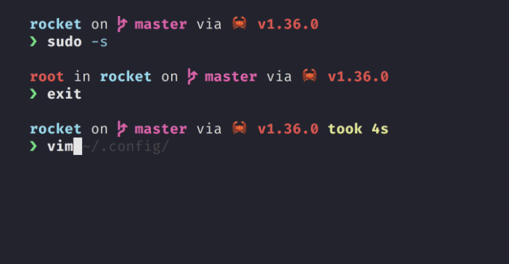
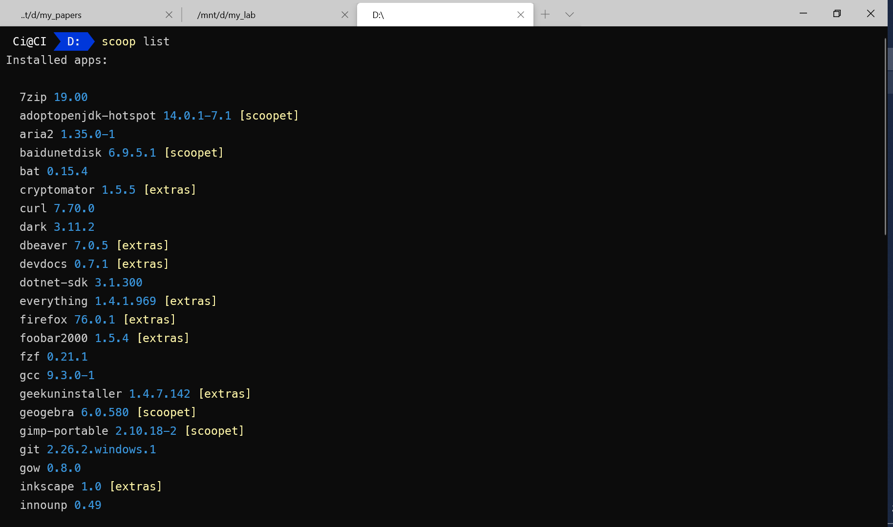

# 打造 Windows 优雅终端

## 1. PowerShell

### 1.1. 主题

Starship 是由 Rust 编写的命令行主题，简单高效、容易配置（基本不用配置），而且跨平台。

使用 Scoop 安装

```bash
scoop install starship
```

打开配置文件

```powershell
code $PROFILE
```

添加

```powershell
Invoke-Expression (&starship init powershell)
```

我之前用 OhMyPosh，但时间长了觉得那些花里胡哨的东西都是浮云，效率才是第一位的，况且 Starship 的默认配置已经可以提供足够多的信息，配置有独立的文件，不与 PowerShell 本身耦合，可定制性高于 OhMyPosh，而且跨平台。

〉详情参考 [Starship 官网](https://starship.rs/)



因为涉及到字体和 Windows-Terminal，这里推荐使用 Scoop 安装（见 Scoop 篇的介绍）：

```powershell
scoop install oh-my-posh
scoop install ivaquero/scoopet/firacode-nf
```

### 1.2. 使用 Linux 命令

安装 `gow`，其可将 Powershell 的命令替换成对应的 Bash 命令

```powershell
scoop install gow
```

## 2. Windows-Terminal

- 安装

```powershell
scoop install windows-terminal
```

### 2.1. 右键菜单

```powershell
$basePath = "Registry::HKEY_CLASSES_ROOT\Directory\Background\shell"
sudo New-Item -Path "$basePath\wt" -Force -Value "Windows Terminal here"
sudo New-ItemProperty -Path "$basePath\wt" -Force -Name "Icon" -PropertyType ExpandString -Value "C:\Scoop\apps\windows-terminal\current\Images\LargeTile.scale-100.png"
sudo New-Item -Path "$basePath\wt\command" -Force -Type ExpandString -Value '"C:\Scoop\apps\windows-terminal\current\WindowsTerminal.exe" -p PowerShell -d "%V"'
```



### 2.2. 整体配置

```json
{
  "$schema": "https://aka.ms/terminal-profiles-schema",
  // 默认启动的终端 id
  "defaultProfile": "{07b52e3e-de2c-5db1-bd2d-ba144ed6c273}",
  // 是否将选择的内容自动复制到剪切板
  "copyOnSelect": false,
  // 是否将格式化后的内容复制到剪切板
  "copyFormatting": false,

  // 全局设置
  "profiles": {
    "defaults": {
      "fontFace": "MesloLGL NF", //字体
      "fontSize": 12,
      "useAcrylic": true, //使用不透明度
      "acrylicOpacity": 0.9, //不透明度
      "cursorShape": "bar",
      "snapOnInput": true, //嗅探输入
      "startingDirectory": "d:"
    }
  },
  "list": [
    {
      // Make changes here to the powershell.exe profile.
      "guid": "{61c54bbd-c2c6-5271-96e7-009a87ff44bf}",
      "name": "电壳",
      "commandline": "powershell.exe",
      "hidden": false
    },
    {
      "guid": "{46ca431a-3a87-5fb3-83cd-11ececc031d2}",
      "hidden": false,
      "name": "邪神",
      "icon": "file:///c:/users/ci/pictures/icons/kali.png",
      "source": "Windows.Terminal.Wsl"
    },
    {
      "guid": "{55ca431a-3a87-5fb3-83cd-11ececc031d2}",
      "hidden": false,
      "name": "邪神（窗口）",
      "icon": "file:///c:/users/ci/pictures/icons/kali.png",
      // 窗口模式启动
      "commandline": "wsl -d kali-linux kex --wtstart -s"
    },
    {
      // Make changes here to the cmd.exe profile.
      "guid": "{0caa0dad-35be-5f56-a8ff-afceeeaa6101}",
      "name": "命令提示符",
      "commandline": "cmd.exe",
      "hidden": false
    },
    {
      "guid": "{b453ae62-4e3d-5e58-b989-0a998ec441b8}",
      "hidden": false,
      "name": "天蓝",
      "source": "Windows.Terminal.Azure"
    }
  ]
}
```

## 3. PSReadLine

- 安装

在终端中键入如下命令：

```powershell
Install-Module PowerShellGet -scope CurrentUser -Force -AllowClobber
Install-Module PSReadLine -scope CurrentUser
```

- 配置

打开配置文件

```powershell
code $PROFILE
```

添加以下配置

```powershell
Import-Module PSReadLine

Set-PSReadlineKeyHandler -Key Tab -Function Complete
Set-PSReadLineKeyHandler -Key "Ctrl+d" -Function MenuComplete
Set-PSReadLineKeyHandler -Key "Ctrl+z" -Function Undo
Set-PSReadLineKeyHandler -Key UpArrow -Function HistorySearchBackward
Set-PSReadLineKeyHandler -Key DownArrow -Function HistorySearchForward
```

## 4. 整合

### 4.1. 整合 VSCode


回到 VSCode，"ctrl"+"," 进入配置，点击右上角的图标，打开配置的 json 文件，加入如下配置

```json
{
  "terminal.integrated.shell.windows": "C:/WINDOWS/System32/WindowsPowerShell/v1.0/powershell.exe",
  "terminal.integrated.shellArgs.windows": [
    "-ExecutionPolicy",
    "Bypass",
    "-NoLogo",
    "-NoExit",
    // 初始化命令
    "-Command",
    "clear;cd d:"
  ]
}
```

### 4.2. 整合 Scoop

添加以下配置

```powershell
Import-Module "$($(Get-Item $(Get-Command scoop).Path).Directory.Parent.FullName)\modules\scoop-completion"
Import-Module "$($(Get-Item $(Get-Command scoop).Path).Directory.Parent.FullName)\modules\scoop-completion" -ErrorAction SilentlyContinue
```

### 4.3. 自定义别名

```powershell
# scoop
function sls {scoop list}
function sud {scoop update}
function suda {scoop update *}
function scl {scoop cleanup *}
function sst {scoop status}
function sck {scoop checkup}
function scat {scoop config aria2-enabled true}
function scaf {scoop config aria2-enabled false}
function srm {del -r $env:scoop\cache\*; clear}
function sbc {cd $env:scoop\buckets\scoopet}
```
