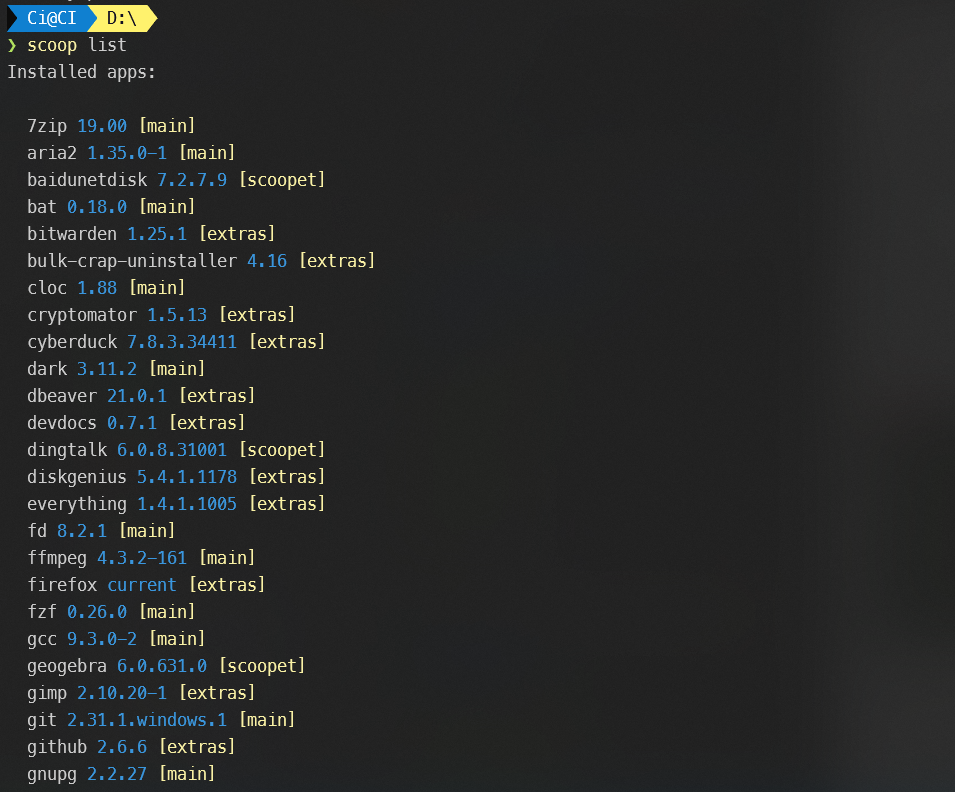
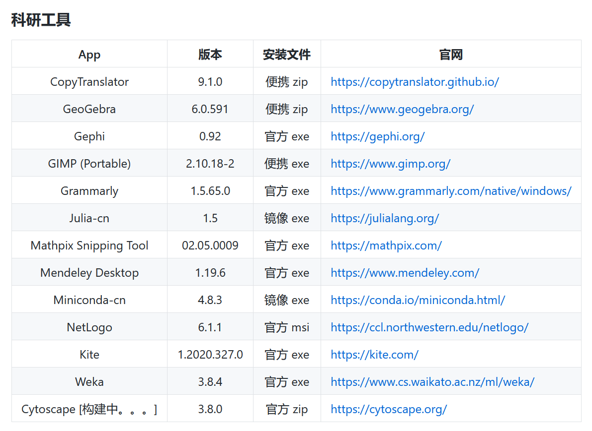
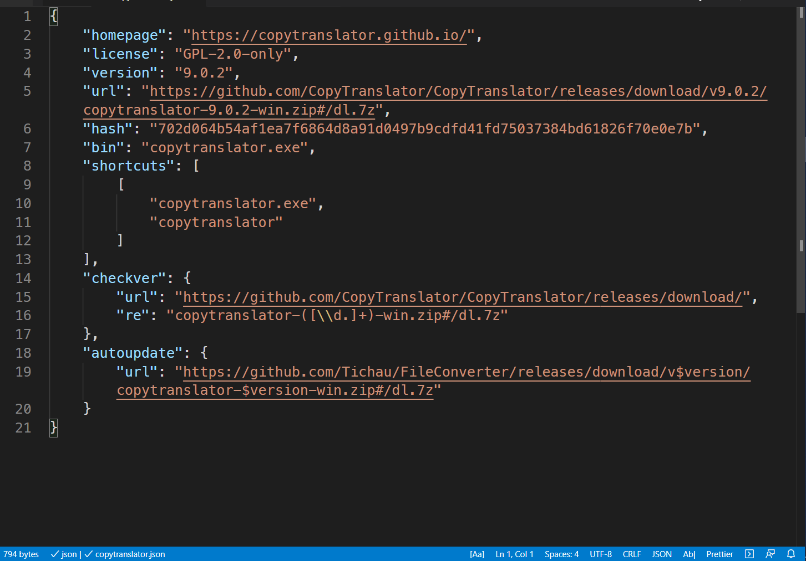
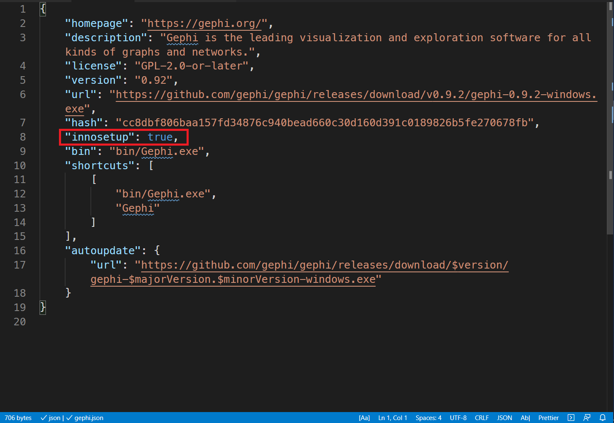

# 搭建 Windows 统一开发环境（Scoop）

## 包管理器

包管理器（package manager）是开发人员常用的生产力工具，Ubuntu 上的 **Apt-Get** 和 macOS 上的 **Homebrew** 等的使用都让开发环境的搭建变得无比丝滑。这里的包，可理解成广义上的软件，不仅包含常见的基于图形用户界面（GUI）的软件，还包含基于命令行界面（CLI）的开发工具。简单说，包管理器就是一个软件自动化管理工具。

作为一款以 GUI 见长的大众操作系统，Windows 的包管理器长期被忽视。如今，随着 Windows 的迭代和编程技术的日益普及，Windows 也有了经过时间检验的包管理器：**WinGet** 和 **Scoop**。

总的来看，上述两者各有长短。

- **Scoop**
  - 优点：
    - 自定义程度高，脚本基于 JSON，可读性较强
    - 不需要管理员权限
  - 缺点：
    - 默认涵盖的 GUI 软件少
    - 依赖社区及个人维护
  - 试用人群：喜欢折腾的程序员
  - 展望：因为不需要管理员权限，故在未来相当长的时间，仍会占有一席之地。
- **WinGet**
  - 优点：
    - 涵盖大量 GUI 软件
    - 微软官方维护
  - 缺点：
    - 命令行工具少
    - 需要管理员权限
  - 试用人群：一般程序员，及没有编程基础的人

## Scoop 的安装

**Scoop** 由澳洲程序员 Luke Sampson 于 2015 年创建，其特色之一就是其安装管理不依赖"管理员权限"，这对使用有权限限制的公共计算机的使用者是一大利好。其的安装步骤如下：

### 步骤 1：在 PowerShell 中打开远程权限

```powershell
Set-ExecutionPolicy RemoteSigned -Scope CurrentUser
```

### 步骤 2：自定义 Scoop 安装目录

```shellscript
irm get.scoop.sh -outfile 'install.ps1'
.\install.ps1 -ScoopDir 'Scoop_Path' -ScoopGlobalDir 'GlobalScoop_Path' -Proxy 'http://<ip:port>'
# 如
# .\install.ps1 -ScoopDir 'C:\Scoop' -ScoopGlobalDir 'C:\Program Files' -NoProxy
```

> **Scoop** 将默认把所有用户安装的 App 和 **Scoop** 本身置于`c:\users\user_name\scoop`

### 步骤 3：更新 Scoop
```shellscript
scoop update
```

国内镜像
```powershell
iwr -useb gitee.com/glsnames/scoop-installer/raw/master/bin/install.ps1 | iex
scoop config SCOOP_REPO 'https://gitee.com/glsnames/scoop-installer'
scoop update
```

### 步骤 4：安装包（主要是命令行程序）

```powershell
scoop install <app_name>
scoop install sudo
```

### 步骤 5：通过 `scoop help` 查看使用简介



更多信息，请访问 [Scoop 官网](https://scoop.sh/)

## Scoop 的使用（加载扩展库）

### 步骤 1：安装 Aria2 来加速下载

```powershell
scoop install aria2
```

若使用代理，有时需要通过如下命令关闭 aria2

```powershell
scoop config aria2-enabled false
```

### 步骤 2：安装 Git 来添加新仓库

```powershell
scoop install git
```

### 步骤 3：添加仓库并更新

- 添加官方维护的 extras 库（含大量 GUI 程序）

```powershell
scoop bucket add extras
# 国内镜像
# scoop bucket add extras https://gitee.com/scoop-bucket/extras.git
scoop update
```

git 下载若使用 Scoop 原生的下载协议可能比较慢，建议使用如下迂回方案：

- 用第三方下载器，如 Motrix 下载；
- 然后将文件复制到 `pathtoscoop/cache`；
- 输入 scoop install git，此时会产生一个扩展名为.download 的文件；
- 输入 scoop uninstall git；
- 重命名自己下载的文件名为 3 中的文件名，但取代 .download 文件；
- 输入 scoop install git；

### 可选步骤：添加我创建并维护的 scoopet 库（专注服务科研）

```powershell
scoop bucket add scoopet https://github.com/ivaquro/scoopet
scoop update
```

scoopet 库包含的安装脚本分为如下四类：

- 科研工具：如 miniconda（国内镜像），julia（国内镜像），copytranslator，gephi，geogebra，mendeley
- 开发辅助：如 cyberduck，virtualbox，vmware
- 日常办公：如 WPS（国内版），百度网盘，灵格斯词霸
- 社交休闲：如 you-get，网易云音乐，微信

> 详情见 [README_CN](https://github.com/ivaquro/scoopet/blob/master/README_CN.md)



### 步骤 4：安装 App

- 使用 `scoop search` 命令搜索 App 的具体名称

```powershell
scoop search <app_name>
```

- 利用插件 `scoop-completion` 协助安装

```powershell
scoop install scoop-completion
scoop install <app_name>
```

> 使用 `scoop-completion`：键入 App 名称的前几个字母后敲击 `tab` 键进行补全

### 步骤 5：查看官方推荐仓库

```powershell
scoop bucket known

main [默认]
extras [墙裂推荐]
versions
nightlies
nirsoft
php
nerd-fonts
nonportable
java
games
jetbrains
```

这里，推荐 [Apps | Scoop](https://scoop.netlify.app/apps/)，方便全网查询安装脚本所在 bucket。

## Scoop 的管理与配置

### 更新

```powershell
# 查看已安装程序
scoop list
# 查看更新
scoop status
# 删除旧版本
scoop cleanup
# 自身诊断
scoop checkup
```


### 命令行推荐

```powershell
# 使用 Linux 命令行
scoop install gow
# 调用管理员权限
scoop install sudo
# windows 终端
scoop install windows-terminal
```

### Aria2 的参数

打开`~\.config\scoop\config.json`，加入以下内容

```json
{
  "alias": {},
  // aria2 在 Scoop 中默认开启
  "aria2-enabled": false,
  // 关于以下参数的作用，详见 aria2 的相关资料资料
  "aria2-retry-wait": 4,
  "aria2-split": 16,
  "aria2-max-connection-per-server": 16,
  "aria2-min-split-size": "4M",
  "proxy": "none"
}
```

### 杀毒

```powershell
# 开启
sudo Add-MpPreference -ExclusionPath "$($env:programdata)\scoop", "$($env:scoop)"
# 关闭
sudo Remove-MpPreference -ExclusionPath "$($env:programdata)\scoop", "$($env:scoop)"
```

### 代理

```powershell
scoop config proxy proxy.example.org:8080
# 认证
scoop config proxy [username:password@]host:port
```

## 建立自己的 Bucket

由于没有自己的公司，Scoop 当前是完全社区化的，核心代码除了增加了 aria 集成，其他没有太多明显的变化，只有不断扩大的扩展库，也称 bucket。当然由于软件繁多，社区里目前主要维护的 bucket 还是 main 和 extras，姑且算是官方库。故，难免有自己需要，而官方库里有没有的软件。不过，Scoop 的简洁，使用户自定义 bucket 的技术门槛非常低，这亦为我一直以来推崇 Scoop 远胜于 Chocolatey 的主要原因之一。

Scoop bucket 的创建的关键步骤有如下两个：

- 创建 git 仓库
- 编写脚本

> 大家均是成年人了，github 这个同性交友网站的使用在这里就不做赘述了。

### bucket

推荐 fork 我的仓库 [Scoopet](https://github.com/ivaquero/scoopet)

或者这个仓库，[](https://github.com/Ash258/GenericBucket)。

其他文件基本不用改动，将自定义的脚本放在 bucket 文件夹里面就行。

### 脚本结构

Scoop 脚本的大致结构如下：



需要做的就是将其中的各项替换。现对各个项目做一下介绍，加 `*` 的是必填项：

- `*homepage`：主页链接；
- `license`：软件发布遵循的协议；
- `*version`：软件的版本；
- `*url`：软件下载链接；
- `hash`：软件的校验码；
- `bin`：安装完毕后的可执行文件（.exe 等）的相对路径；
- `shortcuts`：开始菜单里的快捷方式，上下分别为文件名、文件夹名；
- `checkver`：版本校对；
- `autoupdate`：自动升级，涉及持续集成；

#### hash

脚本开始构建的时候，需要到官网，把软件下载下来，然后本机查看 hash，默认为 sha256 码，也有 md5 和 sha1 形式的，命令如下：

```powershell
certutil -hashfile [file] sha256
certutil -hashfile [file] md5
certutil -hashfile [file] sha1
```

#### url

`url`是比较难处理的。简单说，开源软件最方便，很多可开箱即用，而非开源的不少就特别繁琐，有的甚至处理不了，如 QQ（处理不了 QQ Protect）。这个叙述起来都特别麻烦，需要具体情况具体分析，这里只简述一般情况，后面慢慢补充。

- `.msi`类：往往不需要变更；
- `.zip`类：往往不需要变更，部分需要在下载链接末尾添加`#/dl.7z`；
- `.exe`类：
  - 大部分都需要在下载链接末尾添加`#/dl.7z`（Scoop 默认使用 7zip 进行解压安装）；
  - 不能直接解压的，若内置有 `innosetup`，需要在脚本里添加，`"innosetup": true`；



祝愿感兴趣的朋友早日拥有自己的 bucket，方便自己，也方便他人。


