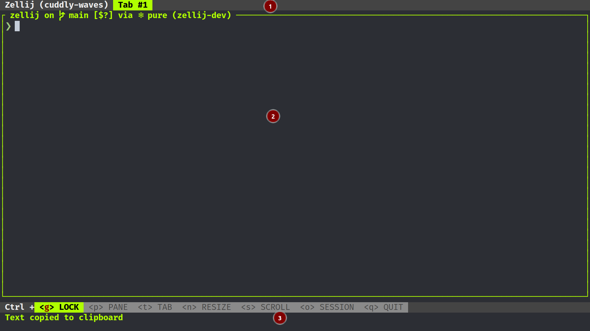
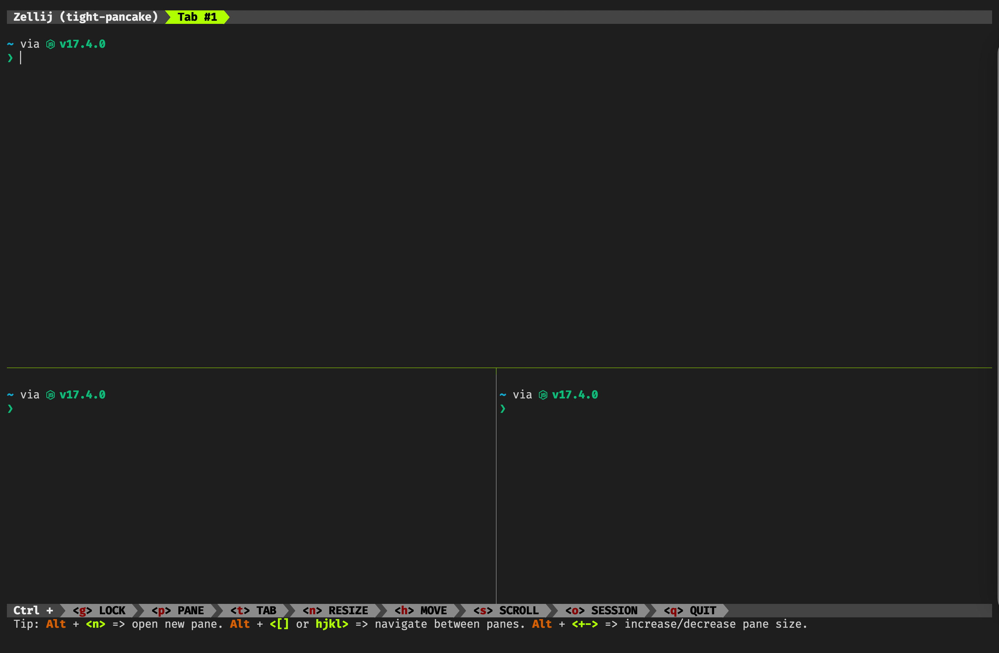

# 逐步搭建现代大一统终端

- 目标：统一主流操作系统的终端配置
- 策略：尽量使用 Rust 编写的工具链
- Rust 工具链优势
  - 配置文件为 TOML 或 YAML，声明式配置，可读性强
  - 多使用系统原生工具进行编译，需要下载安装的依赖少
  - 速度上较快，有时可能不如 C 工具链，但比其他语言的工具往往要快
  - 跨平台性优于 C

## 1. Starship

Starship 是由 Rust 编写的命令行主题，简单高效、容易配置（基本不用配置），而且跨平台。

macOS/Linux 用户使用 Homebrew

打开 `~/.zshrc`，添加：

```bash
eval "$(starship init zsh)"
```

Windows 用户使用 Scoop

```bash
scoop install starship
```

打开配置文件

```powershell
code $PROFILE
```

添加

```powershell
Invoke-Expression (&starship init powershell)
```

## 2. Alacritty

Alacritty 使用 Rust 编写，是一款极简主义风格的跨平台终端模拟器，目前可以说是全网最快。其安装包发布于各个包管理器仓库

macOS/Linux 用户使用 Homebrew

```bash
brew install alacritty
```

Windows 用户使用 Scoop

```powershell
scoop install alacritty
```

### 2.1. 基本配置

手动建立配置文件

- macOS & Linux: `~/.config/alacritty/alacritty.yml`
- Windows: `%APPDATA%\alacritty\alacritty.yml`

```yaml
# 自动刷新
live_config_reload: true
# Tab 缩进
tabspaces: 4
# 背景透明度
window.opacity: 0.9

shell:
  program: /bin/zsh
  # windows
  # program: c:\windows\system32\windowspowershell\v1.0\powershell.exe
  args:
    # login
    - -l

window:
  # 窗口大小
  dimensions:
    columns: 120
    lines: 60

  # 边缘空白
  padding:
    x: 10
    y: 15
  dynamic_padding: false
  startup_mode: Maximized
  # 窗口修饰
  # - full: 有边界 + 标题栏
  # - none: 无边界 + 标题栏
  decorations: none

scrolling:
  # 历史保留行数
  history: 2000

  # 每次滚动行数
  multiplier: 20

  # 每次滚动行数（分屏时）
  faux_multiplier: 100

  # 自动滚动至最新行
  auto_scroll: true
```

### 2.2. 字体

这里推荐 FiraCode，当然，目前 Alacritty 还不支持连字。

macOS/Linux 用户使用 Homebrew

```bash
brew tap homebrew/cask-fonts
brew install font-fira-code-nerd-font
```

Windows 用户使用 Scoop

```powershell
scoop bucket add nerd-fonts
scoop install firacode-nf
```

```yaml
font:
  size: 16
  # 字体
  normal:
    family: 'FiraCode Nerd Font'
    style: Regular
  bold:
    family: 'FiraCode Nerd Font'
    style: Bold
  italic:
    family: 'FiraCode Nerd Font'
    style: Italic
  bold_italic:
    family: 'FiraCode Nerd Font'
    style: Bold Italic

  # 细描边
  use_thin_strokes: true
```

## 3. Zellij

Alacritty 不支持多窗口（需要等待下一个版本，即 0.11.0）或多标签（未来也不会），所以需要开启终端复用器（multiplexer）来配合。

由于 TMux 基于 C，不支持 Windows，而且开发者明确表示未来也不会支持，这里我们选用基于 Rust 的 Zellij。

> 最新版本的 Zellij 已经整合了 TMux 的键位，消除了迁移的顾虑。

虽然 Zellij 目前也不支持 Windows，但 Windows 的 PR 已经提上日程。另外，Zellij 的配置也明显比 TMux 简单，也不需要记忆那么多快捷键。

**需要强调的是**，Alacritty 目前已经可以将 `command / ctrl + C` 复制的内容直接传给系统剪切板，不必再为终端复用器的 copy 模式烦心了，但其他终端模拟器或多或少都还有点问题。

macOS/Linux 用户使用 Homebrew

```bash
brew install zellij
```

基本配置文件位于 `~/.config/zellij/config.yaml`

```yaml
default_shell: zsh
on_force_close: detach

simplified_ui: false # 简单 UI（不包含提示字体）
pane_frames: false # pane 之间的边框
theme: default

default_mode: normal # 启动时的模式，locked 可选
mouse_mode: true # 鼠标模式（选取）
scroll_buffer_size: 10000 # 缓冲大小
```

Zellij 支持自定义启动布局，将布局文件存在 `~/.config/zellij/layouts` 下，使用如下命令启动即可

```bash
zellij --layout [layout-name]
```



```yaml
---
template:
  direction: Horizontal # 排布方向
  parts:
    - direction: Vertical # part 1，垂直分割
      borderless: true # 边框
      split_size:
        Fixed: 1
      run:
        plugin:
          location: 'zellij:tab-bar' # 加载标签栏
    - direction: Vertical # part 2
      body: true # 加载主体
    - direction: Vertical # part 3
      borderless: true
      split_size:
        Fixed: 2
      run:
        plugin:
          location: 'zellij:status-bar' # 加载状态栏

tabs: # 每个标签 pane 的排布
  - name: 'Tab 1' # 每个标签的名字
    direction: Horizontal # 水平排布
    parts:
      - direction: Vertical # 垂直分割
        split_size:
          Percent: 60 # 上半部分占比
      - direction: Vertical
        parts:
          - direction: Horizontal # 水平分割
          - direction: Horizontal
```



其他配置说明，参见官网 [zellij](https://zellij.dev/documentation/)

### 3.1. 整合 Alacritty

在 `alacritty.yml` 中，加入

```yaml
shell:
  program: /bin/zsh
  args:
    # login
    - -l
    - -c
    - 'zellij attach --index 0 --create'
```

### 3.2. 键位绑定

在 `zellij/config.yaml` 中，加入

```yaml
keybinds:
  resize:
    - action: [Resize: Left]
      key: [Char: 'h', Alt: 'h']
    - action: [Resize: Right]
      key: [Char: 'l', Alt: 'l']
    - action: [Resize: Down]
      key: [Char: 'j', Alt: 'j']
    - action: [Resize: Up]
      key: [Char: 'k', Alt: 'k']
```

## 4. 命令行替代

Rust 规避了 C++ 项目的弊病，同时保证了良好的跨平台性质，被广泛用于命令行工具的重写。

- [x] 使用 `bat` 替换 `cat`
- [x] 使用 `bottom` 替换 `top` 和 `htop`
- [x] 使用 `du` 替换 `dust`
- [x] 使用 `fd` 替换 `find`
- [x] 使用 `gitui` 替换 `lazygit`
- [x] 使用 `lsd` 替换 `ls`
- [x] 使用 `lsd --tree` 替换 `tree`
- [x] 使用 `ripgrep` 替换 `grep`
- [x] 使用 `sd` 替换 `sed`
- [x] 使用 `tealdeer` 替换 `tldr` 和 `man`
- [x] 使用 `zoxide` 替换 `cd` 和 `z.lua`

## 5. 后续计划

以下两个项目都已经实现全平台，且被用于实践

### 5.1. Helix Editor

- 目标：取代 Vim 和 NeoVim
- 优势
  - 已实现全平台，配置远比 Vim 方便
  - 内置 LSP，响应速度快
  - 借鉴了 Vim 的键位，迁移成本低
- 劣势：
  - 功能不够全面
  - 尚未形成生态

macOS / Linux 用户

```bash
brew install helix
```

Windows 用户

```powershell
scoop install helix
```

[helix](https://helix-editor.com/)

### 5.2. NuShell

- 目标：取代 PowerShell 和 ZSh
- 优势
  - 借鉴了 SQL，方便数据化管理
  - 目前仅有的全平台，高性能 Shell
- 劣势
  - 扩展性弱，且配置和扩展使用是一套新的 Shell 语言

macOS / Linux 用户

```bash
brew install nushell
```

Windows 用户

```powershell
scoop install nu
```

[nushell](https://www.nushell.sh/)

## 6. 个人项目

[Oxidizer](https://github.com/ivaquero/oxidizer.sh)

鉴于当下，Zellij 目前拒绝支持 Windows，Alacritty 对用户的要求响应很慢，个人项目已用 WezTerm 取代 Alacritty + Zellij，以统一三大平台配置。


> 在 macOS 上，WezTerm 的速度只有 Alacritty 的一半，但是，完整实现了跨平台，多标签，配置上采用 Lua，更灵活。

WezTerm 的基础配置见

[wezterm.lua](https://github.com/ivaquero/oxidizer.sh/blob/master/defaults/wezterm.lua)
