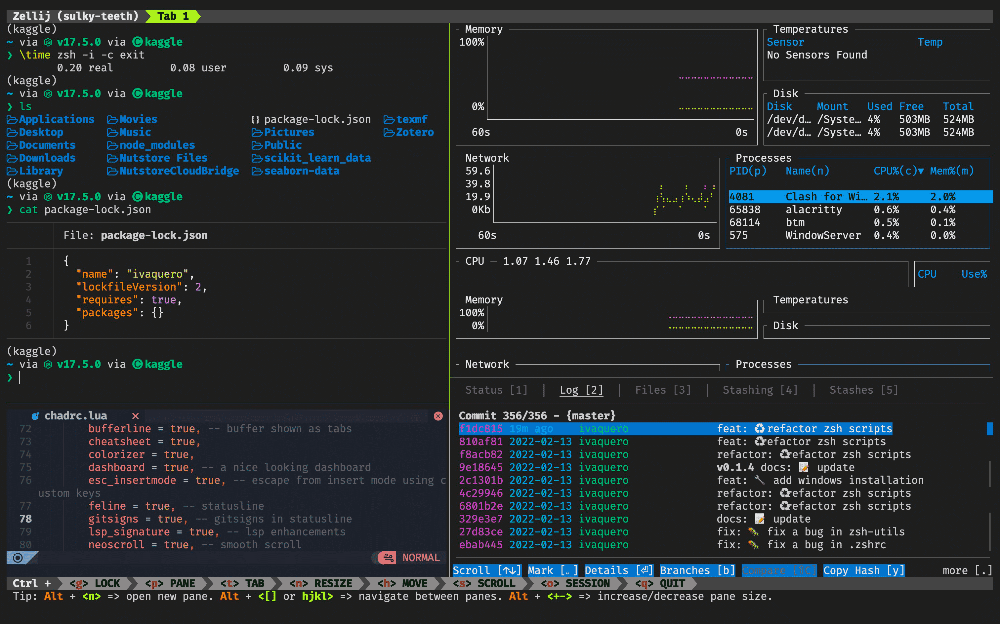

# 打造 macOS/Linux 优雅终端

## 1. ZSh

Zsh 是公认的终极 Shell，其因强大的补全功能、高度的可定制性以及良好的扩展性，被众多开发者极力推崇。

如今，因为 WSL 的出现，Windows 的用户也可享用这一福利了。

推荐使用 Homebrew 安装，详见本专栏的姊妹篇[搭建 macOS/Linux 统一开发环境]。

```bash
# 安装 Zsh
brew install zsh
```

### 1.1. 主题

Starship 是由 Rust 编写的命令行主题，简单高效、容易配置（基本不用配置），而且跨平台。

使用 Homebrew 安装

```bash
brew install starship
```

打开`~/.zshrc`，添加：

```bash
eval "$(starship init zsh)"
```

我之前用 OhMyZsh，但插件多了会出现卡顿，时间长了觉得那些花里胡哨的东西都是浮云，效率才是第一位的，况且 Starship 的默认配置已经可以提供足够多的信息，配置有独立的文件，不与 Zsh 本身耦合，可定制性也不输 OhMyZsh，而且跨平台。

〉详情参考 [Starship 官网](https://starship.rs/)



### 1.2. 字体

```bash
brew tap homebrew/cask-fonts
brew install font-fira-code-nerd-font
```

### 1.3. 配置

打开`~/.zshrc`，添加：

```bash
# 导入 bash 配置
source ~/.bash_profile
# linux
# source ~/.bashrc

# 别名
alias ua="unalias"
alias py="python"
alias man="tldr"
alias bat="cat"
alias find="fd"
```

### 1.4. 大小写敏感

```bash
zstyle ':completion:*' matcher-list 'm:{a-z}={A-Z}'
```

## 2. ZSh 扩展

Zsh 有很好的扩展性，这里推荐 3 个最常用的扩展

- zsh-autosuggestions（补全提示）
- zsh-syntax-highlighting（高亮）
- zsh-completions（补全）

### 2.1. 安装

首先安装链接扩展

```bash
brew install zsh-autosuggestions zsh-syntax-highlighting zsh-completions
```

也可以选择源码安装

```bash
# zsh-autosuggestions
git clone https://github.com/zsh-users/zsh-autosuggestions ${ZSH_CUSTOM:-~/.oh-my-zsh/custom}/plugins/zsh-autosuggestions
# zsh-syntax-highlighting
git clone https://github.com/zsh-users/zsh-syntax-highlighting.git ${ZSH_CUSTOM:-~/.oh-my-zsh/custom}/plugins/zsh-syntax-highlighting
# zsh-completions
git clone https://github.com/zsh-users/zsh-completions ${ZSH_CUSTOM:=~/.oh-my-zsh/custom}/plugins/zsh-completions
```

### 2.2. 整合

在 `~/.zshrc` 中添加：

```bash
source /usr/local/share/zsh-autosuggestions/zsh-autosuggestions.zsh
source /usr/local/share/zsh-syntax-highlighting/zsh-syntax-highlighting.zsh

autoload -Uz compinit && compinit
```

## 3. 其他

### 3.1. 测速

打开`~/.zshrc`，添加：

```bash
zmodload zsh/zprof

alias tt="\time zsh -i -c exit"
```

在命令行键入 `tt` 即可
