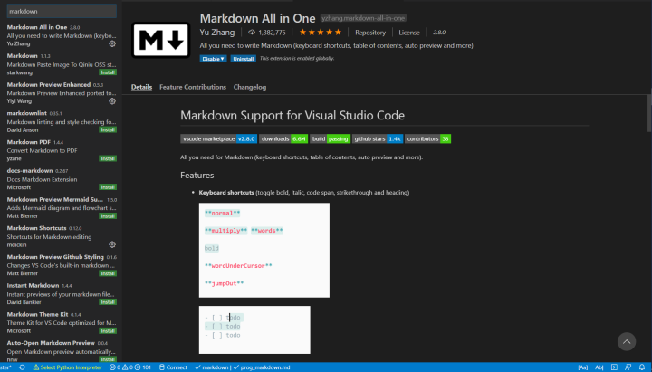
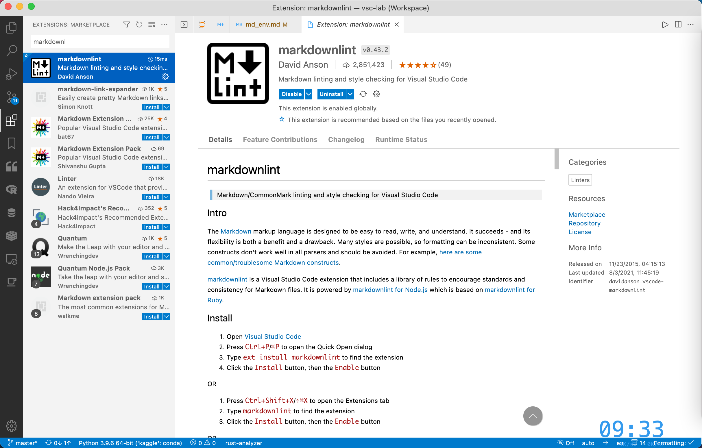
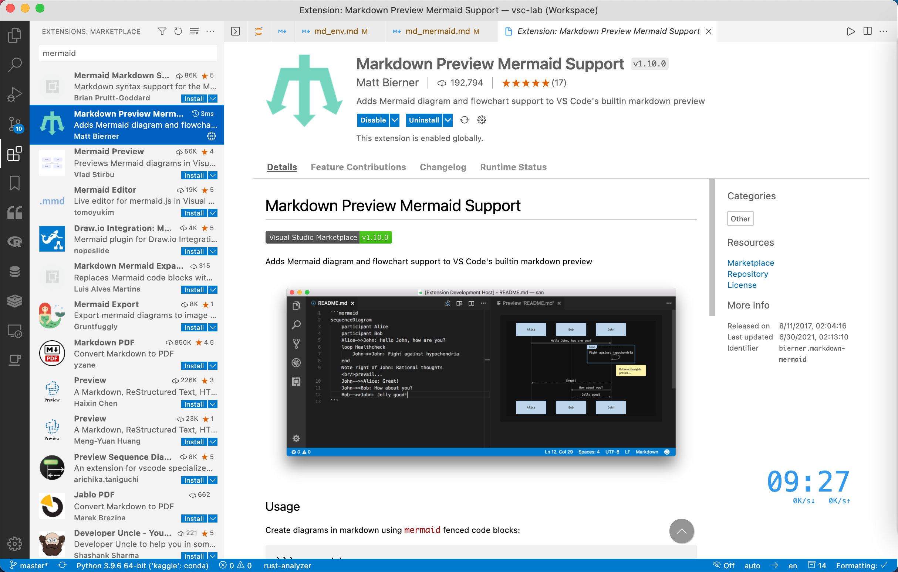
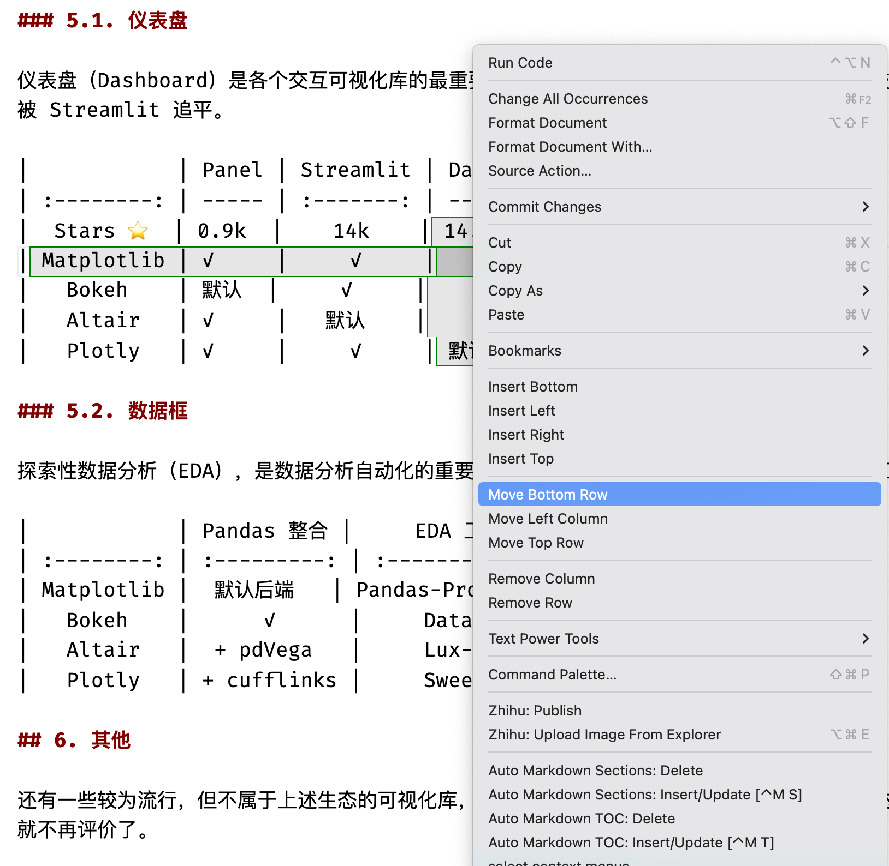
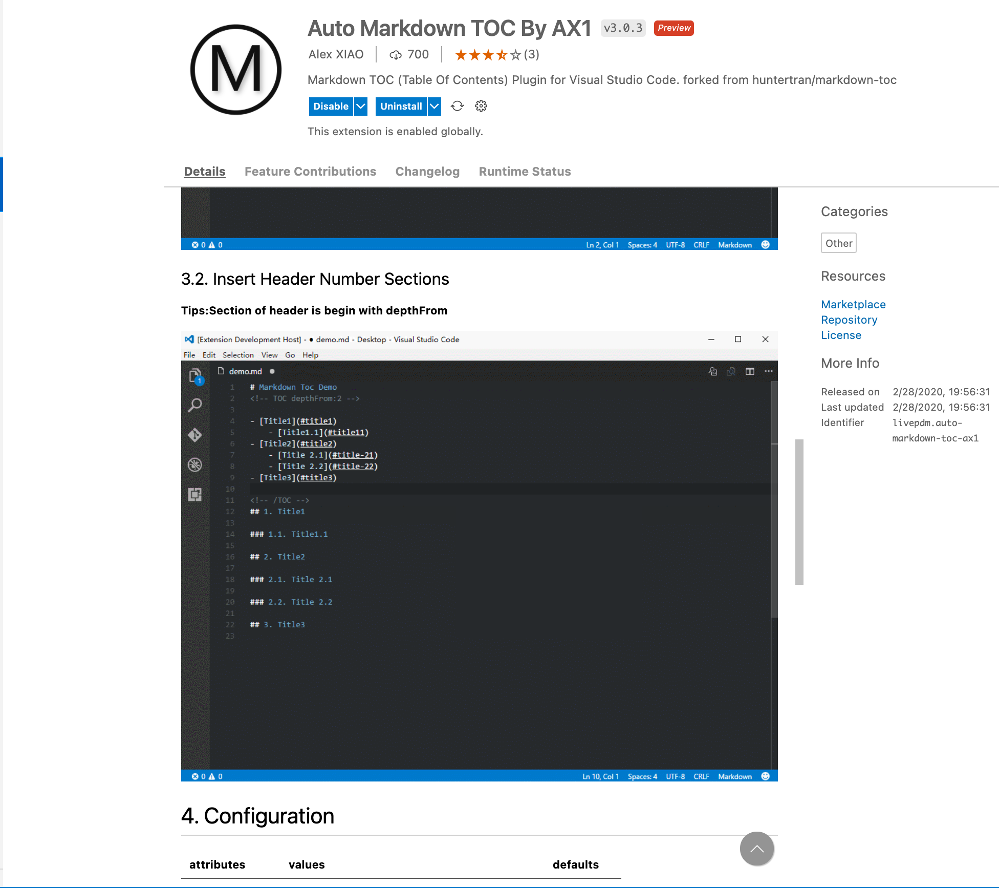
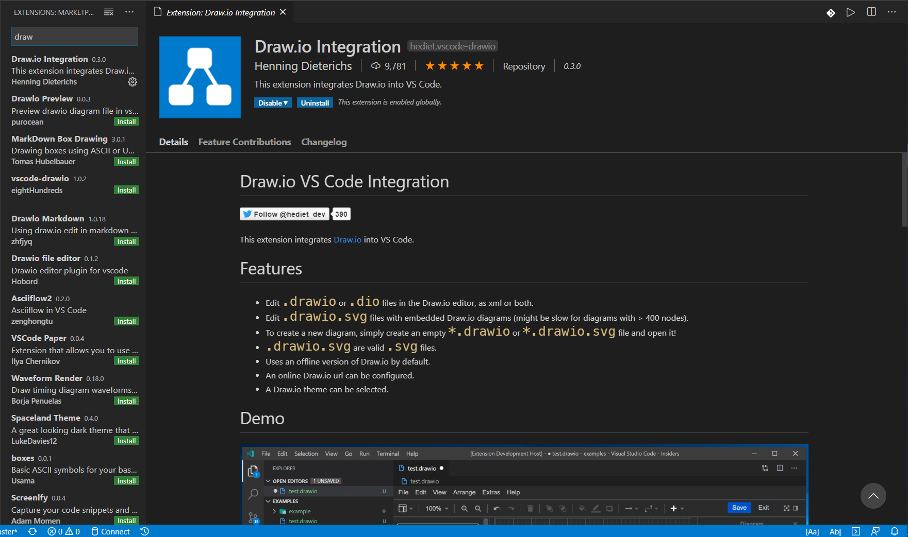
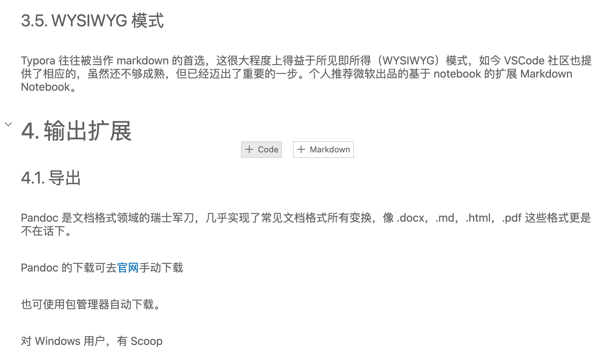
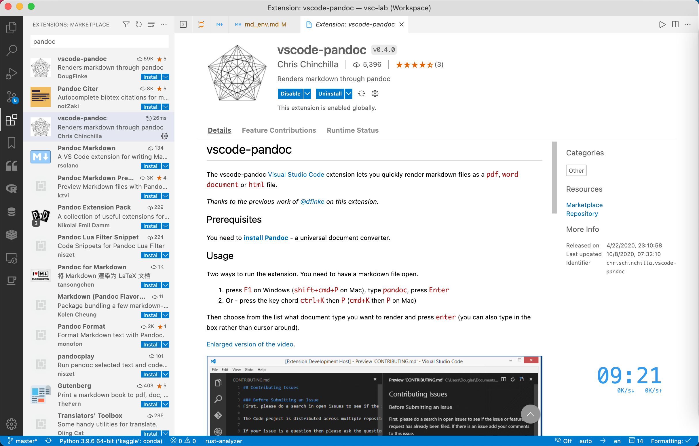

# 搭建 Markdown 强大写作环境（VSCode）

## 1. Markdown 编写环境概览

Markdown 是一种易于读写的轻量级的标记语言，编写出的作品简洁美观，近年来受到了越来越多的追捧，被广泛地用于日常写作，乃至电子书发表。与此同时，一系列优秀 Markdown 编辑器应运而生。其中较为著名的有，Typora（免费，跨平台）、MarkText（开源，跨平台）、Zettlr（开源，跨平台）、MacDown（开源，macOS）等等。

VSCode 是当下最流行的代码编辑器，拥有丰富的扩展，这也使其成为最强大的文本编辑器之一（拒绝伤害 Vim 党人及 Emacs 党人），搞定 Markdown 自然不在话下。与上面提到的编辑器相比，VSCode 的明显优势有：

- 集成的布局：大纲（outline）、工作区（workspace）；
- 强大的补全：LaTeX 公式；
- 丰富的扩展：方便整合其他工具（详见下文的功能扩展部分）；

## 2. 语法扩展

VSCode 默认是支持 Markdown 的，但还是有必装下面 3 个插件提高写作效率。

- Markdown All in One
- mardownlint
- Markdown Preview Mermaid Support

### 2.1. Markdown All in One

如名称所述，这是个大一统型的扩展，集成了撰写 Markdown 时所需要的大部分功能，是 Markdown 类插件中下载榜榜首。可认为是 VSCode 中的 Markdown 必备扩展。其功能涵盖：

- 快捷键自
- 动生成并更新目录
- 自动格式化表格
- LaTeX 数学公式支持



### 2.2. markdownlint

这是个功能强大的 Markdown 语法检查器，可以帮助你书写出规范的文档，同时避免书写错误导致文档无法渲染。个人观点，认为这个也是必装扩展。



### 2.3. Markdown Preview Mermaid Support

很多时候，写文档难免需要绘制一些用于说明的插图，如流程图、甘特图等，这个时候，若另开一个应用画图，再导入文档，则略显繁琐。前文提到的 MPE 扩展支持的 mermaid.js 可轻松解决这一难题。简单说，mermaid.js 就是一个 Markdown 的绘图工具包

Markdown Preview Mermaid Support 支持 mermaid 预览。



> mermaid 语法介绍，可参考本专栏姊妹篇[Markdown 绘图]。

## 3. 编辑扩展

### 3.1. 表格编辑

安装 MdTableEditor 扩展，火箭提升表格编辑效率



### 3.2. 章节编号

安装 Auto Markdown TOC By AX1，实现章节自动编号，及生成目录



### 3.3. 文档绘图

虽然有 mermaid，但有时候我们总会需要绘制一些复杂的图形。这时，可以使用 VSCode 商店里大名鼎鼎的 [Draw.io](https://app.diagrams.net/) 的内嵌扩展，安装完毕后三连：➡️ 新建 .drawio 文件 ➡️ 傻瓜绘图 ➡️ 导出为需要的格式。



### 3.4. 字数统计

这里推荐 Word Count CJK，可对各种字符进行统计，安装扩展后，在 setting.json 中修改

```json
{
  "wordcount_cjk.activateLanguages": ["markdown", "plaintext", "latex"],
  "wordcount_cjk.statusBarTextTemplate": "中文：${cjk} 字 + 英文：${en_words} 词",
  "wordcount_cjk.statusBarTooltipTemplate": "中文字数：${cjk} \\n 非 ASCII 字符数：\\t${total - ascii} \\n 英文单词数：${en_words} \\n 非空白字符数：${total - whitespace} \\n 总字符数：${total}"
}
```

至此，VSCode 已经实现了 Typora 等 Markdown 编辑器除所见即所得（WYSIWYG）之外的全部功能。

### 3.5. WYSIWYG 模式

Typora 往往被当作 markdown 的首选，这很大程度上得益于所见即所得（WYSIWYG）模式，如今 VSCode 社区也提供了相应的，虽然还不够成熟，但已经迈出了重要的一步。个人推荐微软出品的基于 notebook 的扩展 Markdown Notebook。



这个扩展目前还处于开发早期，不能显示图片，但微软出品 + Notebook 框架，前景很好，后续有希望增加运行代码块等功能。

## 4. 输出扩展

### 4.1. 导出

Pandoc 是文档格式领域的瑞士军刀，几乎实现了常见文档格式所有变换，像 .docx，.md，.html，.pdf 这些格式更是不在话下。

Pandoc 的下载可去[官网](https://pandoc.org/)手动下载

也可使用包管理器自动下载。

对 Windows 用户，有 Scoop

```powershell
scoop install pandoc
```

对 macOS 用户，有 Homebrew

```bash
brew install pandoc
```

安装完毕后，在 VSCode 中安装相关扩展，这里首推 vscode-pandoc，可实现 .md 到 .docx 以及.pdf 和.html 的变换。

对于.pdf 的变换，需要在 `settings.json` 中添加：

```json
{
  "pandoc.docxOptString": "",
  "pandoc.htmlOptString": "--standalone --mathjax --shift-heading-level-by=-1",
  "pandoc.pdfOptString": "--pdf-engine=xelatex -V CJKmainfont=\"Arial Unicode MS\""
}
```



### 4.2. 知乎发布

WPL/s 继承于 Zhihu On VSCode，可用于 Markdown 在知乎上一键发布，尤其适合存在**大量图片和代码块**的帖子，当然也在 VSCode 里**看帖摸鱼**。

比之曾经的初代扩展，其最有特色的功能之一是，支持元数据，可以在本地修改已经发布的帖子，只需在题头添加

```yaml
---
title: [文章题目]
zhihu-url: [文章链接]
zhihu-title-image: [题图]
zhihu-tags: [知乎标签]
---
```

而且，作者非常人性化的把之前的扩展链接，从文章开头放在了文章结尾。之前讨厌的开篇一句话“本文使用。。。发布”不见了。

详情可参看其作者的介绍。
