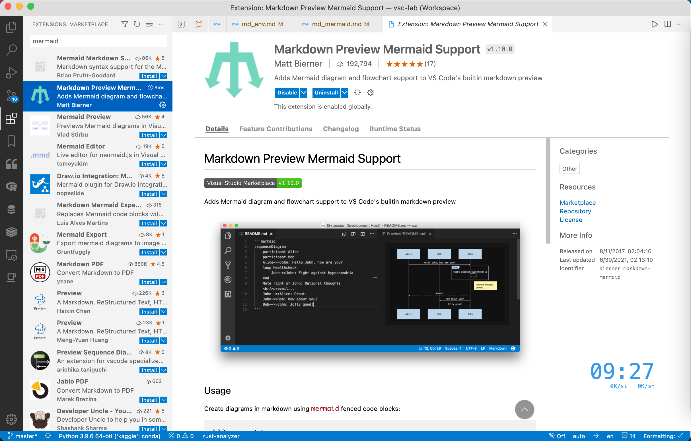

# Markdown 绘图

当撰写文档的时候，需要使用第三方工具绘制流程图，然后再将流程图导入 Markdown 有时会显得特别繁琐。Mermaid.js 可用于解决这一痛点。简单说，Mermaid.js 可看成是 Markdown 文档中一款绘图插件，其语法完全是 markdownish 的，绘图时不需要切换软件，也不需要切换思维。下面给出几个例子，大家可感受一下，Mermaid.js 的简洁优雅。

在 VSCode 中，安装

- Markdown Preview Mermaid Support



## 1. 基础类

### 1.1. 流程图

```markdown
graph TB

id1(圆角矩形)--普通线-->id2[矩形];
subgraph 子图
id2==粗线==>id3{菱形}
id3-. 虚线.->id4>右向旗帜]
id3--无箭头---id5((圆形))
end
```


| 用词 |   含义   |
| :--: | :------: |
|  TB  | 从上到下 |
|  BT  | 从下到上 |
|  RL  | 从右到左 |
|  LR  | 从左到右 |

- 节点定义

|    表述    |      说明      |
| :--------: | :------------: |
|  id[文字]  |    矩形节点    |
|  id(文字)  |  圆角矩形节点  |
| id((文字)) |    圆形节点    |
|  id>文字]  | 右向旗帜状节点 |
|  id{文字}  |    菱形节点    |

- 节点连线

|   表述   |      说明      |
| :------: | :------------: |
|    >     |  添加尾部箭头  |
|    -     | 不添加尾部箭头 |
|    --    |      单线      |
| --text-- |  单线上加文字  |
|    ==    |      粗线      |
| ==text== |   粗线加文字   |
|   -.-    |      虚线      |
| -.text.- |   虚线加文字   |

### 1.2. 时序图

```markdown
sequenceDiagram

Alice->>John: Hello John, how are you?
loop Healthcheck
John->>John: Fight against hypochondria
end
Note right of John: Rational thoughts!
John-->>Alice: Great!
John->>Bob : How about you?
Bob-->>John : Jolly good!
```


### 1.3. Gantt 图

```markdown
gantt

section Section
Completed: done, des1, 2014-01-06, 2014-01-08
Active : active, des2, 2014-01-07, 3d
Parallel 1 : des3, after des1, 1d
Parallel 2 : des4, after des1, 1d
Parallel 3 : des5, after des3, 1d
Parallel 4 : des6, after des4, 1d
```


## 2. 工程类

### 2.1. 类图

```markdown
classDiagram

Class01 <|-- AveryLongClass: Cool
<<interface>> Class01
Class09-->C2: Where am i?
Class09 --\* C3
Class09 --|> Class07
Class07: equals()
Class07: Object[] elementData
Class01: size()
Class01: int chimp
Class01: int gorilla
class Class10 {
<<service>>
int id
size()
}
```


### 2.2. 状态图

```markdown
stateDiagram

[*]-->Active
state Active {
[*]-->NumLockOff
NumLockOff-->NumLockOn : EvNumLockPressed
NumLockOn-->NumLockOff : EvNumLockPressed
--
[*]-->CapsLockOff
CapsLockOff-->CapsLockOn : EvCapsLockPressed
CapsLockOn-->CapsLockOff : EvCapsLockPressed
--
[*]-->ScrollLockOff
ScrollLockOff-->ScrollLockOn : EvCapsLockPressed
ScrollLockOn-->ScrollLockOff : EvCapsLockPressed
}
```


### 2.3. 实体关系图

```markdown
erDiagram
CUSTOMER ||--o{ORDER : places
ORDER ||--|{LINE-ITEM : contains
CUSTOMER}|..|{DELIVERY-ADDRESS : uses
```


### 2.4. Git 图

```markdown
gitGraph:
options
{
"nodeSpacing": 150,
"nodeRadius": 10
}
end
commit
branch newbranch
checkout newbranch
commit
commit
checkout master
commit
commit
merge newbranch
```


## 3. 统计类

### 3.1. 饼图

```markdown
pie

title Key elements in Product X
"Calcium" : 42.96
"Potassium" : 50.05
"Magnesium" : 10.01
"Iron" : 5
```


## 4. 其他类

### 4.1. 旅程图

```markdown
journey
title My working day
section Go to work
Make tea: 5: Me
Go upstairs: 3: Me
Do work: 1: Me, Cat
section Go home
Go downstairs: 5: Me
Sit down: 3: Me
```


## 5. 主题

Mermaid.js 内置了 3 种主题（"default"，"forest"，"dark"），安装 Markdown Preview Enhanced 扩展后

"ctrl"+", " 进入配置，点击右上角的图标，打开配置的 json 文件，加入如下配置：

```json
{
  "markdown-preview-enhanced.mermaidTheme": "forest"
}
```

## 6. 前景

目前，mermaid.js 支持的图型不断扩展，希望以后能成为 Markdown 中的 TikZ 吧。

更多详情，可关注其 [官方文档](https://mermaid-js.github.io/mermaid/)。
