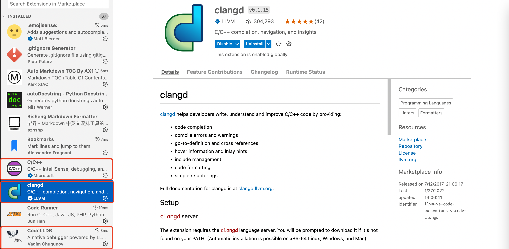

# 搭建 C++ 轻量级编写环境（VSCode）

## 1. clangd

在安装 VSCode 扩展之前，强烈保证系统内安装有 clangd，新版 macOS 已经内置，对于没有 clangd 的

macOS/Linux 用户

```bash
brew install llvm
```

Windows 用户

```powershell
scoop install clangd
```

## 2. 安装并扩展

在 VSCode 扩展商店，搜索并安装如下三个扩展



安装完毕后，"ctrl"+", " 进入配置，点击右上角的图标，打开配置的 json 文件

加入如下 3 段配置

### 2.1. C/C++

官方的 C/C++ 扩展主要提供基础支持，虽然主要方面都有所欠缺，但考虑到其功能相对全面，依然是必需

基本配置如下

> 记住一定要关闭默认的 IntelliSense，否则会与 clangd 冲突

```json
{
  "C_Cpp.default.compilerArgs": [
    "-g",
    "${file}",
    "-std=c++20",
    "-o",
    "${fileDirname}/${fileBasenameNoExtension}"
  ],
  "C_Cpp.default.cppStandard": "c++20",
  "C_Cpp.autocompleteAddParentheses": true,
  "C_Cpp.clang_format_fallbackStyle": "LLVM",
  "C_Cpp.clang_format_sortIncludes": true,
  "C_Cpp.intelliSenseEngine": "Disabled"
}
```

### 2.2. clangd

clangd 扩展由 LLVM 团队维护，提供了非常智能的补全，和代码格式化，以及语法检查。这个扩展的出现让很多人对 VSCode 下的 C/C++ 的观感大大改善，直白地说没有 clangd，VSCode 的 C/C++ 就是个玩具。

关于 clangd 的详细介绍，相见其官网 [clangd](https://clangd.llvm.org/)

基本配置如下

```json
{
  "clangd.checkUpdates": true,
  "clangd.arguments": [
    "--all-scopes-completion",
    "--background-index",
    "--clang-tidy-checks=cppcoreguidelines-*,performance-*,bugprone-*,portability-*,modernize-*",
    "--clang-tidy",
    "--compile-commands-dir=build",
    "--completion-style=detailed",
    "--function-arg-placeholders=false",
    "--header-insertion-decorators",
    "--header-insertion=iwyu",
    "--log=verbose",
    "--pch-storage=memory",
    "-j=12"
  ]
}
```

### 2.3. CodeLLDB

虽然，官方 C/C++ 扩展也提供基于 LLDB 的 debug 功能，但是对于很多 C++ 场景还是太弱了，CodeLLDB 在很大程度上弥补了这个缺陷。同时，这个扩展也支持 Rust 的 debug

基本配置如下

```json
{
  "lldb.commandCompletions": true,
  "lldb.dereferencePointers": true,
  "lldb.evaluateForHovers": true,
  "lldb.launch.expressions": "simple",
  "lldb.launch.terminal": "integrated",
  "lldb.showDisassembly": "never",
  "lldb.verboseLogging": true
}
```

## 3. 其他

### 3.1. 相关配置文件

- `tasks.json`：编译指令设置，用于编译
  - `label` 参数值和 `launch.json` 的 `preLaunchTask` 参数值需要保持一致
- `launch.json`：调试器设置，用于使用 VSCode 自带的 debug 工具
- `c_cpp_properties.json`：用于使用 VSCode 自带的代码提示工具，如 IntelliSense
- `makefile` 一个含有一系列命令（directive）的，通过 Make 自动化编译工具，帮助 C/C++ 程序实现自动编译目标文件的文件。

### 3.2. 一键编译

提到一键编译，必然首选 CodeRunner，其相关配置如下

对 macOS 用户

> Intel macOS 用户也可以选择 gcc，gcc 目前不支持 arm64

```json
{
  "code-runner.runInTerminal": true,
  "code-runner.executorMap": {
    "c": "clang $dir$fileName -o $dir$fileNameWithoutExt && $dir$fileNameWithoutExt",
    "cpp": "clang++ -std=c++20 $dir$fileName -o $dir$fileNameWithoutExt && $dir$fileNameWithoutExt",
    "rust": "rustc $dir$fileName && $dir$fileNameWithoutExt"
  },
  "code-runner.fileDirectoryAsCwd": true
}
```

对 Linux 以及 Windows 用户

```json
{
  "code-runner.runInTerminal": true,
  "code-runner.executorMap": {
    "c": "gcc $dir$fileName -o $dir$fileNameWithoutExt && $dir$fileNameWithoutExt",
    "cpp": "gcc++ -std=c++20 $dir$fileName -o $dir$fileNameWithoutExt && $dir$fileNameWithoutExt",
    "rust": "rustc $dir$fileName && $dir$fileNameWithoutExt"
  },
  "code-runner.fileDirectoryAsCwd": true
}
```
