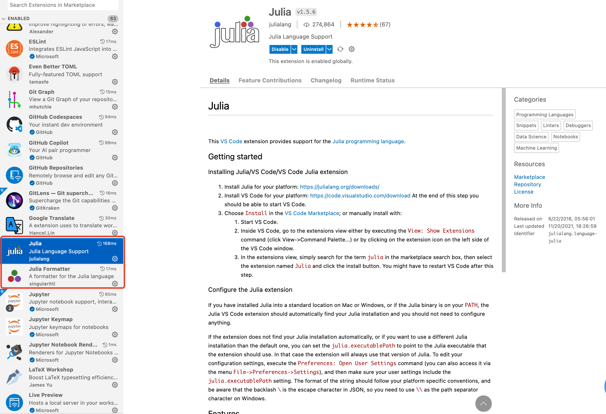
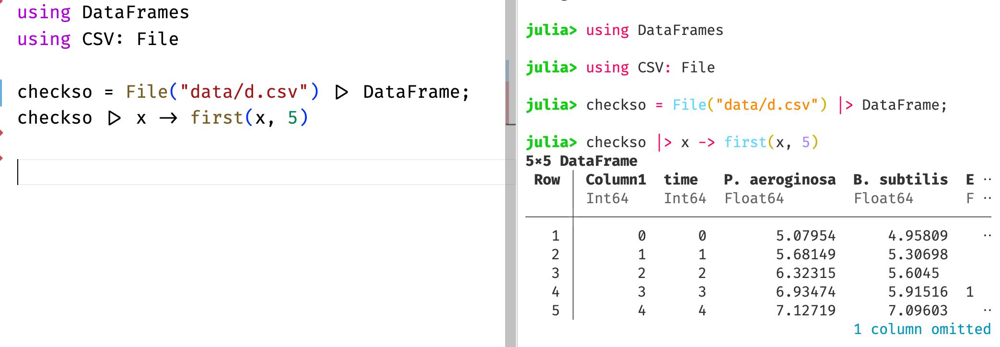
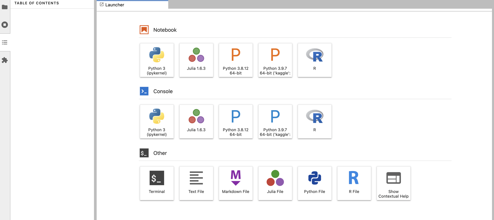

# 搭建 Julia 舒适编写环境

作为数据科学中的后起之秀，Julia 以其出色的运算速度，受到了不少人媒体的追捧。Julia 致力于成为一个全面的数据科学语言，不过由于社区依然不如 Python 和 R 庞大，经常会有包资源稀缺的情况。

就个人体验，Julia 最具优势的是科学计算，其 `DifferentialEquations.jl` 和 `ModelingToolKit.jl` 宇宙包含了目前最棒也是最全面的微分方程求解器。其他热门领域诸如机器学习、深度学习、数据分析等 Julia 还不够灵活，暂不推荐，静观其变。

经过最近一年的迭代，从 1.6 版本开始，采用安装包后自动预编译的策略，Julia 的启动速度已经大幅提升，VSCode 扩展的加载速度也比之前快了许多。

## 1. 安装 Julia

对 macOS/Linux 用户，有 Homebrew

```bash
# mac
brew install --cask julia
# linux
brew install ivaquero/chinese/julia-linux
```

对 Windows 用户，有 Scoop

```powershell
scoop install ivaquero/scoopet/julia-cn
```

### 1.1. 源

打开 Julia 启动文件

- macOS/Linux: `$HOME/.julia/config/startup.jl`
- Windows: `%HOMEPATH%\.julia\config\startup.jl`

添加如下语句

```julia
ENV["JULIA_PKG_SERVER"] = "https://mirrors.tuna.tsinghua.edu.cn/julia"
```

## 2. VSCode 调用 Julia

Julia 团队，曾经力推基于 Atom 的 Juno IDE，但目前已表示弃坑，全面投奔 VSCode。

### 2.1. 安装扩展

在扩展商店，搜索并安装 Julia 扩展即可



安装完毕后，"ctrl"+", " 进入配置，点击右上角的图标，打开配置的 json 文件。

```json
{
  "julia.deleteJuliaCovFiles": true,
  "julia.completionmode": "qualify",
  "julia.editor": "code",
  "julia.enableCrashReporter": false,
  "julia.enableTelemetry": false,
  "julia.execution.codeInREPL": true,
  "julia.execution.resultType": "both",
  "julia.focusPlotNavigator": true,
  "julia.lint.missingrefs": "symbols",
  "julia.symbolCacheDownload": false
}
```

安装 Julia Formatter 扩展，添加配置

```json
{
  "juliaFormatter.alignConditional": true,
  "juliaFormatter.alignPairArrow": true,
  "juliaFormatter.alignStructField": true,
  "juliaFormatter.removeExtraNewlines": true
}
```

### 2.2. 安装包

在 VSCode 中调用 Julia，推荐安装包 `Revise.jl` 。返回 Julia 命令行，进入包管理器

```bash
pkg> add Revise
```

安装 OhMyREPL，高亮终端

```bash
pkg> add OhMyREPL
```

在 `startup.jl` 中，添加

```julia
atreplinit() do repl
    try
        @eval using OhMyREPL
    catch e
        @warn "error while importing OhMyREPL" e
    end
end
```

之后便可编写 Julia 代码。



安装

## 3. JupyterLab 调用 Julia

Jupyter 是 Julia、Python、R 三种语言缩写的集合，后两者的第三方库的管理可由 Conda 完成，而 Julia 的包的安装仍然需要 Julia 原生的包管理器来完成。

### 3.1. 安装包

安装 `IJulia.jl`

```bash
pkg> add IJulia
```

使用已安装的本地 Jupyter，键入如下命令

```julia
using IJulia
installkernel("Julia", "--depwarn=no")
```



### 3.2. Jupyter

自定义 Jupyter 路径，同样在`startup.jl`中，添加

```bash
# mac-arm
ENV["JUPYTER"]="/opt/homebrew/Caskroom/mambaforge/base/bin/jupyter"
# mac-intel
ENV["JUPYTER"]="/usr/local/Caskroom/mambaforge/base/bin/jupyter"
# windows
ENV["JUPYTER"]="c:\\scoop\\apps\\miniconda\\current\\Scripts\\jupyter.EXE"
# linux
ENV["JUPYTER"]="~/miniconda3/base/bin/jupyter"
```

## 4. 备注

### 4.1. 调用 Python 库

使用 `PyCall.jl` 可调用 Python 包，但在安装 `PyCall.jl` 前，需指明 Python 的路径。同样在`startup.jl`中，添加

```julia
# mac-arm
ENV["PYTHON"] = "/opt/homebrew/Caskroom/mambaforge/base/bin/python"
# mac-intel
ENV["PYTHON"] = "/usr/local/Caskroom/miniconda/base/bin/python"
# windows
ENV["PYTHON"] = "c:\\scoop\\apps\\miniconda\\current\\bin\\python.exe"
# linux
ENV["PYTHON"] = "~/miniconda3/base/bin/python"
```

### 4.2. Julia 包管理

```bash
# 添加
pkg> add [Package]
# 删除
pkg> rm [Package]
# 更新
pkg> update [Package]
# 更新所有
pkg> update
# 列出安装了的包
pkg> status
# 编译
pkg> build [Package]
```
