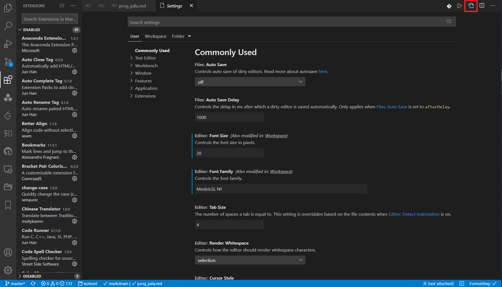

# 搭建 LaTeX 舒适写作环境

LaTeX 是一套强大的排版系统，在学术论文排版方面应用广泛，很多西方高效和期刊都会提供自己 LaTeX 模板方便论文提交。虽然 LaTeX 有不少相关的 IDE，如 TeXstudio，BaKoMa，LyX 等，但总给人一种笨重的感觉。如今，VSCode 为我们提供了另一种选择。

## 1. 背景知识

### 1.1. 引擎

引擎是 TeX 语法的解释器。最原始的 TeX 引擎在 1978 年由 Donald Erwin Knuth（高德纳）开发，其生成 dvi 文件，然后经由其他程序转换为 PDF 文件。改进引擎包括：

- pdfTeX：将 TeX 代码直接编译成 PDF 文件。
- XeTeX：TeX 语言的新的实现，支持 Unicode 编码和直接访问操作系统字体。
- LuaTeX：TeX 语言的一个完整的有扩展的实现，支持 Unicode、系统字体和内嵌语言扩展，能直接输出 PDF 格式文件，也可以仍然输出 DVI 格式。

### 1.2. 格式

TeX 语言本身只有 300 个命令，晦涩难懂。一个简单的符号可能就需要多个命令来实现，可以将这些最基本的命令封装起来做个宏以实现特殊的目的。一堆简写的合集就构成了格式。格式可以与不同的引擎相结合。

- Plain TeX：由 Don Knuth 提供的最小的宏集合。
- LaTeX：更易于使用的宏集，最常见的一种格式。

### 1.3. 发行版

一个完整的 TeX 需要最基本的 TeX 引擎、格式支持、各种辅助宏包、一些转换程序、GUI、编辑器、文档查看器等等。通过选择不同的组合就构成了不同的发行版。

- TeXLive：支持 Linux，Windows，macOS
- MiKTeX：支持 Windows，macOS (Intel)

### 1.4. 辅助工具

- MetaPost：用于生成图像。
- BibTeX：用于生成参考文献。
- dvipdf：dvi 转换成 pdf。

## 2. 安装 LaTeX

对于 LaTeX 的安装，由于官方的 TeXLive 体积过大，这里推荐用包管理器进行最小安装

> 对于包管理器的安装和使用，可以查阅本专栏的相关文章，[Homebrew 介绍](https://zhuanlan.zhihu.com/p/144608732) 和 [Scoop 介绍](https://zhuanlan.zhihu.com/p/128955118)

对 macOS 和 Linux 用户，有 Homebrew

```bash
brew install basictex
```

对 Windows 用户，有 Scoop

```powershell
scoop bucket add scoopet https://github.com/ivaquero/scoopet

scoop install texlive
```

也可以选择较为现代的 `tectonic` 编译器，安装方式如上面类似

对 macOS 和 Linux 用户，有 Homebrew

```bash
brew install tectonic
```

对 Windows 用户，有 Scoop

```powershell
scoop install tectonic
```

## 3. 主要扩展

`LaTeX Workshop` 基本上没什么可说的，使用 VSCode 写 LaTeX 的都会使用这个扩展，可认为是必备。


### 3.1. 编译策略

安装完毕后，"ctrl"+", " 打开配置，并在搜索框中输入"json"，打开配置的 .json 文件。



加入如下配置：

```json
{
  "latex-workshop.latex.tools": [
    {
      "name": "xelatex",
      "command": "xelatex",
      "args": [
        "-synctex=1",
        "-interaction=nonstopmode",
        "-file-line-error",
        "%DOC%"
      ]
    },
    {
      "name": "bibtex",
      "command": "bibtex",
      "args": ["%DOCFILE%"]
    }
  ],
  "latex-workshop.latex.recipes": [
    {
      "name": "xelatex",
      "tools": ["xelatex"]
    },
    {
      "name": "xelatex -> bibtex -> xelatex*2",
      "tools": ["xelatex", "bibtex", "xelatex", "xelatex"]
    }
  ]
}
```

以上是传统配置，如果使用 `tectonic` 作为 `.tex` 文件的编译工具，则配置如下

```json
{
  "latex-workshop.latex.recipes": [
    {
      "name": "tectonic",
      "tools": ["tectonic"]
    }
  ],
  "latex-workshop.latex.tools": [
    {
      "name": "tectonic",
      "command": "tectonic",
      "args": [
        "-X",
        "compile",
        "--keep-intermediates",
        "--keep-logs",
        "%DOC%.tex"
      ]
    }
  ]
}
```

整个编译过程更为简洁，编译过程中会自动下载安装所需包，当然这是一种基于缓存的编译方式，第一次使用时因为需要下载安装包，所以会比较慢。

> `tectonic` 目前对于中文文档编译相对 `xelatex` 较慢，对于英文则优于传统的其他编译器。

### 3.2. 格式化

安装 `latexindent.pl` 对 LaTeX 公式格式化

macOS/Linux 用户使用 Homebrew

```bash
brew install latexindent
```

Windows 用户使用 Scoop

```powershell
scoop install latexindent
```

在 `settings.json` 中，加入

```json
{ "latex-workshop.latexindent.path": "latexindent" }
```

## 4. 辅助扩展

### 4.1. 语法检查

LaTeX 的用户里，不少人均是使用它进行英文写作的，这时就不免会需要拼写检查，这里推荐多语言扩展基于开源语法检查器 LanguageTool 的 LTeX，其功能如下：

- 检测语法
- 检查拼写
- 自定义字典
- 自定义检查等级
- 多语言支持

简单说这相当于整合了一个 Grammarly。


其配置如下：

```json
{
  "ltex.language": "en-US",
  "ltex.enabled": ["latex"],
  "ltex.dictionary": {},
  "ltex.latex.commands": {
    "\\ref{}": "ignore",
    "\\documentclass[]{}": "ignore",
    "\\cite{}": "dummy",
    "\\cite[]{}": "dummy"
  },
  "ltex.latex.environments": {
    "lstlisting": "ignore",
    "verbatim": "ignore"
  },
  "ltex.markdown.nodes": {
    "CodeBlock": "ignore",
    "FencedCodeBlock": "ignore",
    "AutoLink": "dummy",
    "Code": "dummy"
  },
  "ltex.additionalRules.enablePickyRules": true,
  "ltex.additionalRules.motherTongue": "en-US",
  "ltex.diagnosticSeverity": "information",
  "ltex.ltex-ls.logLevel": "finer",
  "ltex.sentenceCacheSize": 2000
}
```

### 4.2. 项目管理

推荐使用 Git 作为论文的版本管理器，不过这带来一个新的问题，LaTeX 编译过程中会产生一系列过程文件，而这些并没有必要同步 Git 仓库。这里可以安装扩展 .gitignore Generator，在根目录下建立一个.gitignore 文件，把过程文件包含进去来避免不必要的同步。


## 5. 宏包管理

### 5.1. 基本操作

对于 Windows 用户，不需要特别对包进行管理，当在文档中导入未安装的包时，LaTeX 会自动弹出窗口，询问是否安装。

对于 macOS 用户，需要使用包管理器 tlmgr 对 LaTeX 包进行管理。

```bash
# 升级自身
sudo tlmgr update --self
# 升级所有包
sudo tlmgr update --all
# 列出已安装包
sudo tlmgr list --only-installed
```

### 5.2. 推荐

```bash
# 中文支持
sudo tlmgr install ctex latexmk
# 化学 & 电子
sudo tlmgr install mhchem chemfig circuitikz
# 排版
sudo tlmgr install multirow ifoddpage relsize titlesec
# 图表
sudo tlmgr install epstopdf subfigure appendix
# 字符 & 字体
sudo tlmgr install ulem xcolor environ letltxmacro enumitem stringenc trimspaces soul algorithm2e genmisc
```

## 6. 格式转换

### 6.1. 转 word

需要安装 pandoc-crossref

```bash
brew install pandoc-crossref
# 或
scoop install pandoc-crossref
```

在命令行键入

```bash
pandoc input.tex -o output.docx -w docx --reference-doc [ref.docx] --pdf-engine xelatex --filter pandoc-crossref --bibliography=[ref.bib]
```

- ref.docx：一个格式好点的模板
- ref.bib：参考文献文件
