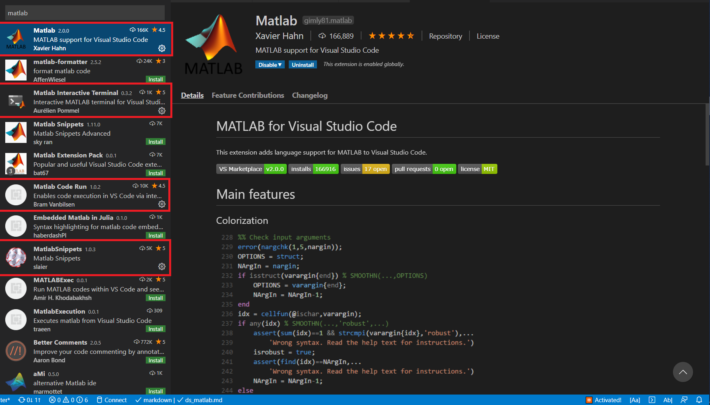
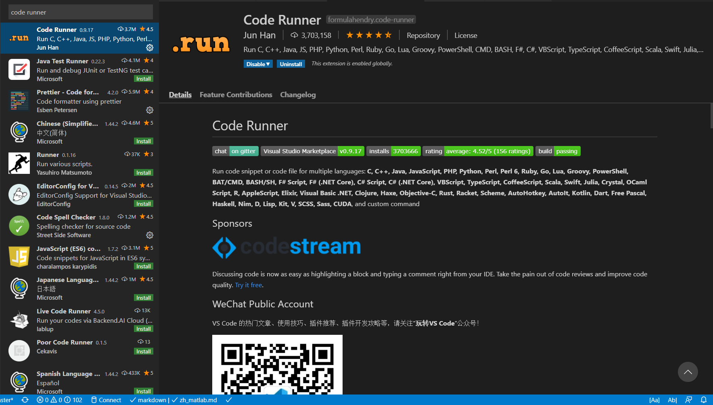
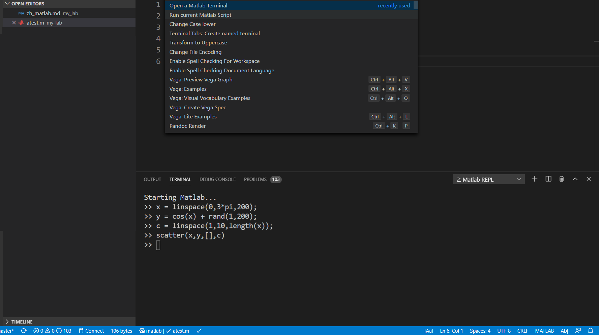
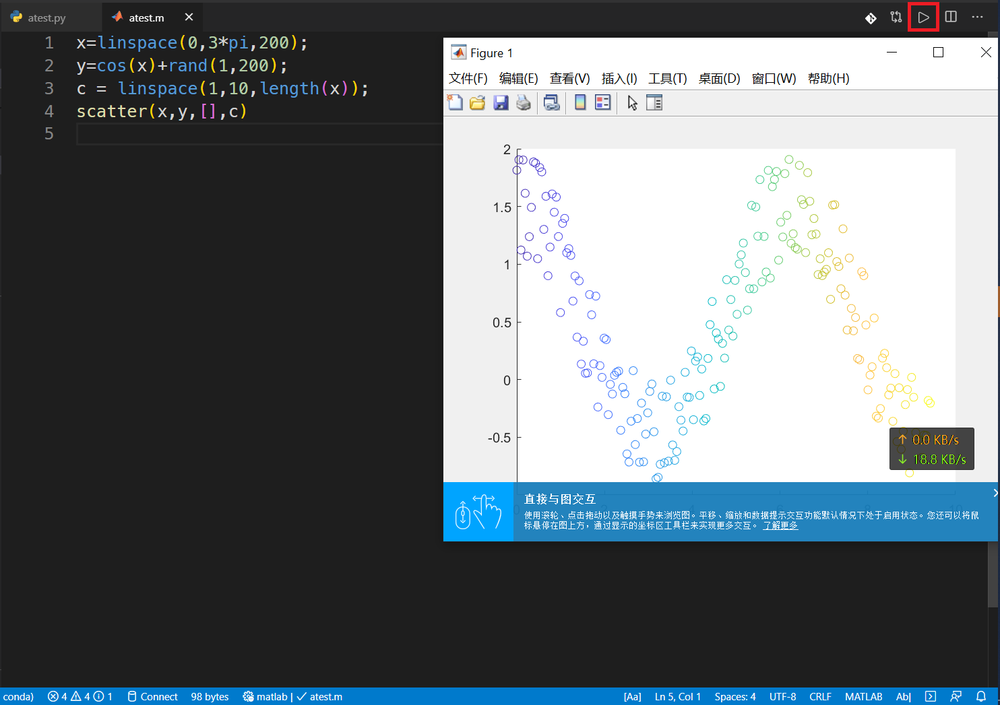
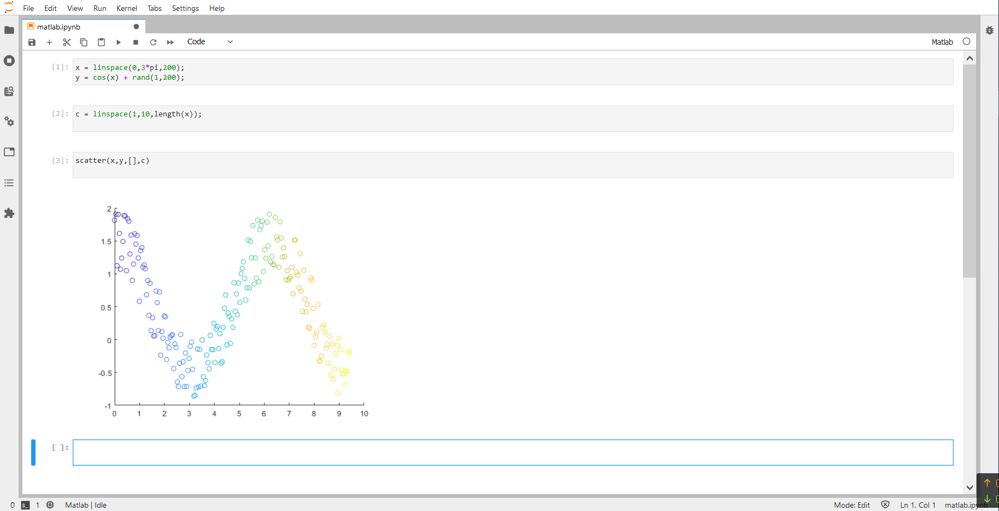

# 搭建 MATLAB 轻量级编写环境

作为 Python 用户，因为课业原因还要时常使用 MATLAB，而每次都要跳转到沉重的 MATLAB 官方界面真的是一件非常麻烦的事。而近两年来，VSCode 和 Jupyter 生态的快速发展，为此类需求提供了新的解决方案。

## 安装 MATLAB 的 Python 引擎

注意：MATLAB 的 Python 引擎仅支持 Python 2.7，3.6 和 3.7

对 macOS 用户，在命令行输入以下命令：

```bash
cd /Applications/Polyspace/R2019b/extern/engines/python
sudo python setup.py build --build-base=$(mktemp -d) install
```

对 Windows 用户，在命令行（需要管理员权限）输入以下命令：

```powershell
cd c:\'program files'\polyspace\r2019a\extern\engines\python
sudo python setup.py build --build-base=$env:temp install
```

## VSCode 调用 MATLAB

### 交互操作

在 VSCode 中的扩展商店里搜索并安装以下 4 个扩展：

- MATLAB（MATLAB 基础支持）
- MATLAB Interactive Terminal（MATLAB 交互命令行）
- MATLABSnippets（自动补全）



安装完毕后，"ctrl"+", " 打开配置，并在搜索框中输入"json"，打开配置的 .json 文件。


对 macOS 加入如下配置：

```json
{
  "matlab.matlabpath": "/Applications/Polyspace/R2019b/matlab",
  "matlab.mlintpath": "/Applications/Polyspace/R2019b/bin/maci64/mlint",
  "matlab.linterEncoding": "gbk",
  "matlab-interactive-terminal.unicodeswitch": true,
  "matlab-interactive-terminal.pythonpath": "/usr/local/Caskroom/miniconda/base/bin/python"
}
```

对于 Windows 加入如下配置：

```json
{
  "matlab.matlabpath": "c:\\program files\\polyspace\\r2019a\\bin\\matlab.exe",
  "matlab.mlintpath": "c:\\program files\\polyspace\\r2019a\\bin\\win64\\mlint.exe",
  "matlab.linterEncoding": "gbk",
  "matlab-interactive-terminal.unicodeswitch": true,
  "matlab-interactive-terminal.pythonpath": "c:\\scoop\\shims\\python.exe"
}
```

### 脚本运行

在 VSCode 中的扩展商店里搜索并安装 Code Runner



同样，安装完毕后，打开配置的 .json 文件。

加入如下配置：

```json
"code-runner.executorMap": {
  "MATLAB" : "cd $dir && MATLAB -nosplash -nodesktop -r $fileNameWithoutExt"
 },
// 或
"code-runner.executorMapByGlob": {
  "*.m": "cd $dir && MATLAB -nosplash -nodesktop -r $fileNameWithoutExt"
 },
```

对交互式操作，快捷键为 "commamd"（或"ctrl"）+"shift"+"p"，打开 Panel，选择 "Open a MATLAB Terminal"。



对于脚本运行，点击右上角的右箭头。



## JupyterLab 调用 MATLAB

### 安装 MATLAB Kernel

```bash
pip install matlab-kernel
```


