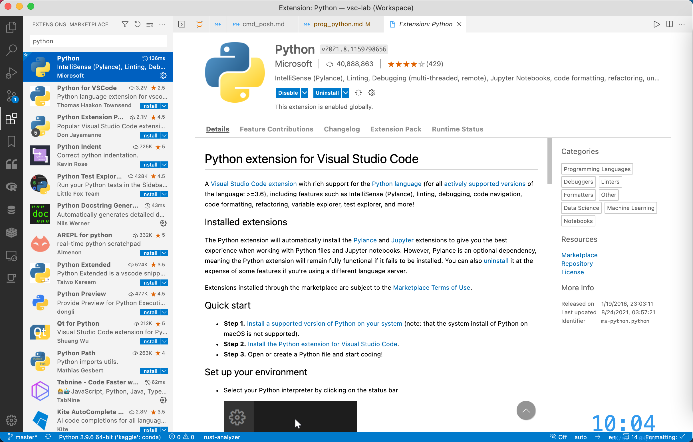
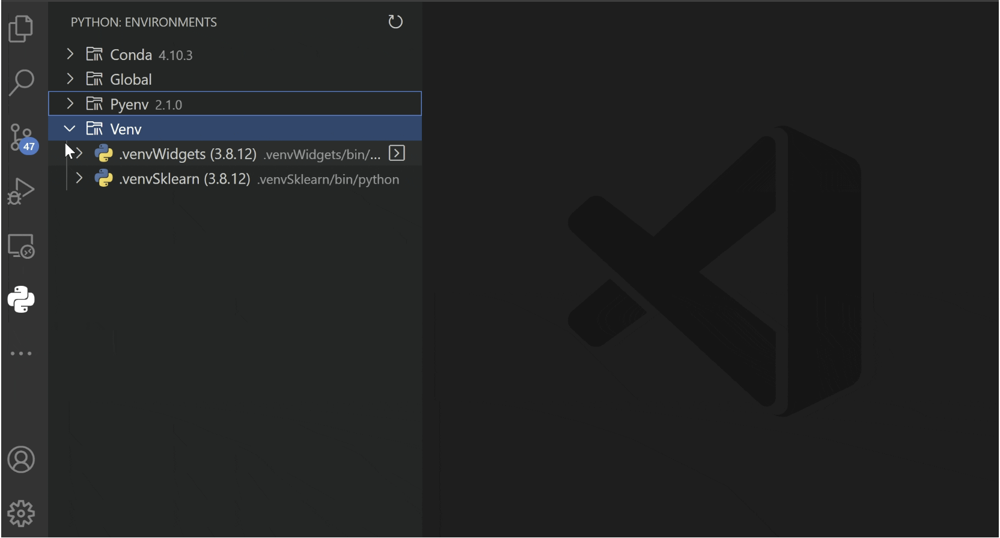
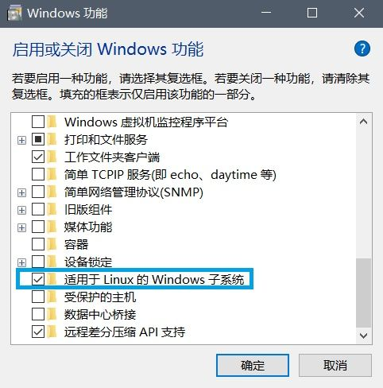
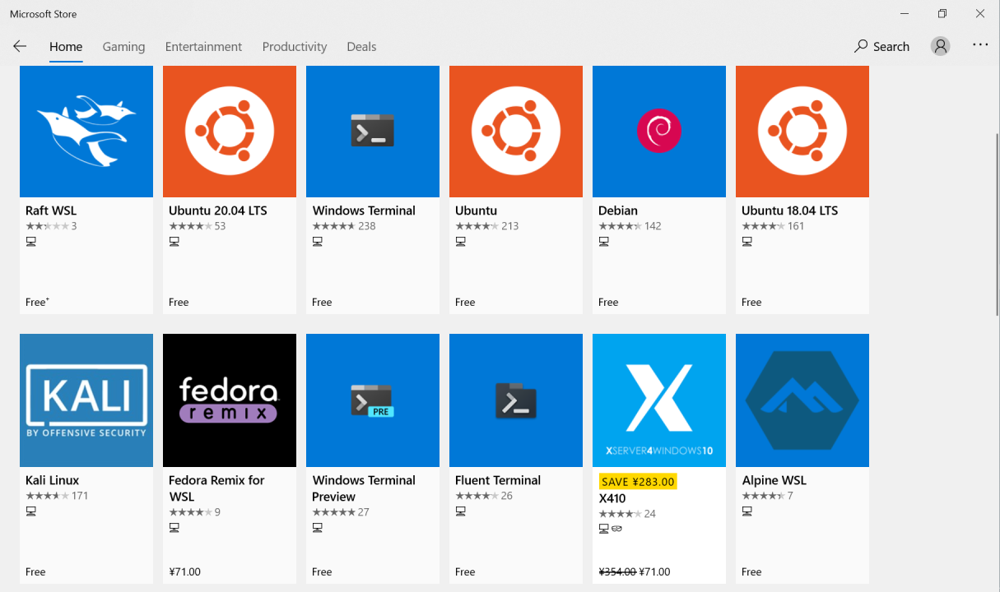
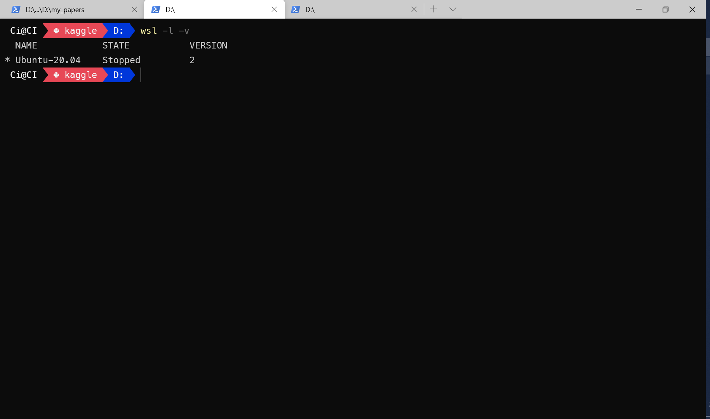
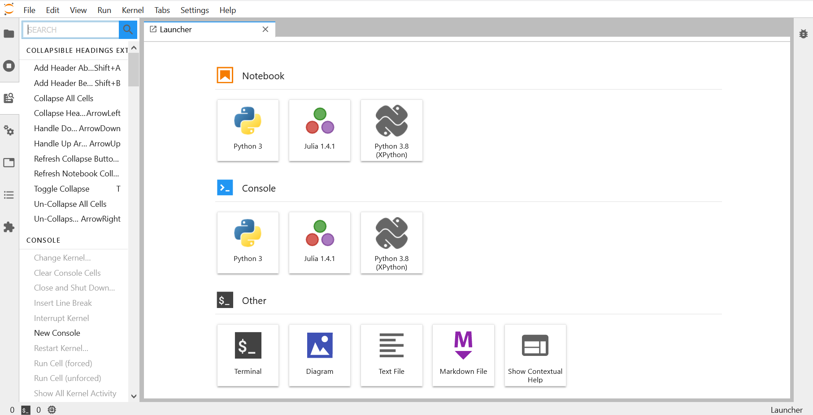

# 搭建 Python 轻量级编写环境

## 1. 安装 Python

### 1.1. Conda / Mamba

Conda 是服务于 Python 和 R 的多语言包管理器，其解决了 Python 原生包管理器 Pip 的依赖冲突问题，极大地方便了 Python 环境的管理。Mamba 基于 Conda，是后者的升级版，默认进行并行下载，效率比 Conda 更上一个台阶。

这里推荐安装 Mambaforge，基于 Mamba 的最小安装版本，只包含环境管理功能。

对 Windows 用户，使用 Scoop

```powershell
scoop install mambaforge
# 或国内镜像
scoop install ivaquero/scoopet/mambaforge-cn
```

对 macOS 用户，有 Homebrew

```bash
brew install mambaforge
# 或国内镜像
brew install ivaquero/chinese/mambaforge-cn
```

### 1.2. 创建环境

接下来，需要创建虚拟环境，也就是自己的工作区，可简单理解为系统登录时的用户。基本命令需指定**环境名称**和**Python 版本**：

```powershell
# 基本格式
mamba create -n [env_name] [python= version]
# 例子
mamba create -n my_python python=3.9
```

安装完毕后，进入环境：

```bash
# 进入
mamba active my_python
# 退出
mamba deactivate
```

### 1.3. 安装相关库

安装格式化工具（formatter）：`yapf`
安装代码检查器（linter）：`mypy`：

```bash
mamba install yapf mypy
```

## 2. Conda 的使用

### 2.1. 环境管理

mamba 常用操作可使用命令 `mamba -h` 和 `mamba config -h` 查看，这里列出几个常用命令：

```bash
# 创建
mamba create -n [env_name]
# 删除
mamba env remove -n [env_name]
# 参照配置文件更新
mamba env update --file [file.yml]
# 环境列表
mamba env list
# mamba 信息
mamba info
```

### 2.2. 包管理

```bash
# 安装
mamba install [package_name]
# 删除
mamba uninstall [package_name]
# 更新
mamba update [package_name]
# 更新所有包
mamba update --all
# 搜索
mamba search [package_name]
# 已安装列表
mamba list
```

### 2.3. 配置文件

mamba 会生成配置文件 `.condarc`。其位置如下：

- Windows：`~\.condarc`
- macOS 和 Linux：`~/.condarc`

其文件结构如下：

```yaml
# 频道
channels:
  - conda-forge
  - biconda

# 将 pip 作为 Python 的依赖
add_pip_as_python_dependency: true
# 安装按照频道的顺序
channel_priority: flexible
# 生成错误报告
report_errors: false
# ssl 验证
ssl_verify: false
# 显示频道具体链接
show_channel_urls: true
# 错误回滚
rollback_enabled: true
# 重试
remote_max_retries: 3
```

### 2.4. 镜像

为了加快速度，国内往往需要使用镜像，修改 channels 如下

```yaml
channels:
  # 中科大镜像
  - https://mirrors.ustc.edu.cn/anaconda/cloud/conda-forge/
  - https://mirrors.ustc.edu.cn/anaconda/cloud/bioconda/
  - https://mirrors.ustc.edu.cn/anaconda/cloud/msys2/
```

### 2.5. 报错

```powershell
## The input line is too long
pip install pywinpath
pywinpath
## Intel MKL FATAL ERROR: Cannot load mkl_intel_thread.dll.
set CONDA_DLL_SEARCH_MODIFICATION_ENABLE = 1
```

## 3. VSCode & Jupyter

### 3.1. VSCode

VSCode 是首选，安装官方扩展的同时，还需安装 Jupyter 相关包

```bash
mamba install jupyter_contrib_nbextensions
```



对于 linter 的提示信息，推荐选择 `mypy`。

- 自动补全：Visual Studio IntelliCode

另外，推荐尝试官方新推出的 Python Environment Manager



这个扩展可以实现类似 PyCharm 环境管理的功能

### 3.2. JupyterLab

```bash
mamba install jupyterlab
```

## 4. WSL2

Windows 下的 Python 环境经常会给人带来一系列的困扰，如，时隐时现的各种因为环境变量导致的奇怪报错，Conda 库更新不到最新的版本，还有诸如 xgboost 等库压根儿就不提供 Win 版等。现在，WSL2（Windows Subsystem Linux 2）的出现，让我们有了一种新的选择。WSL2 是一个 Windows 的内置虚拟机，可运行 Linux 环境，一旦有了 Linux 环境，后面的配置不必多说。

### 4.1. 安装 WSL2

在控制面板 -> 程序和功能 -> Windows 功能窗口中勾选适用于 Linux 的 Windows 子系统 功能，点击确定，并按照提示重启电脑。



在 Windows 应用商店搜索 WSL，选择自己想要的 Linux 发行版，点击下载安装即可。这里选择的是 Ubuntu 20.04。



由于版本问题，好多人的的子系统还停留在 WSL，而不是 WSL2。对于升级，输入如下命令

```powershell
dism.exe /online /enable-feature /featurename:VirtualMachinePlatform /all /norestart
wsl --set-version Ubuntu-20.04 2
```

中间需要下载一个 [WSL2-kernel](https://wslstorestorage.blob.core.windows.net/wslblob/wsl_update_x64.msi)

若之前没有用过 WSL，则首先需要安装 Windows 10 的 WSL 功能：

```powershell
dism.exe /online /enable-feature /featurename:Microsoft-Windows-Subsystem-Linux /all /norestart
```

这部分详情见 [WSL2](https://docs.microsoft.com/en-us/windows/wsl/wsl2-kernel)

### 4.2. 调试 Linux

- 版本

安装完成后，使用微软自家的 Windows-Terminal 打开一个 Ubuntu 标签，待其初始化完成。通过如下命令查看版本

```powershell
wsl -l -v
```



- 设置 WSL2 为默认版本

```powershell
wsl --set-default-version 2
```

- 卸载

```powershell
wslconfig /u Ubuntu-20.04
```

- 初始化

输入以下命令，为 root 用户设置密码。

```bash
sudo passwd root
```

当然，你也可使用如下命令，创建新用户

```bash
sudo adduser username
```

### 4.3. Miniconda

- 下载安装

```bash
wget -c https://mirrors.tuna.tsinghua.edu.cn/anaconda/miniconda/Miniconda3-latest-Linux-x86_64.sh
bash Miniconda3-latest-Linux-x86_64.sh
```

有关 Conda 的具体使用，这里不再赘述。

### 4.4. Jupyter

这里可以选择安装 JupyterLab

```python
mamba install jupyterlab
```

关键是第二步，让 Jupyter 自动打开宿主浏览器。打开配置文件 `jupyter_notebook_config.py`。

```bash
vi ~/.jupyter/jupyter_notebook_config.py
```

若没有，由如下命令生成

```bash
jupyter notebook --generate-config
```

修改下面这如下一行

```python
c.NotebookApp.use_redirect_file = False
```

退回到主界面，在 `~/.bashrc` 或 `~/.zshrc` 文件末尾添加，指定默认浏览器地址，其中，`/mnt/` 之后的部分是你默认浏览器的在 Windows 上的地址

```bash
export BROWSER="/mnt/c/'program files (x86)'/microsoft/edge/application/msedge.exe"
```

使用 `source` 刷新后，就可愉快地使用 Linux 版的 Python 了。


