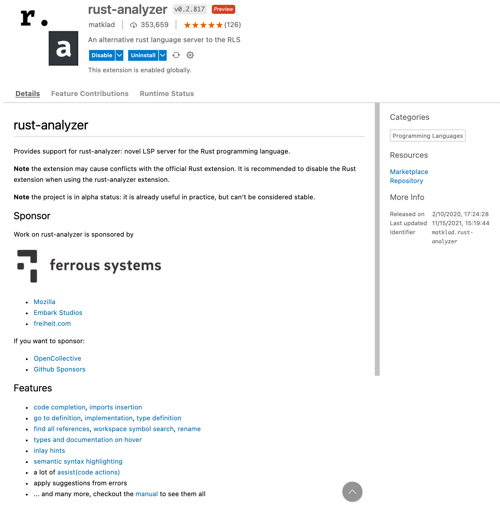

# 搭建 Rust 舒适编写环境（VSCode）

## 1. 安装 Rust

安装 rustup

macOS/Linux 用户，使用 Homebrew

```bash
brew install rustup-init
```

Windows 用户，使用 Scoop

```powershell
scoop install rustup
```

### 1.1. 配置

- 使用 rustup 自动配置

```bash
rustup-init
```

- 启动 carge

```bash
source ~/.cargo/env
```

## 2. 安装扩展

在 VSCode 扩展商店，搜索并安装 rust-analyzer


