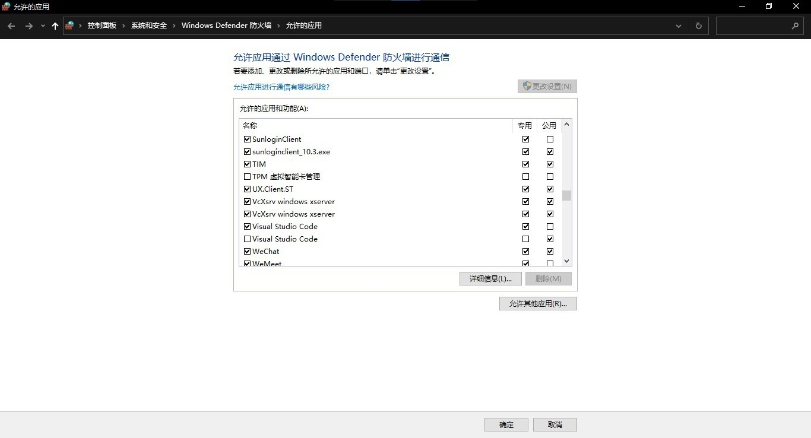
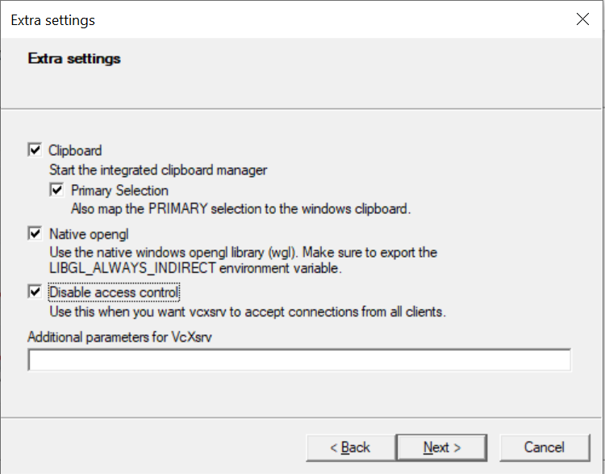
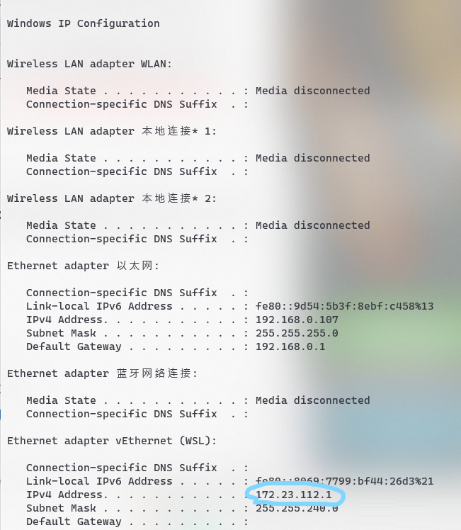
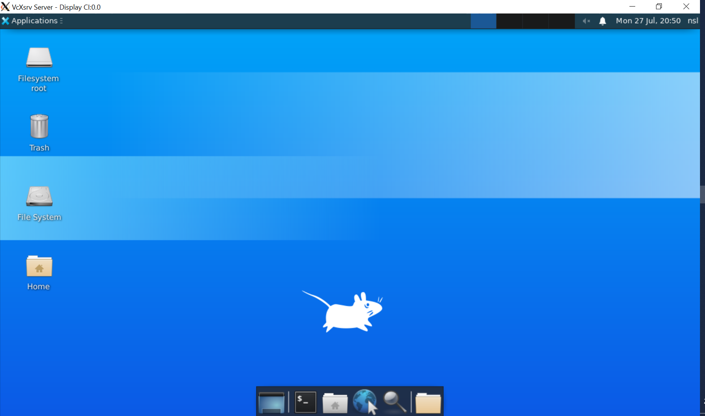
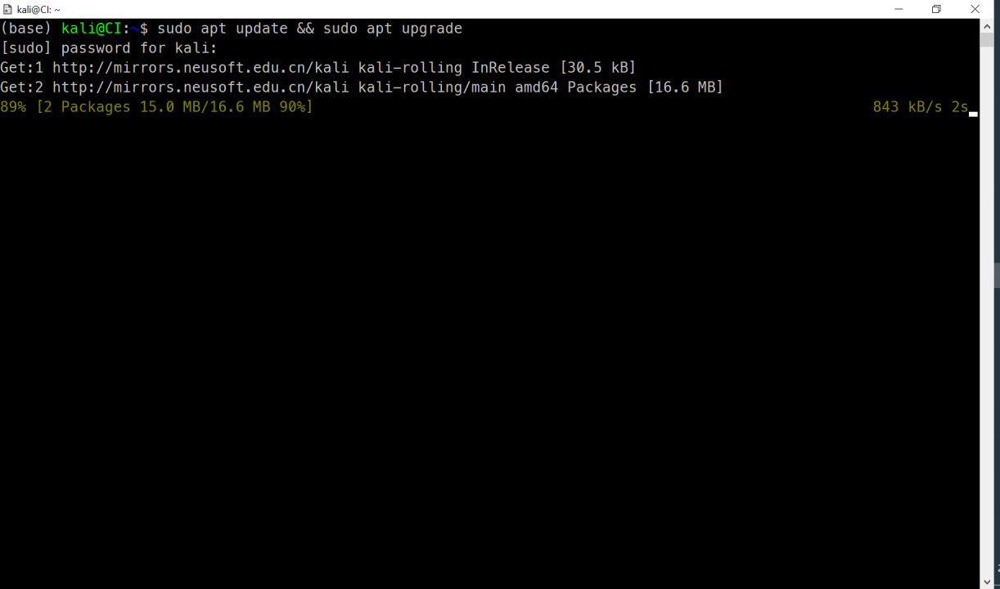
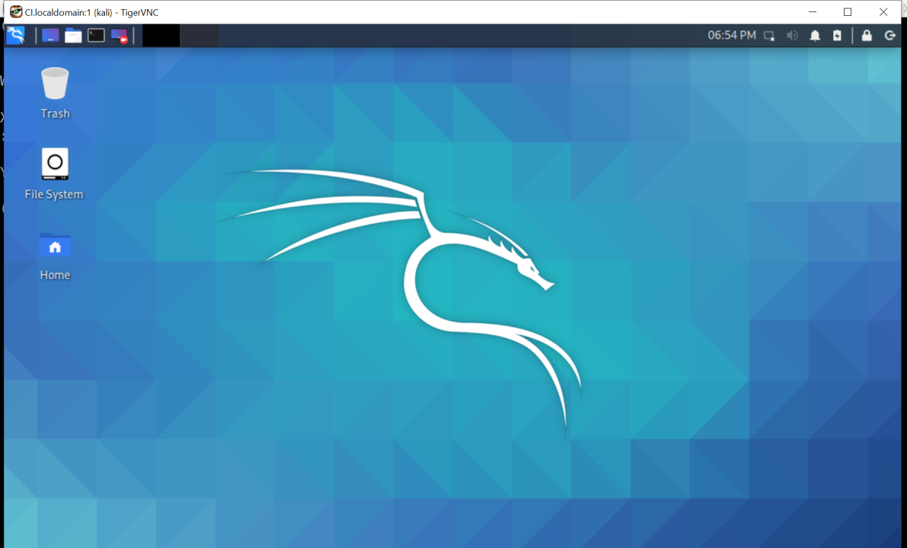
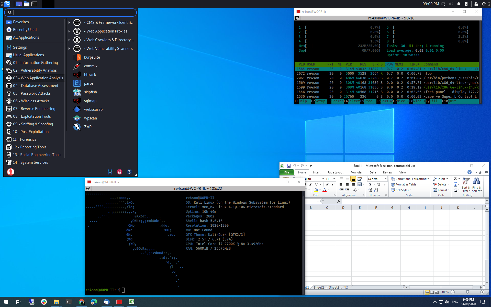
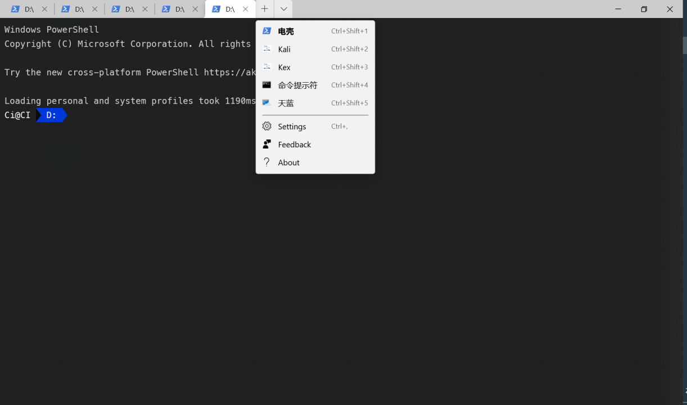

# 搭建 WSL2 舒适开发环境

Windows 下的编程环境经常会给人带来一系列的困扰，如，时隐时现的各种因为环境变量导致的奇怪报错，Python 的不少第三方库不提供 Win 版等。现在，WSL2（Windows Subsystem Linux 2）的出现，让我们有了一种新的选择。WSL2 是一个 Windows 的内置虚拟机，可运行 Linux 环境，一旦有了 Linux 环境，后面的配置不必多说。

## 1. 安装 WSL2

### 1.1. 开启虚拟机功能

在控制面板 -> 程序和功能 -> Windows 功能窗口中勾选适用于 Linux 的 Windows 子系统 功能，点击确定，并按照提示重启电脑。


或以管理员身份在命令行键入

```powershell
Enable-WindowsOptionalFeature -Online -FeatureName Microsoft-Windows-Subsystem-Linux
```

中间需要下载一个 [WSL2-kernel](https://wslstorestorage.blob.core.windows.net/wslblob/wsl_update_x64.msi)

若之前没有用过 WSL，则首先需要安装 Windows 10 的 WSL 功能：

```powershell
dism.exe /online /enable-feature /featurename:Microsoft-Windows-Subsystem-Linux /all /norestart
```

这部分详情见 [WSL2](https://docs.microsoft.com/en-us/windows/wsl/wsl2-kernel)

### 1.2. 安装发行版

类似 Ubuntu 安装，点击下载安装即可。


### 1.3. 初始化

输入以下命令，为 root 用户设置密码。

```bash
sudo passwd root
```

当然，你也可使用如下命令，创建新用户

```bash
sudo adduser username
```

### 1.4. 更改软件源

打开 `sources.list`：

```bash
sudo vi /etc/apt/sources.list
```

Ubuntu

```bash
deb http://mirrors.ustc.edu.cn/ubuntu/ trusty main restricted universe multiverse
deb http://mirrors.ustc.edu.cn/ubuntu/ trusty-security main restricted universe multiverse
deb http://mirrors.ustc.edu.cn/ubuntu/ trusty-updates main restricted universe multiverse
deb http://mirrors.ustc.edu.cn/ubuntu/ trusty-proposed main restricted universe multiverse
deb http://mirrors.ustc.edu.cn/ubuntu/ trusty-backports main restricted universe multiverse
```

Kali

```bash
deb https://mirrors.ustc.edu.cn/kali kali-rolling main non-free contrib
```

更新：

```bash
sudo apt update && sudo apt update -y && sudo apt upgrade -y
# 清理缓存
sudo apt -y clean && sudo apt -y autoclean && sudo apt -y autoremove
```

### 1.5. 网络

Powershell 中，管理员执行如下命令

```powershell
New-NetFirewallRule -DisplayName "WSL" -Direction Inbound  -InterfaceAlias "vEthernet (WSL)"  -Action Allow
```

```bash
ip route | grep default | awk '{print $3}'
sudo vi /etc/wsl.conf
[network]
generateResolvConf = false
```

```bash
sudo vi /etc/resolv.conf
nameserver 8.8.8.8
```

### 1.6. 工具链

为了更方便地使用 Linux，墙裂建议安装 Zsh。同时，也推荐安装 Homebrew

安装 Homebrew

```bash
/bin/bash -c "$(curl -fsSL https://raw.githubusercontent.com/Homebrew/install/master/install.sh)"
```

## 2. Ubuntu

### 2.1. 版本

安装完成后，使用微软自家的 Windows-Terminal 打开一个 Ubuntu 标签。


通过如下命令查看版本

```powershell
wsl -l -v
```

设置 WSL2 为默认版本

```powershell
wsl --set-default-version 2
```

卸载

```powershell
wslconfig /u Ubuntu-20.04
```

删除多余的包

```bash
sudo apt remove --purge python3
```

### 2.2. VcXsrv 的安装和配置

这里，我们选择最省心的 VcXsrv，其下载链接为 [VcXsrv](https://sourceforge.net/projects/vcxsrv/)

也可通过包管理器安装

```powershell
scoop install vcxsrv
```

安装完毕之后打开防火墙配置，勾选所有的 Xserver 连接。



启动开始菜单中的 XLaunch，使用默认的 `One large window` 和 `Start no client`，在 Extra settings 中勾选第三项



最后，完成配置

### 2.3. xfce4 的安装和配置

进入 WSL2，安装 xfce4

```bash
sudo apt install xfce4
```

打开 `/etc/resolve.conf`，添加如下语句

```bash
[network]
generateResolvConf = false
```

在 Powershell 中，查询本地 IP

```powershell
ipconfig
```



回到 WSL2，将如下语句，添加至 `~/.bashrc` 或 `~/.zshrc` 末尾

```bash
export DISPLAY=$(awk '/nameserver / {print $2; exit}' /etc/resolv.conf 2>/dev/null):0
export LIBGL_ALWAYS_INDIRECT=1
```

### 2.4. 启动 GUI

重启 bash 或 zsh

```bash
# source ~/.bashrc
# source ~/.zshrc
```

保持 XLaunch 开启，启动 xfce4

```bash
startxfce4
```



## 3. Kali

### 3.1. 升级

由于版本问题，好多人的的子系统还停留在 WSL，而不是 WSL2，由于后者实质上是一个虚拟机。故要启动虚拟化：

```powershell
dism.exe /online /enable-feature /featurename:VirtualMachinePlatform /all /norestart
wsl -l # 查看 WSL 列表
wsl --set-version kali-linux 2
```

安装完成后，在 Kali Linux 下，输入如下命令，安装默认工具集

```bash
sudo apt update && sudo apt upgrade
sudo apt install -y kali-linux-default
```



当然你也可以选择安装完整工具集

```bash
sudo apt install -y kali-linux-large
```

### 3.2. GUI

当然为了更好的体验 Kali，我们可以安装官方推荐的 GUI —— Win-KeX。输入如下命令，进行安装。

```bash
sudo apt install -y kali-win-kex
```

安装完毕后，可使用如下命令启动

```bash
# 启动
cd ~
kex
# 关闭
kex stop
# 窗口模式
kex --win -s
```



Win-KeX 还提供了无缝模式

```bash
# 无缝模式
kex --sl -s
```



### 3.3. Terminal 整合

当然，像上面那样启动还是不大方便。我们可以在 Windows Terminal 的配置中，加入一下内容，将 Kali 和 Win-KeX 整合进 Terminal。

```json
{
  "list": [
    {
      "guid": "{46ca431a-3a87-5fb3-83cd-11ececc031d2}",
      "hidden": false,
      "name": "Kali",
      "icon": "file:///c:/users/ci/pictures/icons/kali.png",
      "source": "Windows.Terminal.Wsl"
    },
    {
      "guid": "{55ca431a-3a87-5fb3-83cd-11ececc031d2}",
      "hidden": false,
      "name": "KaTex",
      "icon": "file:///c:/users/ci/pictures/icons/kali.png",
      // 窗口模式启动
      "commandline": "wsl -d kali-linux kex --wtstart -s"
    }
  ]
}
```



## 4. WSL2 优化

### 4.1. 压缩

随着使用时间的延长，WSL2 占用的硬盘空间会越来越多，这个时候就需要对其文件进行压缩。方法如下

```powershell
wsl --shutdown
# open window Diskpart
diskpart
select vdisk file="C:\Users\Ci\AppData\Local\Packages\KaliLinux.54290C8133FEE_ey8k8hqnwqnmg\LocalState\ext4.vhdx"
# select vdisk  file="C:\Users\Ci\AppData\Local\Packages\CanonicalGroupLimited.Ubuntu20.04onWindows_79rhkp1fndgsc\LocalState\ext4.vhdx"
attach vdisk readonly
compact vdisk
detach vdisk
```

### 4.2. 内存

当然，WSL2 也会带来内存占用的问题，可以打开 `~/.wslconfig`，进行如下设置

```powershell
[wsl2]
memory=4GB
swap=0
```

### 4.3. Bugs

The attempted operation is not supported for the type of object referenced.

```powershell
sudo netsh winsock reset
```
