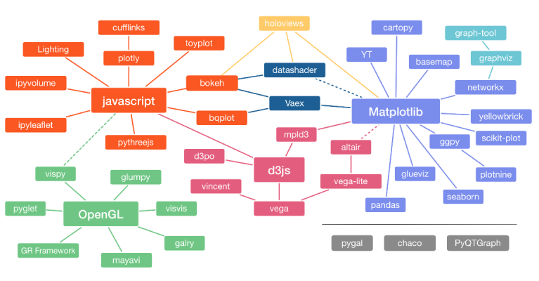

# Python 可视化库盘点

随着数据科学的繁荣，各种 Python 的可视化库相继涌现，公众号和论坛上也有各种各样的推荐，选择哪个可视化库也是很多时候让人头疼的问题。

这里，为自己曾经的踩坑经历做一下梳理。

## 1. Matplotlib

Matplotlib 是 Python 的默认可视化库，拥有最丰富的生态，其重要衍生库如下

- Matplotlib (⭐13.4k)
  - Seaborn (⭐8.3k)
  - PlotNine (⭐2.6k)
  - Yellowbrick (⭐3.1k)
  - CartoPy (⭐0.8k)
  - WordCloud (⭐8k)

Seaborn 兴起于 Kaggle，其采用图形语法，加上漂亮的配色，被认为是数据分析的首选工具。在拓展 Matplotlib 的同时，保持了其灵活性。PlotNine 同样使用图形语法，是 ggplot2 的 Python 克隆，非常适合 R 转 Py 的人。相比于 Seaborn，一些时候，PlotNine 的绘图更加方便，但是返回的是 figure 对象，在绘制子图和调整细节的时候，会非常不灵活。

Yellowbrick 是服务 Scikit-Learn 的可视化库，不过随着后者和 Pandas 也逐渐有了原生的可视化模块，这个曾经风靡一时的仓库可能会逐渐淡出视野。

CartoPy 几乎是地理和气象分析的必须了解的可视化库。WordCloud 字如其名，用于生成词云。

此外，也是 SciPy 生态的默认绘图后端，使用 Matplotlib 的主流计算库包括

- Pandas
- SciPy
  - StatsModels
  - Scikit-Learn
- NetWorkX

Matplotlib 有着非常优秀的底层设计，可以用于大地理、大气、天文、声音等各种数据的可视化，其中不少对于基于数据框的可视化库，如 ggplot2 来说会相当麻烦。然而，由于创始人 John Hunter 英年早逝（40 余岁），其开发经历过一段群龙无首的时期，留下了一堆混乱的 API。不过最近两年，获得了充足经费支持的 Matplotlib，已经开始重新整理规范了开发，有了更加灵活的布局方法。

## 2. HoloViz

HoloViz 是 Anaconda 资助的可视化项目。形成了以 Bokeh 为中心和底层，以 HoloViews 和 Panel 为主打产品的 Python 第二大可视化生态系统。

Bokeh 虽然写起来稍显繁琐手，但是部署却十分方便，可以相对丝滑地与 Python 其他库做整合，作为 Pandas 等默认后端时，调用和 Matplotlib 一样方便。如今，随着 Anaconda 的持续投入，Bokeh 已经成了 Python 社区里默认的交互绘图后端。毕竟爸爸的钱不是白给的。

- Bokeh (⭐14.9k)
- Holoviews (⭐1.8k)
  - Geoviews (⭐0.3k)
  - hvPlot (⭐0.3k)
- DataShader (⭐2.5k)
- Panel (⭐0.9k)

Panel 是 HoloViz 的仪表盘，是目前个人认为最容易上手的仪表盘，官网上有不少案例可供参考。

## 3. Plotly

Plot.ly 是一家位于蒙特利尔的数据可视化商业公司。其可视化库 Plotly 借鉴了大名鼎鼎的 D3.JS，在各种交互可视化库还不那么成熟的几年前，凭借着其灵活性，一跃成为网红。与之配套的 Dash，也是 Python 社区里第一个成熟的仪表盘工具。

- Plotly (⭐9.2k)
  - Plotly_Express (⭐0.6k)
- Dash (⭐14.2k)

Plotly 虽然灵活，但是语法并不简洁，实现同样的效果需要写不少代码。Plotly_Express 相当于 Plotly 的 Seaborn。目前，Plotly 易于部署的特性，已被 Bokeh、Altair 等同类型可视化库追平，仪表盘 Dash 由于不少功能还要写 JS 实现，也不再被认为是首选。

## 4. Altair-Viz

Altair 是 JS 可视化库 Vega-Lite 的 Python 封装。

Altair 有着非常优雅的语法，然而，由于其基于的 Vega-Lite 又继承于 Vega，故 Altair 的改进和迭代严重依赖于上游，从 4.0 以后迭代缓慢。

- Altair (⭐6.5k)
- Streamlit (⭐14k)

以 Altair 为默认后端的 Streamlit 由于可以使用纯 Python 完成整个工程，在社区里迅速爆红。知乎以及公众号都有报道。

## 5. 生态支持

### 5.1. 仪表盘

仪表盘（Dashboard）是各个交互可视化库的最重要的应用场景。可以看出，Dash 作为曾经一枝独秀的王者，热度上已经基本被 Streamlit 追平。

|            | Panel | Streamlit | Dash  |
| :--------: | :---: | :-------: | :---: |
|  Stars ⭐  | 0.9k  |    14k    | 14.2k |
| Matplotlib |   ✓   |     ✓     |       |
|   Bokeh    | 默认  |     ✓     |       |
|   Altair   |   ✓   |   默认    |       |
|   Plotly   |   ✓   |     ✓     | 默认  |

### 5.2. 数据框

探索性数据分析（EDA），是数据分析自动化的重要组成部分，近两年的社区里出现了多个 EDA 工具，各有受众。

|            | Pandas 整合 |     EDA 工具     |
| :--------: | :---------: | :--------------: |
| Matplotlib |  默认后端   | Pandas-Profiling |
|   Bokeh    |      ✓      |     DataPrep     |
|   Altair   |  + pdVega   |     Lux-API      |
|   Plotly   | + cufflinks |     SweetViz     |

## 6. 其他

还有一些较为流行，但不属于上述生态的可视化库，因为没有形成生态，而且我本人没有亲自试用过（PyEcharts 除外），这里就不再评价了。

- PyEcharts (⭐10.8k)
- VisPy (⭐2.6k)
- PyGAL (⭐2.3k)
